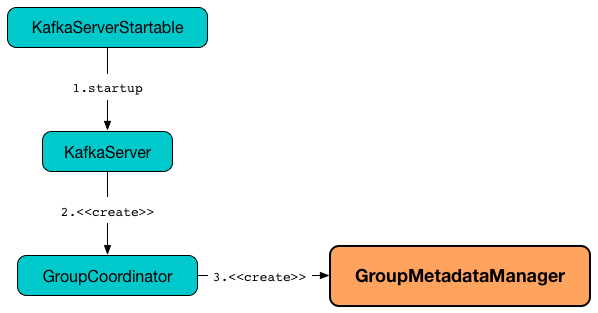

== [[GroupMetadataManager]] GroupMetadataManager

`GroupMetadataManager` is...FIXME

`GroupMetadataManager` is created exclusively when `GroupCoordinator` is link:kafka-GroupCoordinator.adoc#apply[created].

.Creating GroupMetadataManager


[[internal-registries]]
.GroupMetadataManager's Internal Properties (e.g. Registries and Counters)
[cols="1,2",options="header",width="100%"]
|===
| Name
| Description

| [[groupMetadataCache]] `groupMetadataCache`
| Pool of `GroupMetadata` by group ID

| [[groupMetadataTopicPartitionCount]] `groupMetadataTopicPartitionCount`
|

| [[scheduler]] `scheduler`
| link:kafka-KafkaScheduler.adoc[KafkaScheduler]
|===

=== [[enableMetadataExpiration]] `enableMetadataExpiration` Method

[source, scala]
----
enableMetadataExpiration(): Unit
----

`enableMetadataExpiration` requests <<scheduler, KafkaScheduler>> to link:kafka-KafkaScheduler.adoc#start[start].

`enableMetadataExpiration` schedules *delete-expired-group-metadata* task that <<cleanupGroupMetadata, cleanupGroupMetadata>> every `offsetsRetentionCheckIntervalMs` milliseconds.

NOTE: `enableMetadataExpiration` is used exclusively when `GroupCoordinator` is link:kafka-GroupCoordinator.adoc#startup[started].

=== [[creating-instance]] Creating GroupMetadataManager Instance

`GroupMetadataManager` takes the following when created:

* [[brokerId]] Broker ID
* [[interBrokerProtocolVersion]] `ApiVersion`
* [[config]] link:kafka-OffsetConfig.adoc[OffsetConfig]
* [[replicaManager]] link:kafka-server-ReplicaManager.adoc[ReplicaManager]
* [[zkUtils]] link:kafka-ZkUtils.adoc[ZkUtils]
* [[time]] `Time`

`GroupMetadataManager` initializes the <<internal-registries, internal registries and counters>>.

=== [[cleanupGroupMetadata]] `cleanupGroupMetadata` Internal Method

[source, scala]
----
cleanupGroupMetadata(): Unit  // <1>
cleanupGroupMetadata(deletedTopicPartitions: Option[Seq[TopicPartition]]): Unit
----
<1> Calls the other `cleanupGroupMetadata` with empty `deletedTopicPartitions` collection

`cleanupGroupMetadata` takes the current time (using <<time, time>>) and for every `GroupMetadata` in <<groupMetadataCache, cache>> does the following:

1. FIXME

In the end, `cleanupGroupMetadata` prints out the following INFO message to the logs:

```
Removed [offsetsRemoved] expired offsets in [duration] milliseconds
```

NOTE: `cleanupGroupMetadata` is used exclusively when `GroupMetadataManager` is requested to <<enableMetadataExpiration, enableMetadataExpiration>> (as *delete-expired-group-metadata* task).

=== [[getGroupMetadataTopicPartitionCount]] Getting Number of Partitions for __consumer_offsets Topic -- `getGroupMetadataTopicPartitionCount` Internal Method

[source, scala]
----
getGroupMetadataTopicPartitionCount: Int
----

`getGroupMetadataTopicPartitionCount` requests <<zkUtils, ZkUtils>> for link:kafka-ZkUtils.adoc#getTopicPartitionCount[getTopicPartitionCount] of `__consumer_offsets` topic.

If not available, `getGroupMetadataTopicPartitionCount` requests <<config, OffsetConfig>> for link:kafka-OffsetConfig.adoc#offsetsTopicNumPartitions[offsetsTopicNumPartitions].

NOTE: `getGroupMetadataTopicPartitionCount` is used exclusively when `GroupMetadataManager` is requested for <<groupMetadataTopicPartitionCount, groupMetadataTopicPartitionCount>>.
