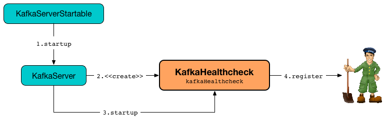

== [[KafkaHealthcheck]] KafkaHealthcheck

`KafkaHealthcheck` <<register, registers>> the broker it runs on with Zookeeper (which in turn makes the broker visible to other brokers that together can form a Kafka cluster).

`KafkaHealthcheck` is <<creating-instance, created>> and <<startup, started>> when `KafkaServer` is requested to link:kafka-server-KafkaServer.adoc#startup[start up].

.KafkaHealthcheck

[[internal-registries]]
.KafkaHealthcheck's Internal Properties (e.g. Registries and Counters)
[frame="topbot",cols="1,2",options="header",width="100%"]
|===
| Name
| Description

| [[sessionExpireListener]] `sessionExpireListener`
| `SessionExpireListener`
|===

=== [[creating-instance]] Creating KafkaHealthcheck Instance

`KafkaHealthcheck` takes the following when created:

* [[brokerId]] Broker ID
* [[advertisedEndpoints]] Advertised endpoints
* [[zkUtils]] link:kafka-ZkUtils.adoc[ZkUtils]
* [[rack]] Optional rack name
* [[interBrokerProtocolVersion]] `ApiVersion`

`KafkaHealthcheck` initializes the <<internal-registries, internal registries and counters>>.

=== [[startup]] Starting Up -- `startup` Method

[source, scala]
----
startup
----

`startup` requests <<zkUtils, ZkUtils>> to link:kafka-ZkUtils.adoc#subscribeStateChanges[subscribeStateChanges] with <<sessionExpireListener, sessionExpireListener>>.

In the end, `startup` <<register, registers the broker with Zookeeper>>.

NOTE: `startup` is used exclusively when `KafkaServer` link:kafka-server-KafkaServer.adoc#startup[starts up].

=== [[register]] Registering Broker in Zookeeper -- `register` Method

[source, scala]
----
register(): Unit
----

`register` reads `com.sun.management.jmxremote.port` System property or defaults to `-1`.

For every `EndPoint` with no host assigned (in <<advertisedEndpoints, advertisedEndpoints>>), `register` assigns the fully-qualified domain name of the local host.

`register` then finds the first `EndPoint` with `PLAINTEXT` security protocol or creates an empty `EndPoint`.

TIP: Define `EndPoint` with `PLAINTEXT` security protocol for older clients to connect.

In the end, `register` requests <<zkUtils, ZkUtils>> to link:kafka-ZkUtils.adoc#registerBrokerInZk[registerBrokerInZk] for <<brokerId, brokerId>>, the host and port of the `PLAINTEXT` endpoint, the updated endpoints, the JMX port, the optional <<rack, rack>> and <<interBrokerProtocolVersion, protocol version>>.

NOTE: `register` makes a broker visible for other brokers to form a Kafka cluster.

NOTE: `register` is used when `KafkaHealthcheck` <<startup, starts up>> and <<handleNewSession, handles a new session>>.

=== [[handleNewSession]] `handleNewSession` Method

CAUTION: FIXME
