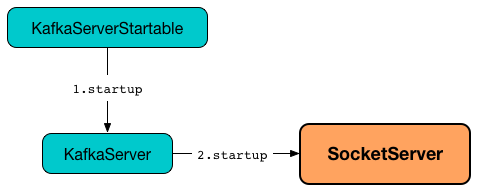

== [[SocketServer]] SocketServer

`SocketServer` is a NIO socket server.

`SocketServer` is created exclusively when `KafkaServer` link:kafka-KafkaServer.adoc#startup[is started].

.SocketServer's Startup

[[gauges]]
.SocketServer's Metrics (in kafka.network group)
[cols="1,2",options="header",width="100%"]
|===
| Name
| Description

| [[NetworkProcessorAvgIdlePercent]] `NetworkProcessorAvgIdlePercent`
|

| [[MemoryPoolAvailable]] `MemoryPoolAvailable`
|

| [[MemoryPoolUsed]] `MemoryPoolUsed`
|
|===

[[internal-registries]]
.SocketServer's Internal Registries and Counters (in alphabetical order)
[cols="1,2",options="header",width="100%"]
|===
| Name
| Description

| [[acceptors]] `acceptors`
| `Acceptor` threads per `EndPoint`

| [[endpoints]] `endpoints`
| `EndPoints` (aka _listeners_) per name (as configured using link:kafka-KafkaConfig.adoc#listeners[listeners] Kafka property)

| [[maxQueuedRequests]] `maxQueuedRequests`
|

| [[maxConnectionsPerIp]] `maxConnectionsPerIp`
|

| [[maxConnectionsPerIpOverrides]] `maxConnectionsPerIpOverrides`
|

| [[memoryPool]] `memoryPool`
|

| [[numProcessorThreads]] `numProcessorThreads`
|

| [[processors]] `processors`
| `Processor` threads (initially <<totalProcessorThreads, totalProcessorThreads>>)

| [[requestChannel]] `requestChannel`
|

| [[totalProcessorThreads]] `totalProcessorThreads`
| Total number of <<processors, processors>>, i.e. <<numProcessorThreads, numProcessorThreads>> for every <<endpoints, endpoint>>
|===

=== [[startup]] `startup` Method

CAUTION: FIXME

=== [[creating-instance]] Creating SocketServer Instance

`SocketServer` takes the following when created:

* [[config]] link:kafka-KafkaConfig.adoc[KafkaConfig]
* [[metrics]] `Metrics`
* [[time]] `Time`
* [[credentialProvider]] `CredentialProvider`

`SocketServer` initializes the <<internal-registries, internal registries and counters>>.
