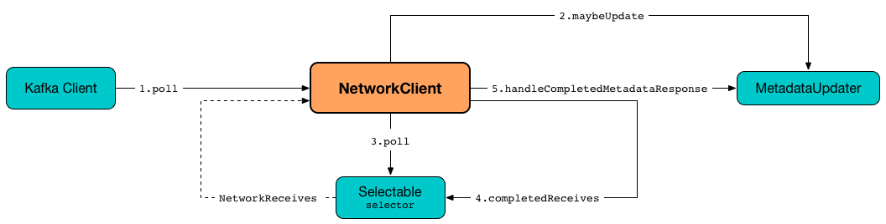

== [[NetworkClient]] NetworkClient -- Non-Blocking Network KafkaClient

`NetworkClient` is a non-blocking <<kafka-clients-KafkaClient.adoc#, KafkaClient>> that uses a <<selector, Selectable>> for network communication (i.e. sending and receiving messages).

NOTE: link:kafka-common-network-Selector.adoc[Selector] is the one and only link:kafka-common-network-Selectable.adoc[Selectable] that uses Java's selectable channels for stream-oriented connecting sockets (i.e. Java's https://docs.oracle.com/en/java/javase/11/docs/api/java.base/java/nio/channels/SocketChannel.html[java.nio.channels.SocketChannel]).

`NetworkClient` does the actual reads and writes (to sockets) every <<poll, poll>>.

.NetworkClient


`NetworkClient` uses the <<metadataUpdater, MetadataUpdater>> for the following:

* <<disconnect, disconnect>>

* <<close, close>>

* <<isReady, isReady>>

* <<poll, poll>>

* <<close, close>>

* <<leastLoadedNode, leastLoadedNode>>

* <<processDisconnection, processDisconnection>>

* <<handleTimedOutRequests, handleTimedOutRequests>>

* <<handleCompletedReceives, handleCompletedReceives>>

* <<handleDisconnections, handleDisconnections>>

* <<initiateConnect, initiateConnect>>

`NetworkClient` is <<creating-instance, created>> when:

* `KafkaConsumer` is created (with `ConsumerNetworkClient`)
* `KafkaProducer` is created (with `Sender`)
* `KafkaAdminClient` is created (using `createInternal`)
* `AdminClient` is created (with `ConsumerNetworkClient`)
* `ControllerChannelManager` is requested to <<kafka-controller-ControllerChannelManager.adoc#addNewBroker, addNewBroker>> (and creates a `RequestSendThread` daemon thread and a `ControllerBrokerStateInfo`)
* `TransactionMarkerChannelManager` is created
* `KafkaServer` does `doControlledShutdown`
* `ReplicaFetcherBlockingSend` is created

[[internal-registries]]
.NetworkClient's Internal Properties (e.g. Registries and Counters)
[cols="1,2",options="header",width="100%"]
|===
| Name
| Description

| [[connectionStates]] `connectionStates`
| `ClusterConnectionStates`

Used when...FIXME
|===

[[logging]]
[TIP]
====
Enable `DEBUG` logging level for `org.apache.kafka.clients.NetworkClient` logger to see what happens inside.

Add the following line to `config/tools-log4j.properties` (for Kafka tools):

```
log4j.logger.org.apache.kafka.clients.NetworkClient=DEBUG
```

Add the following line to `config/log4j.properties`:

```
log4j.logger.org.apache.kafka.clients.NetworkClient=DEBUG
```

Refer to link:kafka-logging.adoc[Logging].
====

=== [[initiateConnect]] Establishing Connection to Broker Node -- `initiateConnect` Internal Method

[source, java]
----
void initiateConnect(Node node, long now)
----

`initiateConnect` prints out the following DEBUG message to the logs:

```
Initiating connection to node [node]
```

`initiateConnect` requests the <<connectionStates, ClusterConnectionStates>> to link:kafka-ClusterConnectionStates.adoc#connecting[enter the connecting state for the connection] to the broker `node`.

`initiateConnect` requests the <<selector, Selectable>> to link:kafka-common-network-Selectable.adoc#connect[connect] to the broker `node` (at a given host and port).

NOTE: `initiateConnect` passes the sizes of <<socketSendBuffer, send>> and <<socketReceiveBuffer, receive>> buffers for the socket connection.

In case of an IO failure, `initiateConnect` requests the <<connectionStates, ClusterConnectionStates>> to link:kafka-ClusterConnectionStates.adoc#disconnected[enter the disconnected state for the connection] to the broker `node`.

`initiateConnect` requests the <<metadataUpdater, MetadataUpdater>> for link:kafka-clients-MetadataUpdater.adoc#requestUpdate[update].

You should see the following DEBUG message in the logs:

```
Error connecting to node [node]
```

[NOTE]
====
`initiateConnect` is used when:

* `NetworkClient` is requested to <<ready, attempt to connect to a broker node>>

* `DefaultMetadataUpdater` is requested to <<kafka-clients-DefaultMetadataUpdater.adoc#maybeUpdate, maybeUpdate>>
====

=== [[ready]] `ready` Method

[source, java]
----
boolean ready(Node node, long now)
----

NOTE: `ready` is a part of <<kafka-clients-KafkaClient.adoc#ready, KafkaClient Contract>>.

`ready`...FIXME

=== [[wakeup]] `wakeup` Method

[source, scala]
----
void wakeup()
----

NOTE: `wakeup` is a part of link:kafka-clients-KafkaClient.adoc#wakeup[KafkaClient Contract].

`wakeup` simply requests the internal <<selector, Selectable>> to link:kafka-clients-KafkaClient.adoc#wakeup[wakeup]

NOTE: `wakeup` is used when...FIXME

=== [[poll]] Reading and Writing to Socket -- `poll` Method

[source, java]
----
List<ClientResponse> poll(
  long timeout,
  long now)
----

NOTE: `poll` is a part of link:kafka-clients-KafkaClient.adoc#poll[KafkaClient] contract.

`poll` requests the <<metadataUpdater, MetadataUpdater>> for link:kafka-clients-MetadataUpdater.adoc#maybeUpdate[cluster metadata update (if needed and possible)].

`poll` then requests <<selector, Selectable>> to link:kafka-common-network-Selectable.adoc#poll[poll].

In the end, `poll` handles completed request sends, receives, disconnected connections, records any connections to new brokers, initiates API version requests, expire in-flight requests, and finally triggers their `RequestCompletionHandlers`.

In case <<abortedSends, abortedSends>> is not empty, `poll` creates a collection of `ClientResponse` with <<abortedSends, abortedSends>>, triggers their `RequestCompletionHandlers` and returns them.

=== [[handleCompletedReceives]] `handleCompletedReceives` Internal Method

[source, java]
----
void handleCompletedReceives(
  List<ClientResponse> responses,
  long now)
----

`handleCompletedReceives`...FIXME

NOTE: `handleCompletedReceives` is used exclusively when `NetworkClient` is requested to <<poll, poll>>.

=== [[creating-instance]] Creating NetworkClient Instance

`NetworkClient` takes the following when created:

* [[metadataUpdater]] <<kafka-clients-MetadataUpdater.adoc#, MetadataUpdater>> (i.e. <<kafka-clients-DefaultMetadataUpdater.adoc#, DefaultMetadataUpdater>>)
* [[metadata]] <<kafka-clients-Metadata.adoc#, Metadata>>
* [[selector]] <<kafka-common-network-Selectable.adoc#, Selectable>>
* [[clientId]] Client ID that is used to identify the client in requests to a Kafka server (when `NetworkClient` is requested to <<newClientRequest, create a new ClientRequest>>)
* [[maxInFlightRequestsPerConnection]] `maxInFlightRequestsPerConnection`
* [[reconnectBackoffMs]] `reconnectBackoffMs`
* [[reconnectBackoffMax]] `reconnectBackoffMax`
* [[socketSendBuffer]] Size of the TCP send buffer (SO_SNDBUF) for socket connection (in bytes)
+
Use link:kafka-properties.adoc#send.buffer.bytes[send.buffer.bytes] property to configure it.
+
Used when `NetworkClient` <<initiateConnect, establishes connection to a broker node>>.

* [[socketReceiveBuffer]] Size of the TCP receive buffer (SO_RCVBUF) for socket connection (in bytes)
+
Use link:kafka-properties.adoc#receive.buffer.bytes[receive.buffer.bytes] property to configure it.
+
Used when `NetworkClient` <<initiateConnect, establishes connection to a broker node>>

* [[defaultRequestTimeoutMs]] `defaultRequestTimeoutMs`
* [[time]] `Time`
* [[discoverBrokerVersions]] `discoverBrokerVersions` flag
* [[apiVersions]] `ApiVersions`
* [[throttleTimeSensor]] `throttleTimeSensor` <<kafka-Sensor.adoc#, Sensor>>
* [[logContext]] `LogContext`

`NetworkClient` initializes the <<internal-registries, internal registries and counters>>.

=== [[completeResponses]] Informing ClientResponse about Response Being Completed -- `completeResponses` Internal Method

[source, java]
----
void completeResponses(List<ClientResponse> responses)
----

`completeResponses` informs every `ClientResponse` (in the input `responses`) that a link:kafka-clients-ClientResponse.adoc#onComplete[response has been completed].

In case of any exception, `completeResponses` prints out the following ERROR message to the logs:

```
Uncaught error in request completion: [exception]
```

NOTE: `completeResponses` is used when `NetworkClient` is requested to <<poll, poll>> (for both <<abortedSends, abortedSends>> and completed actions).

=== [[newClientRequest]] Creating ClientRequest -- `newClientRequest` Method

[source, java]
----
ClientRequest newClientRequest(
  String nodeId,
  AbstractRequest.Builder<?> requestBuilder,
  long createdTimeMs,
  boolean expectResponse,
  int requestTimeoutMs,
  RequestCompletionHandler callback)
----

NOTE: `newClientRequest` is part of the <<kafka-clients-KafkaClient.adoc#newClientRequest, KafkaClient Contract>> to...FIXME.

`newClientRequest` simply creates a new `ClientRequest` (with the input parameters and the <<correlation, correlation>> incremented, the <<clientId, clientId>> and the <<defaultRequestTimeoutMs, defaultRequestTimeoutMs>>).

=== [[sendInternalMetadataRequest]] `sendInternalMetadataRequest` Internal Method

[source, java]
----
void sendInternalMetadataRequest(
  MetadataRequest.Builder builder,
  String nodeConnectionId,
  long now)
----

`sendInternalMetadataRequest`...FIXME

NOTE: `sendInternalMetadataRequest` is used exclusively when `DefaultMetadataUpdater` is requested to <<kafka-clients-DefaultMetadataUpdater.adoc#maybeUpdate, maybeUpdate>>.

=== [[doSend]] `doSend` Internal Method

[source, java]
----
void doSend(
  ClientRequest clientRequest,
  boolean isInternalRequest,
  long now)
void doSend(
  ClientRequest clientRequest,
  boolean isInternalRequest,
  long now,
  AbstractRequest request)
----

`doSend`...FIXME

NOTE: `doSend` is used when `NetworkClient` is requested to <<send, send>>, <<sendInternalMetadataRequest, sendInternalMetadataRequest>> and <<handleInitiateApiVersionRequests, handleInitiateApiVersionRequests>>.

=== [[send]] `send` Method

[source, java]
----
void send(ClientRequest request, long now)
----

NOTE: `send` is part of the <<kafka-clients-KafkaClient.adoc#send, KafkaClient Contract>> to...FIXME.

`send`...FIXME

=== [[handleDisconnections]] `handleDisconnections` Internal Method

[source, java]
----
void handleDisconnections(List<ClientResponse> responses, long now)
----

`handleDisconnections`...FIXME

NOTE: `handleDisconnections` is used exclusively when `NetworkClient` is requested to <<poll, poll>>.

=== [[handleTimedOutRequests]] `handleTimedOutRequests` Internal Method

[source, java]
----
void handleTimedOutRequests(List<ClientResponse> responses, long now)
----

`handleTimedOutRequests`...FIXME

NOTE: `handleTimedOutRequests` is used exclusively when `NetworkClient` is requested to <<poll, poll>>.

=== [[processDisconnection]] `processDisconnection` Internal Method

[source, java]
----
void processDisconnection(
  List<ClientResponse> responses,
  String nodeId,
  long now,
  ChannelState disconnectState)
----

`processDisconnection`...FIXME

NOTE: `processDisconnection` is used when `NetworkClient` is requested to <<handleTimedOutRequests, handleTimedOutRequests>>, <<handleApiVersionsResponse, handleApiVersionsResponse>>, and <<handleDisconnections, handleDisconnections>>.

=== [[handleApiVersionsResponse]] `handleApiVersionsResponse` Internal Method

[source, java]
----
void handleApiVersionsResponse(
  List<ClientResponse> responses,
  InFlightRequest req,
  long now,
  ApiVersionsResponse apiVersionsResponse)
----

`handleApiVersionsResponse`...FIXME

NOTE: `handleApiVersionsResponse` is used exclusively when `NetworkClient` is requested to <<handleCompletedReceives, handleCompletedReceives>> (when requested to <<poll, poll>>).

=== [[leastLoadedNode]] `leastLoadedNode` Method

[source, java]
----
Node leastLoadedNode(long now)
----

NOTE: `leastLoadedNode` is part of the <<kafka-clients-KafkaClient.adoc#leastLoadedNode, KafkaClient Contract>> to...FIXME.

`leastLoadedNode`...FIXME

=== [[close]] `close` Method

[source, java]
----
void close()
----

NOTE: `close` is part of Java's link:++https://docs.oracle.com/en/java/javase/11/docs/api/java.base/java/io/Closeable.html#close()++[java.io.Closeable] to close this stream and releases any system resources associated with it.

`close`...FIXME

=== [[close-nodeId]] `close` Method

[source, java]
----
void close(String nodeId)
----

NOTE: `close` is part of the <<kafka-clients-KafkaClient.adoc#close, KafkaClient Contract>> to...FIXME.

`close`...FIXME

=== [[isReady]] `isReady` Method

[source, java]
----
boolean isReady(Node node, long now)
----

NOTE: `isReady` is part of the <<kafka-clients-KafkaClient.adoc#isReady, KafkaClient Contract>> to...FIXME.

`isReady`...FIXME

=== [[disconnect]] `disconnect` Method

[source, java]
----
void disconnect(String nodeId)
----

NOTE: `disconnect` is part of the <<kafka-clients-KafkaClient.adoc#disconnect, KafkaClient Contract>> to...FIXME.

`disconnect`...FIXME
