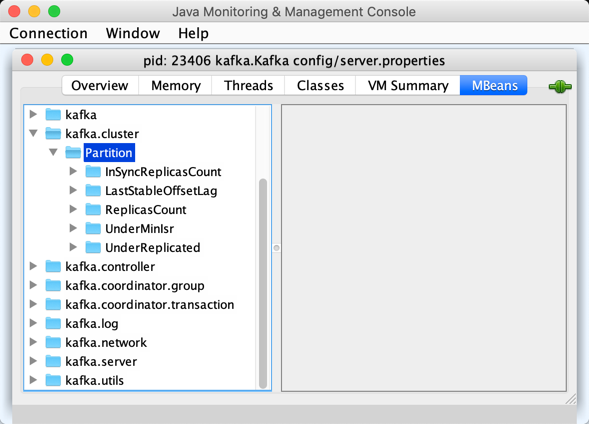

== [[Partition]] Partition

`Partition` is an internal representation of a <<topicPartition, TopicPartition>> for link:kafka-server-ReplicaManager.adoc[ReplicaManager] (to manage <<kafka-server-ReplicaManager.adoc#allPartitions, all partitions>>).

`Partition` knows the host broker (by <<localBrokerId, local broker ID>>) which is one of the *partition replicas* (replicated across brokers of a Kafka cluster).

`Partition` can be the <<isLeader, leader>> of the <<topicPartition, TopicPartition>> or a follower.

`Partition` can be <<makeLeader, elected the partition leader>> (when `ReplicaManager` is requested to link:kafka-server-ReplicaManager.adoc#makeLeaders[makeLeaders]).

[[isUnderReplicated]]
`Partition` is *under-replicated* if it is the <<isLeader, leader>> and the number of <<inSyncReplicaIds, in-sync replicas>> is below the number of <<allReplicaIds, all replicas>>. Use the <<UnderReplicated, UnderReplicated>> metric to know it (or link:kafka-server-ReplicaManager.adoc#UnderReplicatedPartitions[UnderReplicatedPartitions] metric of the link:kafka-server-ReplicaManager.adoc[ReplicaManager]).

`Partition` uses the <<remoteReplicasMap, remoteReplicasMap>> internal registry to track remote replicas (and is requested to <<updateAssignmentAndIsr, update partition replicas and the in-sync replicas>> when...FIXME).

A Kafka topic is spread across a Kafka cluster as a logical group of one or more *partitions*.

Kafka producers publish messages to topic leaders as do Kafka consumers consume them from.

*In-Sync Replicas* (ISR) are brokers that...FIXME

*Offline Replicas* are...FIXME

`Partition` is <<creating-instance, created>> when `ReplicaManager` is requested to <<kafka-server-ReplicaManager.adoc#allPartitions, add a TopicPartition to allPartitions>> (indirectly using <<apply, apply>>) and for the <<kafka-server-ReplicaManager.adoc#OfflinePartition, OfflinePartition>>.

[[logIdent]]
`Partition` uses *[Partition [topicPartition] broker=[localBrokerId]]* as the logging prefix (aka `logIdent`).

[[logging]]
[TIP]
====
Enable `ALL` logging level for `kafka.cluster.Partition` logger to see what happens inside.

Add the following line to `config/log4j.properties`:

```
log4j.logger.kafka.cluster.Partition=ALL
```

Refer to link:kafka-logging.adoc[Logging].
====

=== [[KafkaMetricsGroup]][[metrics]] Performance Metrics

`Partition` is a <<kafka-metrics-KafkaMetricsGroup.adoc#, KafkaMetricsGroup>> with the following performance metrics.

.Partition's Performance Metrics
[cols="30m,70",options="header",width="100%"]
|===
| Metric Name
| Description

| InSyncReplicasCount
a| [[InSyncReplicasCount]]

One of the two possible values:

* Number of <<inSyncReplicas, inSyncReplicas>> when <<isLeaderReplicaLocal, isLeaderReplicaLocal>>

* `0` otherwise

| LastStableOffsetLag
a| [[LastStableOffsetLag]]

| ReplicasCount
a| [[ReplicasCount]]

One of the two possible values:

* Number of <<assignedReplicas, assignedReplicas>> when <<isLeaderReplicaLocal, isLeaderReplicaLocal>>

* `0` otherwise

| UnderMinIsr
a| [[UnderMinIsr]]

One of the two possible values:

* `1` when <<isUnderMinIsr, isUnderMinIsr>>

* `0` otherwise

| UnderReplicated
a| [[UnderReplicated]]

One of the two possible values:

* `1` when <<isUnderReplicated, isUnderReplicated>>

* `0` otherwise

|===

The performance metrics are registered in *kafka.cluster:type=Partition* group (only when the partition is not <<isOffline, offline>>).

.Partition Metrics in JConsole JMX Tool


=== [[creating-instance]] Creating Partition Instance

`Partition` takes the following to be created:

* [[topicPartition]] `TopicPartition`
* [[replicaLagTimeMaxMs]] link:kafka-properties.adoc#replica.lag.time.max.ms[replica.lag.time.max.ms]
* [[interBrokerProtocolVersion]] link:kafka-properties.adoc#inter.broker.protocol.version[inter.broker.protocol.version]
* [[localBrokerId]] Broker ID (of the local broker)
* [[time]] `Time`
* [[stateStore]] <<PartitionStateStore, PartitionStateStore>>
* [[delayedOperations]] `DelayedOperations`
* [[metadataCache]] link:kafka-server-MetadataCache.adoc[MetadataCache]
* [[logManager]] link:kafka-log-LogManager.adoc[LogManager]

`Partition` initializes the <<internal-properties, internal properties>>.

=== [[log]] Partition and Partition Log -- `log` Registry

[source, scala]
----
log: Option[Log] = None
----

`log` is a link:kafka-log-Log.adoc[partition log] (of the partition).

`log` is assigned a `Log` when `Partition` is requested to <<createLogIfNotExists, createLogIfNotExists>> and <<maybeReplaceCurrentWithFutureReplica, maybeReplaceCurrentWithFutureReplica>>.

`log` is available until `Partition` is requested to <<delete, delete>>.

`log` is used when:

* `Partition` is requested for the <<LastStableOffsetLag, LastStableOffsetLag>> metric, <<getLocalLog, getLocalLog>>, <<leaderLogIfLocal, leaderLogIfLocal>>, <<localLogOrException, localLogOrException>>, <<maybeReplaceCurrentWithFutureReplica, maybeReplaceCurrentWithFutureReplica>>

* `ReplicaManager` is requested to link:kafka-server-ReplicaManager.adoc#localLog[localLog], link:kafka-server-ReplicaManager.adoc#becomeLeaderOrFollower[becomeLeaderOrFollower], link:kafka-server-ReplicaManager.adoc#checkpointHighWatermarks[checkpointHighWatermarks] and link:kafka-server-ReplicaManager.adoc#handleLogDirFailure[handleLogDirFailure].

=== [[PartitionStateStore]] Partition and PartitionStateStore

When <<creating-instance, created>>, a `Partition` is given a <<stateStore, PartitionStateStore>> (that is a link:kafka-cluster-ZkPartitionStateStore.adoc[ZkPartitionStateStore] by <<apply, default>>).

`PartitionStateStore` is used when `Partition` is requested for the following:

* <<createLog, createLog>>

* <<expandIsr, expandIsr>>

* <<shrinkIsr, shrinkIsr>>

=== [[apply]] Creating Partition -- `apply` Utility

[source, scala]
----
apply(
  topicPartition: TopicPartition,
  time: Time,
  replicaManager: ReplicaManager): Partition
----

`apply` creates a new <<creating-instance, Partition>> for the given `TopicPartition`, `Time`, and <<kafka-server-ReplicaManager.adoc#, ReplicaManager>> with the following:

* Creates a new `ZkPartitionStateStore` for the given `TopicPartition` and <<kafka-server-ReplicaManager.adoc#, ReplicaManager>>

* Creates a new `DelayedOperations` for the given `TopicPartition` and <<kafka-server-ReplicaManager.adoc#, ReplicaManager>>

* Uses link:kafka-properties.adoc#replica.lag.time.max.ms[replica.lag.time.max.ms] and link:kafka-properties.adoc#inter.broker.protocol.version[inter.broker.protocol.version] configuration properties.

NOTE: `apply` is used when `ReplicaManager` is requested to link:kafka-server-ReplicaManager.adoc#allPartitions[add a partition to allPartitions Registry].

=== [[leaderIsrUpdateLock]][[inReadLock]][[inWriteLock]] Read and Write Locks

[source, scala]
----
leaderIsrUpdateLock: ReentrantReadWriteLock
----

`leaderIsrUpdateLock` is a Java's https://docs.oracle.com/en/java/javase/11/docs/api/java.base/java/util/concurrent/locks/ReentrantReadWriteLock.html[ReentrantReadWriteLock] for a pair of locks, one for read-only operations and one for writing. (The read lock may be held simultaneously by multiple reader threads, so long as there are no writers. The write lock is exclusive).

A read lock (`inReadLock`) is used for the following:

* <<futureReplicaDirChanged, futureReplicaDirChanged>>

* <<maybeIncrementLeaderHW, maybeIncrementLeaderHW>>

* <<doAppendRecordsToFollowerOrFutureReplica, doAppendRecordsToFollowerOrFutureReplica>>

* <<appendRecordsToLeader, appendRecordsToLeader>>

* <<readRecords, readRecords>>

* <<fetchOffsetForTimestamp, fetchOffsetForTimestamp>>

* <<fetchOffsetSnapshot, fetchOffsetSnapshot>>

* <<legacyFetchOffsetsForTimestamp, legacyFetchOffsetsForTimestamp>>

* <<logStartOffset, logStartOffset>>

* <<deleteRecordsOnLeader, deleteRecordsOnLeader>>

* <<truncateTo, truncateTo>>

* <<truncateFullyAndStartAt, truncateFullyAndStartAt>>

* <<lastOffsetForLeaderEpoch, lastOffsetForLeaderEpoch>>

A write lock (`inWriteLock`) is used for the following:

* <<maybeCreateFutureReplica, maybeCreateFutureReplica>>

* <<removeFutureLocalReplica, removeFutureLocalReplica>>

* <<maybeReplaceCurrentWithFutureReplica, maybeReplaceCurrentWithFutureReplica>>

* <<delete, delete>>

* <<makeLeader, makeLeader>>

* <<makeFollower, makeFollower>>

* <<maybeExpandIsr, maybeExpandIsr>>

* <<maybeShrinkIsr, maybeShrinkIsr>>

=== [[maybeExpandIsr]] `maybeExpandIsr` Method

[source, scala]
----
maybeExpandIsr(
  replicaId: Int,
  logReadResult: LogReadResult): Boolean
----

`maybeExpandIsr`...FIXME

NOTE: `maybeExpandIsr` is used when `Partition` is requested to <<updateFollowerFetchState, updateFollowerFetchState>>.

=== [[updateFollowerFetchState]] `updateFollowerFetchState` Method

[source, scala]
----
updateFollowerFetchState(
  followerId: Int,
  followerFetchOffsetMetadata: LogOffsetMetadata,
  followerStartOffset: Long,
  followerFetchTimeMs: Long,
  leaderEndOffset: Long,
  lastSentHighwatermark: Long): Boolean
----

`updateFollowerFetchState`...FIXME

NOTE: `updateFollowerFetchState` is used when `ReplicaManager` is requested to link:kafka-server-ReplicaManager.adoc#updateFollowerFetchState[updateFollowerFetchState].

=== [[maybeShrinkIsr]] `maybeShrinkIsr` Method

[source, scala]
----
maybeShrinkIsr(
  replicaMaxLagTimeMs: Long): Unit
----

`maybeShrinkIsr`...

NOTE: `maybeShrinkIsr` is used when `ReplicaManager` is requested to link:kafka-server-ReplicaManager.adoc#maybeShrinkIsr[maybeShrinkIsr].

=== [[updateReplicaLogReadResult]] `updateReplicaLogReadResult` Method

[source, scala]
----
updateReplicaLogReadResult(replica: Replica, logReadResult: LogReadResult): Boolean
----

`updateReplicaLogReadResult`...FIXME

NOTE: `updateReplicaLogReadResult` is used exclusively when `ReplicaManager` link:kafka-server-ReplicaManager.adoc#updateFollowerLogReadResults[updateFollowerLogReadResults].

=== [[updateIsr]] `updateIsr` Internal Method

[source, scala]
----
updateIsr(newIsr: Set[Replica]): Unit
----

`updateIsr`...FIXME

NOTE: `updateIsr` is used when `Partition` is requested to <<maybeExpandIsr, expand>> or <<maybeShrinkIsr, shrink>> the ISR.

=== [[makeFollower]] `makeFollower` Method

[source, scala]
----
makeFollower(
  controllerId: Int,
  partitionStateInfo: LeaderAndIsrRequest.PartitionState,
  correlationId: Int): Boolean
----

`makeFollower`...FIXME

NOTE: `makeFollower` is used exclusively when `ReplicaManager` is requested to <<kafka-server-ReplicaManager.adoc#makeFollowers, makeFollowers>>.

=== [[leaderReplicaIfLocal]] `leaderReplicaIfLocal` Method

[source, scala]
----
leaderReplicaIfLocal: Option[Replica]
----

`leaderReplicaIfLocal` returns a <<localReplica, Replica>> when the <<leaderReplicaIdOpt, leaderReplicaIdOpt>> is the <<localBrokerId, localBrokerId>>. Otherwise, `leaderReplicaIfLocal` returns `None` (i.e. undefined).

NOTE: `leaderReplicaIfLocal` is used...FIXME

=== [[isUnderMinIsr]] `isUnderMinIsr` Predicate

[source, scala]
----
isUnderMinIsr: Boolean
----

`isUnderMinIsr` is `true` only if the partition <<isLeaderReplicaLocal, isLeaderReplicaLocal>> and the number of <<inSyncReplicas, in-sync replicas>> is below the <<kafka-properties.adoc#min.insync.replicas, min.insync.replicas>> configuration property (as configured for the <<kafka-log-Log.adoc#, Log>> of the <<leaderReplica, leader replica>>).

NOTE: `isUnderMinIsr` is used when...FIXME

=== [[checkEnoughReplicasReachOffset]] `checkEnoughReplicasReachOffset` Method

[source, scala]
----
checkEnoughReplicasReachOffset(
  requiredOffset: Long): (Boolean, Errors)
----

`checkEnoughReplicasReachOffset`...FIXME

NOTE: `checkEnoughReplicasReachOffset` is used when...FIXME

=== [[makeLeader]] Electing Local Partition Replica as Partition Leader -- `makeLeader` Method

[source, scala]
----
makeLeader(
  controllerId: Int,
  partitionState: LeaderAndIsrPartitionState,
  correlationId: Int,
  highWatermarkCheckpoints: OffsetCheckpoints): Boolean
----

`makeLeader` returns `true` if this broker has just been elected as the <<isLeader, leader for the partition>>.

NOTE: `makeLeader` could be executed for a broker that is the <<isLeader, partition leader>> already.

Internally, `makeLeader` starts by acquiring <<inWriteLock, write lock>> (which makes it a single-thread-exclusive operation).

`makeLeader` changes the internal <<controllerEpoch, controller epoch>> based on the given `LeaderAndIsrPartitionState`.

`makeLeader` requests the given `LeaderAndIsrPartitionState` for the partition replicas (their broker IDs) and the ISR (as a list of broker IDs) and <<updateAssignmentAndIsr, updates internal registries for replica assignments and in-sync replicas>>.

`makeLeader` <<createLogIfNotExists, creates a Log (unless available already)>> for the <<localBrokerId, local broker ID>> and the given `OffsetCheckpoints` (with `isFutureReplica` flag off).

`makeLeader` requests the leader log for the link:kafka-log-Log.adoc#logEndOffset[logEndOffset].

`makeLeader` prints out the following INFO message to the logs:

```
[topicPartition] starts at Leader Epoch [leaderEpoch] from offset [leaderEpochStartOffset]. Previous Leader Epoch was: [leaderEpoch]
```

`makeLeader` updates the internal registries: <<leaderEpoch, leaderEpoch>>, <<leaderEpochStartOffsetOpt, leaderEpochStartOffsetOpt>> and <<zkVersion, zkVersion>>.

`makeLeader` requests the leader log to link:kafka-log-Log.adoc#maybeAssignEpochStartOffset[maybeAssignEpochStartOffset] with the current <<leaderEpoch, leaderEpoch>> and the log end offset (that is now considered the leader epoch's start offset).

`makeLeader` requests the <<remoteReplicas, remoteReplicas>> to link:kafka-cluster-Replica.adoc#resetLastCaughtUpTime[resetLastCaughtUpTime]. For replicas in <<inSyncReplicaIds, inSyncReplicaIds>>, the last caught-up time is the current time while for the others it is `0`.

When the partition has just been elected a new leader, `makeLeader` updates the <<leaderReplicaIdOpt, leaderReplicaIdOpt>> internal registry and requests the <<remoteReplicas, remoteReplicas>> to link:kafka-cluster-Replica.adoc#updateFetchState[updateFetchState].

`makeLeader` <<maybeIncrementLeaderHW, checks if increment the high watermark>> with the leader log and, if incremented, <<tryCompleteDelayedRequests, tryCompleteDelayedRequests>>.

NOTE: `makeLeader` is used when `ReplicaManager` is requested to link:kafka-server-ReplicaManager.adoc#makeLeaders[makeLeaders].

=== [[updateAssignmentAndIsr]] Updating Internal Registries for Replica Assignments and In-Sync Replicas -- `updateAssignmentAndIsr` Method

[source, scala]
----
updateAssignmentAndIsr(
  assignment: Seq[Int],
  isr: Set[Int]): Unit
----

`updateAssignmentAndIsr` uses the <<remoteReplicasMap, remoteReplicasMap>> internal registry and the given `assignment` to find the broker IDs that are no longer partition replicas (of the partition).

`updateAssignmentAndIsr` creates new link:kafka-cluster-Replica.adoc[partition replicas] for the broker IDs that have not been registered in the <<remoteReplicasMap, remoteReplicasMap>> internal registry before (based on the given `assignment`).

`updateAssignmentAndIsr` updates the <<allReplicaIds, allReplicaIds>> and the <<inSyncReplicaIds, inSyncReplicaIds>> internal registries with the given `assignment` and `isr`, respectively.

NOTE: `updateAssignmentAndIsr` is used when `Partition` is requested to make the local replica the <<makeLeader, leader>> or a <<makeFollower, follower>>.

=== [[getOrCreateReplica]] Looking Up or Creating Replica -- `getOrCreateReplica` Method

[source, scala]
----
getOrCreateReplica(
  replicaId: Int,
  isNew: Boolean = false): Replica
----

`getOrCreateReplica` simply looks up the <<kafka-cluster-Replica.adoc#, Replica>> in the <<allReplicasMap, allReplicasMap>> internal registry (by the given `replicaId`).

If not found, `getOrCreateReplica`...FIXME

[NOTE]
====
`getOrCreateReplica` is used when:

* `Partition` is requested to <<maybeCreateFutureReplica, maybeCreateFutureReplica>>, <<makeLeader, makeLeader>>, and <<makeFollower, makeFollower>>

* `ReplicaManager` is requested to <<kafka-server-ReplicaManager.adoc#becomeLeaderOrFollower, becomeLeaderOrFollower>> and <<kafka-server-ReplicaManager.adoc#makeFollowers, makeFollowers>>
====

=== [[maybeCreateFutureReplica]] `maybeCreateFutureReplica` Method

[source, scala]
----
maybeCreateFutureReplica(logDir: String): Boolean
----

`maybeCreateFutureReplica`...FIXME

NOTE: `maybeCreateFutureReplica` is used exclusively when `ReplicaManager` is requested to <<alterReplicaLogDirs, alterReplicaLogDirs>>.

=== [[appendRecordsToLeader]] `appendRecordsToLeader` Method

[source, scala]
----
appendRecordsToLeader(
  records: MemoryRecords,
  isFromClient: Boolean,
  requiredAcks: Int = 0): LogAppendInfo
----

`appendRecordsToLeader` basically requests the `Log` (of the leader <<kafka-cluster-Replica.adoc#, Replica>>) to <<kafka-log-Log.adoc#appendAsLeader, appendAsLeader>>.

Internally, `appendRecordsToLeader`...FIXME

[NOTE]
====
`appendRecordsToLeader` is used when:

* `GroupMetadataManager` is requested to <<kafka-coordinator-group-GroupMetadataManager.adoc#cleanupGroupMetadata, cleanupGroupMetadata>>

* `ReplicaManager` is requested to <<kafka-server-ReplicaManager.adoc#appendToLocalLog, appendToLocalLog>>
====

=== [[doAppendRecordsToFollowerOrFutureReplica]] `doAppendRecordsToFollowerOrFutureReplica` Internal Method

[source, scala]
----
doAppendRecordsToFollowerOrFutureReplica(
  records: MemoryRecords,
  isFuture: Boolean): Option[LogAppendInfo]
----

`doAppendRecordsToFollowerOrFutureReplica`...FIXME

NOTE: `doAppendRecordsToFollowerOrFutureReplica` is used exclusively when `Partition` is requested to <<appendRecordsToFollowerOrFutureReplica, appendRecordsToFollowerOrFutureReplica>>.

=== [[appendRecordsToFollowerOrFutureReplica]] `appendRecordsToFollowerOrFutureReplica` Method

[source, scala]
----
appendRecordsToFollowerOrFutureReplica(
  records: MemoryRecords,
  isFuture: Boolean): Option[LogAppendInfo]
----

`appendRecordsToFollowerOrFutureReplica`...FIXME

[NOTE]
====
`appendRecordsToFollowerOrFutureReplica` is used when:

* `ReplicaAlterLogDirsThread` is requested to <<kafka-server-ReplicaAlterLogDirsThread.adoc#processPartitionData, processPartitionData>>

* `ReplicaFetcherThread` is requested to <<kafka-server-ReplicaFetcherThread.adoc#processPartitionData, processPartitionData>>
====

=== [[truncateTo]] `truncateTo` Method

[source, scala]
----
truncateTo(
  offset: Long,
  isFuture: Boolean): Unit
----

`truncateTo`...FIXME

[NOTE]
====
`truncateTo` is used when:

* `ReplicaAlterLogDirsThread` is requested to <<kafka-server-ReplicaAlterLogDirsThread.adoc#truncate, truncate>>

* `ReplicaFetcherThread` is requested to <<kafka-server-ReplicaFetcherThread.adoc#truncate, truncate>>
====

=== [[truncateFullyAndStartAt]] `truncateFullyAndStartAt` Method

[source, scala]
----
truncateFullyAndStartAt(newOffset: Long, isFuture: Boolean): Unit
----

`truncateFullyAndStartAt`...FIXME

[NOTE]
====
`truncateFullyAndStartAt` is used when:

* `Partition` is requested to <<appendRecordsToFollowerOrFutureReplica, appendRecordsToFollowerOrFutureReplica>>

* `ReplicaAlterLogDirsThread` is requested to <<kafka-server-ReplicaAlterLogDirsThread.adoc#truncateFullyAndStartAt, truncateFullyAndStartAt>>

* `ReplicaFetcherThread` is requested to <<kafka-server-ReplicaFetcherThread.adoc#truncateFullyAndStartAt, truncateFullyAndStartAt>>
====

=== [[maybeReplaceCurrentWithFutureReplica]] `maybeReplaceCurrentWithFutureReplica` Method

[source, scala]
----
maybeReplaceCurrentWithFutureReplica(): Boolean
----

`maybeReplaceCurrentWithFutureReplica`...FIXME

NOTE: `maybeReplaceCurrentWithFutureReplica` is used exclusively when `ReplicaAlterLogDirsThread` is requested to <<kafka-server-ReplicaAlterLogDirsThread.adoc#processPartitionData, processPartitionData>>.

=== [[delete]] `delete` Method

[source, scala]
----
delete(): Unit
----

`delete`...FIXME

NOTE: `delete` is used exclusively when `ReplicaManager` is requested to <<kafka-server-ReplicaManager.adoc#stopReplica, stopReplica>>.

=== [[removeFutureLocalReplica]] `removeFutureLocalReplica` Method

[source, scala]
----
removeFutureLocalReplica(deleteFromLogDir: Boolean = true): Unit
----

`removeFutureLocalReplica`...FIXME

NOTE: `removeFutureLocalReplica` is used when `ReplicaManager` is requested to <<kafka-server-ReplicaManager.adoc#alterReplicaLogDirs, alterReplicaLogDirs>> and <<kafka-server-ReplicaManager.adoc#handleLogDirFailure, handleLogDirFailure>>.

=== [[isLeaderReplicaLocal]] `isLeaderReplicaLocal` Internal Method

[source, scala]
----
isLeaderReplicaLocal: Boolean
----

`isLeaderReplicaLocal` is positive (`true`) when the <<leaderReplicaIfLocal, optional Replica>> is defined. Otherwise, `false`.

NOTE: `isLeaderReplicaLocal` is used when `ReplicaManager` is requested for the performance metrics (<<InSyncReplicasCount, InSyncReplicasCount>> and <<ReplicasCount, ReplicasCount>>), <<isUnderReplicated, isUnderReplicated>>, and <<lowWatermarkIfLeader, lowWatermarkIfLeader>>.

=== [[localReplicaOrException]] `localReplicaOrException` Method

[source, scala]
----
localReplicaOrException: Replica
----

`localReplicaOrException` <<localReplica, localReplica>> and returns the local replica if available. Otherwise, `localReplicaOrException` throws a `ReplicaNotAvailableException`:

```
Replica for partition [topicPartition] is not available on broker [localBrokerId]
```

[NOTE]
====
`localReplicaOrException` is used when:

* `Partition` is requested to <<maybeCreateFutureReplica, maybeCreateFutureReplica>>, <<maybeReplaceCurrentWithFutureReplica, maybeReplaceCurrentWithFutureReplica>>, <<makeLeader, makeLeader>>, <<doAppendRecordsToFollowerOrFutureReplica, doAppendRecordsToFollowerOrFutureReplica>>, <<appendRecordsToFollowerOrFutureReplica, appendRecordsToFollowerOrFutureReplica>>

* `ReplicaManager` is requested to <<kafka-server-ReplicaManager.adoc#localReplicaOrException, localReplicaOrException>>, <<kafka-server-ReplicaManager.adoc#alterReplicaLogDirs, alterReplicaLogDirs>>, <<kafka-server-ReplicaManager.adoc#makeFollowers, makeFollowers>>
====

=== [[localReplica]] `localReplica` Method

[source, scala]
----
localReplica: Option[Replica]
----

`localReplica` simply <<getReplica, gets the partition replica>> for the <<localBrokerId, local broker ID>>.

[NOTE]
====
`localReplica` is used when:

* `Partition` is requested to <<localReplicaOrException, localReplicaOrException>> and <<leaderReplicaIfLocal, leaderReplicaIfLocal>>

* `ReplicaManager` is requested to <<kafka-server-ReplicaManager.adoc#localReplica, localReplica>>, <<kafka-server-ReplicaManager.adoc#becomeLeaderOrFollower, becomeLeaderOrFollower>>, <<kafka-server-ReplicaManager.adoc#checkpointHighWatermarks, checkpointHighWatermarks>>, and <<kafka-server-ReplicaManager.adoc#handleLogDirFailure, handleLogDirFailure>>
====

=== [[getReplica]] `getReplica` Method

[source, scala]
----
getReplica(replicaId: Int): Option[Replica]
----

`getReplica` returns the link:kafka-cluster-Replica.adoc[replica] by the given `replicaId` (in the <<allReplicasMap, allReplicasMap>> registry) or `None`.

[NOTE]
====
`getReplica` is used when:

* `Partition` is requested to <<getReplicaOrException, getReplicaOrException>> and <<updateFollowerFetchState, updateFollowerFetchState>>

* `DelayedFetch` is requested to `tryComplete`

* `ReplicaManager` is requested to link:kafka-server-ReplicaManager.adoc#readFromLocalLog[readFromLocalLog]
====

=== [[addReplicaIfNotExists]] `addReplicaIfNotExists` Method

[source, scala]
----
addReplicaIfNotExists(replica: Replica): Replica
----

`addReplicaIfNotExists`...FIXME

NOTE: `addReplicaIfNotExists` is used when...FIXME

=== [[assignedReplicas]] `assignedReplicas` Method

[source, scala]
----
assignedReplicas: Set[Replica]
----

`assignedReplicas`...FIXME

NOTE: `assignedReplicas` is used when...FIXME

=== [[allReplicas]] `allReplicas` Method

[source, scala]
----
allReplicas: Set[Replica]
----

`allReplicas`...FIXME

NOTE: `allReplicas` is used when...FIXME

=== [[removeReplica]] `removeReplica` Internal Method

[source, scala]
----
removeReplica(replicaId: Int): Unit
----

`removeReplica`...FIXME

NOTE: `removeReplica` is used when...FIXME

=== [[toString]] String (Textual) Representation -- `toString` Method

[source, scala]
----
toString(): String
----

NOTE: `toString` is part of the link:++https://docs.oracle.com/en/java/javase/11/docs/api/java.base/java/lang/Object.html#toString()++[java.lang.Object] Contract for a string representation of the object.

`toString`...FIXME

=== [[readRecords]] `readRecords` Method

[source, scala]
----
readRecords(
  fetchOffset: Long,
  currentLeaderEpoch: Optional[Integer],
  maxBytes: Int,
  fetchIsolation: FetchIsolation,
  fetchOnlyFromLeader: Boolean,
  minOneMessage: Boolean): LogReadInfo
----

`readRecords`...FIXME

NOTE: `readRecords` is used when...FIXME

=== [[deleteRecordsOnLeader]] `deleteRecordsOnLeader` Method

[source, scala]
----
deleteRecordsOnLeader(
  offset: Long): LogDeleteRecordsResult
----

`deleteRecordsOnLeader`...FIXME

NOTE: `deleteRecordsOnLeader` is used when...FIXME

=== [[createLogIfNotExists]] Creating Log or Future Log (Unless Available Already) -- `createLogIfNotExists` Method

[source, scala]
----
createLogIfNotExists(
  replicaId: Int,
  isNew: Boolean,
  isFutureReplica: Boolean,
  offsetCheckpoints: OffsetCheckpoints): Unit
----

`createLogIfNotExists` branches off per the given `isFutureReplica` flag:

* When enabled (`true`) and the <<futureLog, futureLog>> internal registry is undefined, `createLogIfNotExists` <<createLog, createLog>> and saves it in the <<futureLog, futureLog>> internal registry

* When disabled (`false`) and the <<log, log>> internal registry is undefined, `createLogIfNotExists` <<createLog, createLog>> and saves it in the <<log, log>> internal registry

For all other cases, `createLogIfNotExists` simply prints out the following TRACE message (with the `Future` prefix for `isFutureReplica` flag enabled):

```
[Future] Log already exists.
```

[NOTE]
====
`createLogIfNotExists` is used when:

* `Partition` is requested to <<maybeCreateFutureReplica, maybeCreateFutureReplica>> (`isFutureReplica` flag is enabled), make the local broker the <<makeLeader, leader>> or a <<makeFollower, follower>> (`isFutureReplica` flag is disabled)

* `ReplicaManager` is requested to link:kafka-server-ReplicaManager.adoc#becomeLeaderOrFollower[becomeLeaderOrFollower] (`isFutureReplica` flag is enabled) and link:kafka-server-ReplicaManager.adoc#makeFollowers[makeFollowers] (`isFutureReplica` flag is disabled)
====

=== [[getOutOfSyncReplicas]] `getOutOfSyncReplicas` Method

[source, scala]
----
getOutOfSyncReplicas(
  maxLagMs: Long): Set[Int]
----

`getOutOfSyncReplicas` requests the <<localLogOrException, Log>> for the link:kafka-log-Log.adoc#logEndOffset[logEndOffset].

`maybeShrinkIsr` <<isFollowerOutOfSync, isFollowerOutOfSync>> for every <<inSyncReplicaIds, inSyncReplicaIds>> (without the <<localBrokerId, local broker ID>>)

NOTE: `getOutOfSyncReplicas` is used when `Partition` is requested to <<maybeShrinkIsr, maybeShrinkIsr>>.

=== [[localLogOrException]] `localLogOrException` Method

[source, scala]
----
localLogOrException: Log
----

`localLogOrException` gives the <<log, Log>> if defined or throws a `ReplicaNotAvailableException`:

```
Log for partition [topicPartition] is not available on broker [localBrokerId]
```

NOTE: `localLogOrException` is used when...FIXME

=== [[leaderLogIfLocal]] `leaderLogIfLocal` Method

[source, scala]
----
leaderLogIfLocal: Option[Log]
----

`leaderLogIfLocal` gives the <<log, Log>> only if the local broker is the <<isLeader, leader>>.

NOTE: `leaderLogIfLocal` is used when...FIXME

=== [[isLeader]] Checking If Broker is Partition Leader -- `isLeader` Method

[source, scala]
----
isLeader: Boolean
----

`isLeader` is positive (`true`) when the <<leaderReplicaIdOpt, leaderReplicaIdOpt>> is the <<localBrokerId, local broker ID>>.

[NOTE]
====
`isLeader` is used when:

* `Partition` is requested for the <<InSyncReplicasCount, InSyncReplicasCount>> and <<ReplicasCount, ReplicasCount>> metrics, to <<isUnderReplicated, isUnderReplicated>>, <<getLocalLog, getLocalLog>>, <<leaderLogIfLocal, leaderLogIfLocal>>, <<makeLeader, makeLeader>>, <<lowWatermarkIfLeader, lowWatermarkIfLeader>>

* `ReplicaManager` is requested to link:kafka-server-ReplicaManager.adoc#findPreferredReadReplica[findPreferredReadReplica]
====

=== [[lastOffsetForLeaderEpoch]] `lastOffsetForLeaderEpoch` Method

[source, scala]
----
lastOffsetForLeaderEpoch(
  currentLeaderEpoch: Optional[Integer],
  leaderEpoch: Int,
  fetchOnlyFromLeader: Boolean): EpochEndOffset
----

`lastOffsetForLeaderEpoch`...FIXME

NOTE: `lastOffsetForLeaderEpoch` is used when...FIXME

=== [[tryCompleteDelayedRequests]] `tryCompleteDelayedRequests` Internal Method

[source, scala]
----
tryCompleteDelayedRequests(): Unit
----

`tryCompleteDelayedRequests`...FIXME

NOTE: `tryCompleteDelayedRequests` is used when `Partition` is requested to <<makeLeader, makeLeader>>, <<updateReplicaLogReadResult, updateReplicaLogReadResult>>, <<maybeShrinkIsr, maybeShrinkIsr>>, and <<appendRecordsToLeader, appendRecordsToLeader>> (when `leaderHWIncremented`).

=== [[createLog]] `createLog` Internal Method

[source, scala]
----
createLog(
  replicaId: Int,
  isNew: Boolean,
  isFutureReplica: Boolean,
  offsetCheckpoints: OffsetCheckpoints): Log
----

`createLog` requests the <<logManager, LogManager>> to link:kafka-log-LogManager.adoc#initializingLog[initializingLog] for the <<topicPartition, TopicPartition>>.

`createLog` requests the <<logManager, LogManager>> to link:kafka-log-LogManager.adoc#getOrCreateLog[look up or create a new partition log] for the <<topicPartition, TopicPartition>>. The `LogConfig` passed in is created by requesting the <<stateStore, PartitionStateStore>> for the link:kafka-cluster-PartitionStateStore.adoc#fetchTopicConfig[fetchTopicConfig] to override the link:kafka-log-LogManager.adoc#currentDefaultConfig[currentDefaultConfig] of the <<logManager, LogManager>>.

`createLog` requests the given `OffsetCheckpoints` to fetch the checkpointed high watermark for the <<topicPartition, TopicPartition>>. Unless found, `createLog` prints out the following INFO message to the logs and assumes `0`:

```
No checkpointed highwatermark is found for partition [topicPartition]
```

`createLog` requests the `Log` to link:kafka-log-Log.adoc#updateHighWatermark[update the high watermark].

`createLog` prints out the following INFO message to the logs:

```
Log loaded for partition [topicPartition] with initial high watermark [initialHighWatermark]
```

In the end, `createLog` requests the <<logManager, LogManager>> to link:kafka-log-LogManager.adoc#finishedInitializingLog[finishedInitializingLog] for the <<topicPartition, TopicPartition>>.

NOTE: `createLog` is used when `Partition` is requested to <<createLogIfNotExists, create a log or future log (unless available already)>>.

=== [[expandIsr]] `expandIsr` Internal Method

[source, scala]
----
expandIsr(
  newIsr: Set[Int]): Unit
----

`expandIsr`...FIXME

NOTE: `expandIsr` is used when `Partition` is requested to <<maybeExpandIsr, maybeExpandIsr>>.

=== [[shrinkIsr]] `shrinkIsr` Internal Method

[source, scala]
----
shrinkIsr(
  newIsr: Set[Int]): Unit
----

`shrinkIsr`...FIXME

NOTE: `shrinkIsr` is used when `Partition` is requested to <<maybeShrinkIsr, maybeShrinkIsr>>.

=== [[isFollowerOutOfSync]] `isFollowerOutOfSync` Internal Method

[source, scala]
----
isFollowerOutOfSync(
  replicaId: Int,
  leaderEndOffset: Long,
  currentTimeMs: Long,
  maxLagMs: Long): Boolean
----

`isFollowerOutOfSync` <<getReplicaOrException, gets the follower replica>> for the given `replicaId` (if available or throws an exception).

`isFollowerOutOfSync` is positive (`true`) when the following hold:

. link:kafka-cluster-Replica.adoc#logEndOffset[logEndOffset] of the follower replica is different than the given `leaderEndOffset`

. Time since the link:kafka-cluster-Replica.adoc#lastCaughtUpTimeMs[lastCaughtUpTimeMs] of the follower replica is greater than the given `maxLagMs` (i.e. link:kafka-properties.adoc#replica.lag.time.max.ms[replica.lag.time.max.ms] configuration property).

NOTE: `isFollowerOutOfSync` is used when `Partition` is requested to <<getOutOfSyncReplicas, getOutOfSyncReplicas>>.

=== [[getReplicaOrException]] `getReplicaOrException` Internal Method

[source, scala]
----
getReplicaOrException(
  replicaId: Int): Replica
----

`getReplicaOrException` <<getReplica, finds the replica>> for the given replica ID or throws a `ReplicaNotAvailableException`:

```
Replica with id [replicaId] is not available on broker [localBrokerId]
```

NOTE: `getReplicaOrException` is used when `Partition` is requested to <<checkEnoughReplicasReachOffset, checkEnoughReplicasReachOffset>>, <<maybeShrinkIsr, maybeShrinkIsr>>, and <<isFollowerOutOfSync, isFollowerOutOfSync>>.

=== [[getLocalLog]] `getLocalLog` Internal Method

[source, scala]
----
getLocalLog(
  currentLeaderEpoch: Optional[Integer],
  requireLeader: Boolean): Either[Log, Errors]
----

`getLocalLog` <<checkCurrentLeaderEpoch, checkCurrentLeaderEpoch>> for the given `currentLeaderEpoch` and branches off per the result:

* For no errors (`Errors.NONE`), if the `requireLeader` flag is on (`true`), but the broker is not the <<isLeader, leader>>, `getLocalLog` returns `Errors.NOT_LEADER_FOR_PARTITION`.

* For no errors (`Errors.NONE`), if the `requireLeader` flag is off (`false`) or the broker is the <<isLeader, leader>>, `getLocalLog` branches off per the optional <<log, log>>. `getLocalLog` gives the <<log, log>> if defined or the errors:

** `Errors.NOT_LEADER_FOR_PARTITION` when the `requireLeader` flag is on (`true`)

** `Errors.REPLICA_NOT_AVAILABLE` when the `requireLeader` flag is off (`false`)

* For any error, `getLocalLog` simply returns it

NOTE: `getLocalLog` is used when `Partition` is requested to <<localLogWithEpochOrException, localLogWithEpochOrException>> and <<lastOffsetForLeaderEpoch, lastOffsetForLeaderEpoch>>.

=== [[checkCurrentLeaderEpoch]] `checkCurrentLeaderEpoch` Internal Method

[source, scala]
----
checkCurrentLeaderEpoch(
  remoteLeaderEpochOpt: Optional[Integer]): Errors
----

`checkCurrentLeaderEpoch`...FIXME

NOTE: `checkCurrentLeaderEpoch` is used when `Partition` is requested to <<getLocalLog, getLocalLog>>.

=== [[localLogWithEpochOrException]] `localLogWithEpochOrException` Internal Method

[source, scala]
----
localLogWithEpochOrException(
  currentLeaderEpoch: Optional[Integer],
  requireLeader: Boolean): Log
----

`localLogWithEpochOrException`...FIXME

NOTE: `localLogWithEpochOrException` is used when `Partition` is requested to...FIXME

=== [[isFollowerInSync]] `isFollowerInSync` Internal Method

[source, scala]
----
isFollowerInSync(
  followerReplica: Replica,
  highWatermark: Long): Boolean
----

`isFollowerInSync`...FIXME

NOTE: `isFollowerInSync` is used when `Partition` is requested to <<maybeExpandIsr, maybeExpandIsr>>.

=== [[maybeUpdateIsrAndVersion]] `maybeUpdateIsrAndVersion` Internal Method

[source, scala]
----
maybeUpdateIsrAndVersion(
  isr: Set[Int],
  zkVersionOpt: Option[Int]): Unit
----

`maybeUpdateIsrAndVersion`...FIXME

NOTE: `maybeUpdateIsrAndVersion` is used when `Partition` is requested to <<expandIsr, expandIsr>> and <<shrinkIsr, shrinkIsr>>.

=== [[internal-properties]] Internal Properties

[cols="30m,70",options="header",width="100%"]
|===
| Name
| Description

| controllerEpoch
a| [[controllerEpoch]] Controller epoch

Starts as `0` and changes when `Partition` is requested to make the local replica the <<makeLeader, leader>> or a <<makeFollower, follower>>.

Used for <<expandIsr, expandIsr>> and <<shrinkIsr, shrinkIsr>>

| inSyncReplicaIds
a| [[inSyncReplicaIds]] In-sync replicas of the <<topicPartition, topic partition>>, i.e. broker IDs that are known to be in-sync with the leader

NOTE: `inSyncReplicaIds` contains in-sync replicas only when <<updateAssignmentAndIsr, updateAssignmentAndIsr>> is executed when the current partition replica is the <<makeLeader, leader>> (and empty when a <<makeFollower, follower>> or <<delete, deleted>>).

Updated when <<maybeUpdateIsrAndVersion, maybeUpdateIsrAndVersion>>, <<updateAssignmentAndIsr, updateAssignmentAndIsr>>, and <<delete, delete>>

| leaderReplicaIdOpt
a| [[leaderReplicaIdOpt]] Broker ID of the broker that manages the leader replica

Default: `None` (undefined)

* Assigned a broker ID when <<makeLeader, makeLeader>> and <<makeFollower, makeFollower>>

* `None` when <<delete, delete>>

| allReplicaIds
a| [[allReplicaIds]] All replica broker IDs that were assigned to this <<topicPartition, topic partition>>

| allReplicasMap
a| [[allReplicasMap]] <<kafka-cluster-Replica.adoc#, Replicas>> by ID

* A new entry added in <<getOrCreateReplica, getOrCreateReplica>>, <<addReplicaIfNotExists, addReplicaIfNotExists>>

* An entry removed in <<removeReplica, removeReplica>>, <<removeFutureLocalReplica, removeFutureLocalReplica>>, <<maybeReplaceCurrentWithFutureReplica, maybeReplaceCurrentWithFutureReplica>>, and <<delete, delete>>

Used in <<getReplica, getReplica>>, <<assignedReplicas, assignedReplicas>>, <<allReplicas, allReplicas>>, <<toString, toString>>

| futureLog
a| [[futureLog]]

| remoteReplicasMap
a| [[remoteReplicasMap]] Remote link:kafka-cluster-Replica.adoc[replicas] by broker ID (`Pool[Int, Replica]`) that is updated when <<updateAssignmentAndIsr, updateAssignmentAndIsr>>

`remoteReplicasMap` contains broker IDs of the partition replicas (of the partition) without the <<localBrokerId, local broker ID>>.

Used for <<getReplica, getReplica>>, <<remoteReplicas, remoteReplicas>>, <<maybeIncrementLeaderHW, maybeIncrementLeaderHW>>

All of the pairs are removed when <<delete, delete>>

|===
