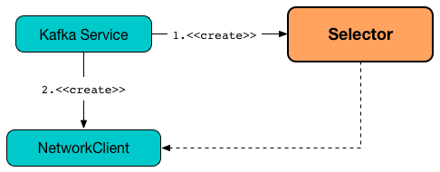

== [[Selector]] Selector -- Selectable on Socket Channels (from Java's New IO API)

`Selector` is the one and only link:kafka-common-network-Selectable.adoc[Selectable] that uses Java's selectable channels for stream-oriented connecting sockets (i.e. Java's http://download.java.net/java/jdk9/docs/api/java/nio/channels/SocketChannel.html[java.nio.channels.SocketChannel]).

`Selector` is used by Kafka services to link:kafka-clients-NetworkClient.adoc#creating-instance[create a NetworkClient].

.Selector is Created for Kafka Services For NetworkClient


[[logging]]
[TIP]
====
Enable `ALL` logging levels for `org.apache.kafka.common.network.Selector` logger to see what happens inside.

Add the following line to `config/log4j.properties`:

```
log4j.logger.org.apache.kafka.common.network.Selector=ALL
```

Refer to link:kafka-logging.adoc[Logging].
====

=== [[connect]] `connect` Method

[source, java]
----
void connect(
  String id,
  InetSocketAddress address,
  int sendBufferSize,
  int receiveBufferSize) throws IOException
----

NOTE: `connect` is a part of link:kafka-common-network-Selectable.adoc#connect[Selectable] contract that `NetworkClient` uses when requested to link:kafka-clients-NetworkClient.adoc#initiateConnect[establish a connection to a broker].

`connect`...FIXME

=== [[addToCompletedReceives]] `addToCompletedReceives` Internal Method

[source, java]
----
void addToCompletedReceives()
void addToCompletedReceives(
  KafkaChannel channel,
  Deque<NetworkReceive> stagedDeque)
----

`addToCompletedReceives`...FIXME

NOTE: `addToCompletedReceives` is used exclusively when `Selector` is requested to <<poll, poll>>.

=== [[poll]] `poll` Method

[source, java]
----
void poll(
  long timeout)
----

NOTE: `poll` is part of the <<kafka-common-network-Selectable.adoc#poll, Selectable Contract>> to...FIXME.

`poll`...FIXME

=== [[register]] `register` Method

[source, java]
----
void register(
  String id,
  SocketChannel socketChannel)
----

`register`...FIXME

NOTE: `register` is used when `Processor` is requested to link:kafka-network-SocketServer-Processor.adoc#configureNewConnections[configureNewConnections].

=== [[registerChannel]] `registerChannel` Method

[source, java]
----
SelectionKey registerChannel(
  String id,
  SocketChannel socketChannel,
  int interestedOps)
----

`registerChannel`...FIXME

NOTE: `registerChannel` is used when `Selector` is requested to <<connect, connect>> and <<register, register>>.

=== [[buildAndAttachKafkaChannel]] `buildAndAttachKafkaChannel` Internal Method

[source, java]
----
KafkaChannel buildAndAttachKafkaChannel(
  SocketChannel socketChannel,
  String id,
  SelectionKey key)
----

`buildAndAttachKafkaChannel`...FIXME

NOTE: `buildAndAttachKafkaChannel` is used when `Selector` is requested to <<registerChannel, registerChannel>>
