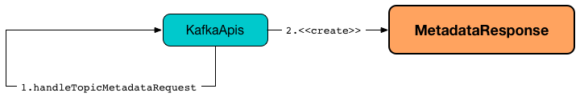

== [[MetadataResponse]] MetadataResponse

`MetadataResponse` <<creating-instance, holds information about a Kafka cluster>>, i.e. the broker nodes, the controller and the topics.

.MetadataResponse

`MetadataResponse` is <<creating-instance, created>> mainly when `KafkaApis` link:kafka-server-KafkaApis.adoc#handleTopicMetadataRequest[handles a Metadata request].

=== [[cluster]] `cluster` Method

[source, java]
----
Cluster cluster()
----

`cluster`...FIXME

NOTE: `cluster` is used when...FIXME

=== [[creating-instance]] Creating MetadataResponse Instance

`MetadataResponse` takes the following when created:

* [[throttleTimeMs]] `throttleTimeMs`
* [[brokers]] Broker nodes
* [[clusterId]] cluster ID
* [[controllerId]] controller ID
* [[topicMetadata]] Collection of `TopicMetadata`

`MetadataResponse` initializes the <<internal-registries, internal registries and counters>>.
