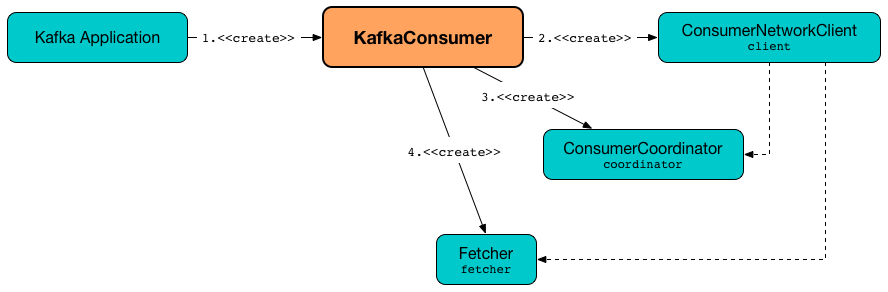
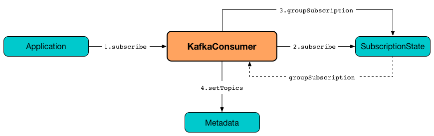
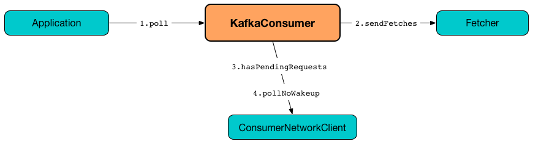
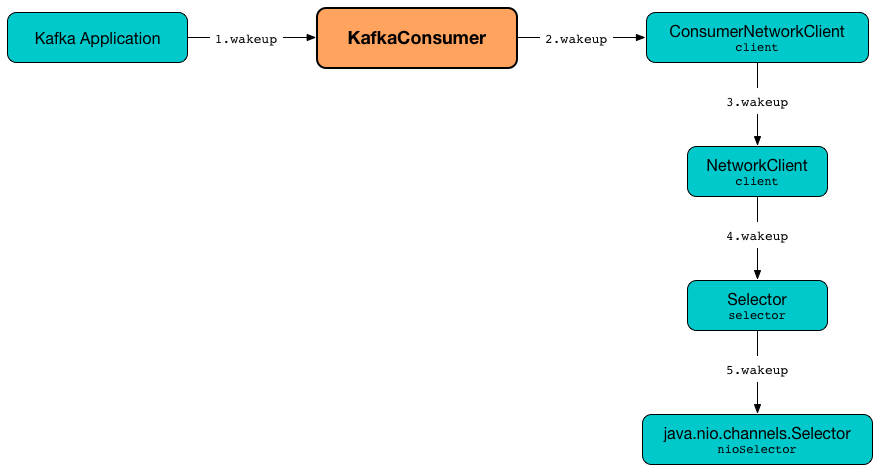

== [[KafkaConsumer]] KafkaConsumer -- Main Class For Kafka Consumers

`KafkaConsumer` is the main public class that you and other Kafka developers use to write link:kafka-consumers.adoc[Kafka consumers] that consume records from a Kafka cluster.

.KafkaConsumer


`KafkaConsumer` is a part of the public API and is <<creating-instance, created>> with properties and (key and value) deserializers as configuration.

NOTE: link:kafka-properties.adoc#bootstrap.servers[bootstrap.servers] and link:kafka-properties.adoc#group.id[group.id] properties are mandatory. They usually appear in the code as `ConsumerConfig.BOOTSTRAP_SERVERS_CONFIG` and  `ConsumerConfig.GROUP_ID_CONFIG` values, respectively.

`KafkaConsumer` follows the link:kafka-consumer-Consumer.adoc[Consumer contract].

[source, scala]
----
// sandbox/kafka-sandbox
val bootstrapServers = ":9092,localhost:9092"
import org.apache.kafka.clients.consumer.ConsumerConfig
// required properties
val configs = Map[String, Object](
  ConsumerConfig.BOOTSTRAP_SERVERS_CONFIG -> bootstrapServers,
)
import org.apache.kafka.common.serialization.StringDeserializer
val keyDeserializer = new StringDeserializer
val valueDeserializer = new StringDeserializer

import scala.collection.JavaConverters._
import org.apache.kafka.clients.consumer.KafkaConsumer
val consumer = new KafkaConsumer[String, String](
  configs.asJava,
  keyDeserializer,
  valueDeserializer)
----

`KafkaConsumer` registers itself in JMX with *kafka.consumer* prefix.

CAUTION: FIXME How does the JMX registration happen?

[IMPORTANT]
====
`KafkaConsumer` does not support multi-threaded access. You should use only one thread per `KafkaConsumer` instance.

`KafkaConsumer` uses light locks protecting itself from multi-threaded access and reports `ConcurrentModificationException` when it happens.

```
KafkaConsumer is not safe for multi-threaded access
```
====

[[internal-registries]]
.KafkaConsumer's Internal Properties (e.g. Registries and Counters)
[cols="1m,3",options="header",width="100%"]
|===
| Name
| Description

| assignors
a| [[assignors]] Zero or more <<kafka-consumer-PartitionAssignor.adoc#, PartitionAssignors>>

Configured using <<kafka-consumer-ConsumerConfig.adoc#PARTITION_ASSIGNMENT_STRATEGY_CONFIG, ConsumerConfig.PARTITION_ASSIGNMENT_STRATEGY_CONFIG>> (aka `partition.assignment.strategy`) configuration property

Used exclusively to create the <<coordinator, ConsumerCoordinator>>

| client
| [[client]] link:kafka-consumer-internals-ConsumerNetworkClient.adoc[ConsumerNetworkClient]

Used mainly _(?)_ to create the <<fetcher, Fetcher>> and <<coordinator, ConsumerCoordinator>>

Used also in <<poll, poll>>, <<pollOnce, pollOnce>> and <<wakeup, wakeup>> (but _I_ think the usage should be limited to create <<fetcher, Fetcher>> and <<coordinator, ConsumerCoordinator>>)

| clientId
| [[clientId]]

| coordinator
a| [[coordinator]] <<kafka-consumer-internals-ConsumerCoordinator.adoc#, ConsumerCoordinator>>

Used in <<subscribe, subscribe>>, <<unsubscribe, unsubscribe>>, <<assign, assign>>, <<updateAssignmentMetadataIfNeeded, updateAssignmentMetadataIfNeeded>>, <<pollForFetches, pollForFetches>>, <<commitSync, commitSync>>, <<commitAsync, commitAsync>>, <<committed, committed>>, <<close, close>>, and <<updateFetchPositions, updateFetchPositions>>

| fetcher
| [[fetcher]] link:kafka-Fetcher.adoc[Fetcher]

Created right when `KafkaConsumer` is <<creating-instance, created>>.

Used when...FIXME

| interceptors
| [[interceptors]] `ConsumerInterceptors` that holds link:kafka-consumer-ConsumerInterceptor.adoc[ConsumerInterceptor] instances (defined using link:kafka-properties.adoc#interceptor.classes[interceptor.classes] setting).

Used when...FIXME

| metadata
| [[metadata]] link:kafka-clients-Metadata.adoc[Metadata]

Created right when `KafkaConsumer` is <<creating-instance, created>>.

Used when...FIXME

| metrics
| [[metrics]] `Metrics`

| retryBackoffMs
| [[retryBackoffMs]] link:kafka-properties-retry-backoff-ms.adoc[retry.backoff.ms] property or a user-defined value

| requestTimeoutMs
a| [[requestTimeoutMs]] Corresponds to link:kafka-properties.adoc#request.timeout.ms[request.timeout.ms] property

`KafkaConsumer` reports `ConfigException` when smaller or equal than link:kafka-properties.adoc#session_timeout_ms[session.timeout.ms] and link:kafka-properties.adoc#fetch_max_wait_ms[fetch.max.wait.ms] properties.

| subscriptions
| [[subscriptions]] `SubscriptionState` for link:kafka-properties.adoc#auto.offset.reset[auto.offset.reset] setting.

Created when `KafkaConsumer` is <<creating-instance, created>>

|===

[[logging]]
[TIP]
====
Enable `DEBUG` or `TRACE` logging levels for `org.apache.kafka.clients.consumer.KafkaConsumer` logger to see what happens inside.

Add the following line to `log4j.properties`:

```
log4j.logger.org.apache.kafka.clients.consumer.KafkaConsumer=TRACE
```

Refer to link:kafka-logging.adoc[Logging].
====

=== [[assign]] (Manually) Assigning Partitions -- `assign` Method

[source, java]
----
void assign(Collection<TopicPartition> partitions)
----

NOTE: `assign` is part of link:kafka-consumer-Consumer.adoc#assign[Consumer Contract] to...FIXME.

`assign`...FIXME

=== [[unsubscribe]] `unsubscribe` Method

[source, java]
----
void unsubscribe()
----

NOTE: `unsubscribe` is part of link:kafka-consumer-Consumer.adoc#unsubscribe[Consumer Contract] to...FIXME.

`unsubscribe`...FIXME

=== [[subscribe]] Subscribing to Topics -- `subscribe` Method

[source, java]
----
void subscribe(Collection<String> topics) // <1>
void subscribe(Collection<String> topics, ConsumerRebalanceListener listener)
void subscribe(Pattern pattern, ConsumerRebalanceListener listener)
----
<1> A short-hand for the other subscribe with `NoOpConsumerRebalanceListener` as `ConsumerRebalanceListener`

`subscribe` subscribes `KafkaConsumer` to the given topics.

NOTE: `subscribe` is a part of link:kafka-consumer-Consumer.adoc#subscribe[Consumer Contract] to...FIXME

[source, scala]
----
val topics = Seq("topic1")
println(s"Subscribing to ${topics.mkString(", ")}")

import scala.collection.JavaConverters._
consumer.subscribe(topics.asJava)
----

Internally, `subscribe` prints out the following DEBUG message to the logs:

```
DEBUG Subscribed to topic(s): [comma-separated topics]
```

`subscribe` then requests <<subscriptions, SubscriptionState>> to `subscribe` for the `topics` and `listener`.

In the end, `subscribe` requests <<subscriptions, SubscriptionState>> for `groupSubscription` that it then passes along to <<metadata, Metadata>> to link:kafka-clients-Metadata.adoc#setTopics[set the topics to track].

.KafkaConsumer subscribes to topics


=== [[poll]] Poll Specified Milliseconds For ConsumerRecords per TopicPartitions -- `poll` Method

[source, java]
----
ConsumerRecords<K, V> poll(long timeout)
----

`poll` polls for new records until `timeout` expires.

NOTE: `KafkaConsumer` has to be subscribed to some topics or assigned partitions before calling <<poll, poll>>.

NOTE: The input `timeout` should be `0` or greater and represents the milliseconds to poll for records.

[source, scala]
----
val seconds = 10
while (true) {
  println(s"Polling for records for $seconds secs")
  val records = consumer.poll(seconds * 1000)
  // do something with the records here
}
----

Internally, `poll` starts by <<pollOnce, polling once>> (for `timeout` milliseconds).

If there are records available, `poll` checks <<fetcher, Fetcher>> for link:kafka-Fetcher.adoc#sendFetches[sendFetches] and <<client, ConsumerNetworkClient>> for link:kafka-consumer-internals-ConsumerNetworkClient.adoc#pendingRequestCount[pendingRequestCount] flag. If either is positive, `poll` requests <<client, ConsumerNetworkClient>> to link:kafka-consumer-internals-ConsumerNetworkClient.adoc#pollNoWakeup[pollNoWakeup].

CAUTION: FIXME Make the above more user-friendly

`poll` returns the available `ConsumerRecords` directly when no <<interceptors, ConsumerInterceptors>> are defined or passes them through <<interceptors, ConsumerInterceptors>> using link:kafka-consumer-ConsumerInterceptor.adoc#onConsume[onConsume].

CAUTION: FIXME Make the above more user-friendly, e.g. when could `interceptors` be empty?

.KafkaConsumer polls topics


NOTE: `poll` is a part of link:kafka-consumers.adoc#poll[Consumer contract] to...FIXME

=== [[commitSync]] `commitSync` Method

[source, java]
----
void commitSync()
----

NOTE: `commitSync` is part of link:kafka-consumer-Consumer.adoc#commitSync[Consumer Contract] to...FIXME.

`commitSync`...FIXME

=== [[seek]] `seek` Method

[source, java]
----
void seek(TopicPartition partition, long offset)
----

NOTE: `seek` is part of link:kafka-consumer-Consumer.adoc#seek[Consumer Contract] to...FIXME.

`seek`...FIXME

=== [[partitionsFor]] Getting Partitions For Topic -- `partitionsFor` Method

CAUTION: FIXME

=== [[endOffsets]] `endOffsets` Method

CAUTION: FIXME

=== [[offsetsForTimes]] `offsetsForTimes` Method

CAUTION: FIXME

=== [[updateFetchPositions]] `updateFetchPositions` Method

CAUTION: FIXME

=== [[pollOnce]] Polling One-Off for ConsumerRecords per TopicPartition -- `pollOnce` Internal Method

[source, java]
----
Map<TopicPartition, List<ConsumerRecord<K, V>>> pollOnce(long timeout)
----

`pollOnce`...FIXME

NOTE: `pollOnce` is used exclusively when `KafkaConsumer` is requested to <<poll, poll>>

=== [[listTopics]] Requesting Metadata for All Topics (From Brokers) -- `listTopics` Method

[source, java]
----
Map<String, List<PartitionInfo>> listTopics()
----

Internally, `listTopics` simply requests <<fetcher, Fetcher>> for link:kafka-Fetcher.adoc#getAllTopicMetadata[metadata for all topics] and returns it.

[source, scala]
----
consumer.listTopics().asScala.foreach { case (name, partitions) =>
  println(s"topic: $name (partitions: ${partitions.size()})")
}
----

NOTE: `listTopics` uses <<requestTimeoutMs, requestTimeoutMs>> that corresponds to link:kafka-properties.adoc#request.timeout.ms[request.timeout.ms] property.

=== [[beginningOffsets]] `beginningOffsets` Method

[source, java]
----
Map<TopicPartition, Long> beginningOffsets(Collection<TopicPartition> partitions)
----

`beginningOffsets` requests <<fetcher, Fetcher>> for link:kafka-Fetcher.adoc#beginningOffsets[beginningOffsets] and returns it.

=== [[creating-instance]] Creating KafkaConsumer Instance

`KafkaConsumer` takes the following when created:

* [[configs]] Consumer configuration (that is converted internally to link:kafka-consumer-ConsumerConfig.adoc[ConsumerConfig])
* [[keyDeserializer]] link:kafka-common-serialization-Deserializer.adoc[Deserializer] for keys
* [[valueDeserializer]] link:kafka-common-serialization-Deserializer.adoc[Deserializer] for values

`KafkaConsumer` initializes the <<internal-registries, internal registries and counters>>.

NOTE: `KafkaConsumer` API offers other constructors that in the end use the <<creating-instance-public, public 3-argument constructor>> that in turn passes the call on to the <<creating-instance-internal, private internal constructor>>.

==== [[creating-instance-public]] KafkaConsumer Public Constructor

[source, java]
----
// Public API
KafkaConsumer(
  Map<String, Object> configs,
  Deserializer<K> keyDeserializer,
  Deserializer<V> valueDeserializer)
----

When created, `KafkaConsumer` adds the <<keyDeserializer, keyDeserializer>> and <<valueDeserializer, valueDeserializer>> to <<configs, configs>> (as link:kafka-properties.adoc#key.deserializer[key.deserializer] and link:kafka-properties.adoc#value.deserializer[value.deserializer] properties respectively) and creates a link:kafka-consumer-ConsumerConfig.adoc[ConsumerConfig].

`KafkaConsumer` passes the call on to the <<creating-instance-internal, internal constructor>>.

==== [[creating-instance-internal]] KafkaConsumer Internal Constructor

[source, java]
----
KafkaConsumer(
  ConsumerConfig config,
  Deserializer<K> keyDeserializer,
  Deserializer<V> valueDeserializer)
----

When called, the internal `KafkaConsumer` constructor prints out the following DEBUG message to the logs:

```
DEBUG Starting the Kafka consumer
```

`KafkaConsumer` sets the internal <<requestTimeoutMs, requestTimeoutMs>> to <<request_timeout_ms, request.timeout.ms>> property.

`KafkaConsumer` sets the internal <<clientId, clientId>> to link:kafka-properties.adoc#client.id[client.id] or generates one with prefix *consumer-* (starting from 1) if not set.

`KafkaConsumer` sets the internal <<metrics, Metrics>> (and `JmxReporter` with *kafka.consumer* prefix).

`KafkaConsumer` sets the internal <<retryBackoffMs, retryBackoffMs>> to link:kafka-properties.adoc#retry.backoff.ms[retry.backoff.ms] property.

CAUTION: FIXME Finish me!

`KafkaConsumer` creates the internal <<metadata, Metadata>> with the following arguments:

1. <<retryBackoffMs, retryBackoffMs>>
1. link:kafka-properties.adoc#metadata.max.age.ms[metadata.max.age.ms]
1. `allowAutoTopicCreation` enabled
1. `topicExpiryEnabled` disabled
1. link:kafka-ClusterResourceListener.adoc[ClusterResourceListeners] with user-defined list of link:kafka-consumer-ConsumerInterceptor.adoc[ConsumerInterceptors] in link:kafka-properties.adoc#interceptor.classes[interceptor.classes] property

`KafkaConsumer` link:kafka-clients-Metadata.adoc#update[updates] `metadata` with link:kafka-properties.adoc#bootstrap.servers[bootstrap.servers].

CAUTION: FIXME Finish me!

`KafkaConsumer` creates a link:kafka-NetworkClient.adoc[NetworkClient] with...FIXME

CAUTION: FIXME Finish me!

`KafkaConsumer` creates <<fetcher, Fetcher>> with the following properties:

* link:kafka-properties.adoc#fetch.min.bytes[fetch.min.bytes]
* link:kafka-properties.adoc#fetch.max.bytes[fetch.max.bytes]
* link:kafka-properties.adoc#fetch.max.wait.ms[fetch.max.wait.ms]
* link:kafka-properties.adoc#max.partition.fetch.bytes[max.partition.fetch.bytes]
* link:kafka-properties.adoc#max.poll.records[max.poll.records]
* link:kafka-properties.adoc#check.crcs[check.crcs]

In the end, `KafkaConsumer` prints out the following DEBUG message to the logs:

```
DEBUG Kafka consumer created
```

Any issues while creating a `KafkaConsumer` are reported as `KafkaException`.

```
org.apache.kafka.common.KafkaException: Failed to construct kafka consumer
```

=== [[wakeup]] `wakeup` Method

[source, scala]
----
void wakeup()
----

NOTE: `wakeup` is a part of link:kafka-consumer-Consumer.adoc#wakeup[Consumer Contract].

`wakeup` simply requests <<client, ConsumerNetworkClient>> to link:kafka-consumer-internals-ConsumerNetworkClient.adoc#wakeup[wakeup].

.KafkaConsumer's wakeup Method


[NOTE]
====
Quoting `wakeup` of Java's link:++http://download.java.net/java/jdk9/docs/api/java/nio/channels/Selector.html#wakeup--++[java.nio.channels.Selector] given `wakeup` simply passes through the intermediaries and in the end triggers it.

> Causes the first selection operation that has not yet returned to return immediately.

Read about Selection in http://download.java.net/java/jdk9/docs/api/java/nio/channels/Selector.html#selop[java.nio.channels.Selector]'s javadoc.
====

NOTE: `wakeup` is used when...FIXME

=== [[configureClusterResourceListeners]] Configuring ClusterResourceListeners -- `configureClusterResourceListeners` Internal Method

[source, java]
----
ClusterResourceListeners configureClusterResourceListeners(
  Deserializer<K> keyDeserializer,
  Deserializer<V> valueDeserializer,
  List<?>... candidateLists)
----

`configureClusterResourceListeners` creates a link:kafka-ClusterResourceListener.adoc#ClusterResourceListeners[ClusterResourceListeners] and registers `ClusterResourceListener` instances from the input `candidateLists`, `keyDeserializer` and `valueDeserializer`.

[NOTE]
====
`configureClusterResourceListeners` is used exclusively when `KafkaConsumer` is <<creating-instance, created>> (to create the <<metadata, Metadata>>) with the following input arguments:

* <<keyDeserializer, key>> and <<valueDeserializer, value>> deserializers (defined when `KafkaConsumer` is created)

* link:kafka-consumer-ConsumerInterceptor.adoc[ConsumerInterceptors] from link:kafka-properties.adoc#interceptor.classes[interceptor.classes] Kafka property

* link:kafka-MetricsReporter.adoc[MetricsReporters] from link:kafka-properties.adoc#metric_reporters[metric.reporters] Kafka property
====

=== [[throwIfNoAssignorsConfigured]] `throwIfNoAssignorsConfigured` Internal Method

[source, java]
----
void throwIfNoAssignorsConfigured()
----

`throwIfNoAssignorsConfigured`...FIXME

NOTE: `throwIfNoAssignorsConfigured` is used exclusively when `KafkaConsumer` is requested to <<subscribe, subscribe to topics>>.

=== [[updateAssignmentMetadataIfNeeded]] `updateAssignmentMetadataIfNeeded` Internal Method

[source, java]
----
boolean updateAssignmentMetadataIfNeeded(final Timer timer)
----

`updateAssignmentMetadataIfNeeded`...FIXME

NOTE: `updateAssignmentMetadataIfNeeded` is used when...FIXME

=== [[pollForFetches]] `pollForFetches` Internal Method

[source, java]
----
Map<TopicPartition, List<ConsumerRecord<K, V>>> pollForFetches(Timer timer)
----

`pollForFetches`...FIXME

NOTE: `pollForFetches` is used when...FIXME

=== [[commitAsync]] `commitAsync` Method

[source, java]
----
void commitAsync()
void commitAsync(
  OffsetCommitCallback callback)
void commitAsync(
  final Map<TopicPartition, OffsetAndMetadata> offsets,
  OffsetCommitCallback callback)
----

NOTE: `commitAsync` is part of the <<kafka-consumer-Consumer.adoc#commitAsync, Consumer Contract>> to...FIXME.

`commitAsync`...FIXME

=== [[committed]] `committed` Method

[source, java]
----
OffsetAndMetadata committed(
  TopicPartition partition)
OffsetAndMetadata committed(
  TopicPartition partition,
  final Duration timeout)
----

NOTE: `committed` is part of the <<kafka-consumer-Consumer.adoc#committed, Consumer Contract>> to...FIXME.

`committed`...FIXME

=== [[close]] `close` Method

[source, java]
----
void close()
void close(Duration timeout)
----

NOTE: `close` is part of the <<kafka-consumer-Consumer.adoc#close, Consumer Contract>> to...FIXME.

`close`...FIXME

==== [[close-private]] `close` Internal Method

[source, java]
----
void close(long timeoutMs, boolean swallowException)
----

`close`...FIXME
