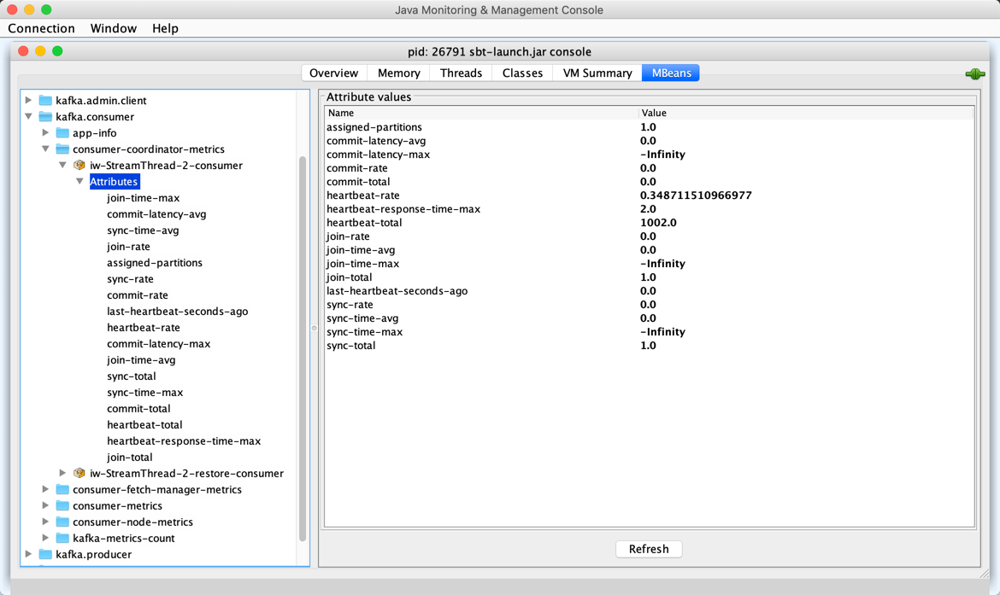

== [[GroupCoordinatorMetrics]] GroupCoordinatorMetrics

`GroupCoordinatorMetrics` is a set of <<metrics, metrics>> to measure performance of <<kafka-consumer-internals-AbstractCoordinator.adoc#sensors, AbstractCoordinator>>.

[[sensors]]
[[metrics]]
.GroupCoordinatorMetrics's Sensors and Metrics
[cols="1m,1m,2",options="header",width="100%"]
|===
| Sensor Name
| Metric Name
| Description

| heartbeat-latency
| heartbeat-rate
| [[heartbeatLatency]] The number of heartbeats per second

| heartbeat-latency
| heartbeat-response-time-max
| The max time taken to receive a response to a heartbeat request

| heartbeat-latency
| heartbeat-total
| The total number of heartbeats

| join-latency
| join-rate
| [[joinLatency]] The number of group joins per second

| join-latency
| join-time-avg
| The average time taken for a group rejoin

| join-latency
| join-time-max
| The max time taken for a group rejoin

| join-latency
| join-total
| The total number of group joins

|
| last-heartbeat-seconds-ago
| The number of seconds since the last coordinator heartbeat was sent

| sync-latency
| sync-rate
| [[syncLatency]] The number of group syncs per second

| sync-latency
| sync-time-avg
| The average time taken for a group sync

| sync-latency
| sync-time-max
| The max time taken for a group sync

| sync-latency
| sync-total
| The total number of group syncs

|===

`GroupCoordinatorMetrics` is registered in *consumer-coordinator-metrics* group.

.GroupCoordinatorMetrics in jconsole


`GroupCoordinatorMetrics` is <<creating-instance, created>> exclusively for <<kafka-consumer-internals-AbstractCoordinator.adoc#sensors, AbstractCoordinator>>.

[[creating-instance]]
`GroupCoordinatorMetrics` takes the following to be created:

* [[metrics]] <<kafka-Metrics.adoc#, Metrics>>
* [[metricGrpPrefix]] Prefix of the metric group name (i.e. *consumer*)

[[metricGrpName]]
`GroupCoordinatorMetrics` uses the <<metricGrpPrefix, prefix>> followed by `-coordinator-metrics` for the *metric group name* (e.g. `consumer-coordinator-metrics`).

```
[prefix]-coordinator-metrics
```
