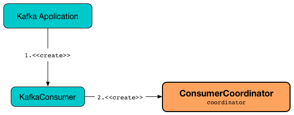

== [[ConsumerCoordinator]] ConsumerCoordinator

`ConsumerCoordinator` is a concrete <<kafka-consumer-internals-AbstractCoordinator.adoc#, AbstractCoordinator>> that...FIXME

`ConsumerCoordinator` is <<creating-instance, created>> exclusively when `KafkaConsumer` is link:kafka-consumer-KafkaConsumer.adoc#coordinator[created].

.ConsumerCoordinator and KafkaConsumer


`KafkaConsumer` uses the following <<consumer-configuration-properties, Consumer configuration properties>> to create a `ConsumerCoordinator`.

[[consumer-configuration-properties]]
.ConsumerCoordinator's Consumer Configuration Properties
[cols="1,2",options="header",width="100%"]
|===
| Configuration Property
| ConsumerCoordinator's Property

| `max.poll.interval.ms`
| <<rebalanceTimeoutMs, rebalanceTimeoutMs>>

| `session.timeout.ms`
| <<sessionTimeoutMs, sessionTimeoutMs>>

| `heartbeat.interval.ms`
| <<heartbeatIntervalMs, heartbeatIntervalMs>>

| `retry.backoff.ms`
| <<retryBackoffMs, retryBackoffMs>>

| link:kafka-properties.adoc#enable.auto.commit[enable.auto.commit]
| <<autoCommitEnabled, autoCommitEnabled>>

| `auto.commit.interval.ms`
| <<autoCommitIntervalMs, autoCommitIntervalMs>>

| `exclude.internal.topics`
| <<excludeInternalTopics, excludeInternalTopics>>

| `internal.leave.group.on.close`
| <<leaveGroupOnClose, leaveGroupOnClose>>
|===

With <<autoCommitEnabled, autoCommitEnabled>> enabled (i.e. link:kafka-properties.adoc#enable.auto.commit[enable.auto.commit] is `true`), `ConsumerCoordinator` does:

. <<maybeAutoCommitOffsetsAsync, Sending asynchronous auto-commit of offsets>>

. <<maybeAutoCommitOffsetsSync, Sending synchronous auto-commit of offsets>>

`ConsumerCoordinator` uses zero or more <<assignors, PartitionAssignors>> for the following:

* <<metadata, metadata>>

* Looking up the <<kafka-consumer-internals-PartitionAssignor.adoc#, PartitionAssignor>> by name (when <<onJoinComplete, onJoinComplete>> and <<performAssignment, performAssignment>>)

[[internal-registries]]
.ConsumerCoordinator's Internal Properties (e.g. Registries, Counters and Flags)
[cols="1m,3",options="header",width="100%"]
|===
| Name
| Description

| assignmentSnapshot
a| [[assignmentSnapshot]] `MetadataSnapshot`

Used in <<rejoinNeededOrPending, rejoinNeededOrPending>>

* Set to the <<metadataSnapshot, metadataSnapshot>> in <<performAssignment, performAssignment>>

* Reset (to `null`) in <<onJoinComplete, onJoinComplete>> (when <<isLeader, isLeader>> flag is off)

| completedOffsetCommits
a| [[completedOffsetCommits]] Java's https://docs.oracle.com/en/java/javase/11/docs/api/java.base/java/util/concurrent/ConcurrentLinkedQueue.html[java.util.concurrent.ConcurrentLinkedQueue] of `OffsetCommitCompletions` with user-defined <<kafka-consumer-OffsetCommitCallback.adoc#, OffsetCommitCallbacks>>

`OffsetCommitCallbacks` are <<kafka-consumer-OffsetCommitCallback.adoc#onComplete, executed>> in <<invokeCompletedOffsetCommitCallbacks, invokeCompletedOffsetCommitCallbacks>>

`OffsetCommitCompletion` are added in <<commitOffsetsAsync, commitOffsetsAsync>> (and also directly in <<doCommitOffsetsAsync, doCommitOffsetsAsync>>)

| isLeader
a| [[isLeader]] Flag that says whether the `ConsumerCoordinator` is a leader (`true`) or not (`false`).

Default: `false`

Turned on in <<performAssignment, performAssignment>> and off in <<onJoinPrepare, onJoinPrepare>>

Used exclusively for <<onJoinComplete, onJoinComplete>> (to reset the <<assignmentSnapshot, assignmentSnapshot>> when off)

| metadataSnapshot
a| [[metadataSnapshot]]

[source, java]
----
MetadataSnapshot metadataSnapshot
----

`MetadataSnapshot` (for the <<subscriptions, SubscriptionState>> and the <<kafka-clients-Metadata.adoc#fetch, cluster metadata>> from the <<metadata, Metadata>>)

* Updated in the `Metadata.Listener` from <<addMetadataListener, addMetadataListener>>

Used in <<rejoinNeededOrPending, rejoinNeededOrPending>> and <<performAssignment, performAssignment>>

|===

[[logging]]
[TIP]
====
Enable `ERROR`, `WARN`, `INFO`, `DEBUG`, or `TRACE` logging level for `org.apache.kafka.clients.consumer.internals.ConsumerCoordinator` logger to see what happens inside.

Add the following line to `log4j.properties`:

```
log4j.logger.org.apache.kafka.clients.consumer.internals.ConsumerCoordinator=TRACE
```

Refer to link:kafka-logging.adoc[Logging].
====

=== [[maybeAutoCommitOffsetsAsync]] Sending Asynchronous Auto-Commit of Offsets -- `maybeAutoCommitOffsetsAsync` Method

[source, java]
----
void maybeAutoCommitOffsetsAsync(long now)
----

`maybeAutoCommitOffsetsAsync`...FIXME

[NOTE]
====
`maybeAutoCommitOffsetsAsync` is used when:

* `KafkaConsumer` is requested to <<kafka-consumer-KafkaConsumer.adoc#assign, manually assign partitions>>

* `ConsumerCoordinator` is requested to <<poll, poll>>
====

=== [[maybeAutoCommitOffsetsSync]] Sending Synchronous Auto-Commit of Offsets -- `maybeAutoCommitOffsetsSync` Internal Method

[source, java]
----
void maybeAutoCommitOffsetsSync(long timeoutMs)
----

`maybeAutoCommitOffsetsSync`...FIXME

NOTE: `maybeAutoCommitOffsetsSync` is used when `ConsumerCoordinator` is requested to <<close, close>> or <<onJoinPrepare, onJoinPrepare>>

=== [[doAutoCommitOffsetsAsync]] `doAutoCommitOffsetsAsync` Internal Method

[source, java]
----
void doAutoCommitOffsetsAsync()
----

`doAutoCommitOffsetsAsync`...FIXME

NOTE: `doAutoCommitOffsetsAsync` is used exclusively when `ConsumerCoordinator` is requested to <<maybeAutoCommitOffsetsAsync, maybeAutoCommitOffsetsAsync>>.

=== [[close]] `close` Method

[source, java]
----
void close(long timeoutMs)
----

`close`...FIXME

NOTE: `close` is used when...FIXME

=== [[commitOffsetsAsync]] `commitOffsetsAsync` Method

[source, java]
----
void commitOffsetsAsync(
  final Map<TopicPartition, OffsetAndMetadata> offsets,
  final OffsetCommitCallback callback)
----

`commitOffsetsAsync`...FIXME

[NOTE]
====
`commitOffsetsAsync` is used when:

* `KafkaConsumer` is requested to <<kafka-consumer-KafkaConsumer.adoc#commitAsync, commitAsync>>

* `ConsumerCoordinator` is requested to <<doAutoCommitOffsetsAsync, doAutoCommitOffsetsAsync>>
====

=== [[commitOffsetsSync]] `commitOffsetsSync` Method

[source, java]
----
boolean commitOffsetsSync(
  Map<TopicPartition,
  OffsetAndMetadata> offsets,
  long timeoutMs)
----

`commitOffsetsSync`...FIXME

NOTE: `commitOffsetsSync` is used when...FIXME

=== [[refreshCommittedOffsetsIfNeeded]] `refreshCommittedOffsetsIfNeeded` Method

[source, java]
----
void refreshCommittedOffsetsIfNeeded()
----

`refreshCommittedOffsetsIfNeeded`...FIXME

NOTE: `refreshCommittedOffsetsIfNeeded` is used when...FIXME

=== [[onJoinComplete]] `onJoinComplete` Callback

[source, java]
----
void onJoinComplete(
  int generation,
  String memberId,
  String assignmentStrategy,
  ByteBuffer assignmentBuffer)
----

NOTE: `onJoinComplete` is part of link:kafka-consumer-internals-AbstractCoordinator.adoc#onJoinComplete[AbstractCoordinator Contract] to...FIXME.

`onJoinComplete`...FIXME

=== [[onJoinPrepare]] `onJoinPrepare` Method

[source, java]
----
void onJoinPrepare(int generation, String memberId)
----

NOTE: `onJoinPrepare` is part of link:kafka-consumer-internals-AbstractCoordinator.adoc#onJoinPrepare[AbstractCoordinator Contract] to...FIXME.

`onJoinPrepare`...FIXME

=== [[performAssignment]] Performing Partition Assignment (using PartitionAssignor) -- `performAssignment` Method

[source, java]
----
Map<String, ByteBuffer> performAssignment(
  String leaderId,
  String assignmentStrategy,
  Map<String, ByteBuffer> allSubscriptions)
----

NOTE: `performAssignment` is part of link:kafka-consumer-internals-AbstractCoordinator.adoc#performAssignment[AbstractCoordinator Contract] to perform partition assignment (i.e. assign partitions to the members of a consumer group).

`performAssignment` <<lookupAssignor, tries to find the PartitionAssignor>> by the given `assignmentStrategy`.

`performAssignment` deserializes `Subscriptions` (from the given `allSubscriptions`) for every entry (and creates a `Map<String, Subscription>`).

`performAssignment` requests the <<subscriptions, SubscriptionState>> to <<kafka-consumer-internals-SubscriptionState.adoc#groupSubscribe, add the topics to group subscription>> (i.e. add all the topics that the consumer group is subscribed to to receive topic metadata updates).

`performAssignment` requests the <<metadata, Metadata>> to <<kafka-clients-Metadata.adoc#setTopics, setTopics>> to be the <<kafka-consumer-internals-SubscriptionState.adoc#groupSubscription, groupSubscription>> of the <<subscriptions, SubscriptionState>>.

`performAssignment` requests the <<client, ConsumerNetworkClient>> to <<kafka-consumer-internals-ConsumerNetworkClient.adoc#ensureFreshMetadata, update the cluster metadata>>.

`performAssignment` turns the <<isLeader, isLeader>> internal flag on.

`performAssignment` prints out the following DEBUG message to the logs:

```
Performing assignment using strategy [assignor] with subscriptions [subscriptions]
```

`performAssignment` requests the <<kafka-consumer-internals-PartitionAssignor.adoc#, PartitionAssignor>> to <<kafka-consumer-internals-PartitionAssignor.adoc#assign, assign partitions to the members of the consumer group>> (with the current <<metadata, cluster metadata>> and subscriptions) and gets the partition assignment back (as `Map<String, Assignment>`).

NOTE: Here `performAssignment` does some customizations that a user-customized assignor could request. It is not a very interesting code to spend your time on.

`performAssignment` sets the <<assignmentSnapshot, assignmentSnapshot>> to be <<metadataSnapshot, metadataSnapshot>>.

`performAssignment` prints out the following DEBUG message to the logs:

```
Finished assignment for group: [assignment]
```

In the end, `performAssignment` takes the partition assignment, encodes the `Assignment` per group member to create a `groupAssignment` (i.e. the `Map<String, ByteBuffer>` that is returned).

`performAssignment` throws an `IllegalStateException` when <<lookupAssignor, no PartitionAssignor could be found>>:

```
Coordinator selected invalid assignment protocol: [assignmentStrategy]
```

=== [[maybeLeaveGroup]] `maybeLeaveGroup` Method

[source, java]
----
void maybeLeaveGroup()
----

`maybeLeaveGroup`...FIXME

NOTE: `maybeLeaveGroup` is used when...FIXME

=== [[updatePatternSubscription]] `updatePatternSubscription` Method

[source, java]
----
void updatePatternSubscription(Cluster cluster)
----

`updatePatternSubscription`...FIXME

NOTE: `updatePatternSubscription` is used when...FIXME

=== [[needRejoin]] `needRejoin` Method

[source, java]
----
boolean needRejoin()
----

NOTE: `needRejoin` is part of the <<kafka-consumer-internals-AbstractCoordinator.adoc#needRejoin, AbstractCoordinator Contract>> to...FIXME.

`needRejoin`...FIXME

=== [[timeToNextPoll]] `timeToNextPoll` Method

[source, java]
----
long timeToNextPoll(long now)
----

`timeToNextPoll`...FIXME

NOTE: `timeToNextPoll` is used when...FIXME

=== [[poll]] Polling for Group Coordinator Events -- `poll` Method

[source, java]
----
boolean poll(Timer timer)
----

`poll` first <<invokeCompletedOffsetCommitCallbacks, invokeCompletedOffsetCommitCallbacks>>.

`poll` branches off per whether the <<subscriptions, SubscriptionState>> is <<kafka-consumer-internals-SubscriptionState.adoc#partitionsAutoAssigned, partitionsAutoAssigned>> or not.

CAUTION: FIXME What does `partitionsAutoAssigned` mean exactly?

In <<kafka-consumer-internals-SubscriptionState.adoc#partitionsAutoAssigned, partitionsAutoAssigned>>, `poll` <<kafka-consumer-internals-AbstractCoordinator.adoc#pollHeartbeat, pollHeartbeat>>.

`poll` returns `false` if <<kafka-consumer-internals-AbstractCoordinator.adoc#coordinatorUnknown, coordinatorUnknown>> and <<kafka-consumer-internals-AbstractCoordinator.adoc#ensureCoordinatorReady, ensureCoordinatorReady>> failed (`false`).

`poll`...FIXME

NOTE: `poll` is used exclusively when `KafkaConsumer` is requested to <<kafka-consumer-KafkaConsumer.adoc#updateAssignmentMetadataIfNeeded, updateAssignmentMetadataIfNeeded>>.

=== [[addMetadataListener]] Registering Metadata.Listener -- `addMetadataListener` Internal Method

[source, java]
----
void addMetadataListener()
----

`addMetadataListener` requests the <<metadata, Metadata>> to add a new <<kafka-clients-Metadata-Listener.adoc#, Metadata Update Listener>> that <<kafka-clients-Metadata-Listener.adoc#onMetadataUpdate, intercepts onMetadataUpdate events>> and does the following:

* FIXME

`addMetadataListener` throws a `TopicAuthorizationException` for any unauthorized topics (i.e. when the given `Cluster` has at least one topic in <<kafka-common-Cluster.adoc#unauthorizedTopics, unauthorizedTopics>>).

```
FIXME
```

NOTE: `addMetadataListener` is used exclusively when `ConsumerCoordinator` is <<creating-instance, created>>.

=== [[fetchCommittedOffsets]] `fetchCommittedOffsets` Method

[source, java]
----
Map<TopicPartition, OffsetAndMetadata> fetchCommittedOffsets(
  Set<TopicPartition> partitions)
----

`fetchCommittedOffsets`...FIXME

NOTE: `fetchCommittedOffsets` is used when...FIXME

=== [[creating-instance]] Creating ConsumerCoordinator Instance

`ConsumerCoordinator` takes the following when created:

* [[logContext]] `LogContext`
* [[client]] <<kafka-consumer-internals-ConsumerNetworkClient.adoc#, ConsumerNetworkClient>>
* [[groupId]] Group ID
* [[rebalanceTimeoutMs]] `rebalanceTimeoutMs`
* [[sessionTimeoutMs]] `sessionTimeoutMs`
* [[heartbeatIntervalMs]] `heartbeatIntervalMs`
* [[assignors]] <<kafka-consumer-internals-PartitionAssignor.adoc#, PartitionAssignors>>
* [[metadata]] <<kafka-clients-Metadata.adoc#, Metadata>>
* [[subscriptions]] <<kafka-consumer-internals-SubscriptionState.adoc#, SubscriptionState>>
* [[metrics]] <<kafka-Metrics.adoc#, Metrics>>
* [[metricGrpPrefix]] Prefix of the metric group
* [[time]] `Time`
* [[retryBackoffMs]] `retryBackoffMs`
* [[autoCommitEnabled]] `autoCommitEnabled` flag
* [[autoCommitIntervalMs]] `autoCommitIntervalMs`
* [[interceptors]] <<kafka-consumer-ConsumerInterceptor.adoc#, ConsumerInterceptors>>
* [[excludeInternalTopics]] `excludeInternalTopics` flag
* [[leaveGroupOnClose]] `leaveGroupOnClose` flag

`ConsumerCoordinator` initializes the <<internal-registries, internal registries and counters>>.

In the end, `ConsumerCoordinator` requests the <<metadata, Metadata>> to <<kafka-clients-Metadata.adoc#requestUpdate, update>> and <<addMetadataListener, addMetadataListener>>.

=== [[rejoinNeededOrPending]] `rejoinNeededOrPending` Method

[source, java]
----
boolean rejoinNeededOrPending()
----

NOTE: `rejoinNeededOrPending` is part of the <<kafka-consumer-internals-AbstractCoordinator.adoc#rejoinNeededOrPending, AbstractCoordinator Contract>> to...FIXME.

`rejoinNeededOrPending`...FIXME

=== [[sendOffsetCommitRequest]] Sending OffsetCommitRequest to Group Coordinator (Kafka Broker) -- `sendOffsetCommitRequest` Internal Method

[source, java]
----
RequestFuture<Void> sendOffsetCommitRequest(
  final Map<TopicPartition, OffsetAndMetadata> offsets)
----

`sendOffsetCommitRequest` <<kafka-consumer-internals-AbstractCoordinator.adoc#checkAndGetCoordinator, gets the node of the consumer group>>.

`sendOffsetCommitRequest` creates a <<kafka-common-requests-OffsetCommitRequest.adoc#OffsetCommitRequest.Builder, OffsetCommitRequest.Builder>> for the <<kafka-consumer-internals-AbstractCoordinator.adoc#groupId, group ID>> and an offset data based on the given offsets.

`sendOffsetCommitRequest` prints out the following TRACE message to the logs:

```
Sending OffsetCommit request with [offsets] to coordinator [coordinator]
```

`sendOffsetCommitRequest` requests the <<kafka-consumer-internals-AbstractCoordinator.adoc#client, ConsumerNetworkClient>> to <<kafka-consumer-internals-ConsumerNetworkClient.adoc#send, send>> an `OffsetCommitRequest` to the group coordinator and then creates a new <<kafka-consumer-internals-OffsetCommitResponseHandler.adoc#, OffsetCommitResponseHandler>> to handle a response.

`sendOffsetCommitRequest` returns immediately when there is no offsets to send.

`sendOffsetCommitRequest` returns immediately with a `COORDINATOR_NOT_AVAILABLE` failure when the <<kafka-consumer-internals-AbstractCoordinator.adoc#checkAndGetCoordinator, consumer group coordinator is not available>>.

NOTE: `sendOffsetCommitRequest` is used when `ConsumerCoordinator` is requested to <<doCommitOffsetsAsync, doCommitOffsetsAsync>> and <<commitOffsetsSync, commitOffsetsSync>>.

=== [[sendOffsetFetchRequest]] `sendOffsetFetchRequest` Internal Method

[source, java]
----
RequestFuture<Map<TopicPartition, OffsetAndMetadata>> sendOffsetFetchRequest(
  Set<TopicPartition> partitions)
----

`sendOffsetFetchRequest`...FIXME

NOTE: `sendOffsetFetchRequest` is used when...FIXME

=== [[invokeCompletedOffsetCommitCallbacks]] `invokeCompletedOffsetCommitCallbacks` Internal Method

[source, java]
----
void invokeCompletedOffsetCommitCallbacks()
----

`invokeCompletedOffsetCommitCallbacks` takes (_polls_) every `OffsetCommitCompletion` from the <<completedOffsetCommits, completedOffsetCommits>> internal registry and requests it to invoke <<kafka-consumer-OffsetCommitCallback.adoc#onComplete, OffsetCommitCallback.onComplete>>.

NOTE: `invokeCompletedOffsetCommitCallbacks` is used when `ConsumerCoordinator` is requested to <<poll, poll>>, <<close, close>>, <<commitOffsetsAsync, commitOffsetsAsync>>, and <<commitOffsetsSync, commitOffsetsSync>>.

=== [[lookupAssignor]] Finding PartitionAssignor by Name -- `lookupAssignor` Internal Method

[source, java]
----
PartitionAssignor lookupAssignor(String name)
----

`lookupAssignor` tries to find the <<kafka-consumer-internals-PartitionAssignor.adoc#, PartitionAssignor>> by the given `name` in the <<assignors, assignors>>.

If not found, `lookupAssignor` returns `null`.

NOTE: `lookupAssignor` is used when `ConsumerCoordinator` is requested to <<onJoinComplete, onJoinComplete>> and <<performAssignment, performAssignment>>.

=== [[doCommitOffsetsAsync]] `doCommitOffsetsAsync` Internal Method

[source, java]
----
void doCommitOffsetsAsync(
  final Map<TopicPartition, OffsetAndMetadata> offsets,
  final OffsetCommitCallback callback)
----

`doCommitOffsetsAsync`...FIXME

NOTE: `doCommitOffsetsAsync` is used exclusively when `ConsumerCoordinator` is requested to <<commitOffsetsAsync, commitOffsetsAsync>>.
