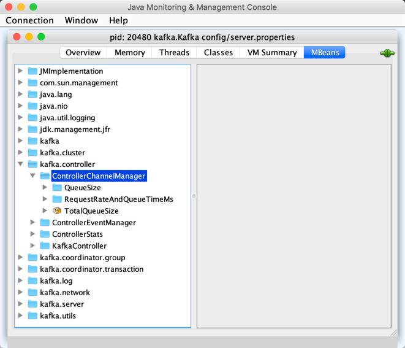

== [[ControllerChannelManager]] ControllerChannelManager

`ControllerChannelManager` manages <<brokerStateInfo, connections to all brokers>> for link:kafka-controller-KafkaController.adoc#controllerChannelManager[KafkaController].

`ControllerChannelManager` is <<creating-instance, created>> when <<kafka-controller-KafkaController.adoc#controllerChannelManager, KafkaController>> is created (to <<addBroker, add>> or <<removeBroker, remove>> brokers as they "announce" themselves in Zookeeper) for <<kafka-controller-ControllerBrokerRequestBatch.adoc#, ControllerBrokerRequestBatches>> of the <<kafka-controller-KafkaController.adoc#brokerRequestBatch, KafkaController>> itself, the <<kafka-controller-KafkaController.adoc#replicaStateMachine, ZkReplicaStateMachine>> and <<kafka-controller-KafkaController.adoc#partitionStateMachine, ZkPartitionStateMachine>> (so they can send broker and partition changes out to all brokers in a Kafka cluster).

When <<startup, started>>, `ControllerChannelManager` establishes connection to every broker and starts a corresponding <<RequestSendThread, RequestSendThread>> to keep sending queued controller requests.

[[logIdent]]
`ControllerChannelManager` uses *[Channel manager on controller [brokerId]]* as the logging prefix (aka `logIdent`).

[[logging]]
[TIP]
====
Enable `ALL` logging levels for `kafka.controller.ControllerChannelManager` logger to see what happens inside.

Add the following line to `config/log4j.properties`:

```
log4j.logger.kafka.controller.ControllerChannelManager=ALL
```

Refer to <<kafka-logging.adoc#, Logging>>.
====

=== [[brokerStateInfo]] Connection Metadata of All Brokers -- `brokerStateInfo` Internal Registry

[source, scala]
----
brokerStateInfo: HashMap[Int, ControllerBrokerStateInfo]
----

`brokerStateInfo` is <<ControllerBrokerStateInfo, connection metadata>> by broker ID.

Request threads for brokers are all <<startRequestSendThread, started>> when `ControllerChannelManager` is requested to <<startup, start up>>.

A new broker is added when `ControllerChannelManager` is requested to <<addNewBroker, add a broker>> (when <<addBroker, addBroker>>).

A broker is removed when `ControllerChannelManager` is requested to <<removeExistingBroker, remove a broker>> (when <<removeBroker, removeBroker>> or <<shutdown, shutting down>>).

Use the <<TotalQueueSize, TotalQueueSize>> gauge metric for the queue depth (i.e. how many link:kafka-controller-AbstractControlRequest.adoc[controller requests] are waiting to be sent out to all brokers).

=== [[KafkaMetricsGroup]][[metrics]] Performance Metrics

`ControllerChannelManager` is a <<kafka-metrics-KafkaMetricsGroup.adoc#, KafkaMetricsGroup>> with the following performance metrics.

.ControllerChannelManager's Performance Metrics
[cols="30m,70",options="header",width="100%"]
|===
| Metric Name
| Description

| QueueSize
a| [[QueueSize]] Controller requests (<<kafka-controller-AbstractControlRequest.adoc#, AbstractControlRequests>>) queue size (per broker)

| RequestRateAndQueueTimeMs
a| [[RequestRateAndQueueTimeMs]][[requestRateAndQueueTimeMetrics]] For every broker

| TotalQueueSize
a| [[TotalQueueSize]] Total number of controller requests (<<kafka-controller-AbstractControlRequest.adoc#, AbstractControlRequests>>) to be sent out to brokers

|===

The performance metrics are registered in *kafka.controller:type=ControllerChannelManager* group.

.ControllerChannelManager in jconsole


=== [[creating-instance]] Creating ControllerChannelManager Instance

`ControllerChannelManager` takes the following to be created:

* [[controllerContext]] <<kafka-controller-ControllerContext.adoc#, ControllerContext>>
* [[config]] <<kafka-server-KafkaConfig.adoc#, KafkaConfig>>
* [[time]] `Time`
* [[metrics]] <<kafka-Metrics.adoc#, Metrics>>
* [[stateChangeLogger]] link:kafka-controller-StateChangeLogger.adoc[StateChangeLogger]
* [[threadNamePrefix]] Thread name prefix (default: `(empty)`)

=== [[addNewBroker]] Registering New Broker -- `addNewBroker` Internal Method

[source, scala]
----
addNewBroker(
  broker: Broker): Unit
----

`addNewBroker` prints out the following DEBUG message to the logs:

```
Controller [brokerId] trying to connect to broker [id]
```

`addNewBroker` finds the name of the listener to use for communication with the broker based on link:kafka-properties.adoc#control.plane.listener.name[control.plane.listener.name] configuration property (if defined) or link:kafka-properties.adoc#inter.broker.listener.name[inter.broker.listener.name].

`addNewBroker` finds the security protocol to use for communication with the broker based on link:kafka-properties.adoc#control.plane.listener.name[control.plane.listener.name] and link:kafka-properties.adoc#listener.security.protocol.map[listener.security.protocol.map] configuration properties (if defined) or link:kafka-properties.adoc#security.inter.broker.protocol[security.inter.broker.protocol].

`addNewBroker` requests the `Broker` for the link:kafka-cluster-Broker.adoc#node[node] for the listener name.

`addNewBroker` creates a new `LogContext` to use the prefix:

```
[Controller id=[brokerId], targetBrokerId=[brokerNode]]
```

`addNewBroker` creates a link:kafka-clients-NetworkClient.adoc[NetworkClient]. Firstly, `addNewBroker` creates a link:kafka-common-network-ChannelBuilders.adoc#clientChannelBuilder[ChannelBuilder] (for the security protocol, the listener name, `SERVER` JAAS context type and SASL-related properties) and, if it is a link:kafka-common-Reconfigurable.adoc[Reconfigurable], adds it to the <<config, KafkaConfig>> as link:kafka-server-KafkaConfig.adoc#addReconfigurable[reconfigurable]. `addNewBroker` then creates a link:kafka-common-network-Selector.adoc[Selector] with `controller-channel` metric group (and `broker-id` of the broker node).

`addNewBroker` builds a thread name per the optional <<threadNamePrefix, threadNamePrefix>>:

```
[threadNamePrefix]:Controller-[brokerId]-to-broker-[id]-send-thread
```

`addNewBroker` creates a new <<RequestRateAndQueueTimeMs, RequestRateAndQueueTimeMs>> timer metric with the id of the broker to connect to.

`addNewBroker` creates a daemon link:kafka-controller-RequestSendThread.adoc[RequestSendThread] for the broker ID (of the controller broker), the <<controllerContext, ControllerContext>>, the `NetworkClient`, the `RequestRateAndQueueTimeMs` metric, the <<stateChangeLogger, StateChangeLogger>>, and the thread name.

`addNewBroker` creates a <<QueueSize, QueueSize>> gauge metric (with the id of the broker to connect) that is the number of the link:kafka-controller-AbstractControlRequest.adoc[AbstractControlRequest] messages in the queue.

In the end, `addNewBroker` registers (_adds_) the id of the broker to connect with a new <<ControllerBrokerStateInfo, ControllerBrokerStateInfo>> to the <<brokerStateInfo, brokerStateInfo>> internal registry.

NOTE: `addNewBroker` is used when `ControllerChannelManager` is requested to <<startup, start up>> (and connect to brokers) and <<addBroker, add a broker>>.

=== [[addBroker]] Registering Newly-Added Broker -- `addBroker` Method

[source, scala]
----
addBroker(broker: Broker): Unit
----

`addBroker`...FIXME

NOTE: `addBroker` is used when `KafkaController` is requested to link:kafka-controller-KafkaController.adoc#processBrokerChange[process a BrokerChange controller event].

=== [[removeBroker]] Deregistering Broker -- `removeBroker` Method

[source, scala]
----
removeBroker(brokerId: Int): Unit
----

`removeBroker` finds the broker metadata in the <<brokerStateInfo, brokerStateInfo>> internal registry that is then used to <<removeExistingBroker, removeExistingBroker>>.

NOTE: `removeBroker` is used exclusively when `KafkaController` is requested to <<kafka-controller-KafkaController.adoc#processBrokerChange, process a BrokerChange controller event>>.

=== [[startup]] Starting Up -- `startup` Method

[source, scala]
----
startup(): Unit
----

`startup`...FIXME

NOTE: `startup` is used when `KafkaController` is requested to link:kafka-controller-KafkaController.adoc#initializeControllerContext[initializeControllerContext].

=== [[shutdown]] Shutting Down -- `shutdown` Method

[source, scala]
----
shutdown(): Unit
----

`shutdown`...FIXME

NOTE: `shutdown` is used when...FIXME

=== [[sendRequest]] Sending AbstractControlRequest Out to Broker -- `sendRequest` Method

[source, scala]
----
sendRequest(
  brokerId: Int,
  request: AbstractControlRequest.Builder[_ <: AbstractControlRequest],
  callback: AbstractResponse => Unit = null)
----

`sendRequest`...FIXME

NOTE: `sendRequest` is used exclusively when `ControllerBrokerRequestBatch` is requested to link:kafka-controller-ControllerBrokerRequestBatch.adoc#sendRequest[send a controller request to a broker].

=== [[removeExistingBroker]] `removeExistingBroker` Internal Method

[source, scala]
----
removeExistingBroker(
  brokerState: ControllerBrokerStateInfo): Unit
----

`removeExistingBroker`...FIXME

NOTE: `removeExistingBroker` is used when...FIXME

=== [[startRequestSendThread]] Starting RequestSendThread -- `startRequestSendThread` Internal Method

[source, scala]
----
startRequestSendThread(
  brokerId: Int): Unit
----

`startRequestSendThread` finds the `RequestSendThread` in the broker metadata in the <<brokerStateInfo, brokerStateInfo>> internal registry and, if the thread has not started yet, `startRequestSendThread` <<start, starts it>>.

NOTE: `startRequestSendThread` is used when `ControllerChannelManager` is requested to <<startup, start up>> and <<addBroker, addBroker>>.

=== [[ControllerBrokerStateInfo]] ControllerBrokerStateInfo

`ControllerBrokerStateInfo` is a broker metadata that holds the following:

* [[networkClient]] <<kafka-clients-NetworkClient.adoc#, Non-Blocking Network KafkaClient>>
* [[brokerNode]] Broker Node
* [[messageQueue]] Message Queue (`BlockingQueue[QueueItem]`)
* [[requestSendThread]] `RequestSendThread`
* [[queueSizeGauge]] Queue Size (`Gauge[Int]`)
* [[requestRateAndTimeMetrics]] RequestRateAndTime Metrics
* [[reconfigurableChannelBuilder]] <<kafka-common-Reconfigurable.adoc#, Reconfigurable>>
