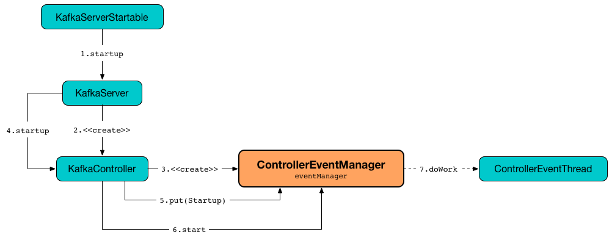
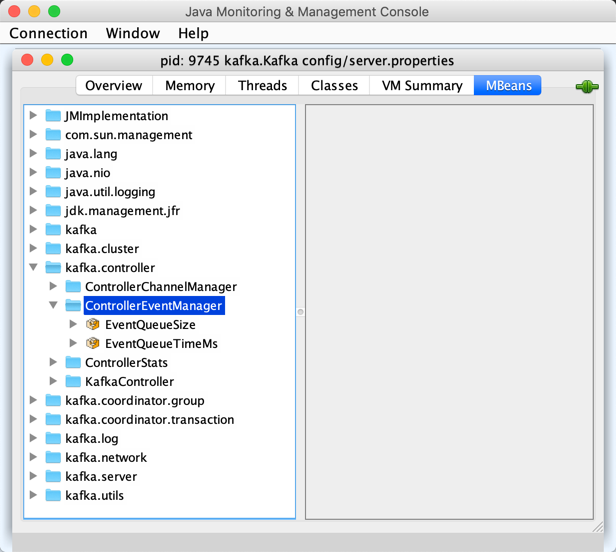

== [[ControllerEventManager]] ControllerEventManager

`ControllerEventManager` manages the <<queue, event queue>> (of <<kafka-controller-QueuedEvent.adoc#, QueuedEvents>>) and the <<thread, controller-event-thread>> for <<kafka-controller-ControllerEventThread.adoc#doWork, event processing>>.

`ControllerEventManager` allows for <<put, emitting ControllerEvents>> (with optional <<clearAndPut, preempting the queue first>>).

`ControllerEventManager` is <<creating-instance, created>> exclusively for the <<kafka-controller-KafkaController.adoc#, KafkaController>> (when <<kafka-server-KafkaServer.adoc#startup, started up>>).

When <<start, started>>, `ControllerEventManager` simply requests the <<thread, ControllerEventThread>> to <<kafka-controller-ControllerEventThread.adoc#doWork, start processing ControllerEvents>>.

`ControllerEventManager` is <<start, started>> when `KafkaController` is link:kafka-controller-KafkaController.adoc#startup[started up].

.ControllerEventManager is Created and Started With KafkaController


[[state]]
`ControllerEventManager` is in one of the possible <<_state, ControllerStates>>.

NOTE: The <<state, state>> of `ControllerEventManager` is exactly the state of the owning <<kafka-controller-KafkaController.adoc#state, KafkaController>>.

=== [[creating-instance]] Creating ControllerEventManager Instance

`ControllerEventManager` takes the following to be created:

* [[controllerId]] Controller ID (i.e. the <<kafka-properties.adoc#broker.id, broker.id>> of the broker)
* [[processor]] <<kafka-controller-ControllerEventProcessor.adoc#, ControllerEventProcessor>>
* [[time]] `Time`
* [[rateAndTimeMetrics]] `KafkaTimers` per <<kafka-controller-ControllerState.adoc#, ControllerState>> (`Map[ControllerState, KafkaTimer]`)

`ControllerEventManager` initializes the <<internal-properties, internal properties>>.

=== [[KafkaMetricsGroup]][[metrics]] Performance Metrics

`ControllerEventManager` is a <<kafka-metrics-KafkaMetricsGroup.adoc#, KafkaMetricsGroup>> with the following performance metrics.

.ControllerEventManager's Performance Metrics
[cols="30m,70",options="header",width="100%"]
|===
| Metric Name
| Description

| EventQueueTimeMs
a| [[eventQueueTimeHist]][[EventQueueTimeMs]]

| EventQueueSize
a| [[EventQueueSize]] Number of <<kafka-controller-QueuedEvent.adoc#, QueuedEvents>> in the <<queue, event queue>>

|===

The performance metrics are registered in *kafka.controller:type=ControllerEventManager* group.

.Partition in jconsole


=== [[put]] Emitting (Enqueuing) Controller Event -- `put` Method

[source, scala]
----
put(event: ControllerEvent): QueuedEvent
----

`put` creates a new <<kafka-controller-QueuedEvent.adoc#, QueuedEvent>> with the <<kafka-controller-ControllerEvent.adoc#, ControllerEvent>> and adds it at the end of the <<queue, event queue>>.

[NOTE]
====
`put` is used when:

* `ControllerBrokerRequestBatch` is requested to <<kafka-controller-ControllerBrokerRequestBatch.adoc#sendEvent, sendEvent>>

* `ControllerEventManager` is requested to <<clearAndPut, clearAndPut>>

* `KafkaController` is requested to do its operation and emits various events
====

=== [[start]] Starting ControllerEventManager (and ControllerEventThread) -- `start` Method

[source, scala]
----
start(): Unit
----

`start` simply requests the <<thread, ControllerEventThread>> to <<kafka-controller-ControllerEventThread.adoc#doWork, start processing ControllerEvents>>.

NOTE: `ControllerEventThread` is a `ShutdownableThread` that triggers `doWork()` method when started.

NOTE: `start` is used exclusively when `KafkaController` is requested to <<kafka-controller-KafkaController.adoc#startup, start up>> (when `KafkaServer` is requested to <<kafka-server-KafkaServer.adoc#startup, start>>).

=== [[clearAndPut]] `clearAndPut` Method

[source, scala]
----
clearAndPut(
  event: ControllerEvent): QueuedEvent
----

`clearAndPut`...FIXME

[NOTE]
====
`clearAndPut` is used when:

* `ControllerEventManager` is requested to <<close, close>> (and emit a `ShutdownEventThread` event)

* `KafkaController` is requested to <<kafka-controller-KafkaController.adoc#startup, startup>> (and registers a `StateChangeHandler` that emits an `Expire` event when `beforeInitializingSession`)
====

=== [[close]] Closing Up -- `close` Method

[source, scala]
----
close(): Unit
----

`close` simply <<clearAndPut, clears the event queue and emits>> a `ShutdownEventThread` event.

In the end, `close` waits until the shutdown is complete. You should see the following INFO message in the logs:

```
Shutdown completed
```

NOTE: `close` is used exclusively when `KafkaController` is requested to <<kafka-controller-KafkaController.adoc#shutdown, shutdown>>.

=== [[internal-properties]] Internal Properties

[cols="30m,70",options="header",width="100%"]
|===
| Name
| Description

| queue
a| [[queue]] Event queue of <<kafka-controller-QueuedEvent.adoc#, QueuedEvents>> (`LinkedBlockingQueue[QueuedEvent]`) that is a Java http://docs.oracle.com/javase/9/docs/api/java/util/concurrent/LinkedBlockingQueue.html[java.util.concurrent.LinkedBlockingQueue] (i.e. an optionally-bounded blocking queue based on linked nodes that orders elements in first-in-first-out fashion)

| _state
a| [[_state]] <<kafka-controller-ControllerState.adoc#, ControllerState>>:

* <<kafka-controller-ControllerState.adoc#Idle, Idle>> when `ControllerEventManager` is <<creating-instance, created>> and right after `ControllerEventThread` has finished <<kafka-controller-ControllerEventThread.adoc#doWork, processing a controller event>>

* State transitions happen per the <<kafka-controller-ControllerEvent.adoc#state, requested state>> of the `ControllerEvent` being processed (while `ControllerEventThread` is <<kafka-controller-ControllerEventThread.adoc#doWork, processing controller events>>)

| thread
a| [[thread]] <<kafka-controller-ControllerEventThread.adoc#, ControllerEventThread>> with *controller-event-thread* thread name

|===
