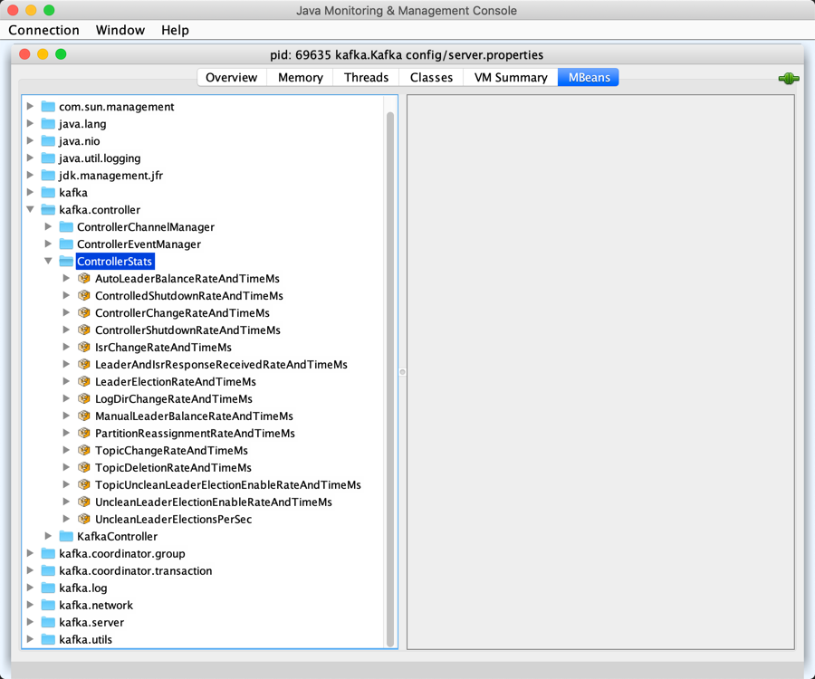

== [[ControllerState]] ControllerState Contract

`ControllerState` is the <<contract, contract>> of the <<implementations, states>> that <<kafka-controller-KafkaController.adoc#state, KafkaController>> can be in.

Every `ControllerEvent` has an associated <<kafka-controller-ControllerEvent.adoc#state, state>>. When a `ControllerEvent` is processed, it triggers a state transition to the requested state. These state transitions are used for <<kafka-controller-ControllerEventManager.adoc#state, ControllerEventManager>> and the owning <<kafka-controller-KafkaController.adoc#state, KafkaController>>.

`ControllerState` has the <<rateAndTimeMetricName, rateAndTimeMetricName>> (except <<Idle, Idle>> state). <<kafka-controller-ControllerContext.adoc#rateAndTimeMetrics, ControllerContext>> uses them to build a registry of `KafkaTimers` for every `ControllerState`. The timer metric name pattern is *kafka.controller:type=ControllerStats,name=*.

.ControllerStates and RateAndTimeMs Timer Metrics in JConsole

[[contract]]
.ControllerState Contract
[cols="1m,2",options="header",width="100%"]
|===
| Method
| Description

| value
a| [[value]]

[source, scala]
----
value: Byte
----

Internal identifier

| rateAndTimeMetricName
a| [[rateAndTimeMetricName]]

[source, scala]
----
rateAndTimeMetricName: Option[String]
----

`rateAndTimeMetricName` depends on the <<hasRateAndTimeMetric, hasRateAndTimeMetric>> flag:

* *[ControllerState_name]RateAndTimeMs* when enabled

* Undefined when disabled

| hasRateAndTimeMetric
a| [[hasRateAndTimeMetric]]

[source, scala]
----
hasRateAndTimeMetric: Boolean
----

Controls whether the `ControllerState` has a <<rateAndTimeMetricName, RateAndTime metric>> (`true`) or not (`false`)

Default: `true`
|===

[[implementations]]
.ControllerStates (and Triggering ControllerEvents)
[cols="1m,3",options="header",width="100%"]
|===
| ControllerState
| Description

| AutoLeaderBalance
| [[AutoLeaderBalance]]

| BrokerChange
| [[BrokerChange]] <<rateAndTimeMetricName, rateAndTimeMetricName>> is *LeaderElectionRateAndTimeMs*

ControllerEvents: BrokerChange, BrokerModifications

| ControlledShutdown
| [[ControlledShutdown]]

| ControllerChange
| [[ControllerChange]] ControllerEvents: RegisterBrokerAndReelect

| ControllerShutdown
| [[ControllerShutdown]]

| Idle
| [[Idle]] The initial state of <<kafka-controller-ControllerEventManager.adoc#state, ControllerEventManager>> (and indirectly <<kafka-controller-KafkaController.adoc#state, KafkaController>>)

`Idle` <<hasRateAndTimeMetric, has no rateAndTime metric>>.

| IsrChange
| [[IsrChange]] ControllerEvents: <<kafka-controller-ControllerEvent.adoc#IsrChangeNotification, IsrChangeNotification>>

| LeaderAndIsrResponseReceived
| [[LeaderAndIsrResponseReceived]]

| LogDirChange
| [[LogDirChange]] ControllerEvents: LogDirEventNotification

| ManualLeaderBalance
| [[ManualLeaderBalance]] ControllerEvents: <<kafka-controller-ControllerEvent.adoc#PreferredReplicaLeaderElection, PreferredReplicaLeaderElection>>

| PartitionReassignment
| [[PartitionReassignment]] ControllerEvents: PartitionReassignment, PartitionReassignmentIsrChange

| TopicChange
| [[TopicChange]] ControllerEvents: TopicChange, PartitionModifications

| TopicDeletion
| [[TopicDeletion]] ControllerEvents: TopicDeletion

| TopicUncleanLeaderElectionEnable
| [[TopicUncleanLeaderElectionEnable]]

| UncleanLeaderElectionEnable
| [[UncleanLeaderElectionEnable]]

|===

NOTE: `ControllerState` is a Scala sealed abstract class and so all the possible <<implementations, controller states>> are in a single compilation unit (i.e. a file).
