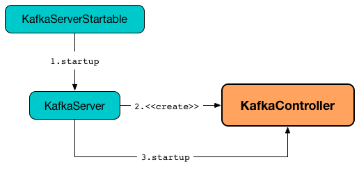

== [[KafkaController]] KafkaController

`KafkaController` is <<creating-instance, created>> and immediately <<startup, started>> when `KafkaServer` is requested to <<kafka-server-KafkaServer.adoc#startup, start up>>.

.KafkaController


`KafkaController` is the default and only known <<kafka-controller-ControllerEventProcessor.adoc#, ControllerEventProcessor>> to <<process, process>> and <<preempt, preempt>> controller events.

[[state]]
`KafkaController` is in one of the <<kafka-controller-ControllerState.adoc#, ControllerStates>> (that is the <<kafka-controller-ControllerEventManager.adoc#state, state>> of the <<eventManager, ControllerEventManager>>).

`KafkaController` uses the <<zkClient, KafkaZkClient>> to be notified about changes in the state of a Kafka cluster (that are reflected in changes in znodes of Apache Zookeeper) and propagate the state changes to other brokers.

`KafkaController` uses <<listeners, listeners>> as a notification system to monitor znodes in Zookeeper and react accordingly.

`KafkaController` emulates a state machine using <<controller-events, controller events>>.

[[controller-events]]
.KafkaController's Controller Events
[cols="1,1,2",options="header",width="100%"]
|===
| Event
| ControllerState
| process Handler

| ApiPartitionReassignment
|
| [[ApiPartitionReassignment]] <<processApiPartitionReassignment, processApiPartitionReassignment>>

| AutoPreferredReplicaLeaderElection
|
| [[AutoPreferredReplicaLeaderElection]] <<processAutoPreferredReplicaLeaderElection, processAutoPreferredReplicaLeaderElection>>

| BrokerChange
| <<kafka-controller-ControllerState.adoc#BrokerChange, BrokerChange>>
| [[BrokerChange]] <<processBrokerChange, processBrokerChange>>

| BrokerModifications
|
| [[BrokerModifications]] <<processBrokerModification, processBrokerModification>>

a| ControlledShutdown

* `ID`

* `controlledShutdownCallback`: Try[Set[TopicAndPartition]] => Unit

| <<kafka-controller-ControllerState.adoc#ControlledShutdown, ControlledShutdown>>
| [[ControlledShutdown]] <<processControlledShutdown, processControlledShutdown>>

a| ControllerChange

* `newControllerId`: Int

| <<kafka-controller-ControllerState.adoc#ControllerChange, ControllerChange>>
a| [[ControllerChange]] <<processControllerChange, processControllerChange>>

1. Assigns the <<getControllerID, current controller ID>> as the input `newControllerId`
1. (only when the broker is no longer an <<isActive, active controller>>) <<onControllerResignation, Resigns as the active controller>>

NOTE:  Similar to <<Reelect, Reelect>> event with the only difference that it does *not* trigger <<elect, election>>

| Expire
|
| [[Expire]] <<processExpire, processExpire>>

| <<kafka-controller-ControllerEvent.adoc#IsrChangeNotification, IsrChangeNotification>>
|
| [[IsrChangeNotification]] <<processIsrChangeNotification, processIsrChangeNotification>>

| <<kafka-controller-ControllerEvent-LeaderAndIsrResponseReceived.adoc#, LeaderAndIsrResponseReceived>>
|
| [[LeaderAndIsrResponseReceived]] <<processLeaderAndIsrResponseReceived, processLeaderAndIsrResponseReceived>>

| ListPartitionReassignments
|
| [[ListPartitionReassignments]] <<processListPartitionReassignments, processListPartitionReassignments>>

| LogDirEventNotification
|
| [[LogDirEventNotification]] <<processLogDirEventNotification, processLogDirEventNotification>>

| PartitionModifications
|
| [[PartitionModifications]] <<processPartitionModifications, processPartitionModifications>>

| PartitionReassignmentIsrChange
|
| [[PartitionReassignmentIsrChange]] <<processPartitionReassignmentIsrChange, processPartitionReassignmentIsrChange>>

| Reelect
| <<kafka-controller-ControllerState.adoc#ControllerChange, ControllerChange>>
a| [[Reelect]] <<processReelect, processReelect>>

1. Assigns the <<getControllerID, current controller ID>> as <<activeControllerId, activeControllerId>>
1. (only when the broker is no longer an <<isActive, active controller>>) <<onControllerResignation, Resigns as the active controller>>
1. <<elect, elect>>

| RegisterBrokerAndReelect
|
| [[RegisterBrokerAndReelect]] <<processRegisterBrokerAndReelect, processRegisterBrokerAndReelect>>

| ReplicaLeaderElection
|
| [[ReplicaLeaderElection]] <<processReplicaLeaderElection, processReplicaLeaderElection>>

| ShutdownEventThread
|
| [[ShutdownEventThread]]

| Startup
| <<kafka-controller-ControllerState.adoc#ControllerChange, ControllerChange>>
a| [[Startup]] <<processStartup, processStartup>>

1. <<registerSessionExpirationListener, registerSessionExpirationListener>>
1. <<registerControllerChangeListener, registerControllerChangeListener>>
1. <<elect, elect>>

| TopicChange
|
| [[TopicChange]] <<processTopicChange, processTopicChange>>

| TopicDeletion
|
| [[TopicDeletion]] <<processTopicDeletion, processTopicDeletion>>

| TopicDeletionStopReplicaResponseReceived
|
| [[TopicDeletionStopReplicaResponseReceived]] <<processTopicDeletionStopReplicaResponseReceived, processTopicDeletionStopReplicaResponseReceived>>

| TopicUncleanLeaderElectionEnable
|
| [[TopicUncleanLeaderElectionEnable]] <<processTopicUncleanLeaderElectionEnable, processTopicUncleanLeaderElectionEnable>>

| UncleanLeaderElectionEnable
|
| [[UncleanLeaderElectionEnable]] <<processUncleanLeaderElectionEnable, processUncleanLeaderElectionEnable>>

| ZkPartitionReassignment
|
| [[ZkPartitionReassignment]] <<processZkPartitionReassignment, processZkPartitionReassignment>>

|===

[[znode-change-handlers]]
.KafkaController's ZNodeChangeHandler and ZNodeChildChangeHandlers
[cols="1m,2",options="header",width="100%"]
|===
| Name
| Description

| brokerChangeHandler
| [[brokerChangeHandler]][[BrokerChangeHandler]] `ZNodeChildChangeHandler` of `/brokers/ids` path

On `handleChildChange`, `brokerChangeHandler` simply sends <<BrokerChange, BrokerChange>> event to the <<eventManager, ControllerEventManager>>.

| isrChangeNotificationHandler
| [[isrChangeNotificationHandler]] `ZNodeChildChangeHandler` of `/isr_change_notification` path

On `handleChildChange`, `isrChangeNotificationHandler` simply sends <<IsrChangeNotification, IsrChangeNotification>> event to the <<eventManager, ControllerEventManager>>.

| logDirEventNotificationHandler
| [[logDirEventNotificationHandler]] `ZNodeChildChangeHandler` of `/log_dir_event_notification` path

On `handleChildChange`, `logDirEventNotificationHandler` simply sends <<LogDirEventNotification, LogDirEventNotification>> event to the <<eventManager, ControllerEventManager>>.

| partitionModificationsHandlers
a| [[partitionModificationsHandlers]] `ZNodeChangeHandlers` per topic of `/brokers/topics/[topic]` path

On `handleDataChange`, `partitionModificationsHandlers` simply send <<PartitionModifications, PartitionModifications>> event to the <<eventManager, ControllerEventManager>>.

| partitionReassignmentHandler
| [[partitionReassignmentHandler]] `ZNodeChangeHandler` of `/admin/reassign_partitions` path

On `handleCreation`, `partitionReassignmentHandler` simply sends <<PartitionReassignment, PartitionReassignment>> event to the <<eventManager, ControllerEventManager>>.

| preferredReplicaElectionHandler
| [[preferredReplicaElectionHandler]][[PreferredReplicaElectionHandler]] `ZNodeChangeHandler` of `/admin/preferred_replica_election` path

On `handleCreation`, `preferredReplicaElectionHandler` simply sends <<PreferredReplicaLeaderElection, PreferredReplicaLeaderElection>> event to the <<eventManager, ControllerEventManager>>.

| topicChangeHandler
| [[topicChangeHandler]] `ZNodeChildChangeHandler` of `/brokers/topics` path

On `handleChildChange`, `topicChangeHandler` simply sends <<TopicChange, TopicChange>> event to the <<eventManager, ControllerEventManager>>.

| topicDeletionHandler
| [[topicDeletionHandler]] `ZNodeChildChangeHandler` of `/admin/delete_topics` path

On `handleChildChange`, `topicDeletionHandler` simply sends <<TopicDeletion, TopicDeletion>> event to the <<eventManager, ControllerEventManager>>.

|===

[[listeners]]
.KafkaController's Listeners
[cols="1,2",options="header",width="100%"]
|===
| Listener
| Description

| [[brokerChangeListener]] `brokerChangeListener`
| `BrokerChangeListener` for this `KafkaController` and <<eventManager, eventManager>>

| [[isrChangeNotificationListener]] `isrChangeNotificationListener`
| `IsrChangeNotificationListener` for this `KafkaController` and <<eventManager, eventManager>>

Registered in <<registerIsrChangeNotificationListener, registerIsrChangeNotificationListener>> when `KafkaController` does <<onControllerFailover, onControllerFailover>>.

De-registered in <<deregisterIsrChangeNotificationListener, deregisterIsrChangeNotificationListener>> when `KafkaController` <<onControllerResignation, resigns as the active controller>>.

| [[logDirEventNotificationListener]] `logDirEventNotificationListener`
| `LogDirEventNotificationListener`

| [[partitionModificationsListeners]] `partitionModificationsListeners`
| `PartitionModificationsListener` by name

| [[partitionReassignmentListener]] `partitionReassignmentListener`
| `PartitionReassignmentListener` for this `KafkaController` and <<eventManager, ControllerEventManager>>

| [[preferredReplicaElectionListener]] `preferredReplicaElectionListener`
| `PreferredReplicaElectionListener` for this `KafkaController` and <<eventManager, ControllerEventManager>>

| [[topicDeletionListener]] `topicDeletionListener`
| `TopicDeletionListener` (for this `KafkaController` and <<eventManager, ControllerEventManager>>)

Registered in <<registerTopicDeletionListener, registerTopicDeletionListener>> when `KafkaController` does <<onControllerFailover, onControllerFailover>>.

De-registered in <<deregisterTopicDeletionListener, deregisterTopicDeletionListener>> when `KafkaController` <<onControllerResignation, resigns as the active controller>>.
|===

[[logIdent]]
`KafkaController` uses *[Controller id=[brokerId]]* as the logging prefix (aka `logIdent`).

[[logging]]
[TIP]
====
Enable `ALL` logging level for `kafka.controller.KafkaController` logger to see what happens inside.

Add the following line to `config/log4j.properties`:

```
log4j.logger.kafka.controller.KafkaController=ALL
```

Refer to <<kafka-logging.adoc#, Logging>>.

---

Please note that Kafka comes with a preconfigured `kafka.controller` logger in `config/log4j.properties`:

```
log4j.appender.controllerAppender=org.apache.log4j.DailyRollingFileAppender
log4j.appender.controllerAppender.DatePattern='.'yyyy-MM-dd-HH
log4j.appender.controllerAppender.File=${kafka.logs.dir}/controller.log
log4j.appender.controllerAppender.layout=org.apache.log4j.PatternLayout
log4j.appender.controllerAppender.layout.ConversionPattern=[%d] %p %m (%c)%n

log4j.logger.kafka.controller=TRACE, controllerAppender
log4j.additivity.kafka.controller=false
```

That means that the logs of `KafkaController` go to `logs/controller.log` file at `TRACE` logging level and are not added to the main logs (per `log4j.additivity` being off).
====

=== [[creating-instance]] Creating KafkaController Instance

`KafkaController` takes the following to be created:

* [[config]] <<kafka-server-KafkaConfig.adoc#, KafkaConfig>>
* [[zkClient]] <<kafka-zk-KafkaZkClient.adoc#, KafkaZkClient>>
* [[time]] `Time`
* [[metrics]] <<kafka-Metrics.adoc#, Metrics>>
* [[initialBrokerInfo]] `BrokerInfo`
* [[initialBrokerEpoch]] `initialBrokerEpoch`
* [[tokenManager]] <<kafka-server-DelegationTokenManager.adoc#, DelegationTokenManager>>
* [[threadNamePrefix]] Thread name prefix (default: undefined)

`KafkaController` initializes the <<internal-properties, internal properties>>.

=== [[controllerContext]] KafkaController and ControllerContext

[source, scala]
----
controllerContext: ControllerContext
----

When <<creating-instance, created>>, `KafkaController` creates a new <<kafka-controller-ControllerContext.adoc#, ControllerContext>>.

=== [[controllerChannelManager]] KafkaController and ControllerChannelManager

[source, scala]
----
controllerChannelManager: ControllerChannelManager
----

When <<creating-instance, created>>, `KafkaController` creates a new <<kafka-controller-ControllerChannelManager.adoc#, ControllerChannelManager>>.

`ControllerChannelManager` is used to create separate <<kafka-controller-ControllerBrokerRequestBatch.adoc#, ControllerBrokerRequestBatches>> of the <<brokerRequestBatch, KafkaController>> itself, the <<replicaStateMachine, ZkReplicaStateMachine>> and <<partitionStateMachine, ZkPartitionStateMachine>>.

`ControllerChannelManager` is requested to <<kafka-controller-ControllerChannelManager.adoc#startup, start up>> when `KafkaController` is requested to start <<elect, controller election>> (and a broker is successfully elected as the active controller).

`KafkaController` uses the `ControllerChannelManager` to <<kafka-controller-ControllerChannelManager.adoc#addBroker, add>> or <<kafka-controller-ControllerChannelManager.adoc#removeBroker, remove>> brokers when <<processBrokerChange, processing broker changes in Zookeeper>> (a new or updated znode under `/brokers/ids` path).

`ControllerChannelManager` is requested to <<kafka-controller-ControllerChannelManager.adoc#shutdown, shut down>> when `KafkaController` is requested to <<onControllerResignation, resign as the active controller>>.

=== [[replicaStateMachine]] KafkaController and ReplicaStateMachine (ZkReplicaStateMachine)

[source, scala]
----
replicaStateMachine: ReplicaStateMachine
----

When <<creating-instance, created>>, `KafkaController` creates a new <<kafka-controller-ZkReplicaStateMachine.adoc#, ZkReplicaStateMachine>>.

`ZkReplicaStateMachine` is requested to <<kafka-controller-ReplicaStateMachine.adoc#startup, start up>> at <<onControllerFailover, onControllerFailover>> (when a broker is successfully <<elect, elected as the controller>>) and <<kafka-controller-ReplicaStateMachine.adoc#shutdown, shut down>> at <<onControllerResignation, controller resignation>>.

`ZkReplicaStateMachine` is requested to <<kafka-controller-ZkReplicaStateMachine.adoc#handleStateChanges, handle state changes of partition replicas>> at the following events:

* <<onBrokerLogDirFailure, onBrokerLogDirFailure>> to transition replicas to `OnlineReplica` state

* <<onBrokerStartup, onBrokerStartup>> to transition replicas to `OnlineReplica` state

* <<onReplicasBecomeOffline, onReplicasBecomeOffline>> to transition replicas to `OfflineReplica` state

* <<onNewPartitionCreation, onNewPartitionCreation>> to transition replicas to `NewReplica` state first and then to `OnlineReplica`

* <<onPartitionReassignment, onPartitionReassignment>> to transition replicas to `OnlineReplica` state

* <<stopOldReplicasOfReassignedPartition, stopOldReplicasOfReassignedPartition>> to transition replicas to `OfflineReplica` state first and then to `ReplicaDeletionStarted`, `ReplicaDeletionSuccessful`, and `NonExistentReplica` in the end

* <<startNewReplicasForReassignedPartition, startNewReplicasForReassignedPartition>> to transition replicas to `NewReplica` state

* <<doControlledShutdown, doControlledShutdown>> to transition replicas to `OfflineReplica` state

`KafkaController` uses the `ZkReplicaStateMachine` to create the <<topicDeletionManager, TopicDeletionManager>>.

=== [[partitionStateMachine]] KafkaController and PartitionStateMachine (ZkPartitionStateMachine)

[source, scala]
----
partitionStateMachine: PartitionStateMachine
----

When <<creating-instance, created>>, `KafkaController` creates a new link:kafka-controller-ZkPartitionStateMachine.adoc[ZkPartitionStateMachine].

`ZkPartitionStateMachine` is requested to <<kafka-controller-PartitionStateMachine.adoc#startup, start up>> at <<onControllerFailover, onControllerFailover>> (when a broker is successfully <<elect, elected as the controller>>) and <<kafka-controller-PartitionStateMachine.adoc#shutdown, shut down>> at <<onControllerResignation, controller resignation>>.

`ZkPartitionStateMachine` is requested to <<kafka-controller-PartitionStateMachine.adoc#triggerOnlinePartitionStateChange, triggerOnlinePartitionStateChange>> at the following events:

* <<onBrokerStartup, onBrokerStartup>>

* <<onReplicasBecomeOffline, onReplicasBecomeOffline>>

* <<processUncleanLeaderElectionEnable, processUncleanLeaderElectionEnable>>

* <<processTopicUncleanLeaderElectionEnable, processTopicUncleanLeaderElectionEnable>> (with a topic)

`ZkPartitionStateMachine` is requested to <<kafka-controller-PartitionStateMachine.adoc#handleStateChanges, handleStateChanges>> at the following events:

* <<onReplicasBecomeOffline, onReplicasBecomeOffline>>

* <<onNewPartitionCreation, onNewPartitionCreation>> to transition partitions to `NewPartition` state first and then to `OnlinePartition`

* <<onPreferredReplicaElection, onPreferredReplicaElection>> to transition partitions to `OnlinePartition`

* <<moveReassignedPartitionLeaderIfRequired, moveReassignedPartitionLeaderIfRequired>> to transition partitions to `OnlinePartition`

* <<doControlledShutdown, doControlledShutdown>> to transition partitions to `OnlinePartition` state

`KafkaController` uses the `ZkPartitionStateMachine` to create the <<topicDeletionManager, TopicDeletionManager>>.

=== [[preempt]] Preempting Controller Events -- `preempt` Method

[source, scala]
----
preempt(event: ControllerEvent): Unit
----

NOTE: `preempt` is part of the <<kafka-controller-ControllerEventProcessor.adoc#preempt, ControllerEventProcessor Contract>> to preempt <<kafka-controller-ControllerEvent.adoc#, controller events>>.

`preempt`...FIXME

=== [[process]] Processing Controller Events -- `process` Method

[source, scala]
----
process(event: ControllerEvent): Unit
----

NOTE: `process` is part of the <<kafka-controller-ControllerEventProcessor.adoc#process, ControllerEventProcessor Contract>> to process <<kafka-controller-ControllerEvent.adoc#, controller events>>.

`process` handles the <<kafka-controller-ControllerEvent.adoc#, ControllerEvent>> using <<handlers, ControllerEvent handlers>>.

[[handlers]]
.ControllerEvent Handlers
[cols="30m,70",options="header",width="100%"]
|===
| Name
| Description

| <<ShutdownEventThread, ShutdownEventThread>>
|

| <<AutoPreferredReplicaLeaderElection, AutoPreferredReplicaLeaderElection>>
| <<processAutoPreferredReplicaLeaderElection, processAutoPreferredReplicaLeaderElection>>

| <<ReplicaLeaderElection, ReplicaLeaderElection>>
| <<processReplicaLeaderElection, processReplicaLeaderElection>>

| <<UncleanLeaderElectionEnable, UncleanLeaderElectionEnable>>
| <<processUncleanLeaderElectionEnable, processUncleanLeaderElectionEnable>>

| <<TopicUncleanLeaderElectionEnable, TopicUncleanLeaderElectionEnable>>
| <<processTopicUncleanLeaderElectionEnable, processTopicUncleanLeaderElectionEnable>>

| <<ControlledShutdown, ControlledShutdown>>
| <<processControlledShutdown, processControlledShutdown>>

| <<kafka-controller-ControllerEvent-LeaderAndIsrResponseReceived.adoc#, LeaderAndIsrResponseReceived>>
| <<processLeaderAndIsrResponseReceived, processLeaderAndIsrResponseReceived>>

| <<TopicDeletionStopReplicaResponseReceived, TopicDeletionStopReplicaResponseReceived>>
| <<processTopicDeletionStopReplicaResponseReceived, processTopicDeletionStopReplicaResponseReceived>>

| <<BrokerChange, BrokerChange>>
| <<processBrokerChange, processBrokerChange>>

| <<BrokerModifications, BrokerModifications>>
| <<processBrokerModification, processBrokerModification>>

| <<ControllerChange, ControllerChange>>
| <<processControllerChange, processControllerChange>>

| <<Reelect, Reelect>>
| <<processReelect, processReelect>>

| <<RegisterBrokerAndReelect, RegisterBrokerAndReelect>>
| <<processRegisterBrokerAndReelect, processRegisterBrokerAndReelect>>

| <<Expire, Expire>>
| <<processExpire, processExpire>>

| <<TopicChange, TopicChange>>
| <<processTopicChange, processTopicChange>>

| <<LogDirEventNotification, LogDirEventNotification>>
| <<processLogDirEventNotification, processLogDirEventNotification>>

| <<PartitionModifications, PartitionModifications>>
| <<processPartitionModifications, processPartitionModifications>>

| <<TopicDeletion, TopicDeletion>>
| <<processTopicDeletion, processTopicDeletion>>

| <<ApiPartitionReassignment, ApiPartitionReassignment>>
| <<processApiPartitionReassignment, processApiPartitionReassignment>>

| <<ZkPartitionReassignment, ZkPartitionReassignment>>
| <<processZkPartitionReassignment, processZkPartitionReassignment>>

| <<ListPartitionReassignments, ListPartitionReassignments>>
| <<processListPartitionReassignments, processListPartitionReassignments>>

| <<PartitionReassignmentIsrChange, PartitionReassignmentIsrChange>>
| <<processPartitionReassignmentIsrChange, processPartitionReassignmentIsrChange>>

| <<IsrChangeNotification, IsrChangeNotification>>
| <<processIsrChangeNotification, processIsrChangeNotification>>

| <<Startup, Startup>>
| <<processStartup, processStartup>>

|===

In the end, `process` <<updateMetrics, updateMetrics>>.

In case of a `ControllerMovedException`, `process` prints out the following INFO message to the logs and <<maybeResign, maybeResign>>.

```
Controller moved to another broker when processing [event].
```

In case of any error (`Throwable`), `process` simply prints out the following ERROR message to the logs:

```
Error processing event [event]
```

=== [[initiateReassignReplicasForTopicPartition]] `initiateReassignReplicasForTopicPartition` Method

[source, scala]
----
initiateReassignReplicasForTopicPartition
----

`initiateReassignReplicasForTopicPartition`...FIXME

NOTE: `initiateReassignReplicasForTopicPartition` is used when...FIXME

=== [[deregisterPartitionReassignmentIsrChangeListeners]] `deregisterPartitionReassignmentIsrChangeListeners` Method

[source, scala]
----
deregisterPartitionReassignmentIsrChangeListeners
----

`deregisterPartitionReassignmentIsrChangeListeners`...FIXME

NOTE: `deregisterPartitionReassignmentIsrChangeListeners` is used when...FIXME

=== [[resetControllerContext]] `resetControllerContext` Method

[source, scala]
----
resetControllerContext
----

`resetControllerContext`...FIXME

NOTE: `resetControllerContext` is used when...FIXME

=== [[deregisterBrokerChangeListener]] `deregisterBrokerChangeListener` Method

[source, scala]
----
deregisterBrokerChangeListener
----

`deregisterBrokerChangeListener`...FIXME

NOTE: `deregisterBrokerChangeListener` is used when...FIXME

=== [[deregisterTopicChangeListener]] `deregisterTopicChangeListener` Method

[source, scala]
----
deregisterTopicChangeListener
----

`deregisterTopicChangeListener`...FIXME

NOTE: `deregisterTopicChangeListener` is used when...FIXME

=== [[onControllerResignation]] Resigning As Active Controller -- `onControllerResignation` Method

[source, scala]
----
onControllerResignation(): Unit
----

`onControllerResignation` starts by printing out the following DEBUG message to the logs:

```
Resigning
```

`onControllerResignation` unsubscribes from intercepting Zookeeper events for the following znodes in order:

. <<deregisterIsrChangeNotificationListener, Child changes to /isr_change_notification znode>>

. <<deregisterPartitionReassignmentListener, Data changes to /admin/reassign_partitions znode>>

. <<deregisterPreferredReplicaElectionListener, Data changes to /admin/preferred_replica_election znode>>

. <<deregisterLogDirEventNotificationListener, Child changes to /log_dir_event_notification znode>>

`onControllerResignation` requests <<topicDeletionManager, TopicDeletionManager>> to link:kafka-controller-TopicDeletionManager.adoc#reset[reset].

`onControllerResignation` requests <<kafkaScheduler, KafkaScheduler>> to link:kafka-KafkaScheduler.adoc#shutdown[shutdown].

`onControllerResignation` resets the following internal counters:

* <<offlinePartitionCount, offlinePartitionCount>>
* <<preferredReplicaImbalanceCount, preferredReplicaImbalanceCount>>
* <<globalTopicCount, globalTopicCount>>
* <<globalPartitionCount, globalPartitionCount>>

`onControllerResignation` <<deregisterPartitionReassignmentIsrChangeListeners, deregisterPartitionReassignmentIsrChangeListeners>>.

`onControllerResignation` requests <<partitionStateMachine, PartitionStateMachine>> to link:kafka-controller-PartitionStateMachine.adoc#shutdown[shutdown].

`onControllerResignation` <<deregisterTopicChangeListener, deregisterTopicChangeListener>>.

`onControllerResignation` <<deregisterPartitionModificationsListener, deregisterPartitionModificationsListener>> every listener in <<partitionModificationsListeners, partitionModificationsListeners>>.

`onControllerResignation` <<deregisterTopicDeletionListener, deregisterTopicDeletionListener>>.

`onControllerResignation` requests <<replicaStateMachine, ReplicaStateMachine>> to link:kafka-controller-ReplicaStateMachine.adoc#shutdown[shutdown].

`onControllerResignation` <<deregisterBrokerChangeListener, deregisterBrokerChangeListener>>.

`onControllerResignation` <<resetControllerContext, resetControllerContext>>.

In the end, `onControllerResignation` prints out the following DEBUG message to the logs:

```
Resigned
```

[NOTE]
====
`onControllerResignation` is used when:

* `ControllerEventThread` is requested to <<kafka-controller-ControllerEventThread.adoc#doWork, process controller events>>, i.e. <<ControllerChange, ControllerChange>> and <<Reelect, Reelect>>

* <<triggerControllerMove, triggerControllerMove>>

* `KafkaController` is requested to <<shutdown, shut down>>
====

=== [[deregisterIsrChangeNotificationListener]] Unsubscribing from Child Changes to /isr_change_notification ZNode -- `deregisterIsrChangeNotificationListener` Internal Method

[source, scala]
----
deregisterIsrChangeNotificationListener(): Unit
----

`deregisterIsrChangeNotificationListener` prints out the following DEBUG message to the logs:

```
De-registering IsrChangeNotificationListener
```

`deregisterIsrChangeNotificationListener` requests <<zkUtils, ZkUtils>> to link:kafka-ZkUtils.adoc#unsubscribeChildChanges[unsubscribe from intercepting changes] to `/isr_change_notification` znode with <<isrChangeNotificationListener, IsrChangeNotificationListener>>.

NOTE: `deregisterIsrChangeNotificationListener` is used exclusively when `KafkaController` <<onControllerResignation, resigns as the active controller>>.

=== [[deregisterLogDirEventNotificationListener]] Unsubscribing from Child Changes to /log_dir_event_notification ZNode -- `deregisterLogDirEventNotificationListener` Internal Method

[source, scala]
----
deregisterLogDirEventNotificationListener(): Unit
----

`deregisterLogDirEventNotificationListener` prints out the following DEBUG message to the logs:

```
De-registering logDirEventNotificationListener
```

`deregisterLogDirEventNotificationListener` requests <<zkUtils, ZkUtils>> to link:kafka-ZkUtils.adoc#unsubscribeChildChanges[unsubscribe from intercepting changes] to `/log_dir_event_notification` znode with <<logDirEventNotificationListener, LogDirEventNotificationListener>>.

NOTE: `deregisterLogDirEventNotificationListener` is used exclusively when `KafkaController` <<onControllerResignation, resigns as the active controller>>.

=== [[deregisterPreferredReplicaElectionListener]] Unsubscribing from Data Changes to /admin/preferred_replica_election ZNode -- `deregisterPreferredReplicaElectionListener` Method

[source, scala]
----
deregisterPreferredReplicaElectionListener(): Unit
----

`deregisterPreferredReplicaElectionListener` requests <<zkUtils, ZkUtils>> to link:kafka-ZkUtils.adoc#unsubscribeDataChanges[unsubscribe from intercepting data changes] to `/admin/preferred_replica_election` znode with <<preferredReplicaElectionListener, PreferredReplicaElectionListener>>.

NOTE: `deregisterPreferredReplicaElectionListener` is used exclusively when `KafkaController` <<onControllerResignation, resigns as the active controller>>.

=== [[deregisterPartitionReassignmentListener]] Unsubscribing from Data Changes to /admin/reassign_partitions ZNode -- `deregisterPartitionReassignmentListener` Method

[source, scala]
----
deregisterPartitionReassignmentListener(): Unit
----

`deregisterPartitionReassignmentListener` requests <<zkUtils, ZkUtils>> to link:kafka-ZkUtils.adoc#unsubscribeDataChanges[unsubscribe from intercepting data changes] to `/admin/reassign_partitions` znode with <<partitionReassignmentListener, PartitionReassignmentListener>>.

NOTE: `deregisterPartitionReassignmentListener` is used exclusively when `KafkaController` <<onControllerResignation, resigns as the active controller>>.

=== [[triggerControllerMove]] `triggerControllerMove` Internal Method

[source, scala]
----
triggerControllerMove(): Unit
----

`triggerControllerMove`...FIXME

NOTE: `triggerControllerMove` is used when `KafkaController` is requested to <<handleIllegalState, handleIllegalState>> and <<elect, elect an active controller>> (and <<elect-Throwable, failed>>).

=== [[handleIllegalState]] `handleIllegalState` Internal Method

[source, scala]
----
handleIllegalState(e: IllegalStateException): Nothing
----

`handleIllegalState`...FIXME

NOTE: `handleIllegalState` is used when `KafkaController` catches an `IllegalStateException` in <<updateLeaderEpochAndSendRequest, updateLeaderEpochAndSendRequest>>, <<sendUpdateMetadataRequest, sendUpdateMetadataRequest>> and when processing a <<ControlledShutdown, ControlledShutdown>> event.

=== [[sendUpdateMetadataRequest]] `sendUpdateMetadataRequest` Method

[source, scala]
----
sendUpdateMetadataRequest(): Unit
----

`sendUpdateMetadataRequest` requests the <<brokerRequestBatch, ControllerBrokerRequestBatch>> to <<kafka-controller-ControllerBrokerRequestBatch.adoc#newBatch, newBatch>> and <<kafka-controller-ControllerBrokerRequestBatch.adoc#addUpdateMetadataRequestForBrokers, addUpdateMetadataRequestForBrokers>>.

In the end, `sendUpdateMetadataRequest` requests the <<brokerRequestBatch, ControllerBrokerRequestBatch>> to <<kafka-controller-ControllerBrokerRequestBatch.adoc#sendRequestsToBrokers, sendRequestsToBrokers>> with the current epoch.

In case of `IllegalStateException`, `sendUpdateMetadataRequest` <<handleIllegalState, handleIllegalState>> (that <<triggerControllerMove, triggers controller movement>>).

[NOTE]
====
`sendUpdateMetadataRequest` is used when:

* `KafkaController` is requested to <<onControllerFailover, onControllerFailover>>, <<onBrokerStartup, onBrokerStartup>>, <<onBrokerUpdate, onBrokerUpdate>>, <<onReplicasBecomeOffline, onReplicasBecomeOffline>>, <<onPartitionReassignment, onPartitionReassignment>>, process a <<IsrChangeNotification, IsrChangeNotification>> controller event

* `TopicDeletionManager` is requested to <<kafka-controller-TopicDeletionManager.adoc#onTopicDeletion, onTopicDeletion>>
====

=== [[updateLeaderEpochAndSendRequest]] `updateLeaderEpochAndSendRequest` Internal Method

[source, scala]
----
updateLeaderEpochAndSendRequest(
  partition: TopicPartition,
  replicasToReceiveRequest: Seq[Int],
  newAssignedReplicas: Seq[Int]): Unit
----

[[updateLeaderEpochAndSendRequest-updateLeaderEpoch]]
`updateLeaderEpochAndSendRequest` <<updateLeaderEpoch, updates leader epoch for the partition>> and branches off per result: a <<updateLeaderEpochAndSendRequest-updateLeaderEpoch-LeaderIsrAndControllerEpoch, LeaderIsrAndControllerEpoch>> or <<updateLeaderEpochAndSendRequest-updateLeaderEpoch-None, none at all>>.

==== [[updateLeaderEpochAndSendRequest-updateLeaderEpoch-LeaderIsrAndControllerEpoch]] `updateLeaderEpochAndSendRequest` and LeaderIsrAndControllerEpoch

When <<updateLeaderEpoch, updating leader epoch for the partition>> returns a `LeaderIsrAndControllerEpoch`, `updateLeaderEpochAndSendRequest` requests the <<brokerRequestBatch, ControllerBrokerRequestBatch>> to <<kafka-controller-AbstractControllerBrokerRequestBatch.adoc#newBatch, prepare a new batch>>. `updateLeaderEpochAndSendRequest` requests the <<brokerRequestBatch, ControllerBrokerRequestBatch>> to <<kafka-controller-AbstractControllerBrokerRequestBatch.adoc#addLeaderAndIsrRequestForBrokers, addLeaderAndIsrRequestForBrokers>> followed by <<kafka-controller-AbstractControllerBrokerRequestBatch.adoc#sendRequestsToBrokers, sendRequestsToBrokers>>.

In the end, `updateLeaderEpochAndSendRequest` prints out the following TRACE message to the logs:

[options="wrap"]
----
Sent LeaderAndIsr request [updatedLeaderIsrAndControllerEpoch] with new assigned replica list [newAssignedReplicas] to leader [leader] for partition being reassigned [partition]
----

==== [[updateLeaderEpochAndSendRequest-updateLeaderEpoch-None]] `updateLeaderEpochAndSendRequest` and No LeaderIsrAndControllerEpoch

When <<updateLeaderEpoch, updating leader epoch for the partition>> returns `None`, `updateLeaderEpochAndSendRequest` prints out the following ERROR message to the logs:

[options="wrap"]
----
Failed to send LeaderAndIsr request with new assigned replica list [newAssignedReplicas] to leader for partition being reassigned [partition]
----

NOTE: `updateLeaderEpochAndSendRequest` is used when `KafkaController` is requested to <<onPartitionReassignment, onPartitionReassignment>> and <<moveReassignedPartitionLeaderIfRequired, moveReassignedPartitionLeaderIfRequired>>.

=== [[shutdown]] Shutting Down -- `shutdown` Method

[source, scala]
----
shutdown(): Unit
----

`shutdown` requests the <<eventManager, ControllerEventManager>> to <<kafka-controller-ControllerEventManager.adoc#close, close>> followed by <<onControllerResignation, onControllerResignation>>.

NOTE: `shutdown` is used exclusively when `KafkaServer` is requested to <<kafka-server-KafkaServer.adoc#shutdown, shutdown>>.

=== [[updateMetrics]] `updateMetrics` Internal Method

[source, scala]
----
updateMetrics(): Unit
----

`updateMetrics`...FIXME

NOTE: `updateMetrics` is used exclusively when `KafkaController` is <<creating-instance, created>> (and creates the <<eventManager, ControllerEventManager>>).

=== [[onBrokerStartup]] `onBrokerStartup` Method

[source, scala]
----
onBrokerStartup(
  newBrokers: Seq[Int]): Unit
----

`onBrokerStartup` prints out the following INFO message to the logs:

```
New broker startup callback for [newBrokers]
```

`onBrokerStartup` requests the <<controllerContext, ControllerContext>> for the <<kafka-controller-ControllerContext.adoc#replicasOnOfflineDirs, replicasOnOfflineDirs>> and removes the given broker IDs (in `newBrokers`).

`onBrokerStartup` <<sendUpdateMetadataRequest, sendUpdateMetadataRequest>> to the <<kafka-controller-ControllerContext.adoc#liveOrShuttingDownBrokerIds, liveOrShuttingDownBrokerIds>> (of the <<controllerContext, ControllerContext>>).

`onBrokerStartup` requests the <<controllerContext, ControllerContext>> for the <<kafka-controller-ControllerContext.adoc#replicasOnBrokers, replicas>> on the given `newBrokers`.

`onBrokerStartup` requests the <<replicaStateMachine, ReplicaStateMachine>> to <<kafka-controller-ReplicaStateMachine.adoc#handleStateChanges, handleStateChanges>> for the replicas on the new brokers and `OnlineReplica` target state.

`onBrokerStartup` requests the <<partitionStateMachine, PartitionStateMachine>> to <<kafka-controller-PartitionStateMachine.adoc#triggerOnlinePartitionStateChange, triggerOnlinePartitionStateChange>>.

`onBrokerStartup` requests the <<controllerContext, ControllerContext>> for the <<kafka-controller-ControllerContext.adoc#partitionsBeingReassigned, partitionsBeingReassigned>> and collects the partitions that have replicas on the new brokers. For every partition with a replica on the new brokers, `onBrokerStartup` <<onPartitionReassignment, onPartitionReassignment>>.

`onBrokerStartup` collects replicas (on the new brokers) that are scheduled to be deleted by requesting the <<topicDeletionManager, TopicDeletionManager>> to <<kafka-controller-TopicDeletionManager.adoc#isTopicQueuedUpForDeletion, see whether isTopicQueuedUpForDeletion>>. If there are any, `onBrokerStartup` prints out the following INFO message to the logs and requests the <<topicDeletionManager, TopicDeletionManager>> to <<kafka-controller-TopicDeletionManager.adoc#resumeDeletionForTopics, resumeDeletionForTopics>>.

```
Some replicas [replicasForTopicsToBeDeleted] for topics scheduled for deletion [topicsToBeDeleted] are on the newly restarted brokers [newBrokers]. Signaling restart of topic deletion for these topics
```

In the end, `onBrokerStartup` <<registerBrokerModificationsHandler, registerBrokerModificationsHandler>> for the new brokers.

NOTE: `onBrokerStartup` is used exclusively when `KafkaController` is requested to process a <<BrokerChange, BrokerChange>> controller event.

=== [[elect]] Controller Election -- `elect` Method

[source, scala]
----
elect(): Unit
----

`elect` requests the <<zkClient, KafkaZkClient>> for the <<kafka-zk-KafkaZkClient.adoc#getControllerId, active controller ID>> (or assumes `-1` if not available) and saves it to the <<activeControllerId, activeControllerId>> internal registry.

`elect` stops the controller election if there is an active controller ID available and prints out the following DEBUG message to the logs:

```
Broker [activeControllerId] has been elected as the controller, so stopping the election process.
```

[[elect-registerControllerAndIncrementControllerEpoch]]
Otherwise, with no active controller, `elect` requests the <<zkClient, KafkaZkClient>> to <<kafka-zk-KafkaZkClient.adoc#registerControllerAndIncrementControllerEpoch, registerControllerAndIncrementControllerEpoch>> (with the <<kafka-properties.adoc#broker.id, broker ID>>).

`elect` saves the controller epoch and the zookeeper epoch as the <<kafka-controller-ControllerContext.adoc#epoch, epoch>> and <<kafka-controller-ControllerContext.adoc#epochZkVersion, epochZkVersion>> of the <<controllerContext, ControllerContext>>, respectively.

`elect` saves the <<kafka-properties.adoc#broker.id, broker ID>> as the <<activeControllerId, activeControllerId>> internal registry.

`elect` prints out the following INFO message to the logs:

[options="wrap"]
----
[brokerId] successfully elected as the controller. Epoch incremented to [epoch] and epoch zk version is now [epochZkVersion]
----

In the end, `elect` <<onControllerFailover, onControllerFailover>>.

NOTE: `elect` is used when `ControllerEventThread` is requested to process <<Startup, Startup>> and <<Reelect, Reelect>> controller events.

==== [[elect-ControllerMovedException]] `elect` and ControllerMovedException

In case of a `ControllerMovedException`, `elect` <<maybeResign, maybeResign>> and prints out either DEBUG or WARN message to the logs per the <<activeControllerId, activeControllerId>> internal registry:

```
Broker [activeControllerId] was elected as controller instead of broker [brokerId]
```

```
A controller has been elected but just resigned, this will result in another round of election
```

==== [[elect-Throwable]] `elect` and Throwable

In case of a `Throwable`, `elect` prints out the following ERROR message to the logs and <<triggerControllerMove, triggerControllerMove>>.

[options="wrap"]
----
Error while electing or becoming controller on broker [brokerId]. Trigger controller movement immediately
----

=== [[isActive]] Is Broker The Active Controller? -- `isActive` Method

[source, scala]
----
isActive: Boolean
----

`isActive` indicates whether the current broker (by the broker ID) hosts the active `KafkaController` (given the <<activeControllerId, activeControllerId>>) or not.

NOTE: `isActive` is on (`true`) after the `KafkaController` of a Kafka broker has been <<elect, elected>>.

[NOTE]
====
`isActive` is used (as a valve to stop processing early) when:

* `ControllerEventThread` is requested to <<kafka-controller-ControllerEventThread.adoc#doWork, process controller events>> (that should only be processed on the active controller, e.g. `AutoPreferredReplicaLeaderElection`, `UncleanLeaderElectionEnable`, `ControlledShutdown`, `LeaderAndIsrResponseReceived`, `TopicDeletionStopReplicaResponseReceived`, `BrokerChange`, `BrokerModifications`, `TopicChange`)

* `KafkaController` is requested to <<updateMetrics, updateMetrics>>

* `KafkaApis` is requested to <<kafka-server-KafkaApis.adoc#handleCreateTopicsRequest, handleCreateTopicsRequest>>, <<kafka-server-KafkaApis.adoc#handleCreatePartitionsRequest, handleCreatePartitionsRequest>> and <<kafka-server-KafkaApis.adoc#handleDeleteTopicsRequest, handleDeleteTopicsRequest>>
====

=== [[registerIsrChangeNotificationListener]] `registerIsrChangeNotificationListener` Internal Method

[source, scala]
----
registerIsrChangeNotificationListener(): Option[Seq[String]]
----

`registerIsrChangeNotificationListener`...FIXME

NOTE: `registerIsrChangeNotificationListener` is used when...FIXME

=== [[deregisterIsrChangeNotificationListener]] `deregisterIsrChangeNotificationListener` Internal Method

[source, scala]
----
deregisterIsrChangeNotificationListener(): Unit
----

`deregisterIsrChangeNotificationListener`...FIXME

NOTE: `deregisterIsrChangeNotificationListener` is used when...FIXME

=== [[startup]] Starting Up -- `startup` Method

[source, scala]
----
startup(): Unit
----

`startup` requests the <<zkClient, KafkaZkClient>> to <<kafka-zk-KafkaZkClient.adoc#registerStateChangeHandler, register a StateChangeHandler>> (under the name *controller-state-change-handler*) that is does the following:

* On `afterInitializingSession`, the `StateChangeHandler` simply puts `RegisterBrokerAndReelect` event on the event queue of the <<eventManager, ControllerEventManager>>

* On `beforeInitializingSession`, the `StateChangeHandler` simply puts `Expire` event on the event queue of the <<eventManager, ControllerEventManager>>

`startup` then puts `Startup` event at the end of the event queue of the <<eventManager, ControllerEventManager>> and immediately requests it to <<kafka-controller-ControllerEventManager.adoc#start, start>>.

NOTE: `startup` is used exclusively when `KafkaServer` is requested to <<kafka-server-KafkaServer.adoc#startup, start>>.

=== [[registerSessionExpirationListener]] Registering SessionExpirationListener To Control Session Recreation -- `registerSessionExpirationListener` Internal Method

[source, scala]
----
registerSessionExpirationListener(): Unit
----

`registerSessionExpirationListener` requests <<zkUtils, ZkUtils>> to link:kafka-ZkUtils.adoc#subscribeStateChanges[subscribe to state changes] with a `SessionExpirationListener` (with the `KafkaController` and <<eventManager, ControllerEventManager>>).

NOTE: `SessionExpirationListener` puts <<Reelect, Reelect>> event on the link:kafka-controller-ControllerEventManager.adoc#queue[event queue] of `ControllerEventManager` every time the Zookeeper session has expired and a new session has been created.

NOTE: `registerSessionExpirationListener` is used exclusively when <<Startup, Startup>> event is processed (after `ControllerEventThread` is link:kafka-controller-ControllerEventThread.adoc#doWork[started]).

=== [[registerControllerChangeListener]] Registering ControllerChangeListener for /controller ZNode Changes -- `registerControllerChangeListener` Internal Method

[source, scala]
----
registerControllerChangeListener(): Unit
----

`registerControllerChangeListener` requests <<zkUtils, ZkUtils>> to link:kafka-ZkUtils.adoc#subscribeDataChanges[subscribe to data changes] for `/controller` znode with a `ControllerChangeListener` (with the `KafkaController` and <<eventManager, ControllerEventManager>>).

[NOTE]
====
`ControllerChangeListener` emits:

1. <<ControllerChange, ControllerChange>> event with the current controller ID (on the link:kafka-controller-ControllerEventManager.adoc#queue[event queue] of `ControllerEventManager`) every time the data of a znode changes

1. <<Reelect, Reelect>> event when the data associated with a znode has been deleted
====

NOTE: `registerControllerChangeListener` is used exclusively when <<Startup, Startup>> event is processed (after `ControllerEventThread` is link:kafka-controller-ControllerEventThread.adoc#doWork[started]).

=== [[registerBrokerChangeListener]] `registerBrokerChangeListener` Internal Method

[source, scala]
----
registerBrokerChangeListener(): Option[Seq[String]]
----

`registerBrokerChangeListener` requests <<zkUtils, ZkUtils>> to link:kafka-ZkUtils.adoc#subscribeChildChanges[subscribeChildChanges] for `/brokers/ids` path with <<brokerChangeListener, BrokerChangeListener>>.

NOTE: `registerBrokerChangeListener` is used exclusively when `KafkaController` does <<onControllerFailover, onControllerFailover>>.

=== [[getControllerID]] Getting Active Controller ID (from JSON under /controller znode) -- `getControllerID` Method

[source, scala]
----
getControllerID(): Int
----

`getControllerID` returns the ID of the active Kafka controller that is associated with `/controller` znode in JSON format or `-1` otherwise.

Internally, `getControllerID` requests <<zkUtils, ZkUtils>> for link:kafka-ZkUtils.adoc#readDataMaybeNull[data associated with `/controller` znode].

If available, `getControllerID` parses the data (being the current controller info in JSON format) to extract `brokerid` field.

[source, shell]
----
$ ./bin/zookeeper-shell.sh :2181 get /controller

{"version":1,"brokerid":0,"timestamp":"1543499076007"}
cZxid = 0x60
ctime = Thu Nov 29 14:44:36 CET 2018
mZxid = 0x60
mtime = Thu Nov 29 14:44:36 CET 2018
pZxid = 0x60
cversion = 0
dataVersion = 0
aclVersion = 0
ephemeralOwner = 0x100073f07ba0003
dataLength = 54
numChildren = 0
----

Otherwise, when no `/controller` znode is available, `getControllerID` returns `-1`.

[NOTE]
====
`getControllerID` is used when:

1. Processing `Reelect` controller event

1. <<elect, elect>>
====

=== [[registerTopicDeletionListener]] Registering TopicDeletionListener for Child Changes to /admin/delete_topics ZNode -- `registerTopicDeletionListener` Internal Method

[source, scala]
----
registerTopicDeletionListener(): Option[Seq[String]]
----

`registerTopicDeletionListener` requests <<zkUtils, ZkUtils>> to link:kafka-ZkUtils.adoc#subscribeChildChanges[subscribeChildChanges] to `/admin/delete_topics` znode with <<topicDeletionListener, TopicDeletionListener>>.

NOTE: `registerTopicDeletionListener` is used exclusively when `KafkaController` does <<onControllerFailover, onControllerFailover>>.

=== [[deregisterTopicDeletionListener]] De-Registering TopicDeletionListener for Child Changes to /admin/delete_topics ZNode -- `deregisterTopicDeletionListener` Internal Method

[source, scala]
----
deregisterTopicDeletionListener(): Unit
----

`deregisterTopicDeletionListener` requests <<zkUtils, ZkUtils>> to link:kafka-ZkUtils.adoc#unsubscribeChildChanges[unsubscribeChildChanges] to `/admin/delete_topics` znode with <<topicDeletionListener, TopicDeletionListener>>.

NOTE: `deregisterTopicDeletionListener` is used exclusively when `KafkaController` <<onControllerResignation, resigns as the active controller>>.

=== [[onReplicasBecomeOffline]] `onReplicasBecomeOffline` Internal Method

[source, scala]
----
onReplicasBecomeOffline(newOfflineReplicas: Set[PartitionAndReplica]): Unit
----

`onReplicasBecomeOffline`...FIXME

NOTE: `onReplicasBecomeOffline` is used when...FIXME

=== [[onPartitionReassignment]] `onPartitionReassignment` Internal Method

[source, scala]
----
onPartitionReassignment(
  topicPartition: TopicPartition,
  reassignedPartitionContext: ReassignedPartitionsContext): Unit
----

`onPartitionReassignment`...FIXME

NOTE: `onPartitionReassignment` is used when `KafkaController` is requested to <<onBrokerStartup, onBrokerStartup>>, <<maybeTriggerPartitionReassignment, maybeTriggerPartitionReassignment>> and process a <<PartitionReassignmentIsrChange, PartitionReassignmentIsrChange>> event.

=== [[onBrokerUpdate]] `onBrokerUpdate` Internal Method

[source, scala]
----
onBrokerUpdate(updatedBrokerId: Int): Unit
----

`onBrokerUpdate`...FIXME

NOTE: `onBrokerUpdate` is used when...FIXME

=== [[updateBrokerInfo]] `updateBrokerInfo` Internal Method

[source, scala]
----
updateBrokerInfo(newBrokerInfo: BrokerInfo): Unit
----

`updateBrokerInfo`...FIXME

NOTE: `updateBrokerInfo` is used exclusively when `DynamicListenerConfig` is requested to <<kafka-server-DynamicListenerConfig.adoc#reconfigure, reconfigure>>.

=== [[registerBrokerModificationsHandler]] `registerBrokerModificationsHandler` Internal Method

[source, scala]
----
registerBrokerModificationsHandler(brokerIds: Iterable[Int]): Unit
----

`registerBrokerModificationsHandler`...FIXME

NOTE: `registerBrokerModificationsHandler` is used when `KafkaController` is requested to <<onBrokerStartup, onBrokerStartup>> and <<onControllerFailover, onControllerFailover>> (indirectly through <<initializeControllerContext, initializeControllerContext>>).

=== [[initializeControllerContext]] Initializing ControllerContext -- `initializeControllerContext` Internal Method

[source, scala]
----
initializeControllerContext(): Unit
----

`initializeControllerContext`...FIXME

In the end, `initializeControllerContext` prints out the following INFO messages to the logs (with the current state based on the <<controllerContext, ControllerContext>>):

[options="wrap"]
----
Currently active brokers in the cluster: [liveBrokerIds]
Currently shutting brokers in the cluster: [shuttingDownBrokerIds]
Current list of topics in the cluster: [allTopics]
----

NOTE: `initializeControllerContext` is used exclusively when `KafkaController` is requested to <<onControllerFailover, onControllerFailover>>.

=== [[unregisterBrokerModificationsHandler]] `unregisterBrokerModificationsHandler` Internal Method

[source, scala]
----
unregisterBrokerModificationsHandler(brokerIds: Iterable[Int]): Unit
----

`unregisterBrokerModificationsHandler`...FIXME

NOTE: `unregisterBrokerModificationsHandler` is used when `KafkaController` is requested to <<onControllerResignation, onControllerResignation>> and <<onBrokerFailure, onBrokerFailure>>.

=== [[onBrokerFailure]] `onBrokerFailure` Internal Method

[source, scala]
----
onBrokerFailure(deadBrokers: Seq[Int]): Unit
----

`onBrokerFailure`...FIXME

NOTE: `onBrokerFailure` is used exclusively when `KafkaController` is requested to handle a <<BrokerChange, BrokerChange>> controller event.

=== [[maybeTriggerPartitionReassignment]] `maybeTriggerPartitionReassignment` Internal Method

[source, scala]
----
maybeTriggerPartitionReassignment(topicPartitions: Set[TopicPartition]): Unit
----

`maybeTriggerPartitionReassignment`...FIXME

NOTE: `maybeTriggerPartitionReassignment` is used when `KafkaController` is requested to <<onControllerFailover, onControllerFailover>> and process the <<PartitionReassignment, PartitionReassignment>> controller event.

=== [[incrementControllerEpoch]] `incrementControllerEpoch` Internal Method

[source, scala]
----
incrementControllerEpoch(): Unit
----

`incrementControllerEpoch`...FIXME

NOTE: `incrementControllerEpoch` is used exclusively when `KafkaController` is requested to <<onControllerFailover, onControllerFailover>>.

=== [[fetchPendingPreferredReplicaElections]] `fetchPendingPreferredReplicaElections` Internal Method

[source, scala]
----
fetchPendingPreferredReplicaElections(): Set[TopicPartition]
----

`fetchPendingPreferredReplicaElections`...FIXME

NOTE: `fetchPendingPreferredReplicaElections` is used exclusively when `KafkaController` is requested to <<onControllerFailover, onControllerFailover>>.

=== [[initializePartitionReassignment]] `initializePartitionReassignment` Internal Method

[source, scala]
----
initializePartitionReassignment(): Unit
----

`initializePartitionReassignment`...FIXME

NOTE: `initializePartitionReassignment` is used exclusively when `KafkaController` is requested to <<initializeControllerContext, initializeControllerContext>>.

=== [[fetchTopicDeletionsInProgress]] `fetchTopicDeletionsInProgress` Internal Method

[source, scala]
----
fetchTopicDeletionsInProgress(): (Set[String], Set[String])
----

`fetchTopicDeletionsInProgress`...FIXME

NOTE: `fetchTopicDeletionsInProgress` is used exclusively when `KafkaController` is requested to <<onControllerFailover, onControllerFailover>>.

=== [[updateLeaderAndIsrCache]] `updateLeaderAndIsrCache` Internal Method

[source, scala]
----
updateLeaderAndIsrCache(partitions: Seq[TopicPartition]
----

Unless given, `updateLeaderAndIsrCache` defaults to <<kafka-controller-ControllerContext.adoc#allPartitions, allPartitions>> of the <<controllerContext, ControllerContext>> for the partitions.

`updateLeaderAndIsrCache` requests the <<zkClient, KafkaZkClient>> to <<kafka-zk-KafkaZkClient.adoc#getTopicPartitionStates, getTopicPartitionStates>> (with the given partitions) and updates the <<kafka-controller-ControllerContext.adoc#partitionLeadershipInfo, partitionLeadershipInfo>> of the <<controllerContext, ControllerContext>>.

NOTE: `updateLeaderAndIsrCache` is used when `KafkaController` is requested to <<initializeControllerContext, initializeControllerContext>> (with no partitions) and <<processIsrChangeNotification, process an IsrChangeNotification controller event>> (with partitions given).

=== [[areReplicasInIsr]] `areReplicasInIsr` Internal Method

[source, scala]
----
areReplicasInIsr(partition: TopicPartition, replicas: Seq[Int]): Boolean
----

`areReplicasInIsr`...FIXME

NOTE: `areReplicasInIsr` is used exclusively when `KafkaController` is requested to <<onPartitionReassignment, onPartitionReassignment>>.

=== [[updateAssignedReplicasForPartition]] `updateAssignedReplicasForPartition` Internal Method

[source, scala]
----
updateAssignedReplicasForPartition(
  partition: TopicPartition,
  replicas: Seq[Int]): Unit
----

`updateAssignedReplicasForPartition`...FIXME

NOTE: `updateAssignedReplicasForPartition` is used exclusively when `KafkaController` is requested to <<onPartitionReassignment, onPartitionReassignment>>.

=== [[registerPartitionModificationsHandlers]] `registerPartitionModificationsHandlers` Internal Method

[source, scala]
----
registerPartitionModificationsHandlers(topics: Seq[String]): Unit
----

`registerPartitionModificationsHandlers`...FIXME

NOTE: `registerPartitionModificationsHandlers` is used when `KafkaController` is requested to <<initializeControllerContext, initializeControllerContext>> and a <<kafka-controller-ControllerEvent.adoc#TopicChange, TopicChange>> controller event is processed.

=== [[unregisterPartitionModificationsHandlers]] `unregisterPartitionModificationsHandlers` Internal Method

[source, scala]
----
unregisterPartitionModificationsHandlers(topics: Seq[String]): Unit
----

`unregisterPartitionModificationsHandlers`...FIXME

[NOTE]
====
`unregisterPartitionModificationsHandlers` is used when:

* `KafkaController` is requested to <<onControllerResignation, onControllerResignation>>

* `TopicDeletionManager` is requested to <<kafka-controller-TopicDeletionManager.adoc#completeDeleteTopic, completeDeleteTopic>>
====

=== [[unregisterPartitionReassignmentIsrChangeHandlers]] `unregisterPartitionReassignmentIsrChangeHandlers` Internal Method

[source, scala]
----
unregisterPartitionReassignmentIsrChangeHandlers(): Unit
----

`unregisterPartitionReassignmentIsrChangeHandlers`...FIXME

NOTE: `unregisterPartitionReassignmentIsrChangeHandlers` is used exclusively when `KafkaController` is requested to <<onControllerResignation, onControllerResignation>>.

=== [[readControllerEpochFromZooKeeper]] `readControllerEpochFromZooKeeper` Internal Method

[source, scala]
----
readControllerEpochFromZooKeeper(): Unit
----

`readControllerEpochFromZooKeeper`...FIXME

NOTE: `readControllerEpochFromZooKeeper` is used exclusively when `KafkaController` is requested to <<onControllerFailover, onControllerFailover>>.

=== [[removePartitionsFromReassignedPartitions]] `removePartitionsFromReassignedPartitions` Internal Method

[source, scala]
----
removePartitionsFromReassignedPartitions(partitionsToBeRemoved: Set[TopicPartition]): Unit
----

`removePartitionsFromReassignedPartitions`...FIXME

NOTE: `removePartitionsFromReassignedPartitions` is used when `KafkaController` is requested to <<onPartitionReassignment, onPartitionReassignment>> and <<maybeTriggerPartitionReassignment, maybeTriggerPartitionReassignment>>.

=== [[removePartitionsFromPreferredReplicaElection]] `removePartitionsFromPreferredReplicaElection` Internal Method

[source, scala]
----
removePartitionsFromPreferredReplicaElection(
  partitionsToBeRemoved: Set[TopicPartition],
  isTriggeredByAutoRebalance : Boolean): Unit
----

`removePartitionsFromPreferredReplicaElection`...FIXME

NOTE: `removePartitionsFromPreferredReplicaElection` is used exclusively when `KafkaController` is requested to <<onPreferredReplicaElection, onPreferredReplicaElection>> (and the election type is not <<kafka-controller-ControllerEvent-PreferredReplicaLeaderElection.adoc#AdminClientTriggered, AdminClientTriggered>>).

=== [[onPreferredReplicaElection]] Preferred Replica Leader Election -- `onPreferredReplicaElection` Internal Method

[source, scala]
----
onPreferredReplicaElection(
  partitions: Set[TopicPartition],
  electionType: ElectionType): Map[TopicPartition, Throwable]
----

`onPreferredReplicaElection` prints out the following INFO message to the logs:

```
Starting preferred replica leader election for partitions [partitions]
```

`onPreferredReplicaElection` requests the <<partitionStateMachine, PartitionStateMachine>> to <<kafka-controller-PartitionStateMachine.adoc#handleStateChanges, handle partition state changes>> for the partitions (with `OnlinePartition` target state and <<kafka-controller-PartitionStateMachine.adoc#PreferredReplicaPartitionLeaderElectionStrategy, PreferredReplicaPartitionLeaderElectionStrategy>>).

(only for <<kafka-controller-ControllerEvent-PreferredReplicaLeaderElection.adoc#election-type, election types>> that are not <<kafka-controller-ControllerEvent-PreferredReplicaLeaderElection.adoc#AdminClientTriggered, AdminClientTriggered>>) In the end, `onPreferredReplicaElection` <<removePartitionsFromPreferredReplicaElection, removePartitionsFromPreferredReplicaElection>>.

(only for <<kafka-controller-ControllerEvent-PreferredReplicaLeaderElection.adoc#election-type, election types>> that are not <<kafka-controller-ControllerEvent-PreferredReplicaLeaderElection.adoc#AdminClientTriggered, AdminClientTriggered>>) In case of an error

[NOTE]
====
`onPreferredReplicaElection` is used when `KafkaController` is requested for the following:

* <<onControllerFailover, onControllerFailover>> (with <<kafka-controller-ControllerEvent-PreferredReplicaLeaderElection.adoc#ZkTriggered, ZkTriggered>> election type)

* <<checkAndTriggerAutoLeaderRebalance, checkAndTriggerAutoLeaderRebalance>> (with <<kafka-controller-ControllerEvent-PreferredReplicaLeaderElection.adoc#AutoTriggered, AutoTriggered>> election type)

* <<processPreferredReplicaLeaderElection, Process a PreferredReplicaLeaderElection controller event>> (any election type with <<kafka-controller-ControllerEvent-PreferredReplicaLeaderElection.adoc#ZkTriggered, ZkTriggered>> the default)
====

=== [[updateLeaderEpoch]] `updateLeaderEpoch` Internal Method

[source, scala]
----
updateLeaderEpoch(partition: TopicPartition): Option[LeaderIsrAndControllerEpoch]
----

`updateLeaderEpoch`...FIXME

NOTE: `updateLeaderEpoch` is used exclusively  when `KafkaController` is requested to <<updateLeaderEpochAndSendRequest, updateLeaderEpochAndSendRequest>>.

=== [[moveReassignedPartitionLeaderIfRequired]] `moveReassignedPartitionLeaderIfRequired` Internal Method

[source, scala]
----
moveReassignedPartitionLeaderIfRequired(
  topicPartition: TopicPartition,
  reassignedPartitionContext: ReassignedPartitionsContext): Unit
----

`moveReassignedPartitionLeaderIfRequired`...FIXME

NOTE: `moveReassignedPartitionLeaderIfRequired` is used exclusively  when `KafkaController` is requested to <<onPartitionReassignment, onPartitionReassignment>>.

=== [[onControllerFailover]] `onControllerFailover` Internal Method

[source, scala]
----
onControllerFailover(): Unit
----

`onControllerFailover` prints out the following INFO message to the logs:

```
Registering handlers
```

`onControllerFailover` requests the <<zkClient, KafkaZkClient>> to <<kafka-zk-KafkaZkClient.adoc#registerZNodeChildChangeHandler, registerZNodeChildChangeHandlers>>:

* <<brokerChangeHandler, brokerChangeHandler>>
* <<topicChangeHandler, topicChangeHandler>>
* <<topicDeletionHandler, topicDeletionHandler>>
* <<logDirEventNotificationHandler, logDirEventNotificationHandler>>
* <<isrChangeNotificationHandler, isrChangeNotificationHandler>>

`onControllerFailover` requests the <<zkClient, KafkaZkClient>> to <<kafka-zk-KafkaZkClient.adoc#registerZNodeChangeHandlerAndCheckExistence, registerZNodeChangeHandlerAndCheckExistence>>:

* <<preferredReplicaElectionHandler, preferredReplicaElectionHandler>>
* <<partitionReassignmentHandler, partitionReassignmentHandler>>

`onControllerFailover` prints out the following INFO message to the logs:

```
Deleting log dir event notifications
```

`onControllerFailover` requests the <<zkClient, KafkaZkClient>> to <<kafka-zk-KafkaZkClient.adoc#deleteLogDirEventNotifications, deleteLogDirEventNotifications>> (with the <<kafka-controller-ControllerContext.adoc#epochZkVersion, epochZkVersion>> of the <<controllerContext, ControllerContext>>).

`onControllerFailover` prints out the following INFO message to the logs:

```
Deleting isr change notifications
```

`onControllerFailover` requests the <<zkClient, KafkaZkClient>> to <<kafka-zk-KafkaZkClient.adoc#deleteIsrChangeNotifications, deleteIsrChangeNotifications>> (with the <<kafka-controller-ControllerContext.adoc#epochZkVersion, epochZkVersion>> of the <<controllerContext, ControllerContext>>).

`onControllerFailover` prints out the following INFO message to the logs:

```
Initializing controller context
```

`onControllerFailover` <<initializeControllerContext, initializeControllerContext>>.

`onControllerFailover` prints out the following INFO message to the logs:

```
Fetching topic deletions in progress
```

`onControllerFailover` <<fetchTopicDeletionsInProgress, fetchTopicDeletionsInProgress>>.

`onControllerFailover` prints out the following INFO message to the logs:

```
Initializing topic deletion manager
```

`onControllerFailover` requests the <<topicDeletionManager, TopicDeletionManager>> to <<kafka-controller-TopicDeletionManager.adoc#init, initialize>> (with the topics to be deleted and ineligible for deletion).

`onControllerFailover` prints out the following INFO message to the logs:

```
Sending update metadata request
```

`onControllerFailover` <<sendUpdateMetadataRequest, sendUpdateMetadataRequest>> (with the <<kafka-controller-ControllerContext.adoc#liveOrShuttingDownBrokerIds, liveOrShuttingDownBrokerIds>> of the <<controllerContext, ControllerContext>>).

`onControllerFailover` requests the <<replicaStateMachine, ReplicaStateMachine>> to <<kafka-controller-ReplicaStateMachine.adoc#startup, start up>>.

`onControllerFailover` requests the <<partitionStateMachine, PartitionStateMachine>> to <<kafka-controller-PartitionStateMachine.adoc#startup, start up>>.

`onControllerFailover` prints out the following INFO message to the logs:

```
Ready to serve as the new controller with epoch [epoch]
```

`onControllerFailover` <<maybeTriggerPartitionReassignment, maybeTriggerPartitionReassignment>> (with the <<kafka-controller-ControllerContext.adoc#partitionsBeingReassigned, partitionsBeingReassigned>> of the <<controllerContext, ControllerContext>>).

`onControllerFailover` requests the <<topicDeletionManager, TopicDeletionManager>> to <<kafka-controller-TopicDeletionManager.adoc#tryTopicDeletion, tryTopicDeletion>>.

`onControllerFailover` <<onPreferredReplicaElection, onPreferredReplicaElection>> with the <<fetchPendingPreferredReplicaElections, fetchPendingPreferredReplicaElections>>.

`onControllerFailover` prints out the following INFO message to the logs:

```
Starting the controller scheduler
```

`onControllerFailover` requests the <<kafkaScheduler, KafkaScheduler>> to <<kafka-KafkaScheduler.adoc#startup, startup>>.

With <<kafka-properties.adoc#auto.leader.rebalance.enable, auto.leader.rebalance.enable>> enabled (default: `true`), `onControllerFailover` <<scheduleAutoLeaderRebalanceTask, scheduleAutoLeaderRebalanceTask>> with the initial delay of 5 seconds.

With <<kafka-properties.adoc#delegation.token.master.key, delegation.token.master.key>> password set (default: `(empty)`), `onControllerFailover` prints out the following INFO message to the logs:

```
starting the token expiry check scheduler
```

`onControllerFailover` requests the <<tokenCleanScheduler, tokenCleanScheduler KafkaScheduler>> to <<kafka-KafkaScheduler.adoc#startup, startup>> and requests it to <<kafka-KafkaScheduler.adoc#schedule, schedule>> the *delete-expired-tokens* task (FIXME).

NOTE: `onControllerFailover` is used when `KafkaController` is requested to <<elect, elect>> (and a broker is successfully elected as the active controller).

=== [[scheduleAutoLeaderRebalanceTask]] `scheduleAutoLeaderRebalanceTask` Internal Method

[source, scala]
----
scheduleAutoLeaderRebalanceTask(
  delay: Long,
  unit: TimeUnit): Unit
----

`scheduleAutoLeaderRebalanceTask` simply requests the <<kafkaScheduler, KafkaScheduler>> to <<kafka-KafkaScheduler.adoc#schedule, schedule a task>> called *auto-leader-rebalance-task* with the given initial delay.

The `auto-leader-rebalance-task` simply requests the <<eventManager, ControllerEventManager>> to <<kafka-controller-ControllerEventManager.adoc#put, enqueue>> an <<kafka-controller-ControllerEvent-AutoPreferredReplicaLeaderElection.adoc#, AutoPreferredReplicaLeaderElection>> controller event.

NOTE: `scheduleAutoLeaderRebalanceTask` is used when `KafkaController` is requested to <<onControllerFailover, onControllerFailover>> and <<processAutoPreferredReplicaLeaderElection, processAutoPreferredReplicaLeaderElection>>

=== [[processAutoPreferredReplicaLeaderElection]] `processAutoPreferredReplicaLeaderElection` Internal Method

[source, scala]
----
processAutoPreferredReplicaLeaderElection(): Unit
----

NOTE: `processAutoPreferredReplicaLeaderElection` does nothing (and simply returns) unless the Kafka broker (`KafkaController`) is an <<isActive, active controller>>.

`processAutoPreferredReplicaLeaderElection` prints out the following INFO message to the logs:

```
Processing automatic preferred replica leader election
```

`processAutoPreferredReplicaLeaderElection` <<checkAndTriggerAutoLeaderRebalance, checkAndTriggerAutoLeaderRebalance>>.

In the end, `processAutoPreferredReplicaLeaderElection` <<scheduleAutoLeaderRebalanceTask, scheduleAutoLeaderRebalanceTask>> with the initial delay based on <<kafka-properties.adoc#leader.imbalance.check.interval.seconds, leader.imbalance.check.interval.seconds>> configuration property (default: `300` seconds).

NOTE: `processAutoPreferredReplicaLeaderElection` is used exclusively when `KafkaController` is requested to <<process, process>> a <<kafka-controller-ControllerEvent-AutoPreferredReplicaLeaderElection.adoc#, AutoPreferredReplicaLeaderElection>> event.

=== [[checkAndTriggerAutoLeaderRebalance]] `checkAndTriggerAutoLeaderRebalance` Internal Method

[source, scala]
----
checkAndTriggerAutoLeaderRebalance(): Unit
----

`checkAndTriggerAutoLeaderRebalance` prints out the following TRACE message to the logs:

```
Checking need to trigger auto leader balancing
```

[[checkAndTriggerAutoLeaderRebalance-preferredReplicasForTopicsByBrokers]]
`checkAndTriggerAutoLeaderRebalance`...FIXME

`checkAndTriggerAutoLeaderRebalance` prints out the following DEBUG message to the logs:

```
Preferred replicas by broker [preferredReplicasForTopicsByBrokers]
```

For every broker with one or more partition leaders, `checkAndTriggerAutoLeaderRebalance`...FIXME

`checkAndTriggerAutoLeaderRebalance` prints out the following DEBUG message to the logs:

```
Topics not in preferred replica for broker [leaderBroker] [topicsNotInPreferredReplica]
```

[[checkAndTriggerAutoLeaderRebalance-imbalanceRatio]]
`checkAndTriggerAutoLeaderRebalance` calculates an imbalance ratio of the broker which is the number of `topicsNotInPreferredReplica` divided by the total number of partitions (`topicPartitionsForBroker`).

`checkAndTriggerAutoLeaderRebalance` prints out the following TRACE message to the logs:

```
Leader imbalance ratio for broker [leaderBroker] is [imbalanceRatio]
```

[[checkAndTriggerAutoLeaderRebalance-candidatePartitions]]
With the imbalance ratio greater than the desired ratio (per <<kafka-properties.adoc#leader.imbalance.per.broker.percentage, leader.imbalance.per.broker.percentage>> configuration property with the default: `10%`), `checkAndTriggerAutoLeaderRebalance` <<onPreferredReplicaElection, onPreferredReplicaElection>> for...FIXME (with <<kafka-controller-ControllerEvent-PreferredReplicaLeaderElection.adoc#AutoTriggered, AutoTriggered>> election type).

NOTE: `checkAndTriggerAutoLeaderRebalance` is used exclusively when `KafkaController` is requested to <<processAutoPreferredReplicaLeaderElection, processAutoPreferredReplicaLeaderElection>>.

=== [[onNewPartitionCreation]] `onNewPartitionCreation` Internal Method

[source, scala]
----
onNewPartitionCreation(
  newPartitions: Set[TopicPartition]): Unit
----

`onNewPartitionCreation`...FIXME

NOTE: `onNewPartitionCreation` is used when <<kafka-controller-ControllerEvent.adoc#TopicChange, TopicChange>> and <<kafka-controller-ControllerEvent.adoc#PartitionModifications, PartitionModifications>> controller events are processed.

=== [[onReplicaElection]] `onReplicaElection` Internal Method

[source, scala]
----
onReplicaElection(
  partitions: Set[TopicPartition],
  electionType: ElectionType,
  electionTrigger: ElectionTrigger): Map[TopicPartition, Either[Throwable, LeaderAndIsr]]
----

`onReplicaElection`...FIXME

NOTE: `onReplicaElection` is used when...FIXME

=== [[onBrokerLogDirFailure]] Handling Log Directory Failures for Brokers -- `onBrokerLogDirFailure` Internal Method

[source, scala]
----
onBrokerLogDirFailure(
  brokerIds: Seq[Int]): Unit
----

`onBrokerLogDirFailure` prints out the following INFO message to the logs:

```
Handling log directory failure for brokers [brokerIds]
```

`onBrokerLogDirFailure` requests the <<controllerContext, ControllerContext>> for the <<kafka-controller-ControllerContext.adoc#replicasOnBrokers, replicas on the brokers>> and then requests the <<replicaStateMachine, ReplicaStateMachine>> to <<kafka-controller-ReplicaStateMachine.adoc#handleStateChanges, handle state changes>> for the replicas to enter `OnlineReplica` state.

NOTE: `onBrokerLogDirFailure` is used exclusively when `KafkaController` is requested to <<processLogDirEventNotification, process a LogDirEventNotification controller event (on controller-event-thread)>>.

=== [[stopOldReplicasOfReassignedPartition]] `stopOldReplicasOfReassignedPartition` Internal Method

[source, scala]
----
stopOldReplicasOfReassignedPartition(
  topicPartition: TopicPartition,
  reassignedPartitionContext: ReassignedPartitionsContext,
  oldReplicas: Set[Int]): Unit
----

`stopOldReplicasOfReassignedPartition`...FIXME

NOTE: `stopOldReplicasOfReassignedPartition` is used when...FIXME

=== [[startNewReplicasForReassignedPartition]] `startNewReplicasForReassignedPartition` Internal Method

[source, scala]
----
startNewReplicasForReassignedPartition(
  topicPartition: TopicPartition,
  reassignedPartitionContext: ReassignedPartitionsContext,
  newReplicas: Set[Int]): Unit
----

`startNewReplicasForReassignedPartition`...FIXME

NOTE: `startNewReplicasForReassignedPartition` is used when...FIXME

=== [[enableDefaultUncleanLeaderElection]] `enableDefaultUncleanLeaderElection` Method

[source, scala]
----
enableDefaultUncleanLeaderElection(): Unit
----

NOTE: `enableDefaultUncleanLeaderElection` does nothing (and simply returns) unless the Kafka broker (`KafkaController`) is an <<isActive, active controller>>.

`enableDefaultUncleanLeaderElection` simply requests the <<eventManager, ControllerEventManager>> to link:kafka-controller-ControllerEventManager.adoc#put[enqueue] a link:kafka-controller-ControllerEvent-UncleanLeaderElectionEnable.adoc[UncleanLeaderElectionEnable] event.

NOTE: `enableDefaultUncleanLeaderElection` is used when `DynamicLogConfig` is requested to link:kafka-server-DynamicLogConfig.adoc#reconfigure[reconfigure] (for link:kafka-log-LogConfig.adoc#unclean.leader.election.enable[unclean.leader.election.enable] configuration property).

=== [[electPreferredLeaders]] Preferred Replica Leader Election -- `electPreferredLeaders` Method

[source, scala]
----
electPreferredLeaders(
  partitions: Set[TopicPartition],
  callback: ElectPreferredLeadersCallback = { (_, _) => }): Unit
----

`electPreferredLeaders` simply requests the <<eventManager, ControllerEventManager>> to <<kafka-controller-ControllerEventManager.adoc#put, enqueue>> an <<kafka-controller-ControllerEvent-PreferredReplicaLeaderElection.adoc#, PreferredReplicaLeaderElection>> event (with <<kafka-controller-ControllerEvent-PreferredReplicaLeaderElection.adoc#AdminClientTriggered, AdminClientTriggered>> election type)

NOTE: `electPreferredLeaders` is used exclusively when `ReplicaManager` is requested to <<kafka-server-ReplicaManager.adoc#electPreferredLeaders, trigger preferred replica leader election>>.

=== [[maybeResign]] `maybeResign` Internal Method

[source, scala]
----
maybeResign(): Unit
----

`maybeResign`...FIXME

NOTE: `maybeResign` is used when `KafkaController` is requested to...FIXME

=== [[processControlledShutdown]] `processControlledShutdown` Internal Method

[source, scala]
----
processControlledShutdown(
  id: Int,
  brokerEpoch: Long,
  controlledShutdownCallback: Try[Set[TopicPartition]] => Unit): Unit
----

`processControlledShutdown`...FIXME

NOTE: `processControlledShutdown` is used exclusively when `KafkaController` is requested to <<process, process a ControlledShutdown controller event>>.

=== [[doControlledShutdown]] `doControlledShutdown` Internal Method

[source, scala]
----
doControlledShutdown(
  id: Int,
  brokerEpoch: Long): Set[TopicPartition]
----

`doControlledShutdown`...FIXME

NOTE: `doControlledShutdown` is used exclusively when `KafkaController` is requested to <<processControlledShutdown, processControlledShutdown>>.

=== [[processUncleanLeaderElectionEnable]] `processUncleanLeaderElectionEnable` Internal Method

[source, scala]
----
processUncleanLeaderElectionEnable(): Unit
----

NOTE: `processUncleanLeaderElectionEnable` does nothing (and simply returns) unless the Kafka broker (`KafkaController`) is an <<isActive, active controller>>.

`processUncleanLeaderElectionEnable` prints out the following INFO message to the logs:

```
Unclean leader election has been enabled by default
```

`processUncleanLeaderElectionEnable` requests the <<partitionStateMachine, PartitionStateMachine>> to link:kafka-controller-PartitionStateMachine.adoc#triggerOnlinePartitionStateChange[triggerOnlinePartitionStateChange].

NOTE: `processUncleanLeaderElectionEnable` is used exclusively when `KafkaController` is requested to <<process, process a UncleanLeaderElectionEnable controller event>>.

=== [[processTopicUncleanLeaderElectionEnable]] `processTopicUncleanLeaderElectionEnable` Internal Method

[source, scala]
----
processTopicUncleanLeaderElectionEnable(topic: String): Unit
----

`processTopicUncleanLeaderElectionEnable`...FIXME

NOTE: `processTopicUncleanLeaderElectionEnable` is used when `KafkaController` is requested to <<process, process a TopicUncleanLeaderElectionEnable controller event>>.

=== [[processLeaderAndIsrResponseReceived]] Processing LeaderAndIsrResponseReceived Controller Event (On controller-event-thread) -- `processLeaderAndIsrResponseReceived` Internal Method

[source, scala]
----
processLeaderAndIsrResponseReceived(
  leaderAndIsrResponseObj: AbstractResponse,
  brokerId: Int): Unit
----

`processLeaderAndIsrResponseReceived`...FIXME

NOTE: `processLeaderAndIsrResponseReceived` is used exclusively when `KafkaController` is requested to <<process, process a LeaderAndIsrResponseReceived controller event>> (on the <<kafka-controller-ControllerEventThread.adoc#, controller-event-thread>>).

=== [[processTopicDeletionStopReplicaResponseReceived]] `processTopicDeletionStopReplicaResponseReceived` Internal Method

[source, scala]
----
processTopicDeletionStopReplicaResponseReceived(
  replicaId: Int,
  requestError: Errors,
  partitionErrors: Map[TopicPartition, Errors]): Unit
----

`processTopicDeletionStopReplicaResponseReceived`...FIXME

NOTE: `processTopicDeletionStopReplicaResponseReceived` is used exclusively when `KafkaController` is requested to <<process, process a TopicDeletionStopReplicaResponseReceived controller event>>.

=== [[processBrokerChange]] Processing BrokerChange Controller Event (On controller-event-thread) -- `processBrokerChange` Internal Method

[source, scala]
----
processBrokerChange(): Unit
----

NOTE: `processBrokerChange` does nothing (and simply returns) unless the Kafka broker (`KafkaController`) is an <<isActive, active controller>>.

`processBrokerChange` requests the <<zkClient, KafkaZkClient>> for the <<kafka-zk-KafkaZkClient.adoc#getAllBrokerAndEpochsInCluster, brokers in a Kafka cluster>> and compares the broker list with the <<kafka-controller-ControllerContext.adoc#liveOrShuttingDownBrokerIds, current brokers>> (of the <<controllerContext, ControllerContext>>).

At this point in time, `processBrokerChange` knows what brokers are new, dead or bounced.

`processBrokerChange` prints out the following INFO message to the logs:

[options="wrap"]
----
Newly added brokers: [ids], deleted brokers: [ids], bounced brokers: [ids], all live brokers: [ids]
----

`processBrokerChange` notifies (_updates_) the <<controllerChannelManager, ControllerChannelManager>>:

* For every newly-added broker, `processBrokerChange` requests to <<kafka-controller-ControllerChannelManager.adoc#addBroker, register it>>

* For bounced brokers, `processBrokerChange` requests to <<kafka-controller-ControllerChannelManager.adoc#removeBroker, deregister them all>> first followed by <<kafka-controller-ControllerChannelManager.adoc#addBroker, registering them>>

* For every deleted broker, `processBrokerChange` requests to <<kafka-controller-ControllerChannelManager.adoc#removeBroker, deregister it>>

`processBrokerChange` updates the <<controllerContext, ControllerContext>>:

* For newly-added brokers (if there were any), `processBrokerChange` requests to <<kafka-controller-ControllerContext.adoc#addLiveBrokersAndEpochs, addLiveBrokersAndEpochs>> followed by <<onBrokerStartup, onBrokerStartup>>

* For bounced brokers (if there were any), `processBrokerChange` first requests to <<kafka-controller-ControllerContext.adoc#removeLiveBrokers, remove them>> followed by <<onBrokerFailure, onBrokerFailure>> and then requests to <<kafka-controller-ControllerContext.adoc#addLiveBrokersAndEpochs, addLiveBrokersAndEpochs>> followed by <<onBrokerStartup, onBrokerStartup>>

* For deleted brokers (if there were any), `processBrokerChange` requests to <<kafka-controller-ControllerContext.adoc#removeLiveBrokers, remove them>> followed by <<onBrokerFailure, onBrokerFailure>>

In the end, only when they were any updates (new, dead or bounced brokers), `processBrokerChange` prints out the following INFO message to the logs:

```
Updated broker epochs cache: [liveBrokerIdAndEpochs]
```

NOTE: `processBrokerChange` is used exclusively when `KafkaController` is requested to <<process, process a BrokerChange controller event>> (on the <<kafka-controller-ControllerEventThread.adoc#, controller-event-thread>>).

=== [[processBrokerModification]] `processBrokerModification` Internal Method

[source, scala]
----
processBrokerModification(
  brokerId: Int): Unit
----

`processBrokerModification`...FIXME

NOTE: `processBrokerModification` is used exclusively when `KafkaController` is requested to <<process, process a BrokerModifications controller event>>.

=== [[processControllerChange]] `processControllerChange` Internal Method

[source, scala]
----
processControllerChange(): Unit
----

`processControllerChange`...FIXME

NOTE: `processControllerChange` is used exclusively when `KafkaController` is requested to <<process, process a ControllerChange controller event>>.

=== [[processReelect]] `processReelect` Internal Method

[source, scala]
----
processReelect(): Unit
----

`processReelect`...FIXME

NOTE: `processReelect` is used when `KafkaController` is requested to <<processRegisterBrokerAndReelect, processRegisterBrokerAndReelect>> and <<process, process a Reelect controller event>>.

=== [[processRegisterBrokerAndReelect]] `processRegisterBrokerAndReelect` Internal Method

[source, scala]
----
processRegisterBrokerAndReelect(): Unit
----

`processRegisterBrokerAndReelect`...FIXME

NOTE: `processRegisterBrokerAndReelect` is used exclusively when `KafkaController` is requested to <<process, process a RegisterBrokerAndReelect controller event>>.

=== [[processExpire]] `processExpire` Internal Method

[source, scala]
----
processExpire(): Unit
----

`processExpire`...FIXME

NOTE: `processExpire` is used exclusively when `KafkaController` is requested to <<process, process a Expire controller event>>.

=== [[processTopicChange]] `processTopicChange` Internal Method

[source, scala]
----
processTopicChange(): Unit
----

`processTopicChange`...FIXME

NOTE: `processTopicChange` is used exclusively when `KafkaController` is requested to <<process, process a TopicChange controller event>>.

=== [[processLogDirEventNotification]] Processing LogDirEventNotification Controller Event (On controller-event-thread) -- `processLogDirEventNotification` Internal Method

[source, scala]
----
processLogDirEventNotification(): Unit
----

NOTE: `processLogDirEventNotification` does nothing (and simply returns) unless the Kafka broker (`KafkaController`) is an <<isActive, active controller>>.

`processLogDirEventNotification` requests the <<zkClient, KafkaZkClient>> for the <<kafka-zk-KafkaZkClient.adoc#getAllLogDirEventNotifications, LogDirEvent notifications (from Zookeeper)>> (_sequence numbers_).

`processLogDirEventNotification` requests the <<zkClient, KafkaZkClient>> for the <<kafka-zk-KafkaZkClient.adoc#getBrokerIdsFromLogDirEvents, convert the LogDirEvent notifications to broker IDs>> and then <<onBrokerLogDirFailure, handles the log directory failures for the brokers>>.

In the end, `processLogDirEventNotification` requests the <<zkClient, KafkaZkClient>> to <<kafka-zk-KafkaZkClient.adoc#deleteLogDirEventNotifications, delete LogDirEvent notifications (from Zookeeper)>>.

NOTE: `processLogDirEventNotification` is used exclusively when `KafkaController` is requested to <<process, process a LogDirEventNotification controller event>>.

=== [[processPartitionModifications]] `processPartitionModifications` Internal Method

[source, scala]
----
processPartitionModifications(
  topic: String): Unit
----

`processPartitionModifications`...FIXME

NOTE: `processPartitionModifications` is used exclusively when `KafkaController` is requested to <<process, process a PartitionModifications controller event>>.

=== [[processTopicDeletion]] `processTopicDeletion` Internal Method

[source, scala]
----
processTopicDeletion(): Unit
----

`processTopicDeletion`...FIXME

NOTE: `processTopicDeletion` is used exclusively when `KafkaController` is requested to <<process, process a TopicDeletion controller event>>.

=== [[processPartitionReassignmentIsrChange]] `processPartitionReassignmentIsrChange` Internal Method

[source, scala]
----
processPartitionReassignmentIsrChange(
  partition: TopicPartition): Unit
----

`processPartitionReassignmentIsrChange`...FIXME

NOTE: `processPartitionReassignmentIsrChange` is used exclusively when `KafkaController` is requested to <<process, process a PartitionReassignmentIsrChange controller event>>.

=== [[processIsrChangeNotification]] `processIsrChangeNotification` Internal Method

[source, scala]
----
processIsrChangeNotification(): Unit
----

`processIsrChangeNotification`...FIXME

NOTE: `processIsrChangeNotification` is used exclusively when `KafkaController` is requested to <<process, process a IsrChangeNotification controller event>>.

=== [[processStartup]] `processStartup` Internal Method

[source, scala]
----
processStartup(): Unit
----

`processStartup` requests the <<zkClient, KafkaZkClient>> to <<kafka-zk-KafkaZkClient.adoc#registerZNodeChangeHandlerAndCheckExistence, registerZNodeChangeHandlerAndCheckExistence>> (with the <<controllerChangeHandler, ControllerChangeHandler>>).

In the end, `processStartup` starts <<elect, controller election>>.

NOTE: `processStartup` is used exclusively when `KafkaController` is requested to <<process, process a Startup controller event>> (on the <<kafka-controller-ControllerEventThread.adoc#, controller-event-thread>>).

=== [[processZkPartitionReassignment]] `processZkPartitionReassignment` Internal Method

[source, scala]
----
processZkPartitionReassignment(): Unit
----

`processZkPartitionReassignment`...FIXME

NOTE: `processZkPartitionReassignment` is used when `KafkaController` is requested to process a <<ZkPartitionReassignment, ZkPartitionReassignment>> controller event and <<initializePartitionReassignments, initializePartitionReassignments>> (for `KafkaController` to process <<Startup, Startup>> and <<Reelect, Reelect>> controller events).

=== [[initializePartitionReassignments]] `initializePartitionReassignments` Internal Method

[source, scala]
----
initializePartitionReassignments(): Unit
----

`initializePartitionReassignments`...FIXME

NOTE: `initializePartitionReassignments` is used when `KafkaController` is requested to <<onControllerFailover, onControllerFailover>> (for `KafkaController` to process <<Startup, Startup>> and <<Reelect, Reelect>> controller events).

=== [[processReplicaLeaderElection]] `processReplicaLeaderElection` Internal Method

[source, scala]
----
processReplicaLeaderElection(
  partitionsFromAdminClientOpt: Option[Set[TopicPartition]],
  electionType: ElectionType,
  electionTrigger: ElectionTrigger,
  callback: ElectLeadersCallback): Unit
----

`processReplicaLeaderElection`...FIXME

NOTE: `processReplicaLeaderElection` is used when `KafkaController` is requested to process a <<ReplicaLeaderElection, ReplicaLeaderElection>> controller event.

=== [[processListPartitionReassignments]] `processListPartitionReassignments` Internal Method

[source, scala]
----
processListPartitionReassignments(
  partitionsOpt: Option[Set[TopicPartition]],
  callback: ListReassignmentsCallback): Unit
----

`processListPartitionReassignments`...FIXME

NOTE: `processListPartitionReassignments` is used when `KafkaController` is requested to process a <<ListPartitionReassignments, ListPartitionReassignments>> controller event.

=== [[processApiPartitionReassignment]] `processApiPartitionReassignment` Internal Method

[source, scala]
----
processApiPartitionReassignment(
  reassignments: Map[TopicPartition, Option[Seq[Int]]],
  callback: AlterReassignmentsCallback): Unit
----

`processApiPartitionReassignment`...FIXME

NOTE: `processApiPartitionReassignment` is used when `KafkaController` is requested to process a <<ApiPartitionReassignment, ApiPartitionReassignment>> controller event.

=== [[preemptPreferredReplicaLeaderElection]] Preempting PreferredReplicaLeaderElection -- `preemptPreferredReplicaLeaderElection` Internal Method

[source, scala]
----
preemptPreferredReplicaLeaderElection(
  partitionsFromAdminClientOpt: Option[Set[TopicPartition]],
  callback: ElectPreferredLeadersCallback = (_, _) => {}): Unit
----

`preemptPreferredReplicaLeaderElection`...FIXME

NOTE: `preemptPreferredReplicaLeaderElection` is used exclusively when `KafkaController` is requested to <<preempt, preempt a PreferredReplicaLeaderElection controller event>>.

=== [[internal-properties]] Internal Properties

[cols="30m,70",options="header",width="100%"]
|===
| Name
| Description

| activeControllerId
a| [[activeControllerId]] The ID of the active `KafkaController`

* Initialized to `-1`

| brokerRequestBatch
a| [[brokerRequestBatch]] <<kafka-controller-ControllerBrokerRequestBatch.adoc#, ControllerBrokerRequestBatch>> (with the <<controllerChannelManager, ControllerChannelManager>>, <<eventManager, ControllerEventManager>>, and <<controllerContext, ControllerContext>>)

| controllerChangeHandler
a| [[controllerChangeHandler]] A `ZNodeChangeHandler` (for the `KafkaController` and the <<eventManager, ControllerEventManager>>) that listens to change events on `/controller` znode.

`controllerChangeHandler` <<kafka-controller-ControllerEventManager.adoc#put, emits controller events>> as follows:

* `ControllerChange` when the znode is created or the znode data changed

* `Reelect` when the znode is deleted

| eventManager
a| [[eventManager]] <<kafka-controller-ControllerEventManager.adoc#, ControllerEventManager>> (with <<kafka-controller-ControllerContext.adoc#rateAndTimeMetrics, rateAndTimeMetrics>> of the <<controllerContext, ControllerContext>>, the <<updateMetrics, updateMetrics>> as the <<kafka-controller-ControllerEventManager.adoc#eventProcessedListener, eventProcessedListener>>` and the <<maybeResign, maybeResign>> as the <<kafka-controller-ControllerEventManager.adoc#controllerMovedListener, controllerMovedListener>>)

`eventManager` is used to create other internal components to allow them for emitting controller events at state changes:

* <<topicDeletionManager, TopicDeletionManager>>
* <<controllerChangeHandler, ControllerChangeHandler>>
* <<brokerChangeHandler, BrokerChangeHandler>>
* <<topicChangeHandler, TopicChangeHandler>>
* <<topicDeletionHandler, TopicDeletionHandler>>
* <<partitionReassignmentHandler, PartitionReassignmentHandler>>
* <<preferredReplicaElectionHandler, PreferredReplicaElectionHandler>>
* <<isrChangeNotificationHandler, IsrChangeNotificationHandler>>
* <<logDirEventNotificationHandler, LogDirEventNotificationHandler>>
* <<registerBrokerModificationsHandler, BrokerModificationsHandlers>>
* <<initializePartitionReassignment, PartitionReassignmentIsrChangeHandlers>>
* <<registerPartitionModificationsHandlers, PartitionModificationsHandlers>>
* <<PartitionReassignment, PartitionReassignmentIsrChangeHandlers>>

`eventManager` is <<kafka-controller-ControllerEventManager.adoc#start, started>> when `KafkaController` is requested to <<startup, start>>.

`eventManager` is <<kafka-controller-ControllerEventManager.adoc#close, closed>> when `KafkaController` is requested to <<shutdown, shutdown>>.

| kafkaScheduler
| [[kafkaScheduler]] <<kafka-KafkaScheduler.adoc#, KafkaScheduler>> with 1 daemon thread with *kafka-scheduler* prefix

| stateChangeLogger
| [[stateChangeLogger]] link:kafka-controller-StateChangeLogger.adoc[StateChangeLogger] with the <<brokerId, broker ID>> and `inControllerContext` flag enabled

| tokenCleanScheduler
| [[tokenCleanScheduler]] <<kafka-KafkaScheduler.adoc#, KafkaScheduler>> with 1 daemon thread with *delegation-token-cleaner* prefix

| topicDeletionManager
| [[topicDeletionManager]] <<kafka-controller-TopicDeletionManager.adoc#, TopicDeletionManager>>
|===
