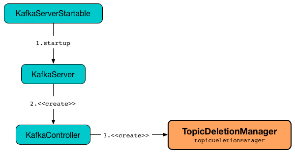

== [[TopicDeletionManager]] TopicDeletionManager

`TopicDeletionManager` is...FIXME

`TopicDeletionManager` is <<creating-instance, created>> exclusively when `KafkaController` is link:kafka-controller-KafkaController.adoc#topicDeletionManager[created].

.TopicDeletionManager is Created Alongside KafkaController


`TopicDeletionManager` is controlled by link:kafka-properties.adoc#delete.topic.enable[delete.topic.enable] Kafka property and does nothing when it is turned off (i.e. `false`).

[[internal-registries]]
.TopicDeletionManager's Internal Properties (e.g. Registries and Counters)
[cols="1,2",options="header",width="100%"]
|===
| Name
| Description

| [[partitionsToBeDeleted]] `partitionsToBeDeleted`
| `TopicAndPartitions` to be deleted

| [[topicsToBeDeleted]] `topicsToBeDeleted`
| The names of the topics to be deleted

| [[topicsIneligibleForDeletion]] `topicsIneligibleForDeletion`
| The names of the topics that must not be deleted (i.e. are ineligible for deletion)
|===

[[logIdent]]
`TopicDeletionManager` uses *[Topic Deletion Manager [brokerId]]* as the logging prefix (aka `logIdent`).

[[logging]]
[TIP]
====
Enable `INFO` logging level for `kafka.controller.TopicDeletionManager` logger to see what happens inside.

Add the following line to `config/log4j.properties`:

```
log4j.logger.kafka.controller.TopicDeletionManager=INFO
```

Refer to link:kafka-logging.adoc[Logging].
====

=== [[startReplicaDeletion]] `startReplicaDeletion` Internal Method

[source, scala]
----
startReplicaDeletion(replicasForTopicsToBeDeleted: Set[PartitionAndReplica]): Unit
----

`startReplicaDeletion`...FIXME

NOTE: `startReplicaDeletion` is used when...FIXME

=== [[enqueueTopicsForDeletion]] `enqueueTopicsForDeletion` Method

[source, scala]
----
enqueueTopicsForDeletion(topics: Set[String]): Unit
----

`enqueueTopicsForDeletion`...FIXME

NOTE: `enqueueTopicsForDeletion` is used when...FIXME

=== [[failReplicaDeletion]] `failReplicaDeletion` Method

[source, scala]
----
failReplicaDeletion(replicas: Set[PartitionAndReplica]): Unit
----

`failReplicaDeletion`...FIXME

NOTE: `failReplicaDeletion` is used when...FIXME

=== [[creating-instance]] Creating TopicDeletionManager Instance

`TopicDeletionManager` takes the following when created:

* [[controller]] link:kafka-controller-KafkaController.adoc[KafkaController]
* [[eventManager]] link:kafka-controller-ControllerEventManager.adoc[ControllerEventManager]

`TopicDeletionManager` initializes the <<internal-registries, internal registries and counters>>.

=== [[markTopicIneligibleForDeletion]] `markTopicIneligibleForDeletion` Method

[source, scala]
----
markTopicIneligibleForDeletion(topics: Set[String]): Unit
----

(only with link:kafka-properties.adoc#delete.topic.enable[delete.topic.enable] Kafka property enabled) `markTopicIneligibleForDeletion` computes the intersection between <<topicsToBeDeleted, topicsToBeDeleted>> and the input `topics` sets and adds the intersection to <<topicsIneligibleForDeletion, topicsIneligibleForDeletion>> set.

If there are any topics in the intersection, `markTopicIneligibleForDeletion` prints out the following INFO message to the logs:

```
Halted deletion of topics [newTopicsToHaltDeletion]
```

[NOTE]
====
`markTopicIneligibleForDeletion` is used when:

* `KafkaController` link:kafka-controller-KafkaController.adoc#initiateReassignReplicasForTopicPartition[initiateReassignReplicasForTopicPartition]

* `TopicDeletion` controller event is link:kafka-controller-ControllerEvent-TopicDeletion.adoc#partitionReassignmentInProgress[processed] (for topics to be deleted with partitions in `controllerContext.partitionsBeingReassigned` list)

* `TopicDeletionManager` does <<startReplicaDeletion, startReplicaDeletion>> and <<failReplicaDeletion, failReplicaDeletion>>
====

=== [[reset]] Reseting -- `reset` Method

[source, scala]
----
reset(): Unit
----

(only with link:kafka-properties.adoc#delete.topic.enable[delete.topic.enable] Kafka property enabled) `reset` removes all elements from the following internal registries:

* <<topicsToBeDeleted, topicsToBeDeleted>>
* <<partitionsToBeDeleted, partitionsToBeDeleted>>
* <<topicsIneligibleForDeletion, topicsIneligibleForDeletion>>

NOTE: `reset` does nothing when link:kafka-properties.adoc#delete.topic.enable[delete.topic.enable] Kafka property is `false`.

NOTE: `reset` is used exclusively when `KafkaController` link:kafka-controller-KafkaController.adoc#onControllerResignation[resigns as the active controller].

=== [[onTopicDeletion]] `onTopicDeletion` Internal Method

[source, scala]
----
onTopicDeletion(topics: Set[String]): Unit
----

`onTopicDeletion`...FIXME

NOTE: `onTopicDeletion` is used when...FIXME

=== [[completeDeleteTopic]] `completeDeleteTopic` Internal Method

[source, scala]
----
completeDeleteTopic(topic: String): Unit
----

`completeDeleteTopic`...FIXME

NOTE: `completeDeleteTopic` is used when...FIXME

=== [[init]] Initializing -- `init` Method

[source, scala]
----
init(
  initialTopicsToBeDeleted: Set[String],
  initialTopicsIneligibleForDeletion: Set[String]): Unit
----

`init`...FIXME

NOTE: `init` is used when...FIXME

=== [[tryTopicDeletion]] `tryTopicDeletion` Method

[source, scala]
----
tryTopicDeletion(): Unit
----

`tryTopicDeletion`...FIXME

NOTE: `tryTopicDeletion` is used when...FIXME

=== [[isTopicQueuedUpForDeletion]] `isTopicQueuedUpForDeletion` Method

[source, scala]
----
isTopicQueuedUpForDeletion(topic: String): Boolean
----

`isTopicQueuedUpForDeletion`...FIXME

NOTE: `isTopicQueuedUpForDeletion` is used when...FIXME

=== [[resumeDeletionForTopics]] `resumeDeletionForTopics` Method

[source, scala]
----
resumeDeletionForTopics(topics: Set[String] = Set.empty): Unit
----

`resumeDeletionForTopics`...FIXME

NOTE: `resumeDeletionForTopics` is used when...FIXME

=== [[completeReplicaDeletion]] `completeReplicaDeletion` Method

[source, scala]
----
completeReplicaDeletion(replicas: Set[PartitionAndReplica]): Unit
----

`completeReplicaDeletion`...FIXME

NOTE: `completeReplicaDeletion` is used when...FIXME

=== [[markTopicForDeletionRetry]] `markTopicForDeletionRetry` Internal Method

[source, scala]
----
markTopicForDeletionRetry(topic: String): Unit
----

`markTopicForDeletionRetry`...FIXME

NOTE: `markTopicForDeletionRetry` is used when...FIXME

=== [[retryDeletionForIneligibleReplicas]] `retryDeletionForIneligibleReplicas` Internal Method

[source, scala]
----
retryDeletionForIneligibleReplicas(topic: String): Unit
----

`retryDeletionForIneligibleReplicas`...FIXME

NOTE: `retryDeletionForIneligibleReplicas` is used when...FIXME
