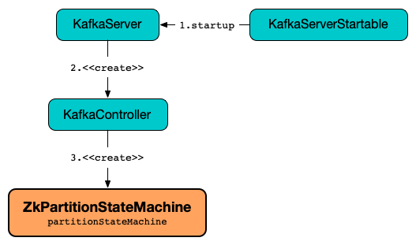

== [[ZkPartitionStateMachine]] ZkPartitionStateMachine

`ZkPartitionStateMachine` is a <<kafka-controller-PartitionStateMachine.adoc#, PartitionStateMachine>> (with a given <<controllerContext, ControllerContext>>) for link:kafka-controller-KafkaController.adoc#partitionStateMachine[KafkaController] (for every link:kafka-server-KafkaServer.adoc[KafkaServer]).

.ZkPartitionStateMachine and KafkaController


When requested to <<handleStateChanges, handle partition state changes>>, `ZkPartitionStateMachine` uses the <<controllerBrokerRequestBatch, ControllerBrokerRequestBatch>> to <<kafka-controller-AbstractControllerBrokerRequestBatch.adoc#sendRequestsToBrokers, propagate them to all brokers in a cluster>>.

[[logIdent]]
`ZkPartitionStateMachine` uses *[PartitionStateMachine controllerId=[brokerId]]* as the logging prefix (aka `logIdent`).

[[logging]]
[TIP]
====
Enable `ALL` logging levels for `kafka.controller.ZkPartitionStateMachine` logger to see what happens inside.

Add the following line to `config/log4j.properties`:

```
log4j.logger.kafka.controller.ZkPartitionStateMachine=ALL
```

Refer to <<kafka-logging.adoc#, Logging>>.
====

=== [[creating-instance]] Creating ZkPartitionStateMachine Instance

`ZkPartitionStateMachine` takes the following to be created:

* [[config]] link:kafka-server-KafkaConfig.adoc[KafkaConfig]
* [[stateChangeLogger]] link:kafka-controller-StateChangeLogger.adoc[StateChangeLogger]
* [[controllerContext]] link:kafka-controller-ControllerContext.adoc[ControllerContext]
* [[zkClient]] link:kafka-zk-KafkaZkClient.adoc[KafkaZkClient]
* [[controllerBrokerRequestBatch]] link:kafka-controller-ControllerBrokerRequestBatch.adoc[ControllerBrokerRequestBatch]

=== [[handleStateChanges]] Handling State Changes of Partitions -- `handleStateChanges` Method

[source, scala]
----
handleStateChanges(
  partitions: Seq[TopicPartition],
  targetState: PartitionState,
  partitionLeaderElectionStrategyOpt: Option[PartitionLeaderElectionStrategy]
): Map[TopicPartition, Throwable]
----

NOTE: `handleStateChanges` is part of the <<kafka-controller-PartitionStateMachine.adoc#handleStateChanges, PartitionStateMachine Contract>> to handle state changes of partitions (_partition state changes_).

`handleStateChanges` requests the <<controllerBrokerRequestBatch, ControllerBrokerRequestBatch>> to <<kafka-controller-AbstractControllerBrokerRequestBatch.adoc#newBatch, prepare a new batch>>.

`handleStateChanges` <<doHandleStateChanges, doHandleStateChanges>> (that may give some errors that are returned in the end).

In the end, `handleStateChanges` requests the <<controllerBrokerRequestBatch, ControllerBrokerRequestBatch>> to <<kafka-controller-AbstractControllerBrokerRequestBatch.adoc#sendRequestsToBrokers, send controller requests to brokers>> and returns the errors.

In case of `ControllerMovedException`, `handleStateChanges` prints out the following ERROR message to the logs:

```
Controller moved to another broker when moving some partitions to [targetState] state
```

In case of any other error (`Throwable`), `handleStateChanges` prints out the following ERROR message to the logs:

```
Error while moving some partitions to [targetState] state
```

=== [[doHandleStateChanges]] `doHandleStateChanges` Internal Method

[source, scala]
----
doHandleStateChanges(
  partitions: Seq[TopicPartition],
  targetState: PartitionState,
  partitionLeaderElectionStrategyOpt: Option[PartitionLeaderElectionStrategy]
): Map[TopicPartition, Throwable]
----

For every partition (in `partitions`), `doHandleStateChanges` requests the <<controllerContext, ControllerContext>> to <<kafka-controller-ControllerContext.adoc#putPartitionStateIfNotExists, putPartitionStateIfNotExists>> to `NonExistentPartition`.

`doHandleStateChanges` requests the <<controllerContext, ControllerContext>> to <<kafka-controller-ControllerContext.adoc#checkValidPartitionStateChange, checkValidPartitionStateChange>> (that gives valid and invalid partitions).

For every invalid partition, `doHandleStateChanges` <<logInvalidTransition, logInvalidTransition>>.

`doHandleStateChanges` branches off per the target state: <<doHandleStateChanges-NewPartition, NewPartition>>, <<doHandleStateChanges-OnlinePartition, OnlinePartition>>, <<doHandleStateChanges-OfflinePartition, OfflinePartition>>, and <<NonExistentPartition, NonExistentPartition>>.

In the end, `doHandleStateChanges` returns the partitions with election failed (for `OnlinePartition` target state and the valid partitions in `OfflinePartition` or `OnlinePartition` states).

NOTE: `doHandleStateChanges` is used exclusively when `ZkPartitionStateMachine` is requested to <<handleStateChanges, handle partition state changes>>.

==== [[doHandleStateChanges-NewPartition]] NewPartition

For `NewPartition` target state, `doHandleStateChanges` goes over the valid partitions and for every partition prints out the following TRACE message to the logs and requests the <<controllerContext, ControllerContext>> to <<kafka-controller-ControllerContext.adoc#putPartitionState, putPartitionState>> to `NewPartition` state.

[options="wrap"]
----
Changed partition [partition] state from [state] to NewPartition with assigned replicas [partitionReplicaAssignment]
----

==== [[doHandleStateChanges-OnlinePartition]] OnlinePartition (and Partition Leader Election)

For `OnlinePartition` target state, `doHandleStateChanges` splits valid partitions into two collections. One partition set (`uninitializedPartitions`) with partitions in `NewPartition` state while the other with partitions in `OfflinePartition` or `OnlinePartition` states (`partitionsToElectLeader`).

For the partitions in `NewPartition` state (uninitialized valid partitions), `doHandleStateChanges` <<initializeLeaderAndIsrForPartitions, initializeLeaderAndIsrForPartitions>> (that gives partitions successfully initialized, aka _successfulInitializations_). For every partition successfully initialized, `doHandleStateChanges` prints out the following TRACE message to the logs and requests the <<controllerContext, ControllerContext>> to <<kafka-controller-ControllerContext.adoc#putPartitionState, putPartitionState>> to `OnlinePartition` state.

[options="wrap"]
----
Changed partition [partition] from [state] to OnlinePartition with state [leaderAndIsr]
----

For partitions to elect leader (valid partitions in `OfflinePartition` or `OnlinePartition` states), `doHandleStateChanges` <<electLeaderForPartitions, electLeaderForPartitions>> (with the partitions and the `PartitionLeaderElectionStrategy`). That gives two sets of partitions with election successful and failed. For every partition with election successful, `doHandleStateChanges` prints out the following TRACE message to the logs and requests the <<controllerContext, ControllerContext>> to <<kafka-controller-ControllerContext.adoc#putPartitionState, putPartitionState>> to `OnlinePartition` state.

[options="wrap"]
----
Changed partition [partition] from [state] to OnlinePartition with state [leaderAndIsr]
----

In the end, `doHandleStateChanges` returns the partitions with election failed.

==== [[doHandleStateChanges-OfflinePartition]] OfflinePartition

For `OfflinePartition` target state, `doHandleStateChanges` goes over the valid partitions and for every partition prints out the following TRACE message to the logs and requests the <<controllerContext, ControllerContext>> to <<kafka-controller-ControllerContext.adoc#putPartitionState, putPartitionState>> to `OfflinePartition` state.

```
Changed partition [partition] state from [state] to OfflinePartition
```

==== [[doHandleStateChanges-NonExistentPartition]] NonExistentPartition

For `NonExistentPartition` target state, `doHandleStateChanges` goes over the valid partitions and for every partition prints out the following TRACE message to the logs and requests the <<controllerContext, ControllerContext>> to <<kafka-controller-ControllerContext.adoc#putPartitionState, putPartitionState>> to `NonExistentPartition` state.

```
Changed partition [partition] state from [state] to NonExistentPartition
```

=== [[initializeLeaderAndIsrForPartitions]] `initializeLeaderAndIsrForPartitions` Internal Method

[source, scala]
----
initializeLeaderAndIsrForPartitions(
  partitions: Seq[TopicPartition]): Seq[TopicPartition]
----

`initializeLeaderAndIsrForPartitions` starts by requesting the <<controllerContext, ControllerContext>> for the <<kafka-controller-ControllerContext.adoc#partitionReplicaAssignment, partition replica assignment>> for every partition (in the given `partitions`).

From the partition replica assignments, `initializeLeaderAndIsrForPartitions` makes sure that the replicas are all <<kafka-controller-ControllerContext.adoc#isReplicaOnline, online>> only (per the <<controllerContext, ControllerContext>>) so all other partitions are filtered out (_excluded_).

`initializeLeaderAndIsrForPartitions` splits the partitions (with online replicas only) into two sets with and without replicas (`partitionsWithLiveReplicas` and `partitionsWithoutLiveReplicas`, respectively).

For every partition without live (online) replicas, `initializeLeaderAndIsrForPartitions` <<logFailedStateChange, prints out the following ERROR message and the StateChangeFailedException to the logs>>:

[options="wrap"]
----
Controller [controllerId] epoch [epoch] failed to change state for partition [partition] from NewPartition to OnlinePartition
----

[options="wrap"]
----
Controller [controllerId] epoch [epoch] encountered error during state change of partition [partition] from New to Online, assigned replicas are [[replicas]], live brokers are [[liveBrokerIds]]. No assigned replica is alive.
----

`initializeLeaderAndIsrForPartitions` converts the partitions with live (online) replicas into `leaderIsrAndControllerEpochs` (`LeaderIsrAndControllerEpoch` with `LeaderAndIsr`) and for every pair `initializeLeaderAndIsrForPartitions` requests the <<zkClient, KafkaZkClient>> to <<kafka-zk-KafkaZkClient.adoc#createTopicPartitionStatesRaw, create state znodes for the partitions>>.

For every successful response (from <<kafka-zk-KafkaZkClient.adoc#createTopicPartitionStatesRaw, creating partition state znodes>>), `initializeLeaderAndIsrForPartitions` requests the following:

. The <<controllerContext, ControllerContext>> to record the `leaderIsrAndControllerEpoch` for the partition (in the <<kafka-controller-ControllerContext.adoc#partitionLeadershipInfo, partitionLeadershipInfo>> registry)

. The <<controllerBrokerRequestBatch, ControllerBrokerRequestBatch>> to <<kafka-controller-AbstractControllerBrokerRequestBatch.adoc#addLeaderAndIsrRequestForBrokers, addLeaderAndIsrRequestForBrokers>> (with `isNew` flag on)

In the end, `initializeLeaderAndIsrForPartitions` returns the partitions that were successfully initialized.

In case of `ControllerMovedException` (while...FIXME), `initializeLeaderAndIsrForPartitions`...FIXME

In case of any other error (`Exception`) (while...FIXME), `initializeLeaderAndIsrForPartitions`...FIXME

NOTE: `initializeLeaderAndIsrForPartitions` is used exclusively when `ZkPartitionStateMachine` is requested to <<doHandleStateChanges, handle partition state changes>> (for <<doHandleStateChanges-OnlinePartition, partitions in NewPartition state that are transitioned to OnlinePartition target state>>).

=== [[electLeaderForPartitions]] `electLeaderForPartitions` Internal Method

[source, scala]
----
electLeaderForPartitions(
  partitions: Seq[TopicPartition],
  partitionLeaderElectionStrategy: PartitionLeaderElectionStrategy
): (Seq[TopicPartition], Map[TopicPartition, Throwable])
----

`electLeaderForPartitions` simply <<doElectLeaderForPartitions, doElectLeaderForPartitions>> until all the given partitions have partition leaders elected successfully or not.

For every failed election, `electLeaderForPartitions` <<logFailedStateChange, prints out the following ERROR message (with an exception) to the logs>>:

[options="wrap"]
----
Controller [controllerId] epoch [epoch] failed to change state for partition [partition] from [state] to OnlinePartition
----

In the end, `electLeaderForPartitions` returns the partitions with leader election successful and failed.

NOTE: `electLeaderForPartitions` is used when `ZkPartitionStateMachine` is requested to <<doHandleStateChanges, handle partition state changes>> (when the partitions are expected in `OnlinePartition` target state).

=== [[doElectLeaderForPartitions]] `doElectLeaderForPartitions` Internal Method

[source, scala]
----
doElectLeaderForPartitions(
  partitions: Seq[TopicPartition],
  partitionLeaderElectionStrategy: PartitionLeaderElectionStrategy
): (Seq[TopicPartition], Seq[TopicPartition], Map[TopicPartition, Exception])
----

`doElectLeaderForPartitions` requests the <<zkClient, KafkaZkClient>> for the <<kafka-zk-KafkaZkClient.adoc#getTopicPartitionStatesRaw, partition states>> and converts them to `LeaderIsrAndControllerEpoch` per partition.

`doElectLeaderForPartitions` collects the partitions that are eligible for partition election (that have controller epoch older than the <<kafka-controller-ControllerContext.adoc#epoch, current controller epoch>> per the <<controllerContext, ControllerContext>>).

`doElectLeaderForPartitions` branches off per the <<kafka-controller-PartitionStateMachine.adoc#PartitionLeaderElectionStrategy, PartitionLeaderElectionStrategy>> and ends up with partitions with and without leaders:

* For <<kafka-controller-PartitionStateMachine.adoc#OfflinePartitionLeaderElectionStrategy, OfflinePartitionLeaderElectionStrategy>>, `doElectLeaderForPartitions` first <<collectUncleanLeaderElectionState, collectUncleanLeaderElectionState>> with the valid partitions for election followed by <<leaderForOffline, leaderForOffline>>.

* For <<kafka-controller-PartitionStateMachine.adoc#ReassignPartitionLeaderElectionStrategy, ReassignPartitionLeaderElectionStrategy>>, `doElectLeaderForPartitions` <<leaderForReassign, leaderForReassign>>

* For <<kafka-controller-PartitionStateMachine.adoc#PreferredReplicaPartitionLeaderElectionStrategy, PreferredReplicaPartitionLeaderElectionStrategy>>, `doElectLeaderForPartitions` <<leaderForPreferredReplica, leaderForPreferredReplica>>

* For <<kafka-controller-PartitionStateMachine.adoc#ControlledShutdownPartitionLeaderElectionStrategy, ControlledShutdownPartitionLeaderElectionStrategy>>, `doElectLeaderForPartitions` <<leaderForControlledShutdown, leaderForControlledShutdown>>

`doElectLeaderForPartitions` requests the <<zkClient, KafkaZkClient>> to <<kafka-zk-KafkaZkClient.adoc#updateLeaderAndIsr, updateLeaderAndIsr>> (with the adjusted leader and ISRs).

For every successfully-updated partition (in <<kafka-zk-KafkaZkClient.adoc#updateLeaderAndIsr, Zookeeper>>), `doElectLeaderForPartitions` requests the following:

. The <<controllerContext, ControllerContext>> to record the `leaderIsrAndControllerEpoch` for the partition (in the <<kafka-controller-ControllerContext.adoc#partitionLeadershipInfo, partitionLeadershipInfo>> registry)

. The <<controllerBrokerRequestBatch, ControllerBrokerRequestBatch>> to <<kafka-controller-AbstractControllerBrokerRequestBatch.adoc#addLeaderAndIsrRequestForBrokers, addLeaderAndIsrRequestForBrokers>> to every live replica broker (with `isNew` flag off)

In the end, `doElectLeaderForPartitions` returns the partitions that were successfully updated, to be updated again and failed (during election and update).

NOTE: `doElectLeaderForPartitions` is used when `ZkPartitionStateMachine` is requested to <<electLeaderForPartitions, electLeaderForPartitions>>.

=== [[collectUncleanLeaderElectionState]] `collectUncleanLeaderElectionState` Internal Method

[source, scala]
----
collectUncleanLeaderElectionState(
  leaderIsrAndControllerEpochs: Seq[(TopicPartition, LeaderIsrAndControllerEpoch)]
): Seq[(TopicPartition, Option[LeaderIsrAndControllerEpoch], Boolean)]
----

`collectUncleanLeaderElectionState`...FIXME

NOTE: `collectUncleanLeaderElectionState` is used when `ZkPartitionStateMachine` is requested to <<doElectLeaderForPartitions, doElectLeaderForPartitions>> (for <<kafka-controller-PartitionStateMachine.adoc#OfflinePartitionLeaderElectionStrategy, OfflinePartitionLeaderElectionStrategy>>).

=== [[logInvalidTransition]] `logInvalidTransition` Internal Method

[source, scala]
----
logInvalidTransition(
  partition: TopicPartition,
  targetState: PartitionState): Unit
----

`logInvalidTransition`...FIXME

NOTE: `logInvalidTransition` is used exclusively when `ZkPartitionStateMachine` is requested to <<doHandleStateChanges, doHandleStateChanges>> (for invalid partitions).

=== [[logFailedStateChange]] Printing Out ERROR Message to Logs -- `logFailedStateChange` Internal Method

[source, scala]
----
logFailedStateChange(
  partition: TopicPartition,
  currState: PartitionState,
  targetState: PartitionState,
  code: Code): Unit // <1>
logFailedStateChange(
  partition: TopicPartition,
  currState: PartitionState,
  targetState: PartitionState,
  t: Throwable): Unit
----
<1> Converts the code to a `KeeperException`

`logFailedStateChange` simply prints out the following ERROR message to the logs:

[options="wrap"]
----
Controller [controllerId] epoch [epoch] failed to change state for partition [partition] from [currState] to [targetState]
----

NOTE: `logFailedStateChange` is used when `ZkPartitionStateMachine` is requested to <<initializeLeaderAndIsrForPartitions, initializeLeaderAndIsrForPartitions>>, <<electLeaderForPartitions, electLeaderForPartitions>>, <<collectUncleanLeaderElectionState, collectUncleanLeaderElectionState>>, and <<logInvalidTransition, logInvalidTransition>>.

=== [[partitionState]] `partitionState` Internal Method

[source, scala]
----
partitionState(
  partition: TopicPartition): PartitionState
----

`partitionState`...FIXME

NOTE: `partitionState` is used when...FIXME

=== [[leaderForOffline]] `leaderForOffline` Method

[source, scala]
----
leaderForOffline(
  controllerContext: ControllerContext,
  partitionsWithUncleanLeaderElectionState: Seq[(TopicPartition, Option[LeaderIsrAndControllerEpoch], Boolean)]
): Seq[ElectionResult]
// Private API
leaderForOffline(
  partition: TopicPartition,
  leaderIsrAndControllerEpochOpt: Option[LeaderIsrAndControllerEpoch],
  uncleanLeaderElectionEnabled: Boolean,
  controllerContext: ControllerContext
): ElectionResult
----

`leaderForOffline`...FIXME

NOTE: `leaderForOffline` is used when...FIXME

=== [[leaderForReassign]] `leaderForReassign` Method

[source, scala]
----
leaderForReassign(
  controllerContext: ControllerContext,
  leaderIsrAndControllerEpochs: Seq[(TopicPartition, LeaderIsrAndControllerEpoch)]
): Seq[ElectionResult]
// Private API
leaderForReassign(
  partition: TopicPartition,
  leaderIsrAndControllerEpoch: LeaderIsrAndControllerEpoch,
  controllerContext: ControllerContext
): ElectionResult
----

`leaderForReassign`...FIXME

NOTE: `leaderForReassign` is used when...FIXME

=== [[leaderForPreferredReplica]] `leaderForPreferredReplica` Method

[source, scala]
----
leaderForPreferredReplica(
  controllerContext: ControllerContext,
  leaderIsrAndControllerEpochs: Seq[(TopicPartition, LeaderIsrAndControllerEpoch)]
): Seq[ElectionResult]
// Private API
leaderForPreferredReplica(
  partition: TopicPartition,
  leaderIsrAndControllerEpoch: LeaderIsrAndControllerEpoch,
  controllerContext: ControllerContext
): ElectionResult
----

`leaderForPreferredReplica`...FIXME

NOTE: `leaderForPreferredReplica` is used when...FIXME

=== [[leaderForControlledShutdown]] `leaderForControlledShutdown` Method

[source, scala]
----
leaderForControlledShutdown(
  controllerContext: ControllerContext,
  leaderIsrAndControllerEpochs: Seq[(TopicPartition, LeaderIsrAndControllerEpoch)]
): Seq[ElectionResult]
// Private API
leaderForControlledShutdown(
  partition: TopicPartition,
  leaderIsrAndControllerEpoch: LeaderIsrAndControllerEpoch,
  shuttingDownBrokerIds: Set[Int],
  controllerContext: ControllerContext
): ElectionResult
----

`leaderForControlledShutdown`...FIXME

NOTE: `leaderForControlledShutdown` is used when...FIXME
