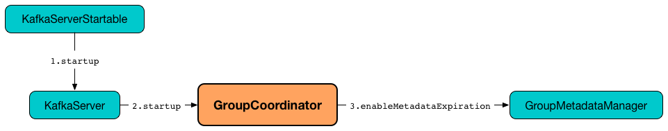

== [[GroupCoordinator]] GroupCoordinator

`GroupCoordinator` is used (in <<kafka-server-KafkaApis.adoc#, KafkaApis>>) for <<handleGroupImmigration, handleGroupImmigration>>, <<handleGroupEmigration, handleGroupEmigration>>, <<handleDeletedPartitions, handleDeletedPartitions>>, <<handleCommitOffsets, handleCommitOffsets>>, <<handleFetchOffsets, handleFetchOffsets>>, <<handleDescribeGroup, handleDescribeGroup>>, <<handleListGroups, handleListGroups>>, <<handleJoinGroup, handleJoinGroup>>, <<handleSyncGroup, handleSyncGroup>>, <<handleDeleteGroups, handleDeleteGroups>>, <<handleLeaveGroup, handleLeaveGroup>>, <<handleHeartbeat, handleHeartbeat>>, <<handleTxnCommitOffsets, handleTxnCommitOffsets>> and <<scheduleHandleTxnCompletion, scheduleHandleTxnCompletion>> (that all simply request the <<groupManager, GroupMetadataManager>> to handle them).

`GroupCoordinator` is also used for <<partitionFor, partitionFor>>.

`GroupCoordinator` is <<apply, created>> and immediately <<startup, started>> when `KafkaServer` is requested to <<kafka-server-KafkaServer.adoc#startup, start up>> for the only purpose of creating the <<kafka-server-KafkaApis.adoc#groupCoordinator, KafkaApis>>.

.GroupCoordinator's Startup


[[isActive]]
`GroupCoordinator` manages the <<groupManager, GroupMetadataManager>>. `GroupCoordinator` uses `isActive` flag to control whether the <<groupManager, GroupMetadataManager>> was requested to <<kafka-coordinator-group-GroupMetadataManager.adoc#startup, start up>> (when `GroupCoordinator` <<startup, was>>) that is used in <<handleListGroups, handleListGroups>> and <<validateGroupStatus, validateGroupStatus>>.

[[logIdent]]
`GroupCoordinator` uses *[GroupCoordinator [brokerId]]* as the logging prefix (aka `logIdent`).

[[logging]]
[TIP]
====
Enable `DEBUG` logging level for `kafka.coordinator.group.GroupCoordinator` logger to see what happens inside.

Add the following line to `config/log4j.properties`:

```
log4j.logger.kafka.coordinator.group.GroupCoordinator=DEBUG
```

Refer to link:kafka-logging.adoc[Logging].
====

=== [[apply]] Creating GroupCoordinator Instance -- `apply` Factory Method

[source, scala]
----
apply(
  config: KafkaConfig,
  zkClient: KafkaZkClient,
  replicaManager: ReplicaManager,
  time: Time): GroupCoordinator // <1>
apply(
  config: KafkaConfig,
  zkClient: KafkaZkClient,
  replicaManager: ReplicaManager,
  heartbeatPurgatory: DelayedOperationPurgatory[DelayedHeartbeat],
  joinPurgatory: DelayedOperationPurgatory[DelayedJoin],
  time: Time): GroupCoordinator
----
<1> Creates a `DelayedOperationPurgatory` and a `DelayedOperationPurgatory`

`apply`...FIXME

NOTE: `apply` is used exclusively when `KafkaServer` is requested to <<kafka-server-KafkaServer.adoc#startup, start up>>.

=== [[creating-instance]] Creating GroupCoordinator Instance

`GroupCoordinator` takes the following to be created:

* [[brokerId]] Broker ID
* [[groupConfig]] `GroupConfig`
* [[offsetConfig]] link:kafka-OffsetConfig.adoc[OffsetConfig]
* [[groupManager]] <<kafka-coordinator-group-GroupMetadataManager.adoc#, GroupMetadataManager>>
* [[heartbeatPurgatory]] `DelayedOperationPurgatory[DelayedHeartbeat]`
* [[joinPurgatory]] `DelayedOperationPurgatory[DelayedJoin]`
* [[time]] `Time`

`GroupCoordinator` initializes the <<internal-registries, internal registries and counters>>.

=== [[startup]] Starting Up -- `startup` Method

[source, scala]
----
startup(enableMetadataExpiration: Boolean = true): Unit
----

`startup` first prints out the following INFO message to the logs:

```
Starting up.
```

`startup` requests the <<groupManager, GroupMetadataManager>> to <<kafka-coordinator-group-GroupMetadataManager.adoc#startup, startup>> (with the given `enableMetadataExpiration` flag).

`startup` turns the <<isActive, isActive>> internal flag on.

In the end, `startup` prints out the following INFO message to the logs:

```
Startup complete.
```

NOTE: `startup` is used exclusively when `KafkaServer` is requested to <<kafka-server-KafkaServer.adoc#startup, start up>>.

=== [[partitionFor]] `partitionFor` Method

[source, scala]
----
partitionFor(group: String): Int
----

`partitionFor` simply requests the <<groupManager, GroupMetadataManager>> to <<kafka-coordinator-group-GroupMetadataManager.adoc#partitionFor, partitionFor>> the given `group` ID.

[NOTE]
====
`partitionFor` is used when:

* `KafkaApis` is requested to handle an <<kafka-server-KafkaApis.adoc#handleAddOffsetsToTxnRequest, AddOffsetsToTxn>> and <<kafka-server-KafkaApis.adoc#handleFindCoordinatorRequest, FindCoordinatorRequest>> requests

* `GroupCoordinator` is requested to <<prepareRebalance, prepareRebalance>> and <<onCompleteJoin, onCompleteJoin>>
====

=== [[handleCommitOffsets]] `handleCommitOffsets` Method

[source, scala]
----
handleCommitOffsets(
  groupId: String,
  memberId: String,
  generationId: Int,
  offsetMetadata: immutable.Map[TopicPartition, OffsetAndMetadata],
  responseCallback: immutable.Map[TopicPartition, Errors] => Unit): Unit
----

`handleCommitOffsets` firstly <<validateGroupStatus, validateGroupStatus>> (for the given `groupId` and `OFFSET_COMMIT` API key).

`handleCommitOffsets` requests the <<groupManager, GroupMetadataManager>> to <<kafka-coordinator-group-GroupMetadataManager.adoc#getGroup, get the metadata of the group>> (by the given `groupId`) and then <<doCommitOffsets, doCommitOffsets>>.

If the <<groupManager, GroupMetadataManager>> could not <<kafka-coordinator-group-GroupMetadataManager.adoc#getGroup, getGroup>>, `handleCommitOffsets`...FIXME

In case of an error while <<validateGroupStatus, validateGroupStatus>>, `handleCommitOffsets`...FIXME

NOTE: `handleCommitOffsets` is used exclusively when `KafkaApis` is requested to <<kafka-server-KafkaApis.adoc#handleOffsetCommitRequest, handle an OffsetCommitRequest>>.

=== [[doCommitOffsets]] `doCommitOffsets` Internal Method

[source, scala]
----
doCommitOffsets(
  group: GroupMetadata,
  memberId: String,
  generationId: Int,
  producerId: Long,
  producerEpoch: Short,
  offsetMetadata: immutable.Map[TopicPartition, OffsetAndMetadata],
  responseCallback: immutable.Map[TopicPartition, Errors] => Unit): Unit
----

`doCommitOffsets`...FIXME

NOTE: `doCommitOffsets` is used when `GroupCoordinator` is requested to <<handleTxnCommitOffsets, handleTxnCommitOffsets>> and <<handleCommitOffsets, handleCommitOffsets>>.

=== [[onCompleteJoin]] `onCompleteJoin` Method

[source, scala]
----
onCompleteJoin(group: GroupMetadata): Unit
----

`onCompleteJoin`...FIXME

NOTE: `onCompleteJoin` is used exclusively when `DelayedJoin` delayed operation is requested to `onComplete`.

=== [[doSyncGroup]] `doSyncGroup` Internal Method

[source, scala]
----
doSyncGroup(
  group: GroupMetadata,
  generationId: Int,
  memberId: String,
  groupAssignment: Map[String, Array[Byte]],
  responseCallback: SyncCallback): Unit
----

`doSyncGroup`...FIXME

NOTE: `doSyncGroup` is used when...FIXME

=== [[handleDescribeGroup]] `handleDescribeGroup` Method

[source, scala]
----
handleDescribeGroup(groupId: String): (Errors, GroupSummary)
----

`handleDescribeGroup`...FIXME

NOTE: `handleDescribeGroup` is used exclusively when `KafkaApis` is requested to <<kafka-server-KafkaApis.adoc#handleDescribeGroupRequest, handleDescribeGroupRequest>>.

=== [[handleGroupImmigration]] `handleGroupImmigration` Method

[source, scala]
----
handleGroupImmigration(offsetTopicPartitionId: Int): Unit
----

`handleGroupImmigration` simply requests the <<groupManager, GroupMetadataManager>> to <<kafka-coordinator-group-GroupMetadataManager.adoc#scheduleLoadGroupAndOffsets, scheduleLoadGroupAndOffsets>> (for the given offset and with the <<onGroupLoaded, onGroupLoaded>> callback)

NOTE: `handleGroupImmigration` is used exclusively when `KafkaApis` is requested to handle a <<kafka-server-KafkaApis.adoc#handleLeaderAndIsrRequest, LeaderAndIsrRequest>>.

=== [[handleGroupEmigration]] `handleGroupEmigration` Method

[source, scala]
----
handleGroupEmigration(offsetTopicPartitionId: Int): Unit
----

`handleGroupEmigration` simply requests the <<groupManager, GroupMetadataManager>> to <<kafka-coordinator-group-GroupMetadataManager.adoc#removeGroupsForPartition, removeGroupsForPartition>> (for the given offset and with the <<onGroupUnloaded, onGroupUnloaded>> callback).

NOTE: `handleGroupEmigration` is used when `KafkaApis` is requested to handle a <<kafka-server-KafkaApis.adoc#handleLeaderAndIsrRequest, LeaderAndIsrRequest>> and a <<kafka-server-KafkaApis.adoc#handleStopReplicaRequest, StopReplicaRequest>>.

=== [[handleDeletedPartitions]] Handling Deleted Partitions -- `handleDeletedPartitions` Method

[source, scala]
----
handleDeletedPartitions(
  topicPartitions: Seq[TopicPartition]): Unit
----

`handleDeletedPartitions` simply requests the <<groupManager, GroupMetadataManager>> to <<kafka-coordinator-group-GroupMetadataManager.adoc#cleanupGroupMetadata, cleanupGroupMetadata>> and...FIXME

NOTE: `handleDeletedPartitions` is used when...FIXME

=== [[handleFetchOffsets]] `handleFetchOffsets` Method

[source, scala]
----
handleFetchOffsets(
  groupId: String,
  partitions: Option[Seq[TopicPartition]] = None):
(Errors, Map[TopicPartition, OffsetFetchResponse.PartitionData])
----

`handleFetchOffsets`...FIXME

NOTE: `handleFetchOffsets` is used when...FIXME

=== [[handleListGroups]] `handleListGroups` Method

[source, scala]
----
handleListGroups(): (Errors, List[GroupOverview])
----

`handleListGroups`...FIXME

NOTE: `handleListGroups` is used when...FIXME

=== [[handleJoinGroup]] `handleJoinGroup` Method

[source, scala]
----
handleJoinGroup(
  groupId: String,
  memberId: String,
  clientId: String,
  clientHost: String,
  rebalanceTimeoutMs: Int,
  sessionTimeoutMs: Int,
  protocolType: String,
  protocols: List[(String, Array[Byte])],
  responseCallback: JoinCallback): Unit
----

`handleJoinGroup` starts by <<validateGroupStatus, validating the status>> of the group and the coordinator itself. In case of an error, `handleJoinGroup` uses the given `JoinCallback` to report it back and returns.

`handleJoinGroup` validates the group configuration, namely the given `sessionTimeoutMs`. In case of an error, `handleJoinGroup` uses the given `JoinCallback` to report a `INVALID_SESSION_TIMEOUT` error back and returns.

`handleJoinGroup` requests the <<groupManager, GroupMetadataManager>> to <<kafka-coordinator-group-GroupMetadataManager.adoc#getGroup, getGroup>> by the given `groupId`.

If the group could not be found and the given `memberId` is defined (i.e. not empty), `handleJoinGroup` uses the given `JoinCallback` to report a `UNKNOWN_MEMBER_ID` error back and returns.

If the group could not be found and the given `memberId` is undefined (i.e. empty) or simply the group is available, `handleJoinGroup` requests the <<groupManager, GroupMetadataManager>> to <<kafka-coordinator-group-GroupMetadataManager.adoc#addGroup, addGroup>> followed by <<doJoinGroup, doJoinGroup>>.

NOTE: `handleJoinGroup` is used exclusively when `KafkaApis` is requested to <<kafka-server-KafkaApis.adoc#handleJoinGroupRequest, handle a JoinGroupRequest>>.

=== [[handleSyncGroup]] `handleSyncGroup` Method

[source, scala]
----
handleSyncGroup(
  groupId: String,
  generation: Int,
  memberId: String,
  groupAssignment: Map[String, Array[Byte]],
  responseCallback: SyncCallback): Unit
----

`handleSyncGroup`...FIXME

NOTE: `handleSyncGroup` is used when...FIXME

=== [[handleDeleteGroups]] `handleDeleteGroups` Method

[source, scala]
----
handleDeleteGroups(groupIds: Set[String]): Map[String, Errors]
----

`handleDeleteGroups`...FIXME

NOTE: `handleDeleteGroups` is used when...FIXME

=== [[handleHeartbeat]] `handleHeartbeat` Method

[source, scala]
----
handleHeartbeat(
  groupId: String,
  memberId: String,
  generationId: Int,
  responseCallback: Errors => Unit)
----

`handleHeartbeat`...FIXME

NOTE: `handleHeartbeat` is used when...FIXME

=== [[handleLeaveGroup]] `handleLeaveGroup` Method

[source, scala]
----
handleLeaveGroup(
  groupId: String,
  memberId: String,
  responseCallback: Errors => Unit): Unit
----

`handleLeaveGroup`...FIXME

NOTE: `handleLeaveGroup` is used when...FIXME

=== [[scheduleHandleTxnCompletion]] `scheduleHandleTxnCompletion` Method

[source, scala]
----
scheduleHandleTxnCompletion(
  producerId: Long,
  offsetsPartitions: Iterable[TopicPartition],
  transactionResult: TransactionResult): Unit
----

`scheduleHandleTxnCompletion`...FIXME

NOTE: `scheduleHandleTxnCompletion` is used exclusively when `KafkaApis` is requested to <<kafka-server-KafkaApis.adoc#handleWriteTxnMarkersRequest, handleWriteTxnMarkersRequest>>.

=== [[handleTxnCommitOffsets]] `handleTxnCommitOffsets` Method

[source, scala]
----
handleTxnCommitOffsets(
  groupId: String,
  producerId: Long,
  producerEpoch: Short,
  offsetMetadata: immutable.Map[TopicPartition, OffsetAndMetadata],
  responseCallback: immutable.Map[TopicPartition, Errors] => Unit): Unit
----

`handleTxnCommitOffsets`...FIXME

NOTE: `handleTxnCommitOffsets` is used when...FIXME

=== [[onGroupLoaded]] `onGroupLoaded` Internal Callback

[source, scala]
----
onGroupLoaded(group: GroupMetadata): Unit
----

`onGroupLoaded`...FIXME

NOTE: `onGroupLoaded` is used when...FIXME

=== [[onGroupUnloaded]] `onGroupUnloaded` Internal Callback

[source, scala]
----
onGroupUnloaded(group: GroupMetadata): Unit
----

`onGroupUnloaded`...FIXME

NOTE: `onGroupUnloaded` is used when...FIXME

=== [[validateGroupStatus]] Validating Group Status -- `validateGroupStatus` Internal Method

[source, scala]
----
validateGroupStatus(groupId: String, api: ApiKeys): Option[Errors]
----

`validateGroupStatus`...FIXME

NOTE: `validateGroupStatus` is used when...FIXME

=== [[doJoinGroup]] `doJoinGroup` Internal Method

[source, scala]
----
doJoinGroup(
  group: GroupMetadata,
  memberId: String,
  clientId: String,
  clientHost: String,
  rebalanceTimeoutMs: Int,
  sessionTimeoutMs: Int,
  protocolType: String,
  protocols: List[(String, Array[Byte])],
  responseCallback: JoinCallback): Unit
----

`doJoinGroup`...FIXME

NOTE: `doJoinGroup` is used exclusively when `GroupCoordinator` is requested to <<handleJoinGroup, handleJoinGroup>>.

=== [[prepareRebalance]] `prepareRebalance` Internal Method

[source, scala]
----
prepareRebalance(group: GroupMetadata, reason: String): Unit
----

`prepareRebalance`...FIXME

NOTE: `prepareRebalance` is used exclusively when `GroupCoordinator` is requested to <<maybePrepareRebalance, maybePrepareRebalance>>.

=== [[maybePrepareRebalance]] `maybePrepareRebalance` Internal Method

[source, scala]
----
maybePrepareRebalance(group: GroupMetadata, reason: String): Unit
----

`maybePrepareRebalance`...FIXME

NOTE: `maybePrepareRebalance` is used exclusively when `GroupCoordinator` is requested to...FIXME

=== [[addMemberAndRebalance]] `addMemberAndRebalance` Internal Method

[source, scala]
----
addMemberAndRebalance(
  rebalanceTimeoutMs: Int,
  sessionTimeoutMs: Int,
  clientId: String,
  clientHost: String,
  protocolType: String,
  protocols: List[(String, Array[Byte])],
  group: GroupMetadata,
  callback: JoinCallback): MemberMetadata
----

`addMemberAndRebalance`...FIXME

NOTE: `addMemberAndRebalance` is used exclusively when `GroupCoordinator` is requested to <<doJoinGroup, doJoinGroup>>.

=== [[removeMemberAndUpdateGroup]] `removeMemberAndUpdateGroup` Internal Method

[source, scala]
----
removeMemberAndUpdateGroup(
  group: GroupMetadata,
  member: MemberMetadata,
  reason: String): Unit
----

`removeMemberAndUpdateGroup`...FIXME

NOTE: `removeMemberAndUpdateGroup` is used when `GroupCoordinator` is requested to <<handleLeaveGroup, handleLeaveGroup>> and <<onExpireHeartbeat, onExpireHeartbeat>>.

=== [[onExpireHeartbeat]] `onExpireHeartbeat` Method

[source, scala]
----
onExpireHeartbeat(
  group: GroupMetadata,
  member: MemberMetadata,
  heartbeatDeadline: Long): Unit
----

`onExpireHeartbeat`...FIXME

NOTE: `onExpireHeartbeat` is used exclusively when `DelayedHeartbeat` is requested to `onExpiration`.

=== [[offsetsTopicConfigs]] `offsetsTopicConfigs` Method

[source, scala]
----
offsetsTopicConfigs: Properties
----

`offsetsTopicConfigs`...FIXME

NOTE: `offsetsTopicConfigs` is used when...FIXME
