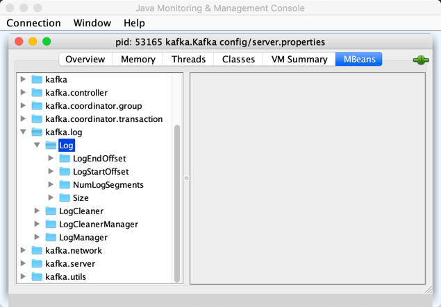

== [[Log]] Partition Log -- Collection Of Log Segments

`Log` represents a *log* of a partition of a topic.

`Log` is a collection of <<segments, LogSegments>> that are stored on disk in a given <<dir, partition log directory>> with the <<parseTopicPartitionName, name>> of the form *topic-partition* or *topic-partition.uniqueId-delete* (if marked for deletion).

While <<creating-instance, being created>>, `Log` creates the <<dir, log directory>> unless available already.

`Log` is <<apply, created>> when `LogManager` is requested to:

* <<kafka-log-LogManager.adoc#loadLog, Load a partition log (directory)>> (while being <<kafka-log-LogManager.adoc#creating-instance, created>> which is when `KafkaServer` is requested to <<kafka-server-KafkaServer.adoc#startup, start up>>)

* <<kafka-log-LogManager.adoc#getOrCreateLog, Look up or create a partition log>> (when `Partition` is requested to <<kafka-cluster-Partition.adoc#getOrCreateReplica, getOrCreateReplica>>)

[[CleanShutdownFile]]
`Log` uses *.kafka_cleanshutdown* file to indicate...FIXME

[[isFuture]]
`Log` is *isFuture* when...FIXME

`Log` uses the <<suffixes, file suffixes>> to differentiate between parts of log segments.

[[suffixes]]
.File Suffixes
[cols="30m,70",options="header",width="100%"]
|===
| Suffix
| Description

| -delete
a| [[DeleteDirSuffix]]

| .index
a| [[IndexFileSuffix]] <<kafka-log-OffsetIndex.adoc#, OffsetIndex>>

| .log
a| [[LogFileSuffix]] <<kafka-common-record-FileRecords.adoc#, FileRecords>> log file

| .snapshot
a| [[ProducerSnapshotFileSuffix]]

| .timeindex
a| [[TimeIndexFileSuffix]] <<kafka-log-TimeIndex.adoc#, TimeIndex>>

| .txnindex
a| [[TxnIndexFileSuffix]] <<kafka-log-TransactionIndex.adoc#, TransactionIndex>>

|===

[[index-files]]
The files of offset indices, time indices, and transaction indices are collectively called *index files*.

`Log` uses a <<scheduler, Scheduler>> to schedule the <<background-tasks, background tasks>>.

[[background-tasks]]
.Log's Background Tasks
[cols="1m,1,1,2",options="header",width="100%"]
|===
| Name
| Period
| Delay
| Description

| PeriodicProducerExpirationCheck
| <<producerIdExpirationCheckIntervalMs, producerIdExpirationCheckIntervalMs>>
| <<producerIdExpirationCheckIntervalMs, producerIdExpirationCheckIntervalMs>>
| [[PeriodicProducerExpirationCheck]] Requests the <<producerStateManager, ProducerStateManager>> to <<kafka-log-ProducerStateManager.adoc#removeExpiredProducers, removeExpiredProducers>>

Scheduled immediately when `Log` is <<creating-instance, created>>.

| flush-log
| `-1` (once)
| `0L`
| [[flush-log]] <<flush, flush>>

Scheduled when `Log` is requested to <<roll, roll>>.

| delete-file
| `-1` (once)
| <<kafka-log-LogConfig.adoc#fileDeleteDelayMs, file.delete.delay.ms>>
| [[delete-file]] <<deleteSeg, deleteSeg>>

Scheduled when `Log` is requested to <<asyncDeleteSegment, asyncDeleteSegment>>.

|===

[[logIdent]]
`Log` uses *[Log partition=[topicPartition], dir=[parent]]* as the logging prefix (aka `logIdent`).

[[logging]]
[TIP]
====
Enable `ALL` logging levels for `kafka.log.Log` logger to see what happens inside.

Add the following line to `log4j.properties`:

```
log4j.logger.kafka.log.Log=ALL
```

Refer to <<kafka-logging.adoc#, Logging>>.
====

=== [[segments]][[logSegments]] LogSegments -- `segments` Internal Registry

[source, scala]
----
segments: ConcurrentNavigableMap[java.lang.Long, LogSegment]
----

`segments` is a Java's https://docs.oracle.com/en/java/javase/11/docs/api/java.base/java/util/concurrent/ConcurrentSkipListMap.html[ConcurrentSkipListMap] of <<kafka-log-LogSegment.adoc#, LogSegments>> per <<kafka-log-LogSegment.adoc#baseOffset, baseOffset>>.

A new `LogSegment` is added when `Log` is requested to <<addSegment, addSegment>>.

* Cleared in <<loadSegments, loadSegments>> just before <<loadSegmentFiles, loadSegmentFiles>>

=== [[KafkaMetricsGroup]][[metrics]] Performance Metrics

`Log` is a <<kafka-metrics-KafkaMetricsGroup.adoc#, KafkaMetricsGroup>> with the following performance metrics.

.Log's Performance Metrics
[cols="30m,70",options="header",width="100%"]
|===
| Metric Name
| Description

| NumLogSegments
| [[NumLogSegments]]

| LogEndOffset
| [[LogEndOffset-metrics]]

| LogStartOffset
| [[LogStartOffset]]

| Size
| [[Size]] Size of the log (in bytes)

|===

The performance metrics are registered in *kafka.log:type=Log* group.

.Log in jconsole


=== [[creating-instance]] Creating Log Instance

`Log` takes the following to be created:

* [[dir]] Partition log directory
* [[config]] <<kafka-log-LogConfig.adoc#, LogConfig>>
* [[logStartOffset]] `logStartOffset`
* [[recoveryPoint]] `recoveryPoint`
* [[scheduler]] <<kafka-Scheduler.adoc#, Scheduler>>
* [[brokerTopicStats]] <<kafka-server-BrokerTopicStats.adoc#, BrokerTopicStats>>
* [[time]] `Time`
* [[maxProducerIdExpirationMs]] `maxProducerIdExpirationMs`
* [[producerIdExpirationCheckIntervalMs]] `producerIdExpirationCheckIntervalMs`
* [[topicPartition]] `TopicPartition`
* [[producerStateManager]] <<kafka-log-ProducerStateManager.adoc#, ProducerStateManager>>
* [[logDirFailureChannel]] `LogDirFailureChannel`

`Log` initializes the <<internal-properties, internal properties>>.

While being created, `Log` creates the <<dir, log directory>> unless already available.

[[creating-instance-initializeLeaderEpochCache]]
`Log` <<initializeLeaderEpochCache, initializeLeaderEpochCache>>.

[[creating-instance-loadSegments]]
`Log` <<loadSegments, loads segments>>.

[[creating-instance-nextOffsetMetadata]][[creating-instance-updateLogEndOffset]]
`Log` <<updateLogEndOffset, updateLogEndOffset>>.

`Log` requests the <<leaderEpochCache, LeaderEpochFileCache>> to remove epoch entries from the store with start offsets greater than or equal to the `nextOffset` (`LeaderEpochFileCache.truncateFromEnd`).

[[creating-instance-logStartOffset]]
`Log` computes the new start offset to be the maximum of the <<logStartOffset, logStartOffset>> and the `baseOffset` of the first <<kafka-log-LogSegment.adoc#, LogSegment>> in the <<segments, segments>> internal registry.

`Log` requests the <<leaderEpochCache, LeaderEpochFileCache>> to remove epoch entries from the store with offsets less than or equal to the new start offset (`LeaderEpochFileCache.truncateFromStart`).

`Log` throws a `IllegalStateException` when the <<producerStateManager, ProducerStateManager>> is not <<kafka-log-ProducerStateManager.adoc#isEmpty, empty>>:

```
Producer state must be empty during log initialization
```

[[creating-instance-loadProducerState]]
`Log` <<loadProducerState, loadProducerState>> (with the `logEndOffset` and the `reloadFromCleanShutdown` based on <<hasCleanShutdownFile, hasCleanShutdownFile>>).

In the end, `Log` prints out the following INFO message to the logs:

[options="wrap"]
----
Completed load of log with [size] segments, log start offset [logStartOffset] and log end offset [logEndOffset] in [time] ms
----

=== [[apply]] Creating Log Instance -- `apply` Utility

[source, scala]
----
apply(
  dir: File,
  config: LogConfig,
  logStartOffset: Long,
  recoveryPoint: Long,
  scheduler: Scheduler,
  brokerTopicStats: BrokerTopicStats,
  time: Time = Time.SYSTEM,
  maxProducerIdExpirationMs: Int,
  producerIdExpirationCheckIntervalMs: Int,
  logDirFailureChannel: LogDirFailureChannel): Log
----

`apply` <<parseTopicPartitionName, parseTopicPartitionName>> from the <<dir, log directory>>.

`apply` creates a new <<kafka-log-ProducerStateManager.adoc#, ProducerStateManager>>.

In the end, `apply` creates a <<creating-instance, Log>>.

NOTE: `apply` is used when `LogManager` is requested to <<kafka-log-LogManager.adoc#loadLog, loadLog>> and <<kafka-log-LogManager.adoc#getOrCreateLog, look up or create a new partition log>>.

=== [[roll]] `roll` Method

[source, scala]
----
roll(
  expectedNextOffset: Option[Long] = None): LogSegment
----

`roll`...FIXME

NOTE: `roll` is used when `Log` is requested to <<deleteSegments, deleteSegments>> and <<maybeRoll, maybeRoll>>.

=== [[closeHandlers]] `closeHandlers` Method

[source, scala]
----
closeHandlers(): Unit
----

`closeHandlers`...FIXME

NOTE: `closeHandlers` is used when...FIXME

=== [[updateHighWatermark]] `updateHighWatermark` Method

[source, scala]
----
updateHighWatermark(
  hw: Long): Long
----

`updateHighWatermark`...FIXME

NOTE: `updateHighWatermark` is used when...FIXME

=== [[addAbortedTransactions]] `addAbortedTransactions` Internal Method

[source, scala]
----
addAbortedTransactions(
  startOffset: Long,
  segmentEntry: JEntry[JLong, LogSegment],
  fetchInfo: FetchDataInfo): FetchDataInfo
----

`addAbortedTransactions`...FIXME

NOTE: `addAbortedTransactions` is used when `Log` is requested to <<read, read records>>.

=== [[collectAbortedTransactions]] `collectAbortedTransactions` Internal Method

[source, scala]
----
collectAbortedTransactions(
  startOffset: Long,
  upperBoundOffset: Long): List[AbortedTxn]
collectAbortedTransactions(
  startOffset: Long,
  upperBoundOffset: Long,
  startingSegmentEntry: JEntry[JLong, LogSegment],
  accumulator: List[AbortedTxn] => Unit): Unit
----

`collectAbortedTransactions`...FIXME

NOTE: `collectAbortedTransactions` is used when `Cleaner` is requested to <<kafka-log-Cleaner.adoc#cleanSegments, cleanSegments>> and <<kafka-log-Cleaner.adoc#buildOffsetMap, buildOffsetMap>>.

=== [[maybeRoll]] `maybeRoll` Internal Method

[source, scala]
----
maybeRoll(
  messagesSize: Int,
  appendInfo: LogAppendInfo): LogSegment
----

`maybeRoll`...FIXME

NOTE: `maybeRoll` is used exclusively when `Log` is requested to <<append, append records>>.

=== [[asyncDeleteSegment]] `asyncDeleteSegment` Internal Method

[source, scala]
----
asyncDeleteSegment(segment: LogSegment): Unit
----

`asyncDeleteSegment`...FIXME

NOTE: `asyncDeleteSegment` is used when `Log` is requested to <<deleteSegment, deleteSegment>> and <<replaceSegments, replaceSegments>>.

=== [[flush]] Flushing Log Segments Out To Disk -- `flush` Method

[source, scala]
----
flush(): Unit // <1>
flush(offset: Long): Unit
----
<1> Uses <<logEndOffset, logEndOffset>> for the offset (and so flushes all log segments)

`flush` prints out the following DEBUG message to the logs:

```
Flushing log up to offset [offset], last flushed: [lastFlushTime],  current time: [time], unflushed: [unflushedMessages]
```

`flush`...FIXME

[NOTE]
====
`flush` is used when:

* `Log` is requested to <<append, append records>> and for the <<flush-log, flush-log background task>>

* `LogManager` is requested to <<kafka-log-LogManager.adoc#shutdown, shut down>> and <<kafka-log-LogManager.adoc#flushDirtyLogs, flushDirtyLogs>>
====

=== [[deleteSeg]] `deleteSeg` Internal Method

[source, scala]
----
deleteSeg(): Unit
----

`deleteSeg`...FIXME

NOTE: `deleteSeg` is used exclusively for the <<delete-file, delete-file Background Task>>.

=== [[appendAsLeader]] `appendAsLeader` Method

[source, scala]
----
appendAsLeader(
  records: MemoryRecords,
  leaderEpoch: Int,
  isFromClient: Boolean = true): LogAppendInfo
----

`appendAsLeader` simply <<append, appends the records>> with the `assignOffsets` flag on.

NOTE: `appendAsLeader` is used exclusively when `Partition` is requested to <<kafka-cluster-Partition.adoc#appendRecordsToLeader, appendRecordsToLeader>>.

=== [[appendAsFollower]] `appendAsFollower` Method

[source, scala]
----
appendAsFollower(records: MemoryRecords): LogAppendInfo
----

`appendAsFollower` simply <<append, append>> (with the `isFromClient` and `assignOffsets` flags off, and the `leaderEpoch` being `-1`).

NOTE: `appendAsFollower` is used exclusively when `Partition` is requested to <<kafka-cluster-Partition.adoc#doAppendRecordsToFollowerOrFutureReplica, doAppendRecordsToFollowerOrFutureReplica>>.

=== [[append]] Appending Records -- `append` Internal Method

[source, scala]
----
append(
  records: MemoryRecords,
  isFromClient: Boolean,
  interBrokerProtocolVersion: ApiVersion,
  assignOffsets: Boolean,
  leaderEpoch: Int): LogAppendInfo
----

`append`...FIXME

NOTE: `append` is used when `Log` is requested to <<appendAsLeader, appendAsLeader>> (with `assignOffsets` enabled) and <<appendAsFollower, appendAsFollower>> (with `assignOffsets` and `isFromClient` disabled).

==== [[analyzeAndValidateRecords]] `analyzeAndValidateRecords` Internal Method

[source, scala]
----
analyzeAndValidateRecords(
  records: MemoryRecords,
  isFromClient: Boolean): LogAppendInfo
----

`analyzeAndValidateRecords`...FIXME

NOTE: `analyzeAndValidateRecords` is used exclusively when `Log` is requested to <<append, append>>.

=== [[deleteSegment]] `deleteSegment` Internal Method

[source, scala]
----
deleteSegment(segment: LogSegment): Unit
----

`deleteSegment`...FIXME

NOTE: `deleteSegment` is used when `Log` is requested to <<recoverLog, recoverLog>>, <<deleteSegments, deleteSegments>>, <<roll, roll>>, <<truncateTo, truncateTo>>, and <<truncateFullyAndStartAt, truncateFullyAndStartAt>>.

=== [[replaceSegments]] `replaceSegments` Internal Method

[source, scala]
----
replaceSegments(
  newSegments: Seq[LogSegment],
  oldSegments: Seq[LogSegment],
  isRecoveredSwapFile: Boolean = false): Unit
----

`replaceSegments`...FIXME

[NOTE]
====
`replaceSegments` is used when:

* `Log` is requested to <<completeSwapOperations, completeSwapOperations>> and <<splitOverflowedSegment, splitOverflowedSegment>>

* `Cleaner` is requested to <<kafka-log-Cleaner.adoc#cleanSegments, cleanSegments>>
====

=== [[hasCleanShutdownFile]] Checking Whether .kafka_cleanshutdown Is In Parent Directory of Log Directory -- `hasCleanShutdownFile` Internal Method

[source, scala]
----
hasCleanShutdownFile: Boolean
----

`hasCleanShutdownFile` is `true` when <<CleanShutdownFile, .kafka_cleanshutdown>> file is in the parent directory of the <<dir, log directory>>. Otherwise, `hasCleanShutdownFile` is `false`.

NOTE: `hasCleanShutdownFile` is used exclusively when `Log` is <<creating-instance, created>> (to <<loadProducerState, loadProducerState>>) and requested to <<recoverLog, recoverLog>>.

=== [[maybeIncrementLogStartOffset]] `maybeIncrementLogStartOffset` Method

[source, scala]
----
maybeIncrementLogStartOffset(
  newLogStartOffset: Long): Unit
----

`maybeIncrementLogStartOffset`...FIXME

NOTE: `maybeIncrementLogStartOffset` is used when...FIXME

=== [[truncateTo]] `truncateTo` Internal Method

[source, scala]
----
truncateTo(targetOffset: Long): Boolean
----

`truncateTo`...FIXME

NOTE: `truncateTo` is used when `LogManager` is requested to <<kafka-log-LogManager.adoc#truncateTo, truncateTo>>.

=== [[truncateFullyAndStartAt]] `truncateFullyAndStartAt` Internal Method

[source, scala]
----
truncateFullyAndStartAt(newOffset: Long): Unit
----

`truncateFullyAndStartAt`...FIXME

[NOTE]
====
`truncateFullyAndStartAt` is used when:

* `Log` is requested to <<truncateTo, truncateTo>>

* `LogManager` is requested to <<kafka-log-LogManager.adoc#truncateFullyAndStartAt, truncateFullyAndStartAt>>
====

=== [[deleteOldSegments]] Scheduling Deletion Of Old Segments (Log Retention) -- `deleteOldSegments` Method

[source, scala]
----
deleteOldSegments(): Long
----

`deleteOldSegments` uses the <<kafka-log-LogConfig.adoc#delete, delete>> flag (of the given <<config, LogConfig>>) to determine the scope of log deletion and returns the <<deleteSegments, number of segments deleted>>.

NOTE: <<kafka-log-LogConfig.adoc#delete, delete>> flag is enabled (`true`) when <<kafka-log-cleanup-policies.adoc#delete, delete>> cleanup policy is part of the <<kafka-log-cleanup-policies.adoc#cleanup.policy, cleanup.policy>> configuration property.

With the <<kafka-log-LogConfig.adoc#delete, delete>> flag enabled (`true`), `deleteOldSegments` <<deleteRetentionMsBreachedSegments, deleteRetentionMsBreachedSegments>>, <<deleteRetentionSizeBreachedSegments, deleteRetentionSizeBreachedSegments>> and <<deleteLogStartOffsetBreachedSegments, deleteLogStartOffsetBreachedSegments>>.

With the <<kafka-log-LogConfig.adoc#delete, delete>> flag disabled (`false`), `deleteOldSegments` merely <<deleteLogStartOffsetBreachedSegments, deleteLogStartOffsetBreachedSegments>>.

[NOTE]
====
`deleteOldSegments` is used when:

* `CleanerThread` (of <<kafka-log-LogCleaner.adoc#, LogCleaner>>) is requested to link:kafka-log-CleanerThread.adoc#cleanFilthiestLog[cleanFilthiestLog]

* `LogManager` is requested to link:kafka-log-LogManager.adoc#cleanupLogs[cleanupLogs]
====

==== [[deleteOldSegments-private]] Scheduling Deletion Of Old Log Segments (Per Predicate) -- `deleteOldSegments` Internal Method

[source, scala]
----
deleteOldSegments(
  predicate: (LogSegment, Option[LogSegment]) => Boolean,
  reason: String): Int
----

`deleteOldSegments` <<deletableSegments, finds deletable segments>> for the given `predicate` and <<deleteSegments, schedules their deletion>>.

If found any, `deleteOldSegments` prints out the following INFO message to the logs:

```
Found deletable segments with base offsets [[baseOffsets]] due to [reason]
```

NOTE: `deleteOldSegments` is used when `Log` is requested to <<deleteRetentionMsBreachedSegments, deleteRetentionMsBreachedSegments>>, <<deleteRetentionSizeBreachedSegments, deleteRetentionSizeBreachedSegments>>, and <<deleteLogStartOffsetBreachedSegments, deleteLogStartOffsetBreachedSegments>>.

==== [[deletableSegments]] Finding Deletable Segments (Per Predicate) -- `deletableSegments` Internal Method

[source, scala]
----
deletableSegments(
  predicate: (LogSegment, Option[LogSegment]) => Boolean): Iterable[LogSegment]
----

`deletableSegments`...FIXME

NOTE: `deletableSegments` is used exclusively when `Log` is requested to <<deleteOldSegments-private, schedule deletion of old segments (per predicate)>>.

==== [[deleteSegments]] `deleteSegments` Internal Method

[source, scala]
----
deleteSegments(
  deletable: Iterable[LogSegment]): Int
----

`deleteSegments` <<roll, roll>> if the number of deletable <<kafka-log-LogSegment.adoc#, LogSegments>> is exactly all the <<segments, segments>>.

For every log segment, `deleteSegments` simply <<deleteSegment, schedules it for deletion>> and <<maybeIncrementLogStartOffset, maybeIncrementLogStartOffset>> (based on...FIXME).

NOTE: `deleteSegments` is used exclusively when `Log` is requested to <<deleteOldSegments-private, schedule deletion of old segments (per predicate)>>.

=== [[deleteRetentionMsBreachedSegments]] `deleteRetentionMsBreachedSegments` Internal Method

[source, scala]
----
deleteRetentionMsBreachedSegments(): Int
----

`deleteRetentionMsBreachedSegments` uses the <<kafka-log-LogConfig.adoc#retentionMs, retentionMs>> threshold (of the given <<config, LogConfig>>) to determine the scope of log retention.

`deleteRetentionMsBreachedSegments` <<deleteOldSegments-private, schedules deletion of segments>> with their <<kafka-log-LogSegment.adoc#largestTimestamp, largestTimestamp>> below the <<kafka-log-LogConfig.adoc#retentionMs, retentionMs>> threshold.

`deleteRetentionMsBreachedSegments` uses the following reason:

```
retention time [retentionMs]ms breach
```

`deleteRetentionMsBreachedSegments` simply returns `0` for a negative <<kafka-log-LogConfig.adoc#retentionMs, retention.ms>> threshold.

NOTE: `deleteRetentionMsBreachedSegments` is used exclusively when `Log` is requested to <<deleteOldSegments, schedule deletion of old segments (log retention)>>.

=== [[deleteRetentionSizeBreachedSegments]] `deleteRetentionSizeBreachedSegments` Internal Method

[source, scala]
----
deleteRetentionSizeBreachedSegments(): Int
----

`deleteRetentionSizeBreachedSegments` uses the link:kafka-log-LogConfig.adoc#retentionSize[retentionSize] threshold (of the given <<config, LogConfig>>) to determine the scope of log retention.

NOTE: link:kafka-log-LogConfig.adoc#retentionSize[retentionSize] threshold is the value of link:kafka-common-TopicConfig.adoc#retention.bytes[retention.bytes] configuration for a topic or link:kafka-properties.adoc#log.retention.bytes[log.retention.bytes] configuration for the cluster.

With the link:kafka-log-LogConfig.adoc#retentionSize[retentionSize] threshold negative (the default is link:kafka-common-TopicConfig.adoc#RETENTION_BYTES_CONFIG[-1L]) or the <<size, size of the log>> below it, `deleteRetentionSizeBreachedSegments` simply exits with the return value of `0`.

`deleteRetentionSizeBreachedSegments` <<deleteOldSegments-private, schedules deletion of records in log segments>> (per their <<kafka-log-LogSegment.adoc#size, size>>) so the <<size, log size>> drops below the threshold.

`deleteRetentionSizeBreachedSegments` uses the following reason:

```
retention size in bytes [retentionSize] breach
```

NOTE: `deleteRetentionSizeBreachedSegments` is used exclusively when `Log` is requested to <<deleteOldSegments, schedule deletion of old segments (log retention)>> (for link:kafka-log-cleanup-policies.adoc#delete[delete] cleanup policy).

=== [[deleteLogStartOffsetBreachedSegments]] `deleteLogStartOffsetBreachedSegments` Internal Method

[source, scala]
----
deleteLogStartOffsetBreachedSegments(): Int
----

`deleteLogStartOffsetBreachedSegments`...FIXME

NOTE: `deleteLogStartOffsetBreachedSegments` is used when...FIXME

=== [[splitOverflowedSegment]] `splitOverflowedSegment` Internal Method

[source, scala]
----
splitOverflowedSegment(
  segment: LogSegment): List[LogSegment]
----

`splitOverflowedSegment`...FIXME

[NOTE]
====
`splitOverflowedSegment` is used when:

* `Log` is requested to <<retryOnOffsetOverflow, retryOnOffsetOverflow>>

* `LogCleaner` is requested to <<kafka-log-LogCleaner.adoc#cleanSegments, cleanSegments>>
====

=== [[onHighWatermarkIncremented]] `onHighWatermarkIncremented` Method

[source, scala]
----
onHighWatermarkIncremented(highWatermark: Long): Unit
----

`onHighWatermarkIncremented`...FIXME

NOTE: `onHighWatermarkIncremented` is used when `Replica` is <<kafka-cluster-Replica.adoc#, created>> and <<kafka-cluster-Replica.adoc#highWatermark_, highWatermark_=>>.

=== [[parseTopicPartitionName]] `parseTopicPartitionName` Object Method

[source, scala]
----
parseTopicPartitionName(dir: File): TopicPartition
----

`parseTopicPartitionName` parses the name of the given directory and creates a `TopicPartition`.

`parseTopicPartitionName` assumes that the name is of the form *topic-partition* or *topic-partition.uniqueId-delete* (if marked for deletion).

`parseTopicPartitionName` uses all characters up to the last `-` for the topic name and the rest as the partition ID.

[NOTE]
====
`parseTopicPartitionName` is used when:

* `Log` is <<apply, created>>

* `LogManager` is requested to <<kafka-log-LogManager.adoc#loadLog, load a partition log directory>>
====

=== [[offsetFromFileName]] `offsetFromFileName` Object Method

[source, scala]
----
offsetFromFileName(filename: String): Long
----

`offsetFromFileName`...FIXME

NOTE: `offsetFromFileName` is used when `Log` is requested to <<removeTempFilesAndCollectSwapFiles, removeTempFilesAndCollectSwapFiles>> (right when <<creating-instance, created>>) and <<offsetFromFile, offsetFromFile>>.

=== [[offsetFromFile]] `offsetFromFile` Object Method

[source, scala]
----
offsetFromFile(file: File): Long
----

`offsetFromFile`...FIXME

NOTE: `offsetFromFile` is used when...FIXME

=== [[read]] Reading Records -- `read` Method

[source, scala]
----
read(
  startOffset: Long,
  maxLength: Int,
  maxOffset: Option[Long],
  minOneMessage: Boolean,
  includeAbortedTxns: Boolean): FetchDataInfo
----

`read`...FIXME

[NOTE]
====
`read` is used when:

* `Partition` is requested to <<kafka-cluster-Partition.adoc#readRecords, read records>>

* `GroupMetadataManager` is requested to <<kafka-coordinator-group-GroupMetadataManager.adoc#doLoadGroupsAndOffsets, doLoadGroupsAndOffsets>>

* `TransactionStateManager` is requested to <<kafka-TransactionStateManager.adoc#loadTransactionMetadata, loadTransactionMetadata>>

* `Log` is requested to <<convertToOffsetMetadata, convertToOffsetMetadata>>
====

=== [[convertToOffsetMetadata]] `convertToOffsetMetadata` Method

[source, scala]
----
convertToOffsetMetadata(
  offset: Long): Option[LogOffsetMetadata]
----

`convertToOffsetMetadata`...FIXME

NOTE: `convertToOffsetMetadata` is used exclusively when `Replica` is requested to <<kafka-cluster-Replica.adoc#convertHWToLocalOffsetMetadata, convertHWToLocalOffsetMetadata>>

=== [[logEndOffset]] `logEndOffset` Method

[source, scala]
----
logEndOffset: Long
----

`logEndOffset` is the offset of the next message that will be appended to the log (based on the <<nextOffsetMetadata, nextOffsetMetadata>> internal registry).

NOTE: `logEndOffset` is used when...FIXME

=== [[addSegment]] `addSegment` Method

[source, scala]
----
addSegment(
  segment: LogSegment): LogSegment
----

`addSegment` simply associates the given <<kafka-log-LogSegment.adoc#, LogSegment>> with the <<kafka-log-LogSegment.adoc#baseOffset, baseOffset>> in the <<segments, segments>> internal registry.

NOTE: `addSegment` is used when `Log` is requested to <<replaceSegments, replaceSegments>>, <<loadSegmentFiles, loadSegmentFiles>>, <<loadSegments, loadSegments>>, <<recoverLog, recoverLog>>, <<roll, roll>>, and <<truncateFullyAndStartAt, truncateFullyAndStartAt>>.

=== [[updateLogEndOffset]] `updateLogEndOffset` Internal Method

[source, scala]
----
updateLogEndOffset(messageOffset: Long): Unit
----

`updateLogEndOffset` simply creates a new `LogOffsetMetadata` (with the `messageOffset`, <<activeSegment, active segment>>) and becomes the <<nextOffsetMetadata, nextOffsetMetadata>> internal registry.

NOTE: `updateLogEndOffset` is used when `Log` is requested to <<append, append records>>, <<roll, roll log segment>>, <<truncateTo, truncateTo>>, and <<truncateFullyAndStartAt, truncateFullyAndStartAt>>.

=== [[activeSegment]] `activeSegment` Method

[source, scala]
----
activeSegment: LogSegment
----

`activeSegment` gives the active <<kafka-log-LogSegment.adoc#, LogSegment>> that is currently taking appends (that is the greatest key in the <<segments, segments>> internal registry).

NOTE: `activeSegment` is used exclusively when `Log` is <<creating-instance, created>> (to create a <<nextOffsetMetadata, LogOffsetMetadata>>).

=== [[updateConfig]] Updating Config -- `updateConfig` Method

[source, scala]
----
updateConfig(
  updatedKeys: Set[String],
  newConfig: LogConfig): Unit
----

`updateConfig` replaces the current <<config, LogConfig>> with the given <<kafka-log-LogConfig.adoc#, LogConfig>>.

If `message.format.version` is among the updated keys, `updateConfig`...FIXME

[NOTE]
====
`updateConfig` is used when:

* `TopicConfigHandler` is requested to <<kafka-server-TopicConfigHandler.adoc#processConfigChanges, process configuration changes>>

* `DynamicLogConfig` is requested to <<kafka-server-DynamicLogConfig.adoc#reconfigure, reconfigure>>
====

=== [[renameDir]] `renameDir` Method

[source, scala]
----
renameDir(
  name: String): Unit
----

`renameDir`...FIXME

NOTE: `renameDir` is used when `LogManager` is requested to <<kafka-log-LogManager.adoc#replaceCurrentWithFutureLog, replaceCurrentWithFutureLog>> and <<kafka-log-LogManager.adoc#asyncDelete, asyncDelete>>.

=== [[initFileSize]] `initFileSize` Method

[source, scala]
----
initFileSize: Int
----

`initFileSize`...FIXME

NOTE: `initFileSize` is used when...FIXME

=== [[logFile]] Creating Log File -- `logFile` Utility

[source, scala]
----
logFile(
  dir: File,
  offset: Long,
  suffix: String = ""): File
----

`logFile` <<filenamePrefixFromOffset, creates a prefix of the file name of a log segment>> (for the given `offset`, the <<LogFileSuffix, .log>> suffix and the optional `suffix`) in the given `dir` directory.

.logFile's Example
[source, scala]
----
import java.nio.file.{Files, Path}
import java.io.File
val tmp = "/tmp/kafka-internals"
val p = Path.of(tmp)
val dir = if (Files.exists(p)) {
  new File(tmp)
} else {
  Files.createDirectory(p).toFile()
}

import kafka.log.Log
val log_file = Log.logFile(dir, offset = 10, suffix = ".suffix")
assert(log_file.getName == "00000000000000000010.log.suffix")
----

[NOTE]
====
`logFile` is used when:

* `LogSegment` utility is used to <<kafka-log-LogSegment.adoc#open, open a log segment>> and <<kafka-log-LogSegment.adoc#deleteIfExists, deleteIfExists>>

* `Log` is requested to <<loadSegmentFiles, loadSegmentFiles>> and <<roll, roll>>
====

=== [[offsetIndexFile]] `offsetIndexFile` Method

[source, scala]
----
offsetIndexFile(
  dir: File,
  offset: Long,
  suffix: String = ""): File
----

`offsetIndexFile` <<filenamePrefixFromOffset, creates a prefix of the file name of a log segment>> (for the given `offset`, the <<IndexFileSuffix, .index>> suffix and the optional `suffix`) in the given `dir` directory.

.offsetIndexFile's Example
[source, scala]
----
import java.nio.file.{Files, Path}
import java.io.File
val tmp = "/tmp/kafka-internals"
val p = Path.of(tmp)
val dir = if (Files.exists(p)) {
  new File(tmp)
} else {
  Files.createDirectory(p).toFile()
}

import kafka.log.Log
val log_file = Log.offsetIndexFile(dir, offset = 10, suffix = ".suffix")
assert(log_file.getName == "00000000000000000010.index.suffix")
----

[NOTE]
====
`offsetIndexFile` is used when:

* `LogSegment` utility is used to <<kafka-log-LogSegment.adoc#open, open a log segment>> and <<kafka-log-LogSegment.adoc#deleteIfExists, deleteIfExists>>

* `Log` is requested to <<removeTempFilesAndCollectSwapFiles, removeTempFilesAndCollectSwapFiles>> and <<roll, roll>>
====

=== [[timeIndexFile]] `timeIndexFile` Method

[source, scala]
----
timeIndexFile(
  dir: File,
  offset: Long,
  suffix: String = ""): File
----

`timeIndexFile` <<filenamePrefixFromOffset, creates a prefix of the file name of a log segment>> (for the given `offset`, the <<TimeIndexFileSuffix, .timeindex>> suffix and the optional `suffix`) in the given `dir` directory.

.timeIndexFile's Example
[source, scala]
----
import java.nio.file.{Files, Path}
import java.io.File
val tmp = "/tmp/kafka-internals"
val p = Path.of(tmp)
val dir = if (Files.exists(p)) {
  new File(tmp)
} else {
  Files.createDirectory(p).toFile()
}

import kafka.log.Log
val log_file = Log.timeIndexFile(dir, offset = 10, suffix = ".suffix")
assert(log_file.getName == "00000000000000000010.timeindex.suffix")
----

[NOTE]
====
`timeIndexFile` is used when:

* `LogSegment` utility is used to <<kafka-log-LogSegment.adoc#open, open a log segment>> and <<kafka-log-LogSegment.adoc#deleteIfExists, deleteIfExists>>

* `Log` is requested to <<removeTempFilesAndCollectSwapFiles, removeTempFilesAndCollectSwapFiles>>, <<loadSegmentFiles, loadSegmentFiles>> and <<roll, roll>>
====

=== [[transactionIndexFile]] `transactionIndexFile` Method

[source, scala]
----
transactionIndexFile(
  dir: File,
  offset: Long,
  suffix: String = ""): File
----

`transactionIndexFile` <<filenamePrefixFromOffset, creates a prefix of the file name of a log segment>> (for the given `offset`, the <<TxnIndexFileSuffix, .txnindex>> suffix and the optional `suffix`) in the given `dir` directory.

.transactionIndexFile's Example
[source, scala]
----
import java.nio.file.{Files, Path}
import java.io.File
val tmp = "/tmp/kafka-internals"
val p = Path.of(tmp)
val dir = if (Files.exists(p)) {
  new File(tmp)
} else {
  Files.createDirectory(p).toFile()
}

import kafka.log.Log
val log_file = Log.transactionIndexFile(dir, offset = 10, suffix = ".suffix")
assert(log_file.getName == "00000000000000000010.txnindex.suffix")
----

[NOTE]
====
`transactionIndexFile` is used when:

* `LogSegment` utility is used to <<kafka-log-LogSegment.adoc#open, open a log segment>> and <<kafka-log-LogSegment.adoc#deleteIfExists, deleteIfExists>>

* `Log` is requested to <<removeTempFilesAndCollectSwapFiles, removeTempFilesAndCollectSwapFiles>> and <<roll, roll>>
====

=== [[producerSnapshotFile]] `producerSnapshotFile` Method

[source, scala]
----
producerSnapshotFile(
  dir: File,
  offset: Long): File
----

`producerSnapshotFile` <<filenamePrefixFromOffset, creates a prefix of the file name of a log segment>> (for the given `offset` and the <<ProducerSnapshotFileSuffix, .snapshot>> suffix) in the given `dir` directory.

.producerSnapshotFile's Example
[source, scala]
----
import java.nio.file.{Files, Path}
import java.io.File
val tmp = "/tmp/kafka-internals"
val p = Path.of(tmp)
val dir = if (Files.exists(p)) {
  new File(tmp)
} else {
  Files.createDirectory(p).toFile()
}

import kafka.log.Log
val log_file = Log.producerSnapshotFile(dir, offset = 10)
assert(log_file.getName == "00000000000000000010.snapshot")
----

NOTE: `producerSnapshotFile` is used exclusively when `ProducerStateManager` is requested to <<kafka-log-ProducerStateManager.adoc#takeSnapshot, takeSnapshot>>.

=== [[filenamePrefixFromOffset]] Creating File Name Of Log Segment (From Offset) -- `filenamePrefixFromOffset` Utility

[source, scala]
----
filenamePrefixFromOffset(
  offset: Long): String
----

`filenamePrefixFromOffset` uses https://docs.oracle.com/en/java/javase/11/docs/api/java.base/java/text/NumberFormat.html[java.text.NumberFormat] to format the given `offset`:

* Minimum number of digits: 20

* Maximum number of digits in the fraction portion of a number: 0

* No grouping used

[source, scala]
----
import kafka.log.Log
val filenamePrefix = Log.filenamePrefixFromOffset(offset = 10)
assert(filenamePrefix == "00000000000000000010")
----

NOTE: `filenamePrefixFromOffset` is used when `Log` utility is used to create file names for <<logFile, logFile>>, <<offsetIndexFile, offsetIndexFile>>, <<timeIndexFile, timeIndexFile>>, <<producerSnapshotFile, producerSnapshotFile>>, and <<transactionIndexFile, transactionIndexFile>>.

=== [[close]] Closing Log -- `close` Method

[source, scala]
----
close(): Unit
----

`close`...FIXME

NOTE: `close` is used when...FIXME

=== [[maybeAssignEpochStartOffset]] `maybeAssignEpochStartOffset` Method

[source, scala]
----
maybeAssignEpochStartOffset(
  leaderEpoch: Int,
  startOffset: Long): Unit
----

`maybeAssignEpochStartOffset`...FIXME

NOTE: `maybeAssignEpochStartOffset` is used when...FIXME

=== [[size]] Log Size (in Bytes) -- `size` Method

[source, scala]
----
size: Long
----

`size` uses the `Log` utility for the <<sizeInBytes, size>> of the <<logSegments, segments>>.

NOTE: `size` is used when...FIXME

=== [[sizeInBytes]] `sizeInBytes` Utility

[source, scala]
----
sizeInBytes(
  segments: Iterable[LogSegment]): Long
----

`sizeInBytes` sums up the link:kafka-log-LogSegment.adoc#size[sizes] of the given log segments.

NOTE: `sizeInBytes` is used when `Log` is requested for the <<size, size>>.

=== [[loadSegments]] Loading Segments -- `loadSegments` Internal Method

[source, scala]
----
loadSegments(): Long
----

`loadSegments` <<removeTempFilesAndCollectSwapFiles, removeTempFilesAndCollectSwapFiles>>.

`loadSegments` <<loadSegmentFiles, loadSegmentFiles>> (with retries when there are <<retryOnOffsetOverflow, log segments with offset overflow>>).

`loadSegments` <<completeSwapOperations, completeSwapOperations>>.

`loadSegments` branches off per whether the <<loadSegments-dir-to-be-deleted, log directory is scheduled to be deleted>> or <<loadSegments-dir-not-to-be-deleted, not>>.

NOTE: `loadSegments` is used when `Log` is <<creating-instance-loadSegments, created>> (to create a <<nextOffsetMetadata, LogOffsetMetadata>>).

==== [[loadSegments-dir-not-to-be-deleted]] `loadSegments` Internal Method and Log Directory Not Scheduled For Deletion

For the <<dir, log directory>> that is not <<DeleteDirSuffix, scheduled to be deleted>>, `loadSegments` <<recoverLog, recoverLog>>.

`loadSegments` requests the <<activeSegment, active segment>> to <<kafka-log-LogSegment.adoc#resizeIndexes, resizeIndexes>> (to the value of <<kafka-log-LogConfig.adoc#segment.index.bytes, segment.index.bytes>> configuration property).

In the end, `loadSegments` returns the next offset after recovery.

==== [[loadSegments-dir-to-be-deleted]] `loadSegments` Internal Method and Log Directory Scheduled For Deletion

For the <<dir, log directory>> that is <<DeleteDirSuffix, scheduled to be deleted>>, `loadSegments` <<addSegment, adds a new log segment>> (with base offset `0` and <<initFileSize, initFileSize>>).

In the end, `loadSegments` returns `0`.

==== [[recoverLog]] `recoverLog` Internal Method

[source, scala]
----
recoverLog(): Long
----

`recoverLog`...FIXME

NOTE: `recoverLog` is used when `Log` is requested to <<loadSegments, loadSegments>>.

=== [[removeTempFilesAndCollectSwapFiles]] `removeTempFilesAndCollectSwapFiles` Internal Method

[source, scala]
----
removeTempFilesAndCollectSwapFiles(): Set[File]
----

`removeTempFilesAndCollectSwapFiles`...FIXME

NOTE: `removeTempFilesAndCollectSwapFiles` is used exclusively when `Log` is requested to <<loadSegments, loadSegments>> (right when <<creating-instance, created>>).

=== [[loadSegmentFiles]] Loading Segment Files -- `loadSegmentFiles` Internal Method

[source, scala]
----
loadSegmentFiles(): Unit
----

`loadSegmentFiles` processes <<loadSegmentFiles-isIndexFile, index>> and <<loadSegmentFiles-isLogFile, log>> files in the <<dir, log directory>> (by name in ascending order).

Internally, `loadSegmentFiles` finds all the files (sorted by name) in the <<dir, log directory>> and branches off per whether a file is an <<loadSegmentFiles-isIndexFile, index>> or a <<isLogFile, log>> file.

NOTE: `loadSegmentFiles` is used when `Log` is <<creating-instance, created>> (and in turn <<loadSegments, loadSegments>>).

==== [[loadSegmentFiles-isLogFile]] Loading Log Files

For a <<isLogFile, log file>>, `loadSegmentFiles` <<kafka-log-LogSegment.adoc#open, opens it>> and requests <<kafka-log-LogSegment.adoc#sanityCheck, sanityCheck>>.

In case of `NoSuchFileException`, `loadSegmentFiles` prints out the following ERROR to the logs and <<recoverSegment, recovers the segment>>.

[options="wrap"]
----
Could not find offset index file corresponding to log file [path], recovering segment and rebuilding index files...
----

In case of `CorruptIndexException`, `loadSegmentFiles` prints out the following ERROR to the logs and <<recoverSegment, recovers the segment>>.

[options="wrap"]
----
Found a corrupted index file corresponding to log file [path] due to [message], recovering segment and rebuilding index files...
----

In the end, `loadSegmentFiles` <<addSegment, addSegment>>.

==== [[loadSegmentFiles-isIndexFile]] Loading Index Files

For <<isIndexFile, index files>>, `loadSegmentFiles` simply makes sure that they have corresponding <<LogFileSuffix, .log>> files (in the same <<dir, log directory>>).

If an orphaned index file is found, `loadSegmentFiles` simply prints out the following WARN message and deletes the file:

```
Found an orphaned index file [path], with no corresponding log file.
```

=== [[isIndexFile]] `isIndexFile` Internal Object Method

[source, scala]
----
isIndexFile(file: File): Boolean
----

`isIndexFile` is positive (`true`) when the given file has got one of the following file suffices:

* <<IndexFileSuffix, .index>>

* <<TimeIndexFileSuffix, .timeindex>>

* <<TxnIndexFileSuffix, .txnindex>>

Otherwise, `isIndexFile` is `false`.

NOTE: `isIndexFile` is used when `Log` is requested to <<removeTempFilesAndCollectSwapFiles, removeTempFilesAndCollectSwapFiles>> and <<loadSegmentFiles, loadSegmentFiles>>.

=== [[isLogFile]] `isLogFile` Internal Object Method

[source, scala]
----
isLogFile(file: File): Boolean
----

`isLogFile` returns `true` when the given file has <<LogFileSuffix, .log>> file suffix. Otherwise, `isLogFile` is `false`.

NOTE: `isLogFile` is used when `Log` is requested to <<removeTempFilesAndCollectSwapFiles, removeTempFilesAndCollectSwapFiles>>, <<loadSegmentFiles, loadSegmentFiles>>, and <<splitOverflowedSegment, splitOverflowedSegment>>.

=== [[recoverSegment]] Recovering Log Segment -- `recoverSegment` Internal Method

[source, scala]
----
recoverSegment(
  segment: LogSegment,
  leaderEpochCache: Option[LeaderEpochFileCache] = None): Int
----

`recoverSegment` creates a new <<kafka-log-ProducerStateManager.adoc#, ProducerStateManager>> (for the <<topicPartition, TopicPartition>>, <<dir, log directory>> and <<maxProducerIdExpirationMs, maxProducerIdExpirationMs>>).

NOTE: Why does `recoverSegment` create a new <<kafka-log-ProducerStateManager.adoc#, ProducerStateManager>> rather than using the <<producerStateManager, ProducerStateManager>>?

`recoverSegment` then <<rebuildProducerState, rebuildProducerState>> (with the <<kafka-log-LogSegment.adoc#baseOffset, baseOffset>> of the <<kafka-log-LogSegment.adoc#, LogSegment>>, the `reloadFromCleanShutdown` flag off, and the new `ProducerStateManager`).

`recoverSegment` requests the given `LogSegment` to <<kafka-log-LogSegment.adoc#recover, recover>> (with the new `ProducerStateManager` and the optional `LeaderEpochFileCache`).

`recoverSegment` requests the `ProducerStateManager` to <<kafka-log-ProducerStateManager.adoc#takeSnapshot, takeSnapshot>>.

`recoverSegment` returns the number of bytes truncated from the log (while doing <<kafka-log-LogSegment.adoc#recover, segment recovery>>).

NOTE: `recoverSegment` is used when `Log` is requested to <<loadSegmentFiles, loadSegmentFiles>>, <<completeSwapOperations, completeSwapOperations>>, and <<recoverLog, recoverLog>>.

=== [[loadProducerState]] `loadProducerState` Internal Method

[source, scala]
----
loadProducerState(
  lastOffset: Long,
  reloadFromCleanShutdown: Boolean): Unit
----

`loadProducerState` <<rebuildProducerState, rebuildProducerState>> (with the `lastOffset`, `reloadFromCleanShutdown` and the <<producerStateManager, ProducerStateManager>>).

In the end, `loadProducerState` <<updateFirstUnstableOffset, updateFirstUnstableOffset>>.

NOTE: `loadProducerState` is used when `Log` is <<creating-instance-loadProducerState, created>> and requested to <<truncateTo, truncateTo>>.

=== [[rebuildProducerState]] `rebuildProducerState` Internal Method

[source, scala]
----
rebuildProducerState(
  lastOffset: Long,
  reloadFromCleanShutdown: Boolean,
  producerStateManager: ProducerStateManager): Unit
----

`rebuildProducerState`...FIXME

NOTE: `rebuildProducerState` is used when `Log` is requested to <<recoverSegment, recoverSegment>> and <<loadProducerState, loadProducerState>>.

=== [[updateFirstUnstableOffset]] `updateFirstUnstableOffset` Internal Method

[source, scala]
----
updateFirstUnstableOffset(): Unit
----

`updateFirstUnstableOffset`...FIXME

NOTE: `updateFirstUnstableOffset` is used when `Log` is requested to <<loadProducerState, loadProducerState>>, <<append, append>>, <<onHighWatermarkIncremented, onHighWatermarkIncremented>>, <<maybeIncrementLogStartOffset, maybeIncrementLogStartOffset>>, and <<truncateFullyAndStartAt, truncateFullyAndStartAt>>.

=== [[completeSwapOperations]] `completeSwapOperations` Internal Method

[source, scala]
----
completeSwapOperations(
  swapFiles: Set[File]): Unit
----

`completeSwapOperations`...FIXME

NOTE: `completeSwapOperations` is used  when `Log` is <<creating-instance, created>> (and in turn <<loadSegments, loadSegments>>).

=== [[retryOnOffsetOverflow]] `retryOnOffsetOverflow` Internal Method

[source, scala]
----
retryOnOffsetOverflow[T](fn: => T): T
----

`retryOnOffsetOverflow` executes the `fn` block and returns the result.

In case of `LogSegmentOffsetOverflowException`, `retryOnOffsetOverflow` prints out the following INFO message to the logs, <<splitOverflowedSegment, splitOverflowedSegment>> and retries execution of the `fn` block.

```
Caught segment overflow error: [message]. Split segment and retry.
```

NOTE: `retryOnOffsetOverflow` is used exclusively when `Log` is requested to <<loadSegments, loadSegments>>.

=== [[initializeLeaderEpochCache]] `initializeLeaderEpochCache` Internal Method

[source, scala]
----
initializeLeaderEpochCache(): Unit
----

`initializeLeaderEpochCache`...FIXME

NOTE: `initializeLeaderEpochCache` is used when `Log` is <<creating-instance-initializeLeaderEpochCache, created>> and later requested to <<updateConfig, updateConfig>> and <<renameDir, renameDir>>.

=== [[internal-properties]] Internal Properties

[cols="30m,70",options="header",width="100%"]
|===
| Name
| Description

| nextOffsetMetadata
a| [[nextOffsetMetadata]][[logEndOffsetMetadata]] `LogOffsetMetadata` (_log end offset_) of the next message that will be <<append, appended>> to the log

* Initialized right when `Log` is <<creating-instance, created>>

* Updated when <<updateLogEndOffset, updateLogEndOffset>>

Used when:

* `Log` is <<creating-instance, created>> and then requested to <<append, append>>, <<read, read>>, <<roll, roll>>, and for the <<logEndOffset, logEndOffset>>

* `Replica` is requested for <<kafka-cluster-Replica.adoc#logEndOffsetMetadata, logEndOffsetMetadata>>

|===
