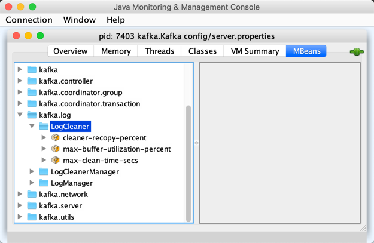

== [[LogCleaner]] LogCleaner

`LogCleaner` manages one or more <<cleaners, CleanerThreads>> to remove obsolete records from logs with <<kafka-log-cleanup-policies.adoc#compact, compact>> retention strategy.

`LogCleaner` is <<creating-instance, created>> exclusively for <<kafka-log-LogManager.adoc#cleaner, LogManager>> with <<kafka-log-CleanerConfig.adoc#enableCleaner, enableCleaner>> flag enabled (of the <<kafka-log-LogManager.adoc#cleanerConfig, CleanerConfig>> of the parent <<kafka-log-LogManager.adoc#, LogManager>>) (which is the default).

When <<creating-instance, created>>, `LogCleaner` is given a <<config, CleanerConfig>> that `LogManager` <<cleanerConfig, builds>> when <<kafka-log-LogManager.adoc#apply, created>> (when `KafkaServer` is requested to <<kafka-server-KafkaServer.adoc#startup, start up>>).

`LogCleaner` registers <<metrics, performance metrics>> (as a <<kafka-metrics-KafkaMetricsGroup.adoc#, KafkaMetricsGroup>>).

`LogCleaner` supports <<reconfigurableConfigs, dynamic (re)configuration>> (as a <<kafka-server-BrokerReconfigurable.adoc#, BrokerReconfigurable>>).

[[logging]]
[TIP]
====
Enable `ALL` logging levels for `kafka.log.LogCleaner` logger to see what happens inside.

Add the following line to `config/log4j.properties`:

```
log4j.logger.kafka.log.LogCleaner=ALL
```

Refer to <<kafka-logging.adoc#, Logging>>.

---

Please note that Kafka comes with a preconfigured `kafka.log.LogCleaner` logger in `config/log4j.properties`:

```
log4j.appender.cleanerAppender=org.apache.log4j.DailyRollingFileAppender
log4j.appender.cleanerAppender.DatePattern='.'yyyy-MM-dd-HH
log4j.appender.cleanerAppender.File=${kafka.logs.dir}/log-cleaner.log
log4j.appender.cleanerAppender.layout=org.apache.log4j.PatternLayout
log4j.appender.cleanerAppender.layout.ConversionPattern=[%d] %p %m (%c)%n

log4j.logger.kafka.log.LogCleaner=INFO, cleanerAppender
log4j.additivity.kafka.log.LogCleaner=false
```

That means that the logs of `LogCleaner` go to `logs/log-cleaner.log` file at `INFO` logging level and are not added to the main logs (per `log4j.additivity` being off).
====

=== [[creating-instance]] Creating LogCleaner Instance

`LogCleaner` takes the following to be created:

* [[initialConfig]] <<kafka-log-CleanerConfig.adoc#, CleanerConfig>>
* [[logDirs]] Log directories
* [[logs]] <<kafka-log-Log.adoc#, Logs>> per Kafka `TopicPartition`
* [[logDirFailureChannel]] `LogDirFailureChannel`
* [[time]] `Time` (default: `Time.SYSTEM`)

`LogCleaner` initializes the <<internal-properties, internal properties>>.

=== [[cleaners]] LogCleaner And CleanerThreads

`LogCleaner` manages <<kafka-log-CleanerThread.adoc#, CleanerThreads>> for <<kafka-log-CleanerThread.adoc#doWork, cleaning up dirty logs>>.

`CleanerThreads` are created and started at <<startup, startup>>. They are doing their join until <<shutdown, shutdown>>.

The number of `CleanerThreads` in use is determined by the <<kafka-log-CleanerConfig.adoc#numThreads, numThreads>> of the <<config, CleanerConfig>> (default: 1).

The statistics about the last log cleaning of `CleanerThreads` are used for the <<metrics, performance metrics>>.

=== [[metrics]][[KafkaMetricsGroup]] Performance Metrics

`LogCleaner` is a <<kafka-metrics-KafkaMetricsGroup.adoc#, KafkaMetricsGroup>> with the following performance metrics.

.LogCleaner's Performance Metrics
[cols="30m,70",options="header",width="100%"]
|===
| Metric Name
| Description

| cleaner-recopy-percent
| [[cleaner-recopy-percent]] Sum of `bytesWritten` by sum of `bytesRead` of the <<cleaners, cleaners>> in the last cleaning

| max-buffer-utilization-percent
| [[max-buffer-utilization-percent]] Maximum `bufferUtilization` of the <<cleaners, cleaners>> in the last cleaning

| max-clean-time-secs
| [[max-clean-time-secs]] Maximum cleaning time of the <<cleaners, cleaners>> in the last cleaning

| max-compaction-delay-secs
| [[max-compaction-delay-secs]] Maximum delay between the time when a log is required to be compacted and the time of last cleaner run

|===

The performance metrics are registered in *kafka.log:type=LogCleaner* group.

.LogCleaner in jconsole


=== [[config]] LogCleaner And CleanerConfig

[source,scala]
----
config: CleanerConfig
----

`LogCleaner` uses <<kafka-log-CleanerConfig.adoc#, CleanerConfig>> for <<reconfigurableConfigs, dynamic configurations>> (that can be changed via <<reconfigure, reconfigure>>).

`LogCleaner` is first given the <<initialConfig, initial CleanerConfig>> when created (from <<kafka-log-LogManager.adoc#cleanerConfig, LogManager>> based on the `KafkaConfig` from `KafkaServer`).

=== [[reconfigurableConfigs]] Dynamic (Re)Configuration

`LogCleaner` is a <<kafka-server-BrokerReconfigurable.adoc#, BrokerReconfigurable>> for the following <<kafka-server-BrokerReconfigurable.adoc#reconfigurableConfigs, dynamic configurations>>:

* <<kafka-server-KafkaConfig.adoc#LogCleanerThreadsProp, log.cleaner.threads>>

* <<kafka-server-KafkaConfig.adoc#LogCleanerDedupeBufferSizeProp, log.cleaner.dedupe.buffer.size>>

* <<kafka-server-KafkaConfig.adoc#LogCleanerDedupeBufferLoadFactorProp, log.cleaner.io.buffer.load.factor>>

* <<kafka-server-KafkaConfig.adoc#LogCleanerIoBufferSizeProp, log.cleaner.io.buffer.size>>

* <<kafka-server-KafkaConfig.adoc#LogCleanerIoMaxBytesPerSecondProp, log.cleaner.io.max.bytes.per.second>>

* <<kafka-server-KafkaConfig.adoc#LogCleanerBackoffMsProp, log.cleaner.backoff.ms>>

* <<kafka-server-KafkaConfig.adoc#MessageMaxBytesProp, message.max.bytes>>

=== [[createNewCleanedSegment]] `createNewCleanedSegment` Object Method

[source, scala]
----
createNewCleanedSegment(
  log: Log,
  baseOffset: Long): LogSegment
----

`createNewCleanedSegment`...FIXME

[NOTE]
====
`createNewCleanedSegment` is used when:

* `Log` is requested to <<kafka-log-Log.adoc#splitOverflowedSegment, splitOverflowedSegment>>

* `LogCleaner` is requested to <<cleanSegments, cleanSegments>>
====

=== [[cleanSegments]] `cleanSegments` Internal Method

[source, scala]
----
cleanSegments(
  log: Log,
  segments: Seq[LogSegment],
  map: OffsetMap,
  deleteHorizonMs: Long,
  stats: CleanerStats): Unit
----

`cleanSegments`...FIXME

NOTE: `cleanSegments` is used when...FIXME

=== [[buildOffsetMap]] `buildOffsetMap` Internal Method

[source, scala]
----
buildOffsetMap(
  log: Log,
  start: Long,
  end: Long,
  map: OffsetMap,
  stats: CleanerStats): Unit
----

`buildOffsetMap`...FIXME

NOTE: `buildOffsetMap` is used when...FIXME

=== [[reconfigure]] Reconfiguring -- `reconfigure` Method

[source, scala]
----
reconfigure(
  oldConfig: KafkaConfig,
  newConfig: KafkaConfig): Unit
----

NOTE: `reconfigure` is part of the <<kafka-server-BrokerReconfigurable.adoc#reconfigure, BrokerReconfigurable Contract>> to change (_reconfigure_) the value of a Kafka dynamic configuration.

`reconfigure`...FIXME

=== [[startup]] Starting Up -- `startup` Method

[source, scala]
----
startup(): Unit
----

`startup` prints out the following INFO message to the logs:

```
Starting the log cleaner
```

`startup` creates new <<kafka-log-CleanerThread.adoc#, CleanerThreads>> and <<kafka-log-CleanerThread.adoc#doWork, starts>> them all immediately.

`startup` adds the cleaner threads in <<cleaners, cleaners>> internal registry.

NOTE: The number of `CleanerThreads` is controlled by <<kafka-log-CleanerConfig.adoc#numThreads, log.cleaner.threads>> dynamic configuration (default: `1`).

[NOTE]
====
`startup` is used when:

* `LogManager` is requested to <<kafka-log-LogManager.adoc#startup, start up>> (with `enableCleaner` enabled which is the default)

* `LogCleaner` is requested to <<reconfigure, reconfigure>>
====

=== [[cleanerConfig]] Building CleanerConfig From KafkaConfig -- `cleanerConfig` Utility

[source, scala]
----
cleanerConfig(
  config: KafkaConfig): CleanerConfig
----

`cleanerConfig` simply creates a new <<kafka-log-CleanerConfig.adoc#, CleanerConfig>> based on the given <<kafka-server-KafkaConfig.adoc#, KafkaConfig>>.

[NOTE]
====
`cleanerConfig` is used when:

* `LogCleaner` is requested to <<validateReconfiguration, validateReconfiguration>> and <<reconfigure, reconfigure>>

* `LogManager` is <<kafka-log-LogManager.adoc#apply, created>>
====

=== [[awaitCleaned]] `awaitCleaned` Method

[source, scala]
----
awaitCleaned(
  topicPartition: TopicPartition,
  offset: Long,
  maxWaitMs: Long = 60000L): Boolean
----

`awaitCleaned`...FIXME

NOTE: `awaitCleaned` seems to be used exclusively in tests.

=== [[alterCheckpointDir]] `alterCheckpointDir` Method

[source, scala]
----
alterCheckpointDir(
  topicPartition: TopicPartition,
  sourceLogDir: File,
  destLogDir: File): Unit
----

`alterCheckpointDir`...FIXME

NOTE: `alterCheckpointDir` is used exclusively when `LogManager` is requested to <<kafka-log-LogManager.adoc#replaceCurrentWithFutureLog, replaceCurrentWithFutureLog>>.

=== [[handleLogDirFailure]] `handleLogDirFailure` Method

[source, scala]
----
handleLogDirFailure(dir: String): Unit
----

`handleLogDirFailure`...FIXME

NOTE: `handleLogDirFailure` is used exclusively when `LogManager` is requested to <<kafka-log-LogManager.adoc#handleLogDirFailure, handleLogDirFailure>>.

=== [[updateCheckpoints]] `updateCheckpoints` Method

[source, scala]
----
updateCheckpoints(dataDir: File): Unit
----

`updateCheckpoints`...FIXME

NOTE: `updateCheckpoints` is used exclusively when `LogManager` is requested to <<kafka-log-LogManager.adoc#asyncDelete, asyncDelete>>.

=== [[maybeTruncateCheckpoint]] `maybeTruncateCheckpoint` Method

[source, scala]
----
maybeTruncateCheckpoint(
  dataDir: File,
  topicPartition: TopicPartition,
  offset: Long): Unit
----

`maybeTruncateCheckpoint`...FIXME

NOTE: `maybeTruncateCheckpoint` is used when `LogManager` is requested to <<kafka-log-LogManager.adoc#truncateTo, truncateTo>> and <<kafka-log-LogManager.adoc#truncateFullyAndStartAt, truncateFullyAndStartAt>>.

=== [[shutdown]] Shuting Down -- `shutdown` Method

[source, scala]
----
shutdown(): Unit
----

`shutdown`...FIXME

NOTE: `shutdown` is used when...FIXME

=== [[abortAndPauseCleaning]] `abortAndPauseCleaning` Method

[source, scala]
----
abortAndPauseCleaning(
  topicPartition: TopicPartition): Unit
----

`abortAndPauseCleaning`...FIXME

NOTE: `abortAndPauseCleaning` is used when...FIXME

=== [[resumeCleaning]] `resumeCleaning` Method

[source, scala]
----
resumeCleaning(
  topicPartitions: Iterable[TopicPartition]): Unit
----

`resumeCleaning`...FIXME

NOTE: `resumeCleaning` is used when...FIXME

=== [[pauseCleaningForNonCompactedPartitions]] `pauseCleaningForNonCompactedPartitions` Method

[source, scala]
----
pauseCleaningForNonCompactedPartitions(): Iterable[(TopicPartition, Log)]
----

`pauseCleaningForNonCompactedPartitions`...FIXME

NOTE: `pauseCleaningForNonCompactedPartitions` is used when...FIXME

=== [[internal-properties]] Internal Properties

[cols="30m,70",options="header",width="100%"]
|===
| Name
| Description

| cleanerManager
a| [[cleanerManager]] <<kafka-log-LogCleanerManager.adoc#, LogCleanerManager>>

|===
