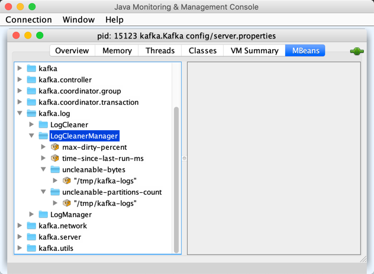

== [[LogCleanerManager]] LogCleanerManager

`LogCleanerManager` is <<creating-instance, created>> exclusively for <<kafka-log-LogCleaner.adoc#cleanerManager, LogCleaner>>.

`LogCleanerManager` is a <<kafka-metrics-KafkaMetricsGroup.adoc#, KafkaMetricsGroup>> and registers <<metrics, performance metrics>>.

[[metrics]]
.LogCleanerManager's Performance Metrics
[cols="1m,2",options="header",width="100%"]
|===
| Metric Name
| Description

| max-dirty-percent
| [[max-dirty-percent]]

| time-since-last-run-ms
| [[time-since-last-run-ms]]

| uncleanable-bytes
| [[uncleanable-bytes]] (for every <<logDirs, log directory>>)

| uncleanable-partitions-count
| [[uncleanable-partitions-count]] (for every <<logDirs, log directory>>)

|===

The <<metrics, performance metrics>> are registered in *kafka.log:type=LogCleanerManager* group.

.LogCleanerManager in jconsole

[[offsetCheckpointFile]]
`LogCleanerManager` uses *cleaner-offset-checkpoint* for the name of the offset checkpoint files for every <<logDirs, log directory>> (in <<checkpoints, checkpoints>> registry).

[[internal-registries]]
.LogCleanerManager's Internal Properties (e.g. Registries, Counters and Flags)
[cols="1m,3",options="header",width="100%"]
|===
| Name
| Description

| checkpoints
| [[checkpoints]] `OffsetCheckpointFiles` per <<logDirs, log directory>>

Used when...FIXME

|===

[[loggerName]]
[[logging]]
`LogCleanerManager` uses <<kafka-log-LogCleaner.adoc#logging, kafka.log.LogCleaner>> logger.

[TIP]
====
Enable `INFO` logging level for `kafka.log.LogCleaner` logger to see what happens inside.
====

=== [[creating-instance]] Creating LogCleanerManager Instance

`LogCleanerManager` takes the following to be created:

* [[logDirs]] Log directories
* [[logs]] <<kafka-log-Log.adoc#, Logs>> per Kafka `TopicPartition`
* [[logDirFailureChannel]] `LogDirFailureChannel`

`LogCleanerManager` initializes the <<internal-registries, internal registries and counters>>.

=== [[isCompactAndDelete]] `isCompactAndDelete` Predicate

[source, scala]
----
isCompactAndDelete(log: Log): Boolean
----

`isCompactAndDelete`...FIXME

NOTE: `isCompactAndDelete` is used when...FIXME

=== [[cleanableOffsets]] `cleanableOffsets` Method

[source, scala]
----
cleanableOffsets(
  log: Log,
  topicPartition: TopicPartition,
  lastClean: immutable.Map[TopicPartition, Long],
  now: Long): (Long, Long)
----

`cleanableOffsets`...FIXME

NOTE: `cleanableOffsets` is used when...FIXME

=== [[grabFilthiestCompactedLog]] `grabFilthiestCompactedLog` Method

[source, scala]
----
grabFilthiestCompactedLog(time: Time): Option[LogToClean]
----

`grabFilthiestCompactedLog`...FIXME

NOTE: `grabFilthiestCompactedLog` is used when...FIXME

=== [[deletableLogs]] `deletableLogs` Method

[source, scala]
----
deletableLogs(): Iterable[(TopicPartition, Log)]
----

`deletableLogs`...FIXME

NOTE: `deletableLogs` is used when...FIXME

=== [[doneDeleting]] `doneDeleting` Method

[source, scala]
----
doneDeleting(topicPartitions: Iterable[TopicPartition]): Unit
----

`doneDeleting`...FIXME

NOTE: `doneDeleting` is used when...FIXME

=== [[doneCleaning]] `doneCleaning` Method

[source, scala]
----
doneCleaning(
  topicPartition: TopicPartition,
  dataDir: File,
  endOffset: Long): Unit
----

`doneCleaning`...FIXME

NOTE: `doneCleaning` is used when...FIXME

=== [[allCleanerCheckpoints]] `allCleanerCheckpoints` Method

[source, scala]
----
allCleanerCheckpoints: Map[TopicPartition, Long]
----

`allCleanerCheckpoints`...FIXME

[NOTE]
====
`allCleanerCheckpoints` is used when:

* `LogCleanerManager` is requested to <<grabFilthiestCompactedLog, grabFilthiestCompactedLog>> and for the <<uncleanable-bytes, uncleanable-bytes>> performance metric

* `LogCleaner` is requested to <<kafka-log-LogCleaner.adoc#awaitCleaned, awaitCleaned>> (for tests only)
====

=== [[alterCheckpointDir]] `alterCheckpointDir` Method

[source, scala]
----
alterCheckpointDir(
  topicPartition: TopicPartition,
  sourceLogDir: File,
  destLogDir: File): Unit
----

`alterCheckpointDir`...FIXME

NOTE: `alterCheckpointDir` is used exclusively when `LogCleaner` is requested to <<kafka-log-LogCleaner.adoc#alterCheckpointDir, alterCheckpointDir>>.

=== [[handleLogDirFailure]] `handleLogDirFailure` Method

[source, scala]
----
handleLogDirFailure(dir: String): Unit
----

`handleLogDirFailure`...FIXME

NOTE: `handleLogDirFailure` is used exclusively when `LogCleaner` is requested to <<kafka-log-LogCleaner.adoc#handleLogDirFailure, handleLogDirFailure>>.
