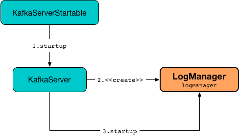
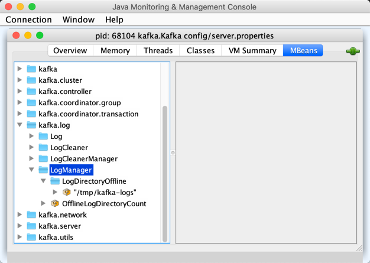

== [[LogManager]] LogManager

`LogManager` is <<creating-instance, created>> (via <<apply, apply>> factory utility) and immediately <<startup, started>> for `KafkaServer` when requested to <<kafka-server-KafkaServer.adoc#startup, start up>>.

.LogManager and KafkaServer


`LogManager` runs until (and is requested to <<shutdown, shut down>> when) `KafkaServer` is requested to <<kafka-server-KafkaServer.adoc#shutdown, shut down>>.

`LogManager` uses the following <<properties, configuration properties>>.

[[properties]]
.LogManager's Configuration Properties
[cols="30,70",options="header",width="100%"]
|===
| Name
| Description

| link:kafka-properties.adoc#file.delete.delay.ms[file.delete.delay.ms]
a| [[file.delete.delay.ms]]

| link:kafka-properties.adoc#log.cleaner.backoff.ms[log.cleaner.backoff.ms]
a| [[log.cleaner.backoff.ms]]

| link:kafka-properties.adoc#log.cleaner.dedupe.buffer.size[log.cleaner.dedupe.buffer.size]
a| [[log.cleaner.dedupe.buffer.size]]

| link:kafka-properties.adoc#log.cleaner.enable[log.cleaner.enable]
a| [[log.cleaner.enable]] Used to enable a <<cleaner, LogCleaner>>

| link:kafka-properties.adoc#log.cleaner.io.buffer.load.factor[log.cleaner.io.buffer.load.factor]
a| [[log.cleaner.io.buffer.load.factor]]

| link:kafka-properties.adoc#log.cleaner.io.buffer.size[log.cleaner.io.buffer.size]
a| [[log.cleaner.io.buffer.size]]

| link:kafka-properties.adoc#log.cleaner.io.max.bytes.per.second[log.cleaner.io.max.bytes.per.second]
a| [[log.cleaner.io.max.bytes.per.second]]

| link:kafka-properties.adoc#log.cleaner.threads[log.cleaner.threads]
a| [[log.cleaner.threads]]

| link:kafka-server-KafkaConfig.adoc#logDirs[log.dirs or log.dir]
a| [[log.dirs]][[log.dir]] Used for the <<logDirs, log directories>> that are immediately <<createAndValidateLogDirs, validated>> and <<loadLogs, loaded>> (on a fixed thread pool with <<numRecoveryThreadsPerDataDir, numRecoveryThreadsPerDataDir>> recovery threads)

| link:kafka-properties.adoc#log.flush.offset.checkpoint.interval.ms[log.flush.offset.checkpoint.interval.ms]
a| [[log.flush.offset.checkpoint.interval.ms]]

| link:kafka-properties.adoc#log.flush.scheduler.interval.ms[log.flush.scheduler.interval.ms]
a| [[log.flush.scheduler.interval.ms]]

| link:kafka-properties.adoc#log.flush.start.offset.checkpoint.interval.ms[log.flush.start.offset.checkpoint.interval.ms]
a| [[log.flush.start.offset.checkpoint.interval.ms]]

| link:kafka-properties.adoc#log.retention.check.interval.ms[log.retention.check.interval.ms]
a| [[log.retention.check.interval.ms]]

| link:kafka-properties.adoc#message.max.bytes[message.max.bytes]
a| [[message.max.bytes]]

| link:kafka-properties.adoc#num.recovery.threads.per.data.dir[num.recovery.threads.per.data.dir]
a| [[num.recovery.threads.per.data.dir]] Number of threads per <<log.dirs, log data directory>> for <<loadLogs, log recovery at startup>> and <<shutdown, flushing at shutdown>>

| link:kafka-properties.adoc#transactional.id.expiration.ms[transactional.id.expiration.ms]
a| [[transactional.id.expiration.ms]]

|===

`LogManager` is used to create a link:kafka-server-ReplicaManager.adoc#logManager[ReplicaManager], a link:kafka-server-DynamicLogConfig.adoc#logManager[DynamicLogConfig], a link:kafka-server-TopicConfigHandler.adoc#logManager[TopicConfigHandler], and a link:kafka-cluster-Partition.adoc#logManager[Partition].

[[InitialTaskDelayMs]]
`LogManager` defaults to `30000ms` for the *initial task delay*.

[[logging]]
[TIP]
====
Enable `ALL` logging level for `kafka.log.LogManager` logger to see what happens inside.

Add the following line to `config/log4j.properties`:

```
log4j.logger.kafka.log.LogManager=ALL
```

Refer to link:kafka-logging.adoc[Logging].
====

=== [[cleaner]] LogManager and LogCleaner

`LogManager` creates a <<kafka-log-LogCleaner.adoc#, LogCleaner>> only when the <<kafka-log-CleanerConfig.adoc#enableCleaner, log.cleaner.enable>> flag (of the given <<cleanerConfig, CleanerConfig>>) is enabled (default: `true`).

`LogManager` uses <<kafka-log-LogCleaner.adoc#, LogCleaner>> for the following:

* <<truncateTo, truncateTo>>

* <<truncateFullyAndStartAt, truncateFullyAndStartAt>>

* <<abortAndPauseCleaning, abortAndPauseCleaning>>

* <<replaceCurrentWithFutureLog, replaceCurrentWithFutureLog>>

* <<asyncDelete, asyncDelete>>

* <<cleanupLogs, cleanupLogs>>

* <<startup, startup>>

* <<shutdown, shutdown>>

* <<handleLogDirFailure, handleLogDirFailure>>

=== [[KafkaMetricsGroup]][[metrics]] Performance Metrics

`LogManager` is a <<kafka-metrics-KafkaMetricsGroup.adoc#, KafkaMetricsGroup>> with the following performance metrics.

.LogManager's Performance Metrics
[cols="30m,70",options="header",width="100%"]
|===
| Metric Name
| Description

| OfflineLogDirectoryCount
| [[offlineLogDirectoryCount]][[OfflineLogDirectoryCount]] The number of offline log directories

| LogDirectoryOffline
a| [[LogDirectoryOffline]] Registered for every <<logDirs, log directory>> to indicate whether it is online or offline

Possible values:

* `0` when a log directory is online

* `1` when a log directory is offline

The path of the directory is the tag of the metric.

|===

The performance metrics are registered in *kafka.log:type=LogManager* group.

.LogManager in jconsole


=== [[apply]] Creating LogManager -- `apply` Utility

[source, scala]
----
apply(
  config: KafkaConfig,
  initialOfflineDirs: Seq[String],
  zkClient: KafkaZkClient,
  brokerState: BrokerState,
  kafkaScheduler: KafkaScheduler,
  time: Time,
  brokerTopicStats: BrokerTopicStats,
  logDirFailureChannel: LogDirFailureChannel): LogManager
----

`apply`...FIXME

NOTE: `apply` is used exclusively when `KafkaServer` is requested to <<kafka-server-KafkaServer.adoc#startup, start up>>.

=== [[creating-instance]] Creating LogManager Instance

`LogManager` takes the following to be created:

* [[logDirs]] Absolute paths to log directories
* [[initialOfflineDirs]] Initial offline directories
* [[topicConfigs]] Topic configurations - <<kafka-log-LogConfig.adoc#, LogConfigs>> per topic name
* [[initialDefaultConfig]] Initial link:kafka-log-LogConfig.adoc[LogConfig]
* [[cleanerConfig]] link:kafka-log-LogCleaner.adoc#CleanerConfig[CleanerConfig]
* [[recoveryThreadsPerDataDir]] link:kafka-server-KafkaConfig.adoc#numRecoveryThreadsPerDataDir[num.recovery.threads.per.data.dir] dynamic configuration property
* [[flushCheckMs]] link:kafka-properties.adoc#log.flush.scheduler.interval.ms[log.flush.scheduler.interval.ms] configuration property
* [[flushRecoveryOffsetCheckpointMs]] link:kafka-properties.adoc#log.flush.offset.checkpoint.interval.ms[log.flush.offset.checkpoint.interval.ms] configuration property
* [[flushStartOffsetCheckpointMs]] link:kafka-properties.adoc#log.flush.start.offset.checkpoint.interval.ms[log.flush.start.offset.checkpoint.interval.ms] configuration property
* [[retentionCheckMs]] link:kafka-properties.adoc#log.retention.check.interval.ms[log.retention.check.interval.ms] configuration property
* [[maxPidExpirationMs]] link:kafka-properties.adoc#transactional.id.expiration.ms[transactional.id.expiration.ms] configuration property
* [[scheduler]] link:kafka-Scheduler.adoc[Scheduler]
* [[brokerState]] `BrokerState`
* <<brokerTopicStats, BrokerTopicStats>>
* [[logDirFailureChannel]] `LogDirFailureChannel`
* [[time]] `Time`

`LogManager` initializes the <<internal-properties, internal properties>>.

While being created, `LogManager` <<loadLogs, loads logs>>.

=== [[abortAndPauseCleaning]] `abortAndPauseCleaning` Method

[source, scala]
----
abortAndPauseCleaning(
  topicPartition: TopicPartition): Unit
----

`abortAndPauseCleaning`...FIXME

NOTE: `abortAndPauseCleaning` is used when `ReplicaManager` is requested to <<kafka-server-ReplicaManager.adoc#alterReplicaLogDirs, alterReplicaLogDirs>> and <<kafka-server-ReplicaManager.adoc#becomeLeaderOrFollower, becomeLeaderOrFollower>>.

=== [[loadLogs]] Recovering And Loading Logs In Log Data Directories -- `loadLogs` Internal Method

[source, scala]
----
loadLogs(): Unit
----

`loadLogs` prints out the following INFO message to the logs:

```
Loading logs.
```

For every <<liveLogDirs, live log directory>>, `loadLogs` first creates a fixed thread pool (with <<numRecoveryThreadsPerDataDir, numRecoveryThreadsPerDataDir>> threads).

`loadLogs` then checks whether <<kafka-log-Log.adoc#CleanShutdownFile, .kafka_cleanshutdown>> file exists in the log directory. If so, `loadLogs` prints out the following DEBUG message to the logs:

```
Found clean shutdown file. Skipping recovery for all logs in data directory: [dir]
```

`loadLogs` uses the <<recoveryPointCheckpoints, recoveryPointCheckpoints>> to look up the `OffsetCheckpointFile` for the log directory (*recovery-point-offset-checkpoint* file) and then loads it.

`loadLogs` uses the <<logStartOffsetCheckpoints, logStartOffsetCheckpoints>> to look up the `OffsetCheckpointFile` for the log directory (*recovery-point-offset-checkpoint* file) and then loads it.

For every directory in the log directory, `loadLogs` creates a new thread to <<loadLog, load the log directory>> with the recovery points and log start offsets (that have just been loaded).

`loadLogs` submits the new threads to <<loadLog, load the log directory>> for execution on the fixed thread pool.

`loadLogs` then...FIXME (finish me)

In the end, after <<loadLog, having loaded the log directories>> successfully, `loadLogs` prints out the following INFO message to the logs:

```
Logs loading complete in [duration] ms.
```

In case <<kafka-log-Log.adoc#CleanShutdownFile, .kafka_cleanshutdown>> file does not exist, `loadLogs` transitions the <<brokerState, BrokerState>> to `RecoveringFromUncleanShutdown`.

In case of an exception while loading the `OffsetCheckpointFile` of a log directory (*recovery-point-offset-checkpoint* file), `loadLogs` simply prints out the following WARN messages to the logs:

```
Error occurred while reading recovery-point-offset-checkpoint file of directory [dir]
Resetting the recovery checkpoint to 0
```

In case of an exception while loading the `OffsetCheckpointFile` of a log directory (*log-start-offset-checkpoint* file), `loadLogs` simply prints out the following WARN messages to the logs:

```
Error occurred while reading log-start-offset-checkpoint file of directory [dir]
```

In case of an exception while <<loadLog, load the log directory>> or any other task, `loadLogs` adds the log directory to a *offlineDirs* internal registry with the exception and prints out the following ERROR message to the logs:

```
Error while loading log dir [dir]
```

NOTE: `loadLogs` is used exclusively when `LogManager` is <<creating-instance, created>>.

==== [[loadLog]] Loading Partition Log Directory -- `loadLog` Internal Method

[source, scala]
----
loadLog(
  logDir: File,
  recoveryPoints: Map[TopicPartition, Long],
  logStartOffsets: Map[TopicPartition, Long]): Unit
----

`loadLog` first prints out the following DEBUG message to the logs:

```
Loading log '[logDir]'
```

`loadLog` then <<kafka-log-Log.adoc#parseTopicPartitionName, parses the topic and partition out of the directory name of the log>> (by the given `logDir`).

`loadLog` gets the <<kafka-log-LogConfig.adoc#, LogConfig>> for the topic (from the <<topicConfigs, LogConfigs per topic>>) or defaults to the <<currentDefaultConfig, currentDefaultConfig>>.

`loadLog` gets `logRecoveryPoint` for the partition (from the given `recoveryPoints`) or defaults to `0`.

`loadLog` gets `logStartOffset` for the partition (from the given `logStartOffsets`) or defaults to `0`.

`loadLog` creates a <<kafka-log-Log.adoc#, Log>>.

In case the name of the given `logDir` ends with <<DeleteDirSuffix, -delete>> suffix, `loadLog` <<addLogToBeDeleted, addLogToBeDeleted>>.

Otherwise, `loadLog` adds the `Log` to the <<futureLogs, futureLogs>> or <<currentLogs, currentLogs>> internal registry whether it is <<kafka-log-Log.adoc#isFuture, isFuture>> or not, respectively.

In case there was `Log` already registered (the <<futureLogs, futureLogs>> or <<currentLogs, currentLogs>> internal registry), `loadLog` throws an `IllegalStateException`:

```
FIXME
```

NOTE: `loadLog` is used exclusively when `LogManager` is requested to <<loadLogs, recover and load the logs in log data directories>>.

=== [[startup]] Starting Up -- `startup` Method

[source, scala]
----
startup(): Unit
----

`startup` starts the background threads to flush logs and do log cleanup.

Internally, `startup` prints out the following INFO message to the logs:

```
Starting log cleanup with a period of [retentionCheckMs] ms.
```

`startup` requests the <<scheduler, Scheduler>> to <<kafka-Scheduler.adoc#schedule, schedule a task>> with the name *kafka-log-retention* that <<cleanupLogs, cleanupLogs>> with the <<InitialTaskDelayMs, InitialTaskDelayMs>> delay and the <<retentionCheckMs, retentionCheckMs>> execution period.

`startup` prints out the following INFO message to the logs:

```
Starting log flusher with a default period of [flushCheckMs] ms.
```

`startup` requests the <<scheduler, Scheduler>> to <<kafka-Scheduler.adoc#schedule, schedule a task>> with the name *kafka-log-flusher* that <<flushDirtyLogs, flushDirtyLogs>> with the <<InitialTaskDelayMs, InitialTaskDelayMs>> delay and the <<flushCheckMs, flushCheckMs>> execution period.

`startup` requests the <<scheduler, Scheduler>> to <<kafka-Scheduler.adoc#schedule, schedule a task>> with the name *kafka-recovery-point-checkpoint* that <<checkpointLogRecoveryOffsets, checkpointLogRecoveryOffsets>> with the <<InitialTaskDelayMs, InitialTaskDelayMs>> delay and the <<flushRecoveryOffsetCheckpointMs, flushRecoveryOffsetCheckpointMs>> execution period.

`startup` requests the <<scheduler, Scheduler>> to <<kafka-Scheduler.adoc#schedule, schedule a task>> with the name *kafka-log-start-offset-checkpoint* that <<checkpointLogStartOffsets, checkpointLogStartOffsets>> with the <<InitialTaskDelayMs, InitialTaskDelayMs>> delay and the <<flushStartOffsetCheckpointMs, flushStartOffsetCheckpointMs>> execution period.

`startup` requests the <<scheduler, Scheduler>> to <<kafka-Scheduler.adoc#schedule, schedule a task>> with the name *kafka-delete-logs* that <<deleteLogs, deleteLogs>> with the <<InitialTaskDelayMs, InitialTaskDelayMs>> delay.

(only when the <<cleanerConfig, CleanerConfig>> has the <<kafka-log-CleanerConfig.adoc#enableCleaner, enableCleaner>> flag enabled) `startup` requests the <<cleaner, LogCleaner>> to <<kafka-log-LogCleaner.adoc#startup, start up>>.

NOTE: `startup` is used exclusively when `KafkaServer` is requested to <<kafka-server-KafkaServer.adoc#startup, start up>>.

=== [[brokerTopicStats]] BrokerTopicStats

When <<creating-instance, created>>, `LogManager` is given a <<kafka-server-BrokerTopicStats.adoc#, BrokerTopicStats>> that is used exclusively to create <<kafka-log-Log.adoc#, Logs>> when <<loadLog, recovering and loading logs in log data directories>> and <<getOrCreateLog, looking up or creating a Log>>.

=== [[cleanupLogs]] `cleanupLogs` Method

[source, scala]
----
cleanupLogs(): Unit
----

`cleanupLogs` prints out the following DEBUG message to the logs:

```
Beginning log cleanup...
```

`cleanupLogs` finds so-called *deletable (non-compacted) logs* by requesting the <<cleaner, LogCleaner>> (if used) to <<kafka-log-LogCleaner.adoc#pauseCleaningForNonCompactedPartitions, pauseCleaningForNonCompactedPartitions>> or simply finds all logs in the <<currentLogs, currentLogs>> internal registry that are not compacted (by the <<kafka-log-LogConfig.adoc#compact, compact>> flag of the <<kafka-log-Log.adoc#config, LogConfig>> of the <<kafka-log-Log.adoc#, Log>>).

For every <<kafka-log-Log.adoc#, deletable log>>, `cleanupLogs` prints out the following DEBUG message to the logs:

```
Garbage collecting '[log.name]'
```

`cleanupLogs` requests the log to <<kafka-log-Log.adoc#deleteOldSegments, deleteOldSegments>>.

`cleanupLogs` finds the future log for the partition (of the deletable log) in the <<futureLogs, futureLogs>> internal registry and, if available, prints out the following DEBUG message to the logs followed by requesting it to <<kafka-log-Log.adoc#deleteOldSegments, deleteOldSegments>>.

```
Garbage collecting future log '[futureLog.name]'
```

In the end, `cleanupLogs` requests the <<cleaner, LogCleaner>> (if used) to <<kafka-log-LogCleaner.adoc#resumeCleaning, resumeCleaning>> and prints out the following DEBUG message to the logs:

```
Log cleanup completed. [total] files deleted in [duration] seconds
```

NOTE: `cleanupLogs` is used when `LogManager` is requested to <<startup, start up>> (and schedules <<kafka-server-scheduled-tasks.adoc#kafka-log-retention, kafka-log-retention>> periodic task).

=== [[allLogs]] Getting All Partition Logs -- `allLogs` Method

[source, scala]
----
allLogs: Iterable[Log]
----

`allLogs`...FIXME

NOTE: `allLogs` is used when...FIXME

=== [[addLogToBeDeleted]] `addLogToBeDeleted` Internal Method

[source, scala]
----
addLogToBeDeleted(log: Log): Unit
----

`addLogToBeDeleted`...FIXME

NOTE: `addLogToBeDeleted` is used when...FIXME

=== [[asyncDelete]] `asyncDelete` Method

[source, scala]
----
asyncDelete(
  topicPartition: TopicPartition,
  isFuture: Boolean = false): Log
----

`asyncDelete`...FIXME

[NOTE]
====
`asyncDelete` is used when:

* `Partition` is requested to <<kafka-cluster-Partition.adoc#removeFutureLocalReplica, removeFutureLocalReplica>> and <<kafka-cluster-Partition.adoc#delete, delete>>

* `ReplicaManager` is requested to <<kafka-server-ReplicaManager.adoc#stopReplica, stopReplica>>
====

=== [[getOrCreateLog]] Looking Up Or Creating New Partition Log -- `getOrCreateLog` Method

[source, scala]
----
getOrCreateLog(
  topicPartition: TopicPartition,
  config: LogConfig,
  isNew: Boolean = false,
  isFuture: Boolean = false): Log
----

`getOrCreateLog` <<getLog, looks up the partition log>> for the given `TopicPartition` (and returns it if found) or creates a new one.

[[getOrCreateLog-logDirs]]
When <<getLog, looking up the partition log>> was unsuccessful, `getOrCreateLog` finds the log directory for the `TopicPartition`. `getOrCreateLog` finds one in the <<preferredLogDirs, preferredLogDirs>> internal registry and falls back on <<nextLogDirs, nextLogDirs>> (that simply gives all the log directories sorted by the number of partition logs).

[[getOrCreateLog-logDirName]]
`getOrCreateLog` creates the directory name for the `TopicPartition` (based on the given `isFuture` flag).

[[getOrCreateLog-logDir]]
`getOrCreateLog` tries to <<createLogDirectory, createLogDirectory>> in the available log directories (one by one) until successful.

[[getOrCreateLog-log]]
`getOrCreateLog` creates a new <<kafka-log-Log.adoc#apply, Log>> (using the <<maxPidExpirationMs, maxPidExpirationMs>> and `LogManager.ProducerIdExpirationCheckIntervalMs` configuration properties).

`getOrCreateLog` registers the new `Log` with the `TopicPartition` in the <<futureLogs, futureLogs>> or <<currentLogs, currentLogs>> internal registries (based on the given <<isFuture, isFuture>> flag).

`getOrCreateLog` prints out the following INFO message to the logs:

```
Created log for partition [topicPartition] in [logDir] with properties [config].
```

[[getOrCreateLog-preferredLogDirs]]
`getOrCreateLog` removes the `TopicPartition` from the <<preferredLogDirs, preferredLogDirs>> internal registry.

NOTE: `getOrCreateLog` is used exclusively when `Partition` is requested to <<kafka-cluster-Partition.adoc#getOrCreateReplica, getOrCreateReplica>>.

=== [[getLog]] `getLog` Method

[source, scala]
----
getLog(
  topicPartition: TopicPartition,
  isFuture: Boolean = false): Option[Log]
----

`getLog`...FIXME

NOTE: `getLog` is used when...FIXME

=== [[liveLogDirs]] `liveLogDirs` Method

[source, scala]
----
liveLogDirs: Seq[File]
----

`liveLogDirs`...FIXME

NOTE: `liveLogDirs` is used when...FIXME

=== [[deleteLogs]] `deleteLogs` Internal Method

[source, scala]
----
deleteLogs(): Unit
----

`deleteLogs`...FIXME

NOTE: `deleteLogs` is used when...FIXME

=== [[checkpointLogRecoveryOffsets]] `checkpointLogRecoveryOffsets` Method

[source, scala]
----
checkpointLogRecoveryOffsets(): Unit
----

`checkpointLogRecoveryOffsets`...FIXME

NOTE: `checkpointLogRecoveryOffsets` is used when...FIXME

=== [[checkpointLogStartOffsets]] `checkpointLogStartOffsets` Method

[source, scala]
----
checkpointLogStartOffsets(): Unit
----

`checkpointLogStartOffsets`...FIXME

NOTE: `checkpointLogStartOffsets` is used when...FIXME

=== [[isLogDirOnline]] `isLogDirOnline` Method

[source, scala]
----
isLogDirOnline(logDir: String): Boolean
----

`isLogDirOnline`...FIXME

NOTE: `isLogDirOnline` is used when...FIXME

=== [[createAndValidateLogDirs]] Validating Data Log Directories -- `createAndValidateLogDirs` Internal Method

[source, scala]
----
createAndValidateLogDirs(
  dirs: Seq[File],
  initialOfflineDirs: Seq[File]): ConcurrentLinkedQueue[File]
----

For every directory in the given `dirs`, `createAndValidateLogDirs` makes sure that the data directory is available (i.e. it is a readable directory) or creates it.

`createAndValidateLogDirs` prints out the following INFO message to the logs when a data directory does not exist:

```
Log directory [dir] not found, creating it.
```

NOTE: `createAndValidateLogDirs` is given the <<logDirs, logDirs>> and the <<initialOfflineDirs, initialOfflineDirs>> that `LogManager` is <<creating-instance, created>> with.

`createAndValidateLogDirs` throws...FIXME

NOTE: `createAndValidateLogDirs` is used exclusively when `LogManager` is <<_liveLogDirs, created>>.

=== [[truncateTo]] `truncateTo` Method

[source, scala]
----
truncateTo(
  partitionOffsets: Map[TopicPartition, Long],
  isFuture: Boolean): Unit
----

`truncateTo`...FIXME

NOTE: `truncateTo` is used when `Partition` is requested to <<kafka-cluster-Partition.adoc#truncateTo, truncateTo>>.

=== [[truncateFullyAndStartAt]] `truncateFullyAndStartAt` Method

[source, scala]
----
truncateFullyAndStartAt(
  topicPartition: TopicPartition,
  newOffset: Long,
  isFuture: Boolean): Unit
----

`truncateFullyAndStartAt`...FIXME

NOTE: `truncateFullyAndStartAt` is used exclusively when `Partition` is requested to <<kafka-cluster-Partition.adoc#truncateFullyAndStartAt, truncateFullyAndStartAt>>.

=== [[resizeRecoveryThreadPool]] `resizeRecoveryThreadPool` Method

[source, scala]
----
resizeRecoveryThreadPool(newSize: Int): Unit
----

`resizeRecoveryThreadPool` prints out the following INFO message to the logs and reconfigures the <<numRecoveryThreadsPerDataDir, numRecoveryThreadsPerDataDir>> internal registry to be the given `newSize`.

```
Resizing recovery thread pool size for each data dir from [numRecoveryThreadsPerDataDir] to [newSize]
```

NOTE: `resizeRecoveryThreadPool` is used exclusively when `DynamicThreadPool` is requested to <<kafka-server-DynamicThreadPool.adoc#reconfigure, reconfigure>> (with a new value of <<kafka-server-KafkaConfig.adoc#numRecoveryThreadsPerDataDir, KafkaConfig.numRecoveryThreadsPerDataDir>>).

=== [[shutdown]] Shutting Down -- `shutdown` Method

[source, scala]
----
shutdown(): Unit
----

`shutdown` prints out the following INFO message to the logs:

```
Shutting down.
```

`shutdown` then...FIXME

NOTE: `shutdown` is used exclusively when `KafkaServer` is requested to <<kafka-server-KafkaServer.adoc#shutdown, shutdown>>.

=== [[replaceCurrentWithFutureLog]] `replaceCurrentWithFutureLog` Method

[source, scala]
----
replaceCurrentWithFutureLog(topicPartition: TopicPartition): Unit
----

`replaceCurrentWithFutureLog`...FIXME

NOTE: `replaceCurrentWithFutureLog` is used exclusively when `Partition` is requested to <<kafka-cluster-Partition.adoc#maybeReplaceCurrentWithFutureReplica, maybeReplaceCurrentWithFutureReplica>>.

=== [[handleLogDirFailure]] `handleLogDirFailure` Method

[source, scala]
----
handleLogDirFailure(
  dir: String): Unit
----

`handleLogDirFailure`...FIXME

NOTE: `handleLogDirFailure` is used exclusively when `ReplicaManager` is requested to <<kafka-server-ReplicaManager.adoc#handleLogDirFailure, handleLogDirFailure>>.

=== [[initializingLog]] Marking Start of Partition Log Initialization -- `initializingLog` Method

[source, scala]
----
initializingLog(
  topicPartition: TopicPartition): Unit
----

`initializingLog`...FIXME

NOTE: `initializingLog` is used when `Partition` is requested to link:kafka-cluster-Partition.adoc#createLog[createLog].

=== [[finishedInitializingLog]] Marking End of Partition Log Initialization -- `finishedInitializingLog` Method

[source, scala]
----
finishedInitializingLog(
  topicPartition: TopicPartition,
  maybeLog: Option[Log],
  fetchLogConfig: () => LogConfig): Unit
----

`finishedInitializingLog`...FIXME

NOTE: `finishedInitializingLog` is used when `Partition` is requested to link:kafka-cluster-Partition.adoc#createLog[createLog].

=== [[flushDirtyLogs]] `flushDirtyLogs` Internal Method

[source, scala]
----
flushDirtyLogs(): Unit
----

`flushDirtyLogs` prints out the following DEBUG message to the logs:

```
Checking for dirty logs to flush...
```

`flushDirtyLogs`...FIXME

NOTE: `flushDirtyLogs` is used exclusively for the <<kafka-server-scheduled-tasks.adoc#kafka-log-flusher, kafka-log-flusher task>> (when `LogManager` is requested to <<startup, start up>>).

=== [[createLogDirectory]] `createLogDirectory` Internal Method

[source, scala]
----
createLogDirectory(
  logDir: File,
  logDirName: String): Try[File]
----

`createLogDirectory`...FIXME

NOTE: `createLogDirectory` is used when `LogManager` is requested to <<getOrCreateLog, look up or create a new partition log>>.

=== [[nextLogDirs]] `nextLogDirs` Internal Method

[source, scala]
----
nextLogDirs(): List[File]
----

`nextLogDirs`...FIXME

NOTE: `nextLogDirs` is used when `LogManager` is requested to <<getOrCreateLog, look up or create a new partition log>>.

=== [[internal-properties]] Internal Properties

[cols="30m,70",options="header",width="100%"]
|===
| Name
| Description

| _liveLogDirs
a| [[_liveLogDirs]] Java's https://docs.oracle.com/en/java/javase/11/docs/api/java.base/java/util/concurrent/ConcurrentLinkedQueue.html[ConcurrentLinkedQueue] of live log directories (after <<createAndValidateLogDirs, createAndValidateLogDirs>> was executed with the <<logDirs, logDirs>> and the <<initialOfflineDirs, initialOfflineDirs>> directories).

Used when...FIXME

| currentDefaultConfig
a| [[_currentDefaultConfig]][[currentDefaultConfig]] Default <<kafka-log-LogConfig.adoc#, LogConfig>>

Used when a custom `LogConfig` is not available in the <<topicConfigs, topicConfigs>>

| currentLogs
a| [[currentLogs]] Pool of <<kafka-log-Log.adoc#, Logs>> per `TopicPartition` (`Pool[TopicPartition, Log]`)

| futureLogs
a| [[futureLogs]] Pool of <<kafka-log-Log.adoc#, Logs>> per `TopicPartition` (`Pool[TopicPartition, Log]`)

| logStartOffsetCheckpoints
a| [[logStartOffsetCheckpoints]]

| numRecoveryThreadsPerDataDir
a| [[numRecoveryThreadsPerDataDir]] Number of recovery threads per log data directory

Starts as the <<recoveryThreadsPerDataDir, recoveryThreadsPerDataDir>> and can then be <<resizeRecoveryThreadPool, dynamically changed>>.

| preferredLogDirs
a| [[preferredLogDirs]]

[source, scala]
----
preferredLogDirs: ConcurrentHashMap[TopicPartition, String]
----

| recoveryPointCheckpoints
a| [[recoveryPointCheckpoints]]

|===
