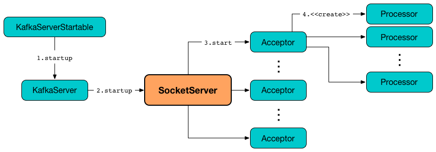

== [[SocketServer]] SocketServer

`SocketServer` is a NIO socket server for a <<kafka-server-KafkaServer.adoc#socketServer, KafkaServer>>.

`SocketServer` is <<creating-instance, created>> and then <<startup, started up>> exclusively when `KafkaServer` is requested to <<kafka-server-KafkaServer.adoc#startup, start up>>.

.SocketServer's Startup


[[maxQueuedRequests]]
`SocketServer` uses <<kafka-server-KafkaConfig.adoc#queuedMaxRequests, queued.max.requests>> configuration property for...FIXME

[[metrics]]
.SocketServer's Metrics (in kafka.network group)
[cols="1,2",options="header",width="100%"]
|===
| Name
| Description

| [[NetworkProcessorAvgIdlePercent]] `NetworkProcessorAvgIdlePercent`
|

| [[MemoryPoolAvailable]] `MemoryPoolAvailable`
|

| [[MemoryPoolUsed]] `MemoryPoolUsed`
|
|===

[[DataPlaneMetricPrefix]]
`SocketServer` uses an empty metric prefix for...FIXME

[[ControlPlaneMetricPrefix]]
`SocketServer` uses *ControlPlane* metric prefix for...FIXME

=== [[creating-instance]] Creating SocketServer Instance

`SocketServer` takes the following to be created:

* [[config]] <<kafka-server-KafkaConfig.adoc#, KafkaConfig>>
* [[metrics]] <<kafka-Metrics.adoc#, Metrics>>
* [[time]] `Time`
* [[credentialProvider]] `CredentialProvider`

`SocketServer` initializes the <<internal-properties, internal properties>>.

=== [[controlPlaneRequestChannelOpt]] Control-Plane Request Handler for Controller-Brokers Communication -- `controlPlaneRequestChannelOpt` Internal Value

`SocketServer` creates a dedicated link:kafka-network-RequestChannel.adoc[RequestChannel] for communication between a controller and brokers when link:kafka-properties.adoc#control.plane.listener.name[control.plane.listener.name] configuration property is defined.

The `RequestChannel` is created for `KafkaServer` (when requested to link:kafka-server-KafkaServer.adoc#startup[start up]). It is the time when `KafkaServer` creates dedicated link:kafka-server-KafkaServer.adoc#controlPlaneRequestProcessor[control-plane request processor] and link:kafka-server-KafkaServer.adoc#controlPlaneRequestHandlerPool[control-plane request handler pool].

The `RequestChannel` is created with the queue size of `20` and the <<ControlPlaneMetricPrefix, ControlPlane>> metric name prefix.

`SocketServer` manages the `RequestChannel` (when requested to <<stopProcessingRequests, stopProcessingRequests>> and <<shutdown, shutdown>>).

The `RequestChannel` is assumed to be available when `SocketServer` is requested to <<createControlPlaneAcceptorAndProcessor, createControlPlaneAcceptorAndProcessor>> (when requested to <<startup, start up>>) based on link:kafka-properties.adoc#control.plane.listener.name[control.plane.listener.name] configuration property.

=== [[newProcessor]] Creating Network Processor Thread -- `newProcessor` Internal Method

[source, scala]
----
newProcessor(
  id: Int,
  connectionQuotas: ConnectionQuotas,
  listenerName: ListenerName,
  securityProtocol: SecurityProtocol,
  memoryPool: MemoryPool): Processor
----

`newProcessor` simply creates a new <<kafka-network-SocketServer-Processor.adoc#, Processor>> with the <<requestChannel, RequestChannel>> and the following configuration properties:

* <<kafka-server-KafkaConfig.adoc#socketRequestMaxBytes, socket.request.max.bytes>>

* <<kafka-server-KafkaConfig.adoc#connectionsMaxIdleMs, connections.max.idle.ms>>

* <<kafka-server-KafkaConfig.adoc#failedAuthenticationDelayMs, connection.failed.authentication.delay.ms>>

NOTE: `newProcessor` is used exclusively when `SocketServer` is requested to <<createControlPlaneAcceptorAndProcessor, createControlPlaneAcceptorAndProcessor>> and <<addDataPlaneProcessors, addDataPlaneProcessors>>.

=== [[startup]] Starting Up -- `startup` Method

[source, scala]
----
startup(
  startupProcessors: Boolean = true): Unit
----

Internally, `startup` creates the <<connectionQuotas, ConnectionQuotas>> (with <<maxConnectionsPerIp, maxConnectionsPerIp>> and <<maxConnectionsPerIpOverrides, maxConnectionsPerIpOverrides>>).

For every endpoint (in <<endpoints, endpoints>> registry) `startup` does the following:

. Creates up to <<numProcessorThreads, numProcessorThreads>> number of <<newProcessor, Processors>> (for <<connectionQuotas, ConnectionQuotas>> and <<memoryPool, MemoryPool>>)

. Creates a `Acceptor` for the endpoint and processors

. Records the `Acceptor` in <<acceptors, acceptors>> internal registry

. Starts a non-daemon thread for the `Acceptor` with the name as `kafka-socket-acceptor-[listenerName]-[securityProtocol]-[port]` (e.g. `kafka-socket-acceptor-ListenerName(PLAINTEXT)-PLAINTEXT-9092`) and waits until it has started fully

`startup` then registers <<metrics, metrics>>.

In the end, `startup` prints out the following INFO message to the logs:

```
Started [dataPlaneAcceptors] acceptor threads for data-plane
```

NOTE: `startup` is used exclusively when `KafkaServer` is requested to link:kafka-server-KafkaServer.adoc#startup[start up].

=== [[addProcessors]] `addProcessors` Internal Method

[source, scala]
----
addProcessors(
  acceptor: Acceptor,
  endpoint: EndPoint,
  newProcessorsPerListener: Int): Unit
----

`addProcessors`...FIXME

NOTE: `addProcessors` is used when `SocketServer` is requested to <<createAcceptorAndProcessors, createAcceptorAndProcessors>> and <<resizeThreadPool, resizeThreadPool>>.

=== [[createAcceptorAndProcessors]] `createAcceptorAndProcessors` Internal Method

[source, scala]
----
createAcceptorAndProcessors(
  processorsPerListener: Int,
  endpoints: Seq[EndPoint]): Unit
----

`createAcceptorAndProcessors`...FIXME

NOTE: `createAcceptorAndProcessors` is used when `SocketServer` is requested to <<startup, startup>> and <<addListeners, addListeners>>.

=== [[resizeThreadPool]] `resizeThreadPool` Method

[source, scala]
----
resizeThreadPool(
  oldNumNetworkThreads: Int,
  newNumNetworkThreads: Int): Unit
----

`resizeThreadPool`...FIXME

NOTE: `resizeThreadPool` is used exclusively when `DynamicThreadPool` is requested to <<kafka-server-DynamicThreadPool.adoc#reconfigure, reconfigure>> (the number of network threads).

=== [[addListeners]] `addListeners` Method

[source, scala]
----
addListeners(listenersAdded: Seq[EndPoint]): Unit
----

`addListeners`...FIXME

NOTE: `addListeners` is used exclusively when `DynamicListenerConfig` is requested to <<kafka-server-DynamicListenerConfig.adoc#reconfigure, reconfigure>>.

=== [[stopProcessingRequests]] Stopping Request Processors -- `stopProcessingRequests` Method

[source, scala]
----
stopProcessingRequests(): Unit
----

`stopProcessingRequests`...FIXME

[NOTE]
====
`stopProcessingRequests` is used when:

* `SocketServer` is requested to <<shutdown, shutdown>>

* `KafkaServer` is requested to <<kafka-server-KafkaServer.adoc#shutdown, shutdown>>
====

=== [[shutdown]] Shutting Down -- `shutdown` Method

[source, scala]
----
shutdown(): Unit
----

`shutdown`...FIXME

NOTE: `shutdown` is used when...FIXME

=== [[updateMaxConnectionsPerIpOverride]] `updateMaxConnectionsPerIpOverride` Method

[source, scala]
----
updateMaxConnectionsPerIpOverride(
  maxConnectionsPerIpOverrides: Map[String, Int]): Unit
----

`updateMaxConnectionsPerIpOverride`...FIXME

NOTE: `updateMaxConnectionsPerIpOverride` is used when...FIXME

=== [[updateMaxConnectionsPerIp]] `updateMaxConnectionsPerIp` Method

[source, scala]
----
updateMaxConnectionsPerIp(maxConnectionsPerIp: Int): Unit
----

`updateMaxConnectionsPerIp`...FIXME

NOTE: `updateMaxConnectionsPerIp` is used when...FIXME

=== [[removeListeners]] `removeListeners` Method

[source, scala]
----
removeListeners(listenersRemoved: Seq[EndPoint]): Unit
----

`removeListeners`...FIXME

NOTE: `removeListeners` is used when...FIXME

=== [[addDataPlaneProcessors]] `addDataPlaneProcessors` Internal Method

[source, scala]
----
addDataPlaneProcessors(
  acceptor: Acceptor,
  endpoint: EndPoint,
  newProcessorsPerListener: Int): Unit
----

`addDataPlaneProcessors`...FIXME

NOTE: `addDataPlaneProcessors` is used when `SocketServer` is requested to <<createDataPlaneAcceptorsAndProcessors, createDataPlaneAcceptorsAndProcessors>> and <<resizeThreadPool, resizeThreadPool>>.

=== [[createDataPlaneAcceptorsAndProcessors]] `createDataPlaneAcceptorsAndProcessors` Internal Method

[source, scala]
----
createDataPlaneAcceptorsAndProcessors(
  dataProcessorsPerListener: Int,
  endpoints: Seq[EndPoint]): Unit
----

`createDataPlaneAcceptorsAndProcessors`...FIXME

NOTE: `createDataPlaneAcceptorsAndProcessors` is used when `SocketServer` is requested to <<startup, start up>> and <<addListeners, addListeners>>.

=== [[createControlPlaneAcceptorAndProcessor]] `createControlPlaneAcceptorAndProcessor` Internal Method

[source, scala]
----
createControlPlaneAcceptorAndProcessor(
  endpointOpt: Option[EndPoint]): Unit
----

`createControlPlaneAcceptorAndProcessor`...FIXME

NOTE: `createControlPlaneAcceptorAndProcessor` is used when `SocketServer` is requested to <<startup, start up>>.

=== [[startDataPlaneProcessors]] `startDataPlaneProcessors` Internal Method

[source, scala]
----
startDataPlaneProcessors(
  authorizerFutures: Map[Endpoint, CompletableFuture[Void]] = Map.empty): Unit
----

`startDataPlaneProcessors`...FIXME

NOTE: `startDataPlaneProcessors` is used when...FIXME

=== [[createAcceptor]] `createAcceptor` Internal Method

[source, scala]
----
createAcceptor(
  endPoint: EndPoint,
  metricPrefix: String) : Acceptor
----

`createAcceptor`...FIXME

NOTE: `createAcceptor` is used when...FIXME

=== [[internal-properties]] Internal Properties

[cols="30m,70",options="header",width="100%"]
|===
| Name
| Description

| acceptors
| [[acceptors]] `Acceptor` threads per `EndPoint`

| connectionQuotas
| [[connectionQuotas]] `ConnectionQuotas`

| dataPlaneRequestChannel
a| [[dataPlaneRequestChannel]] <<kafka-network-RequestChannel.adoc#, RequestChannel>> (with the queue size of <<maxQueuedRequests, maxQueuedRequests>> and the <<DataPlaneMetricPrefix, DataPlaneMetricPrefix>> metric name prefix)

Initialized when `SocketServer` is requested to <<addDataPlaneProcessors, addDataPlaneProcessors>>

Used to create the <<kafka-server-KafkaServer.adoc#dataPlaneRequestProcessor, dataPlaneRequestProcessor>> and <<kafka-server-KafkaServer.adoc#dataPlaneRequestHandlerPool, dataPlaneRequestHandlerPool>> for `KafkaServer`

| endpoints
| [[endpoints]] `EndPoints` (aka _listeners_) per name (as configured using link:kafka-server-KafkaConfig.adoc#listeners[listeners] Kafka property)

| maxConnectionsPerIp
| [[maxConnectionsPerIp]]

| maxConnectionsPerIpOverrides
| [[maxConnectionsPerIpOverrides]]

| memoryPool
| [[memoryPool]] `MemoryPool`

| numProcessorThreads
| [[numProcessorThreads]] The number of processors per endpoint (as configured using link:kafka-server-KafkaConfig.adoc#numNetworkThreads[num.network.threads] Kafka property)

| processors
| [[processors]] <<kafka-network-SocketServer-Processor.adoc#, Network processor threads>> per ID (initially <<totalProcessorThreads, totalProcessorThreads>>)

New processor threads are added in <<addProcessors, addProcessors>>

Used in <<stopProcessingRequests, stopProcessingRequests>> (to shut down the network processor threads)

| requestChannel
a| [[requestChannel]] A <<kafka-network-RequestChannel.adoc#, RequestChannel>> (with <<maxQueuedRequests, queued.max.requests>> queue size)

Used when:

* `SocketServer` is requested to <<newProcessor, create a network processor thread>>, <<addProcessors, addProcessors>>, <<stopProcessingRequests, stopProcessingRequests>>, <<resizeThreadPool, resizeThreadPool>>, and <<shutdown, shutdown>>

* `KafkaServer` is requested to <<kafka-server-KafkaServer.adoc#startup, start up>> (and creates the <<kafka-server-KafkaServer.adoc#apis, KafkaApis>> and the <<kafka-server-KafkaServer.adoc#requestHandlerPool, KafkaRequestHandlerPool>>)

| totalProcessorThreads
| [[totalProcessorThreads]] Total number of <<processors, processors>>, i.e. <<numProcessorThreads, numProcessorThreads>> for every <<endpoints, endpoint>>

|===
