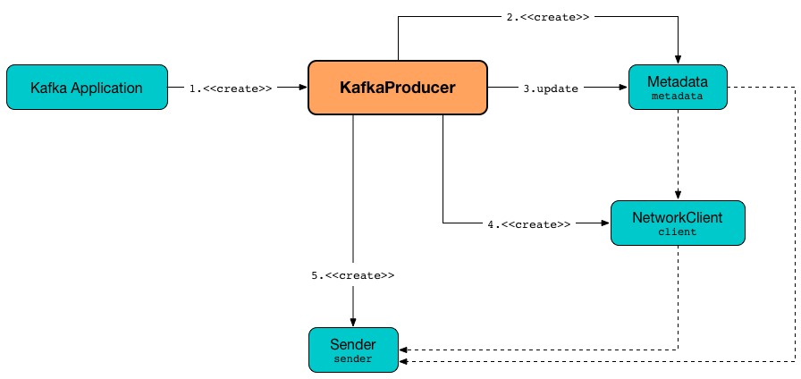

== [[KafkaProducer]] KafkaProducer -- Main Class For Kafka Producers

`KafkaProducer` is the default <<kafka-producer-Producer.adoc#, Producer>> client in Apache Kafka.

`KafkaProducer` is the class that a Kafka developer uses to <<send, send messages>> to a Kafka cluster.

[source, scala]
----
// Necessary imports
import org.apache.kafka.clients.producer.KafkaProducer
import org.apache.kafka.clients.producer.ProducerConfig
import org.apache.kafka.common.serialization.StringSerializer

// Creating a KafkaProducer
import java.util.Properties
val props = new Properties()
props.put(ProducerConfig.KEY_SERIALIZER_CLASS_CONFIG, classOf[StringSerializer].getName)
props.put(ProducerConfig.VALUE_SERIALIZER_CLASS_CONFIG, classOf[StringSerializer].getName)
props.put(ProducerConfig.BOOTSTRAP_SERVERS_CONFIG, ":9092")
val producer = new KafkaProducer[String, String](props)

// Creating a record to be sent
import org.apache.kafka.clients.producer.ProducerRecord
val r = new ProducerRecord[String, String]("0", "this is a message")

// Sending the record (with no Callback)
import java.util.concurrent.Future
import org.apache.kafka.clients.producer.RecordMetadata
val metadataF: Future[RecordMetadata] = producer.send(r)
----

`KafkaProducer` uses the <<kafka-producer-ProducerConfig.adoc#INTERCEPTOR_CLASSES_CONFIG, ProducerConfig.INTERCEPTOR_CLASSES_CONFIG>> configuration property to define <<interceptors, ProducerInterceptors>> that are notified (about successes and failures) every time `KafkaProducer` is requested to <<send, send a record to a topic>>.

`KafkaProducer` uses the <<kafka-producer-ProducerConfig.adoc#PARTITIONER_CLASS_CONFIG, ProducerConfig.PARTITIONER_CLASS_CONFIG>> configuration property to define the <<partitioner, Partitioner>> that is used (to <<kafka-producer-Partitioner.adoc#partition, compute the partition for a record>>) when `KafkaProducer` is requested to <<partition, partition>> (when requested to <<doSend, send a ProducerRecord to a Kafka cluster asynchronously>>).

Internally, `KafkaProducer` uses the <<sender, Kafka producer I/O thread>> that is responsible for sending produce requests to a Kafka cluster (on <<ioThread, kafka-producer-network-thread>> daemon thread of execution). The thread is started right when `KafkaProducer` is <<creating-instance, created>>.

.KafkaProducer


[[PRODUCER_METRIC_GROUP_NAME]]
`KafkaProducer` uses *producer-metrics* for...FIXME

[[logging]]
[TIP]
====
Enable `ALL` logging levels for `org.apache.kafka.clients.producer.KafkaProducer` logger to see what happens inside.

Add the following line to `config/log4j.properties`:

```
log4j.logger.org.apache.kafka.clients.producer.KafkaProducer=ALL
```

Refer to <<kafka-logging.adoc#, Logging>>.
====

=== [[metrics]] Performance Metrics

`KafkaProducer` exposes performance metrics.

.KafkaProducer's Metrics
[cols="1m,1m,2",options="header",width="100%"]
|===
| Metric Name
| Recording Level
| Description

| buffer-exhausted-records
| INFO
| [[buffer-exhausted-records]] Recorded when `KafkaProducer` is requested to <<doSend, send a ProducerRecord to a Kafka cluster asynchronously>> and `BufferExhaustedException` is reported.

| errors
|
| [[errors]] Recorded when `KafkaProducer` is requested to <<doSend, send a ProducerRecord to a Kafka cluster asynchronously>> and there were exceptions reported (e.g. `ApiException`, `InterruptedException`, `BufferExhaustedException` and `KafkaException`)

| produce-throttle-time-avg
|
| [[produce-throttle-time-avg]] Recorded when `NetworkClient` is requested to <<kafka-clients-NetworkClient.adoc#parseStructMaybeUpdateThrottleTimeMetrics, parseStructMaybeUpdateThrottleTimeMetrics>> (and a request was throttled due to quota violation)

| produce-throttle-time-max
|
| [[produce-throttle-time-max]] Recorded when `NetworkClient` is requested to <<kafka-clients-NetworkClient.adoc#parseStructMaybeUpdateThrottleTimeMetrics, parseStructMaybeUpdateThrottleTimeMetrics>> (and a request was throttled due to quota violation)
|===

=== [[send]] Sending ProducerRecord to Kafka Cluster Asynchronously With Producer Interceptors -- `send` Method

[source, java]
----
Future<RecordMetadata> send(
  ProducerRecord<K, V> record) // <1>
Future<RecordMetadata> send(
  ProducerRecord<K, V> record,
  Callback callback)
----
<1> Uses no callback (`null`)

NOTE: `send` is a part of <<kafka-producer-Producer.adoc#send, Producer Contract>> to send a <<kafka-producer-ProducerRecord.adoc#, ProducerRecord>> to a Kafka cluster asynchronously.

`send` requests the <<interceptors, ProducerInterceptors>> to <<kafka-producer-internals-ProducerInterceptors.adoc#onSend, pass the ProducerRecord through a chain of registered producer interceptors>>.

In the end, `send` <<doSend, sends a ProducerRecord to a Kafka cluster asynchronously>> (with the intercepted <<kafka-producer-ProducerRecord.adoc#, ProducerRecord>> and the <<kafka-producer-Callback.adoc#, Callback>>).

==== [[doSend]] Sending ProducerRecord to Kafka Cluster Asynchronously -- `doSend` Internal Method

[source, java]
----
Future<RecordMetadata> doSend(
  ProducerRecord<K, V> record,
  Callback callback)
----

`doSend`...FIXME

`doSend` requests the <<accumulator, RecordAccumulator>> to <<kafka-producer-internals-RecordAccumulator.adoc#append, append the serialized key and value>>.

`doSend`...FIXME

NOTE: `doSend` is used exclusively when `KafkaProducer` is requested to <<send, send a ProducerRecord to a Kafka cluster asynchronously with producer interceptors>>.

=== [[configureClusterResourceListeners]] Configuring ClusterResourceListeners -- `configureClusterResourceListeners` Internal Method

[source, java]
----
ClusterResourceListeners configureClusterResourceListeners(
  Serializer<K> keySerializer,
  Serializer<V> valueSerializer,
  List<?>... candidateLists)
----

`configureClusterResourceListeners` creates a link:kafka-ClusterResourceListener.adoc#ClusterResourceListeners[ClusterResourceListeners] and registers `ClusterResourceListener` instances from the input `candidateLists`, `keySerializer` and `valueSerializer`.

[NOTE]
====
`configureClusterResourceListeners` is used exclusively when `KafkaProducer` is <<creating-instance, created>> (to create the <<metadata, Metadata>>) with the following input arguments:

* <<keySerializer, key>> and <<valueSerializer, value>> serializers (defined when `KafkaProducer` is created)

* link:kafka-producer-ProducerInterceptor.adoc[ProducerInterceptors] from link:kafka-properties.adoc#interceptor.classes[interceptor.classes] Kafka property

* link:kafka-MetricsReporter.adoc[MetricsReporters] from link:kafka-properties.adoc#metric_reporters[metric.reporters] Kafka property
====

=== [[partitionsFor]] Requesting Partitions for Topic -- `partitionsFor` Method

[source, java]
----
List<PartitionInfo> partitionsFor(String topic)
----

NOTE: `partitionsFor` is a part of link:kafka-producer-Producer.adoc#partitionsFor[Producer Contract].

`partitionsFor` <<waitOnMetadata, waits on cluster metadata>> for the input `topic` and <<maxBlockTimeMs, max.block.ms>> time. Once retrieved, `partitionsFor` requests `Cluster` for the link:kafka-common-Cluster.adoc#partitionsForTopic[partitions].

=== [[waitOnMetadata]] Waiting for Cluster Metadata (with Partitions for Topic) -- `waitOnMetadata` Internal Recursive Method

[source, java]
----
ClusterAndWaitTime waitOnMetadata(
  String topic,
  Integer partition,
  long maxWaitMs) throws InterruptedException
----

`waitOnMetadata` link:kafka-clients-Metadata.adoc#add[adds] the input `topic` to <<metadata, Metadata>>.

`waitOnMetadata` first checks if the available cluster metadata could be current enough.

`waitOnMetadata` requests <<metadata, Metadata>> for the link:kafka-clients-Metadata.adoc#fetch[current cluster information] and then requests the cluster for the link:kafka-common-Cluster.adoc#partitionCountForTopic[number of partitions] of the input `topic`.

If the cluster metadata is not current enough (i.e. the number of partitions is unavailable or the `partition` is above the current count), `waitOnMetadata` prints out the following TRACE message to the logs:

```
Requesting metadata update for topic [topic].
```

`waitOnMetadata` requests <<metadata, Metadata>> for link:kafka-clients-Metadata.adoc#requestUpdate[update] and requests <<sender, Sender>> to link:kafka-producer-internals-Sender.adoc#wakeup[wake up].

`waitOnMetadata` then requests <<metadata, Metadata>> to link:kafka-clients-Metadata.adoc#awaitUpdate[wait for a metadata update] and then <<metadata, Metadata>> for the link:kafka-clients-Metadata.adoc#fetch[current cluster information].

`waitOnMetadata` keeps doing it until the link:kafka-common-Cluster.adoc#partitionCountForTopic[number of partitions] of the input `topic` is available.

`waitOnMetadata` reports a `TimeoutException` when `maxWaitMs` has elapsed.

```
Failed to update metadata after [maxWaitMs] ms.
```

`waitOnMetadata` reports a `TopicAuthorizationException` when the access to the `topic` is unauthorized.

`waitOnMetadata` reports a `KafkaException` when the `partition` is above the number of available partitions.

```
Invalid partition given with record: [partition] is not in the range [0...[partitionsCount]).
```

NOTE: `waitOnMetadata` is used when `KafkaProducer` is requested for the <<partitionsFor, partitions of a topic>> and to <<doSend, send a ProducerRecord to a Kafka cluster asynchronously>>.

=== [[creating-instance]] Creating KafkaProducer Instance

`KafkaProducer` takes the following when created:

* [[config]] <<kafka-producer-ProducerConfig.adoc#, ProducerConfig>>
* [[keySerializer]] <<kafka-common-serialization-Serializer.adoc#, Serializer>> for keys
* [[valueSerializer]] <<kafka-common-serialization-Serializer.adoc#, Serializer>> for values
* <<kafka-clients-Metadata.adoc#, Metadata>>
* [[kafkaClient]] <<kafka-clients-KafkaClient.adoc#, KafkaClient>>

`KafkaProducer` initializes the <<internal-registries, internal registries and counters>>.

While being created, `KafkaProducer` saves the <<config, ProducerConfig>> in the <<producerConfig, producerConfig>> internal registry and the <<time, time>> becomes `SYSTEM`.

`KafkaProducer` sets the <<clientId, clientId>> as the <<kafka-producer-ProducerConfig.adoc#CLIENT_ID_CONFIG, ProducerConfig.CLIENT_ID_CONFIG>> or uses `producer-[id]`.

`KafkaProducer` prints out the following `TRACE` message to the logs:

```
Starting the Kafka producer
```

`KafkaProducer` creates a `MetricConfig` with the following:

* Number of samples as <<kafka-producer-ProducerConfig.adoc#METRICS_NUM_SAMPLES_CONFIG, ProducerConfig.METRICS_NUM_SAMPLES_CONFIG>>

* Time window of <<kafka-producer-ProducerConfig.adoc#METRICS_SAMPLE_WINDOW_MS_CONFIG, ProducerConfig.METRICS_SAMPLE_WINDOW_MS_CONFIG>> milliseconds

* Recording level as <<kafka-producer-ProducerConfig.adoc#METRICS_RECORDING_LEVEL_CONFIG, ProducerConfig.METRICS_RECORDING_LEVEL_CONFIG>>

* Metrics tags with a single pair of `client-id` and the <<clientId, clientId>>

`KafkaProducer` uses the <<kafka-producer-ProducerConfig.adoc#METRIC_REPORTER_CLASSES_CONFIG, ProducerConfig.METRIC_REPORTER_CLASSES_CONFIG>> as the <<kafka-MetricsReporter.adoc#, MetricsReporters>> and adds the <<kafka-MetricsReporter.adoc#JmxReporter, JmxReporter>> (with `kafka.producer` prefix).

`KafkaProducer` sets the <<metrics, metrics>> as a new <<kafka-Metrics.adoc#, Metrics>> (with the `MetricConfig`, the `MetricsReporters` and the <<time, time>>).

`KafkaProducer` sets the <<partitioner, partitioner>> as <<kafka-producer-ProducerConfig.adoc#PARTITIONER_CLASS_CONFIG, ProducerConfig.PARTITIONER_CLASS_CONFIG>>.

`KafkaProducer` sets the <<keySerializer, keySerializer>> as follows:

* <<kafka-producer-ProducerConfig.adoc#KEY_SERIALIZER_CLASS_CONFIG, ProducerConfig.KEY_SERIALIZER_CLASS_CONFIG>> when the input `keySerializer` was not defined and immediately requests the `Serializer` to <<kafka-common-serialization-Serializer.adoc#configure, configure>> itself

* The input `keySerializer`

`KafkaProducer` sets the <<valueSerializer, valueSerializer>> as follows:

* <<kafka-producer-ProducerConfig.adoc#VALUE_SERIALIZER_CLASS_CONFIG, ProducerConfig.VALUE_SERIALIZER_CLASS_CONFIG>> when the input `keySerializer` was not defined and immediately requests the `Serializer` to <<kafka-common-serialization-Serializer.adoc#configure, configure>> itself

* The input `valueSerializer`

`KafkaProducer` sets the <<interceptors, interceptors>> as <<kafka-producer-ProducerConfig.adoc#INTERCEPTOR_CLASSES_CONFIG, ProducerConfig.INTERCEPTOR_CLASSES_CONFIG>>.

`KafkaProducer` sets the following:

* <<maxRequestSize, maxRequestSize>> as <<kafka-producer-ProducerConfig.adoc#MAX_REQUEST_SIZE_CONFIG, ProducerConfig.MAX_REQUEST_SIZE_CONFIG>>

* <<totalMemorySize, totalMemorySize>> as <<kafka-producer-ProducerConfig.adoc#BUFFER_MEMORY_CONFIG, ProducerConfig.BUFFER_MEMORY_CONFIG>>

* <<compressionType, compressionType>> as <<kafka-producer-ProducerConfig.adoc#COMPRESSION_TYPE_CONFIG, ProducerConfig.COMPRESSION_TYPE_CONFIG>>

* <<maxBlockTimeMs, maxBlockTimeMs>> as <<kafka-producer-ProducerConfig.adoc#MAX_BLOCK_MS_CONFIG, ProducerConfig.MAX_BLOCK_MS_CONFIG>>

* <<requestTimeoutMs, requestTimeoutMs>> as <<kafka-producer-ProducerConfig.adoc#REQUEST_TIMEOUT_MS_CONFIG, ProducerConfig.REQUEST_TIMEOUT_MS_CONFIG>>

`KafkaProducer` creates a new `ApiVersions` for the <<apiVersions, apiVersions>>.

`KafkaProducer` creates a new <<kafka-producer-internals-RecordAccumulator.adoc#, RecordAccumulator>> for the <<accumulator, accumulator>> with the following configuration properties:

* <<kafka-producer-ProducerConfig.adoc#BATCH_SIZE_CONFIG, ProducerConfig.BATCH_SIZE_CONFIG>>

* <<totalMemorySize, totalMemorySize>>, i.e. <<kafka-producer-ProducerConfig.adoc#BUFFER_MEMORY_CONFIG, ProducerConfig.BUFFER_MEMORY_CONFIG>>

* <<compressionType, compressionType>>, i.e. <<kafka-producer-ProducerConfig.adoc#COMPRESSION_TYPE_CONFIG, ProducerConfig.COMPRESSION_TYPE_CONFIG>>

* <<kafka-producer-ProducerConfig.adoc#LINGER_MS_CONFIG, ProducerConfig.LINGER_MS_CONFIG>>

* <<kafka-producer-ProducerConfig.adoc#RETRY_BACKOFF_MS_CONFIG, ProducerConfig.RETRY_BACKOFF_MS_CONFIG>>

`KafkaProducer` sets the <<metadata, metadata>> as follows:

* Creates a new <<kafka-clients-Metadata.adoc#, Metadata>> (with <<kafka-producer-ProducerConfig.adoc#RETRY_BACKOFF_MS_CONFIG, ProducerConfig.RETRY_BACKOFF_MS_CONFIG>>, <<kafka-producer-ProducerConfig.adoc#METADATA_MAX_AGE_CONFIG, ProducerConfig.METADATA_MAX_AGE_CONFIG>> and <<configureClusterResourceListeners, configureClusterResourceListeners>>) and immediately requests the <<metadata, Metadata>> to <<kafka-clients-Metadata.adoc#update, update>> (with <<kafka-producer-ProducerConfig.adoc#BOOTSTRAP_SERVERS_CONFIG, ProducerConfig.BOOTSTRAP_SERVERS_CONFIG>>)

* The input `metadata` if given

`KafkaProducer` creates a new <<kafka-clients-NetworkClient.adoc#, NetworkClient>> (unless the input <<kafka-clients-KafkaClient.adoc#, KafkaClient>> was given) with the following configuration properties:

* <<kafka-producer-ProducerConfig.adoc#CONNECTIONS_MAX_IDLE_MS_CONFIG, ProducerConfig.CONNECTIONS_MAX_IDLE_MS_CONFIG>>

* <<kafka-producer-ProducerConfig.adoc#RECONNECT_BACKOFF_MS_CONFIG, ProducerConfig.RECONNECT_BACKOFF_MS_CONFIG>>

* <<kafka-producer-ProducerConfig.adoc#RECONNECT_BACKOFF_MAX_MS_CONFIG, ProducerConfig.RECONNECT_BACKOFF_MAX_MS_CONFIG>>

* <<kafka-producer-ProducerConfig.adoc#SEND_BUFFER_CONFIG, ProducerConfig.SEND_BUFFER_CONFIG>>

* <<kafka-producer-ProducerConfig.adoc#RECEIVE_BUFFER_CONFIG, ProducerConfig.RECEIVE_BUFFER_CONFIG>>

* <<kafka-producer-ProducerConfig.adoc#REQUEST_TIMEOUT_MS_CONFIG, ProducerConfig.REQUEST_TIMEOUT_MS_CONFIG>>

`KafkaProducer` creates a new <<kafka-producer-internals-Sender.adoc#, Sender>> as the <<sender, sender>> with the following configuration properties:

* <<kafka-producer-ProducerConfig.adoc#MAX_REQUEST_SIZE_CONFIG, ProducerConfig.MAX_REQUEST_SIZE_CONFIG>>

* <<kafka-producer-ProducerConfig.adoc#REQUEST_TIMEOUT_MS_CONFIG, ProducerConfig.REQUEST_TIMEOUT_MS_CONFIG>>

* <<kafka-producer-ProducerConfig.adoc#RETRY_BACKOFF_MS_CONFIG, ProducerConfig.RETRY_BACKOFF_MS_CONFIG>>

`KafkaProducer` sets the <<transactionManager, transactionManager>> as <<configureTransactionState, configureTransactionState>>.

`KafkaProducer` <<configureRetries, configureRetries>> for the number of retries.

`KafkaProducer` <<configureInflightRequests, configureInflightRequests>> for the maximum number of in-flight requests.

`KafkaProducer` <<configureAcks, configureAcks>> for acks.

`KafkaProducer` creates a new <<kafka-ProducerMetrics.adoc#, ProducerMetrics>> (with the <<metrics, metrics>>).

`KafkaProducer` starts the <<ioThread, kafka-producer-network-thread>> daemon thread of execution for the <<sender, sender>>.

`KafkaProducer` requests the `ProducerConfig` to <<kafka-producer-ProducerConfig.adoc#logUnused, logUnused>>.

`KafkaProducer` registers the AppInfo MBean (with `kafka.producer` JMX prefix, the <<clientId, clientId>> and the <<metrics, metrics>>).

In the end, `KafkaProducer` prints out the following DEBUG message to the logs:

```
Kafka producer started
```

In case of any errors, `KafkaProducer` <<close, closes>> itself with `0` millis timeout and throws a `KafkaException`:

```
Failed to construct kafka producer
```

=== [[partition]] Computing Partition For ProducerRecord -- `partition` Internal Method

[source, java]
----
int partition(
  ProducerRecord<K, V> record,
  byte[] serializedKey,
  byte[] serializedValue,
  Cluster cluster)
----

`partition` requests the `ProducerRecord` for the <<kafka-producer-ProducerRecord.adoc#partition, partition>> and return it when specified. Otherwise, `partition` requests the <<partitioner, Partitioner>> for the <<kafka-producer-Partitioner.adoc#partition, partition>>.

NOTE: `partition` is used exclusively when `KafkaProducer` is requested to <<doSend, send a ProducerRecord to a Kafka cluster asynchronously>>.

=== [[beginTransaction]] `beginTransaction` Method

[source, java]
----
void beginTransaction() throws ProducerFencedException
----

NOTE: `beginTransaction` is part of the <<kafka-producer-Producer.adoc#beginTransaction, Producer Contract>> to...FIXME.

`beginTransaction` simply requests the internal <<transactionManager, TransactionManager>> to <<kafka-producer-internals-TransactionManager.adoc#beginTransaction, beginTransaction>>.

`beginTransaction` throws an `IllegalStateException` when the <<transactionManager, TransactionManager>> is undefined (`null`).

```
Cannot use transactional methods without enabling transactions by setting the transactional.id configuration property
```

=== [[configureTransactionState]] `configureTransactionState` Static Internal Method

[source, java]
----
TransactionManager configureTransactionState(
  ProducerConfig config,
  LogContext logContext,
  Logger log)
----

`configureTransactionState`...FIXME

NOTE: `configureTransactionState` is used exclusively when `KafkaProducer` is created (and initializes a <<transactionManager, TransactionManager>>).

=== [[close]] Closing Kafka Producer -- `close` Method

[source, java]
----
void close() // <1>
void close(Duration timeout) // <2>
// private API
void close(Duration timeout, boolean swallowException)
----
<1> Uses the maximum timeout (`Long.MAX_VALUE`)
<2> Disables `swallowException` flag (`false`)

NOTE: `close` is a part of <<kafka-producer-Producer.adoc#close, Producer Contract>>.

`close`...FIXME

=== [[flush]] Flushing Accumulated Records -- `flush` Method

[source, java]
----
void flush()
----

NOTE: `flush` is a part of <<kafka-producer-Producer.adoc#flush, Producer Contract>>.

`flush`...FIXME

=== [[initTransactions]] `initTransactions` Method

[source, java]
----
void initTransactions()
----

NOTE: `initTransactions` is a part of <<kafka-producer-Producer.adoc#initTransactions, Producer Contract>>.

`initTransactions`...FIXME

=== [[sendOffsetsToTransaction]] `sendOffsetsToTransaction` Method

[source, java]
----
void sendOffsetsToTransaction(
  Map<TopicPartition, OffsetAndMetadata> offsets,
  String consumerGroupId)
throws ProducerFencedException
----

NOTE: `sendOffsetsToTransaction` is a part of <<kafka-producer-Producer.adoc#sendOffsetsToTransaction, Producer Contract>>.

`sendOffsetsToTransaction`...FIXME

=== [[commitTransaction]] `commitTransaction` Method

[source, java]
----
void commitTransaction()
throws ProducerFencedException
----

NOTE: `commitTransaction` is a part of <<kafka-producer-Producer.adoc#commitTransaction, Producer Contract>>.

`commitTransaction`...FIXME

=== [[abortTransaction]] `abortTransaction` Method

[source, java]
----
void abortTransaction()
throws ProducerFencedException
----

NOTE: `abortTransaction` is a part of <<kafka-producer-Producer.adoc#abortTransaction, Producer Contract>>.

`abortTransaction`...FIXME

=== [[newSender]] `newSender` Method

[source, scala]
----
Sender newSender(
  LogContext logContext,
  KafkaClient kafkaClient,
  ProducerMetadata metadata)
----

`newSender`...FIXME

NOTE: `newSender` is used when `KafkaProducer` is <<creating-instance, created>>.

=== [[internal-properties]] Internal Properties

[cols="30m,70",options="header",width="100%"]
|===
| Name
| Description

| accumulator
a| [[accumulator]] <<kafka-producer-internals-RecordAccumulator.adoc#, RecordAccumulator>>

Used when:

* <<doSend, Sending a ProducerRecord to a Kafka cluster asynchronously>>

* <<newSender, Creating a new Sender>>

* <<flush, Flushing accumulated records>>

| clientId
a| [[clientId]] Client ID per <<kafka-producer-ProducerConfig.adoc#CLIENT_ID_CONFIG, CLIENT_ID_CONFIG>> (if defined) or `producer-[number]`

Used when:

* `KafkaProducer` is requested for <<logging, logging>>

* <<kafka-clients-NetworkClient.adoc#, NetworkClient>> is created

| interceptors
a| [[interceptors]] <<kafka-producer-ProducerInterceptor.adoc#, ProducerInterceptors>> that are notified (about successes and failures) when `KafkaProducer` is requested to <<send, send a record to a topic>>

The `ProducerInterceptors` are initialized when the `KafkaProducer` is <<creating-instance, created>> using <<kafka-producer-ProducerConfig.adoc#INTERCEPTOR_CLASSES_CONFIG, ProducerConfig.INTERCEPTOR_CLASSES_CONFIG>> configuration property.

| ioThread
a| [[ioThread]] *kafka-producer-network-thread* daemon thread of execution for the <<sender, sender>>

| maxBlockTimeMs
a| [[maxBlockTimeMs]] Time `KafkaProducer` uses to block when requesting <<partitionsFor, partitions for a topic>>.

NOTE: Use link:kafka-properties.adoc#max.block.ms[max.block.ms] Kafka property to set the value.

| metadata
a| [[metadata]] <<kafka-clients-Metadata.adoc#, Metadata>>

* Created when `KafkaProducer` is <<creating-instance, created>> with the following properties:
** link:kafka-properties-retry-backoff-ms.adoc[retry.backoff.ms] for link:kafka-clients-Metadata.adoc#refreshBackoffMs[refreshBackoffMs]
** link:kafka-properties.adoc#metadata.max.age.ms[metadata.max.age.ms] for link:kafka-clients-Metadata.adoc#metadataExpireMs[metadataExpireMs]
** link:kafka-clients-Metadata.adoc#allowAutoTopicCreation[allowAutoTopicCreation] flag enabled
** link:kafka-clients-Metadata.adoc#topicExpiryEnabled[topicExpiryEnabled] flag enabled

* link:kafka-clients-Metadata.adoc#update[Updated] with a bootstrap cluster when `KafkaProducer` is <<creating-instance, created>>

* Used in <<waitOnMetadata, waitOnMetadata>>

| partitioner
a| [[partitioner]] <<kafka-producer-Partitioner.adoc#, Partitioner>> that is used (to <<kafka-producer-Partitioner.adoc#partition, compute the partition for a record>>) when `KafkaProducer` is requested to <<partition, partition>> (when requested to <<doSend, send a ProducerRecord to a Kafka cluster asynchronously>>)

The `Partitioner` is initialized when the `KafkaProducer` is <<creating-instance, created>> using <<kafka-producer-ProducerConfig.adoc#PARTITIONER_CLASS_CONFIG, ProducerConfig.PARTITIONER_CLASS_CONFIG>> configuration property.

| producerConfig
a| [[producerConfig]] <<kafka-producer-ProducerConfig.adoc#, ProducerConfig>>

| sender
a| [[sender]] <<kafka-producer-internals-Sender.adoc#, Kafka producer I/O thread>> (aka `Sender`) that is <<kafka-producer-internals-Sender.adoc#run, started>> when `KafkaProducer` is <<creating-instance, created>>.

| time
a| [[time]] Time abstraction (with `SYSTEM` being the default).

| transactionManager
a| [[transactionManager]] <<kafka-producer-internals-TransactionManager.adoc#, TransactionManager>>

Used when:

* `KafkaProducer` is created (and creates a <<accumulator, RecordAccumulator>> and a <<newSender, Sender>>)

* For transactional public methods: <<initTransactions, initTransactions>>, <<beginTransaction, beginTransaction>>, <<sendOffsetsToTransaction, sendOffsetsToTransaction>>, <<commitTransaction, commitTransaction>>, <<abortTransaction, abortTransaction>>

* <<doSend, Sending a ProducerRecord to a Kafka cluster asynchronously>>

|===
