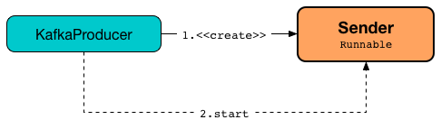

== [[Sender]] Sender -- Kafka Producer Network Thread

`Sender` is a *Kafka producer network thread* (of execution) that <<run, runs indefinitely and sends ProduceRequests to a Kafka cluster>>.

.Sender and KafkaProducer


`Sender` is <<creating-instance, created>> when `KafkaProducer` is link:kafka-producer-KafkaProducer.adoc#sender[created] and immediately <<run, started>> under the name **kafka-producer-network-thread | [clientId]** (as a <<kafka-producer-KafkaProducer.adoc#ioThread, daemon thread>>).

Every <<runOnce, runOnce>>, `Sender` takes (_drains_) up to <<kafka-producer-ProducerConfig.adoc#max.request.size, max.request.size>> messages from the <<accumulator, record accumulator>> (that batches records) and eventually <<sendProduceRequests, sendProduceRequests>> to every active Kafka broker for which there is at least one <<kafka-producer-internals-ProducerBatch.adoc#, ProducerBatch>>.

`KafkaProducer` uses the following configuration properties to create a `Sender`:

* <<kafka-producer-ProducerConfig.adoc#max.in.flight.requests.per.connection, max.in.flight.requests.per.connection>> for the <<guaranteeMessageOrder, guaranteeMessageOrder>>

* <<kafka-producer-ProducerConfig.adoc#max.request.size, max.request.size>> for the <<maxRequestSize, maxRequestSize>>

* <<kafka-producer-ProducerConfig.adoc#acks, acks>> for the <<acks, acks>>

* <<kafka-producer-ProducerConfig.adoc#retries, retries>> for the <<retries, retries>>

* <<kafka-producer-ProducerConfig.adoc#request.timeout.ms, request.timeout.ms>> for the <<requestTimeoutMs, requestTimeoutMs>>

* <<kafka-producer-ProducerConfig.adoc#retry.backoff.ms, retry.backoff.ms>> for the <<retryBackoffMs, retryBackoffMs>>

[[logging]]
[TIP]
====
Enable `ALL` logging level for `org.apache.kafka.clients.producer.internals.Sender` logger to see what happens inside.

Add the following line to `config/tools-log4j.properties`:

```
log4j.logger.org.apache.kafka.clients.producer.internals.Sender=ALL
```

Refer to link:kafka-logging.adoc[Logging].
====

=== [[creating-instance]] Creating Sender Instance

`Sender` takes the following to be created:

* [[logContext]] `LogContext`
* [[client]] <<kafka-clients-KafkaClient.adoc#, KafkaClient>>
* [[metadata]] <<kafka-clients-Metadata.adoc#, Metadata>>
* [[accumulator]] <<kafka-producer-internals-RecordAccumulator.adoc#, RecordAccumulator>>
* [[guaranteeMessageOrder]] `guaranteeMessageOrder` flag
* [[maxRequestSize]] `maxRequestSize`
* [[acks]] `acks`
* [[retries]] The number of retries
* [[metricsRegistry]] `SenderMetricsRegistry`
* [[time]] `Time`
* [[requestTimeout]] `requestTimeout`
* [[retryBackoffMs]] `retryBackoffMs`
* [[transactionManager]] <<kafka-producer-internals-TransactionManager.adoc#, TransactionManager>>
* [[apiVersions]] `ApiVersions`

`Sender` initializes the <<internal-properties, internal properties>>.

=== [[run]] Starting Thread of Execution -- `run` Method

[source, java]
----
void run()
----

NOTE: `run` is a part of link:++https://docs.oracle.com/en/java/javase/11/docs/api/java.base/java/lang/Runnable.html#run()++[java.lang.Runnable] that is executed when the thread is started.

`run` first prints out the following DEBUG message to the logs:

```
Starting Kafka producer I/O thread.
```

`run` keeps <<runOnce, running>> until the <<running, running>> internal flag is off.

Once the <<running, running>> internal flag is off, `run` prints out the following DEBUG message to the logs:

```
Beginning shutdown of Kafka producer I/O thread, sending remaining records.
```

`run` may wait until...FIXME (`(!forceClose...`)

In the end, `run` requests the <<client, KafkaClient>> to <<kafka-clients-KafkaClient.adoc#close, close>> and prints out the following DEBUG message to the logs:

```
Shutdown of Kafka producer I/O thread has completed.
```

==== [[runOnce]] Running Single Iteration of Sending -- `runOnce` Method

[source, java]
----
void runOnce()
----

`runOnce` simply <<sendProducerData, sendProducerData>> followed by requesting the <<client, KafkaClient>> to <<kafka-clients-KafkaClient.adoc#poll, poll>>.

With a <<transactionManager, transactionManager>> assigned, `runOnce`...FIXME

NOTE: `run` is used exclusively when `Sender` is requested to <<run, run>> (as a thread of execution).

==== [[sendProducerData]] `sendProducerData` Internal Method

[source, java]
----
long sendProducerData(long now)
----

`sendProducerData` requests the <<metadata, ProducerMetadata>> to <<kafka-clients-Metadata.adoc#fetch, get the current cluster metadata (without blocking)>>.

`sendProducerData` requests the <<accumulator, RecordAccumulator>> to <<kafka-producer-internals-RecordAccumulator.adoc#ready, get the current cluster metadata (without blocking)>>.

`sendProducerData` requests the <<accumulator, RecordAccumulator>> to <<kafka-producer-internals-RecordAccumulator.adoc#drain, drain (create ProducerBatches per TopicPartition for ready brokers)>>.

`sendProducerData` <<addToInflightBatches, adds the batches to inflight batches>>.

`sendProducerData`...FIXME (`guaranteeMessageOrder`)

`sendProducerData` requests the <<sensors, SenderMetrics>> to <<kafka-producer-internals-SenderMetrics.adoc#updateProduceRequestMetrics, updateProduceRequestMetrics>>.

`sendProducerData`...FIXME

In the end, `sendProducerData` <<sendProduceRequests, sendProduceRequests>> (for the batches).

NOTE: `sendProducerData` is used exclusively when `Sender` is requested to <<runOnce, run a single iteration of sending>>.

==== [[sendProduceRequests]] Sending ProduceRequests -- `sendProduceRequests` Internal Method

[source, java]
----
void sendProduceRequests(
  Map<Integer, List<ProducerBatch>> collated,
  long now)
----

`sendProduceRequests` simply goes over the given `collated` collection (of <<kafka-producer-internals-ProducerBatch.adoc#, ProducerBatches>> per partition ID) and <<sendProduceRequest, sendProduceRequest>> for every pair.

NOTE: `sendProduceRequests` is used exclusively when `Sender` is requested to <<sendProducerData, sendProducerData>>.

==== [[sendProduceRequest]] Sending ProduceRequest to Broker -- `sendProduceRequest` Internal Method

[source, java]
----
void sendProduceRequest(
  long now,
  int destination,
  short acks,
  int timeout,
  List<ProducerBatch> batches)
----

`sendProduceRequest`...FIXME

`sendProduceRequest` requests the `ProduceRequest.Builder` to <<kafka-common-requests-ProduceRequest.adoc#forMagic, create a ProduceRequest.Builder instance (for a given magic number)>>.

`sendProduceRequest` creates a new <<kafka-clients-RequestCompletionHandler.adoc#, RequestCompletionHandler>> that <<handleProduceResponse, handleProduceResponse>> when a <<kafka-clients-RequestCompletionHandler.adoc#onComplete, request is complete>>.

`sendProduceRequest` requests the <<client, KafkaClient>> to <<kafka-clients-KafkaClient.adoc#newClientRequest, create a new ClientRequest>> (for the <<kafka-common-requests-ProduceRequest.adoc#ProduceRequest.Builder, ProduceRequest.Builder>> and <<kafka-clients-RequestCompletionHandler.adoc#, RequestCompletionHandler>>).

NOTE: `sendProduceRequest` creates a new <<kafka-clients-ClientRequest.adoc#, ClientRequest>> with the `expectResponse` flag on when `acks` argument is non-``0``.

`sendProduceRequest` requests the <<client, KafkaClient>> to <<kafka-clients-KafkaClient.adoc#send, send the ClientRequest>>.

In the end, `sendProduceRequest` prints out the following TRACE message to the logs:

```
Sent produce request to [nodeId]: [requestBuilder]
```

NOTE: `sendProduceRequest` is used exclusively when `Sender` is requested to <<sendProduceRequests, sendProduceRequests>>.

==== [[handleProduceResponse]] Handling ProduceResponse -- `handleProduceResponse` Internal Method

[source, java]
----
void handleProduceResponse(
  ClientResponse response,
  Map<TopicPartition, ProducerBatch> batches,
  long now)
----

`handleProduceResponse`...FIXME

NOTE: `handleProduceResponse` is used exclusively when `Sender` is requested to <<sendProduceRequest, send a ProduceRequest>>.

==== [[completeBatch]] `completeBatch` Internal Method

[source, java]
----
void completeBatch(
  ProducerBatch batch,
  ProduceResponse.PartitionResponse response,
  long correlationId,
  long now,
  long throttleUntilTimeMs)
----

`completeBatch`...FIXME

NOTE: `completeBatch` is used exclusively when `Sender` is requested to <<handleProduceResponse, handle a ProduceResponse>>.

==== [[maybeSendAndPollTransactionalRequest]] `maybeSendAndPollTransactionalRequest` Internal Method

[source, java]
----
boolean maybeSendAndPollTransactionalRequest()
----

`maybeSendAndPollTransactionalRequest`...FIXME

NOTE: `maybeSendAndPollTransactionalRequest` is used when `Sender` is requested to <<runOnce, run a single iteration of sending>>.

=== [[addToInflightBatches]] `addToInflightBatches` Method

[source, java]
----
void addToInflightBatches(Map<Integer, List<ProducerBatch>> batches)
----

`addToInflightBatches`...FIXME

NOTE: `addToInflightBatches` is used exclusively when `Sender` is requested to <<sendProducerData, sendProducerData>>.

=== [[maybeSendTransactionalRequest]] `maybeSendTransactionalRequest` Internal Method

[source, java]
----
boolean maybeSendTransactionalRequest(long now)
----

`maybeSendTransactionalRequest`...FIXME

NOTE: `maybeSendTransactionalRequest` is used exclusively when `Sender` is <<run, running>>.

=== [[maybeWaitForProducerId]] `maybeWaitForProducerId` Internal Method

[source, java]
----
void maybeWaitForProducerId()
----

`maybeWaitForProducerId`...FIXME

NOTE: `maybeWaitForProducerId` is used exclusively when `Sender` is <<run, running>>.

=== [[awaitLeastLoadedNodeReady]] `awaitLeastLoadedNodeReady` Internal Method

[source, java]
----
Node awaitLeastLoadedNodeReady(long remainingTimeMs)
----

`awaitLeastLoadedNodeReady`...FIXME

NOTE: `awaitLeastLoadedNodeReady` is used when `Sender` is requsted to <<maybeSendTransactionalRequest, maybeSendTransactionalRequest>> and <<maybeWaitForProducerId, maybeWaitForProducerId>>.

=== [[initiateClose]] `initiateClose` Method

[source, java]
----
void initiateClose()
----

`initiateClose` requests the <<accumulator, RecordAccumulator>> to <<kafka-producer-internals-RecordAccumulator.adoc#close, close>>.

In the end, `initiateClose` turns the <<running, running>> internal flag off followed by <<wakeup, waking up the Kafka client>>.

[NOTE]
====
`initiateClose` is used when:

* `KafkaProducer` is requested to <<kafka-producer-KafkaProducer.adoc#close, close>>

* `Sender` is requested to <<forceClose, forceClose>>
====

=== [[wakeup]] `wakeup` Method

[source, java]
----
void wakeup()
----

`wakeup` merely requests the <<client, KafkaClient>> to <<kafka-clients-KafkaClient.adoc#wakeup, wakeup>>.

[NOTE]
====
`wakeup` is used when:

* `KafkaProducer` is requested to <<kafka-producer-KafkaProducer.adoc#initTransactions, initTransactions>>, <<kafka-producer-KafkaProducer.adoc#sendOffsetsToTransaction, sendOffsetsToTransaction>>, <<kafka-producer-KafkaProducer.adoc#commitTransaction, commitTransaction>>, <<kafka-producer-KafkaProducer.adoc#abortTransaction, abortTransaction>>, <<kafka-producer-KafkaProducer.adoc#doSend, doSend>>, <<kafka-producer-KafkaProducer.adoc#waitOnMetadata, waitOnMetadata>>, and <<kafka-producer-KafkaProducer.adoc#flush, flush>>

* `Sender` is requested to <<initiateClose, initiateClose>>
====

=== [[forceClose]] `forceClose` Method

[source, java]
----
void forceClose()
----

`forceClose`...FIXME

NOTE: `forceClose` is used exclusively when `KafkaProducer` is requested to <<kafka-producer-KafkaProducer.adoc#close, close>>.

=== [[reenqueueBatch]] `reenqueueBatch` Internal Method

[source, java]
----
void reenqueueBatch(
  ProducerBatch batch,
  long currentTimeMs)
----

`reenqueueBatch`...FIXME

NOTE: `reenqueueBatch` is used when...FIXME

=== [[internal-properties]] Internal Properties

[cols="30m,70",options="header",width="100%"]
|===
| Name
| Description

| running
a| [[running]] Flag that controls whether <<run, run>> should stop (`false`) or not (`true`)

* Enabled (`true`) by default when `Sender` is <<creating-instance, created>>

* Disabled (`false`) when `Sender` is requested to <<initiateClose, initiateClose>>

|===
