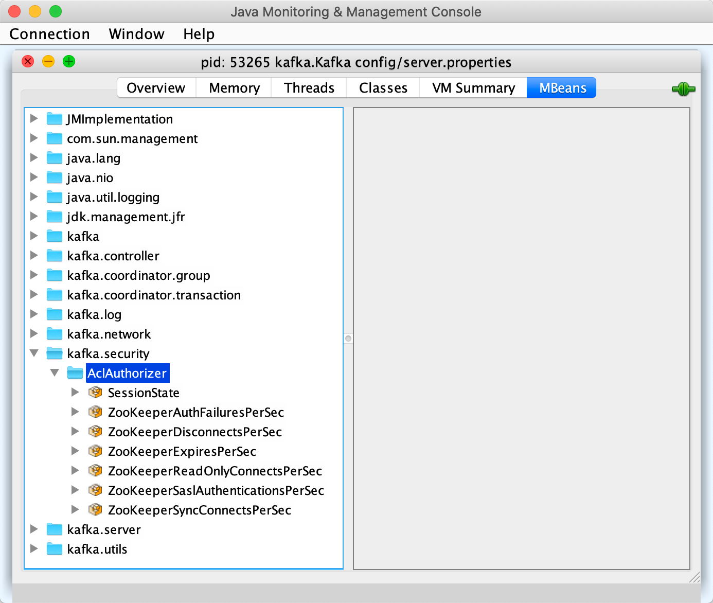

== [[AclAuthorizer]] AclAuthorizer

`AclAuthorizer` (`kafka.security.authorizer.AclAuthorizer`) is an link:kafka-server-authorizer-Authorizer.adoc[Authorizer] that uses <<zkClient, Apache ZooKeeper>> to persist ACLs.

NOTE: `AclAuthorizer` is available since Apache Kafka 2.4.0 (link:++https://cwiki.apache.org/confluence/display/KAFKA/KIP-504+-+Add+new+Java+Authorizer+Interface++[KIP-504 - Add new Java Authorizer Interface]).

`AclAuthorizer` uses <<properties, properties>> for <<configure, configuration>> (when `KafkaServer` is requested to link:kafka-server-KafkaServer.adoc#startup[start up]).

`AclAuthorizer` may use its own dedicated ZooKeeper for ACLs per <<authorizer.zookeeper.url, authorizer.zookeeper.url>> configuration property (that could be separate from the cluster's ZooKeeper).

`AclAuthorizer` uses a dedicated <<zkClient, KafkaZkClient>> to access ZooKeeper.

TIP: Consult link:kafka-demo-acl-authorization.adoc[Demo: ACL Authorization].

[[properties]]
.AclAuthorizer's Configuration Properties
[cols="30m,70",options="header",width="100%"]
|===
| Name
| Description

| allow.everyone.if.no.acl.found
a| [[allow.everyone.if.no.acl.found]][[AllowEveryoneIfNoAclIsFoundProp]][[shouldAllowEveryoneIfNoAclIsFound]] Allows all users to access <<isEmptyAclAndAuthorized, resources with no ACL>>

Default: `false`

| authorizer.zookeeper.connection.timeout.ms
a| [[authorizer.zookeeper.connection.timeout.ms]][[ZkConnectionTimeOutProp]] Default: link:kafka-server-KafkaConfig.adoc#zkConnectionTimeoutMs[zkConnectionTimeoutMs]

| authorizer.zookeeper.max.in.flight.requests
a| [[authorizer.zookeeper.max.in.flight.requests]][[ZkMaxInFlightRequests]] Default: link:kafka-properties.adoc#zookeeper.max.in.flight.requests[zookeeper.max.in.flight.requests]

| authorizer.zookeeper.session.timeout.ms
a| [[authorizer.zookeeper.session.timeout.ms]][[ZkSessionTimeOutProp]] Default: link:kafka-properties.adoc#zookeeper.session.timeout.ms[zookeeper.session.timeout.ms]

| authorizer.zookeeper.url
a| [[authorizer.zookeeper.url]][[ZkUrlProp]] URL of the dedicated Zookeeper to store ACLs (that can be different from link:kafka-properties.adoc#zookeeper.connect[zookeeper.connect])

Default: link:kafka-properties.adoc#zookeeper.connect[zookeeper.connect]

| super.users
a| [[super.users]][[SuperUsersProp]][[superUsers]] Semicolon-separated list of link:kafka-common-security-auth-KafkaPrincipal.adoc[Kafka principals] that are super users and have access to all the resources for all actions from all hosts.

Default: (empty)

|===

[[authorizerLogger]]
[[logging]]
[TIP]
====
Enable `ALL` logging level for `kafka.authorizer.logger` logger to see what happens inside.

Add the following line to `config/log4j.properties`:

```
log4j.logger.kafka.authorizer.logger=ALL
```

Refer to link:kafka-logging.adoc[Logging].

---

Please note that Kafka comes with a preconfigured `kafka.authorizer.logger` logger in `config/log4j.properties`:

```
log4j.appender.authorizerAppender=org.apache.log4j.DailyRollingFileAppender
log4j.appender.authorizerAppender.DatePattern='.'yyyy-MM-dd-HH
log4j.appender.authorizerAppender.File=${kafka.logs.dir}/kafka-authorizer.log
log4j.appender.authorizerAppender.layout=org.apache.log4j.PatternLayout
log4j.appender.authorizerAppender.layout.ConversionPattern=[%d] %p %m (%c)%n

# Access denials are logged at INFO level, change to DEBUG to also log allowed accesses
log4j.logger.kafka.authorizer.logger=INFO, authorizerAppender
log4j.additivity.kafka.authorizer.logger=false
```

That means that the logs of `AclAuthorizer` go to `logs/kafka-authorizer.log` file at `INFO` logging level and are not added to the main logs (per `log4j.additivity` being off).
====

=== [[configure]] `configure` Method

[source, scala]
----
configure(
  javaConfigs: util.Map[String, _]): Unit
----

NOTE: `configure` is part of the link:kafka-common-Configurable.adoc#configure[Configurable] contract to pass configurations.

`configure` creates a <<zkClient, KafkaZkClient>> (using the <<properties, properties>> in the given `javaConfigs`) with `kafka.security` metric group and `AclAuthorizer` metric type, and `ACL authorizer` logger prefix.

.AclAuthorizer's KafkaZkClient in jconsole


`configure` requests the <<zkClient, KafkaZkClient>> to link:kafka-zk-KafkaZkClient.adoc#createAclPaths[createAclPaths].

`configure` <<startZkChangeListeners, startZkChangeListeners>> and then <<loadCache, loadCache>>.

=== [[start]] `start` Method

[source, scala]
----
start(
  serverInfo: AuthorizerServerInfo): util.Map[Endpoint, _ <: CompletionStage[Void]]
----

NOTE: `start` is part of the link:kafka-server-authorizer-Authorizer.adoc#start[Authorizer] contract to...FIXME.

`start`...FIXME

=== [[authorize]] `authorize` Method

[source, scala]
----
authorize(
  requestContext: AuthorizableRequestContext,
  actions: List[Action]): List[AuthorizationResult]
----

NOTE: `authorize` is part of the link:kafka-server-authorizer-Authorizer.adoc#authorize[Authorizer] contract to...FIXME.

`authorize`...FIXME

=== [[createAcls]] `createAcls` Method

[source, scala]
----
createAcls(
  requestContext: AuthorizableRequestContext,
  aclBindings: util.List[AclBinding]): util.List[_ <: CompletionStage[AclCreateResult]]
----

NOTE: `createAcls` is part of the link:kafka-server-authorizer-Authorizer.adoc#createAcls[Authorizer] contract to...FIXME.

`createAcls`...FIXME

=== [[deleteAcls]] `deleteAcls` Method

[source, scala]
----
deleteAcls(
  requestContext: AuthorizableRequestContext,
  aclBindingFilters: util.List[AclBindingFilter]): util.List[_ <: CompletionStage[AclDeleteResult]]
----

NOTE: `deleteAcls` is part of the link:kafka-server-authorizer-Authorizer.adoc#deleteAcls[Authorizer] contract to...FIXME.

`deleteAcls`...FIXME

=== [[acls]] `acls` Method

[source, scala]
----
acls(
  filter: AclBindingFilter): lang.Iterable[AclBinding]
----

NOTE: `acls` is part of the link:kafka-server-authorizer-Authorizer.adoc#acls[Authorizer] contract to...FIXME.

`acls`...FIXME

=== [[isSuperUser]] `isSuperUser` Method

[source, scala]
----
isSuperUser(
  principal: KafkaPrincipal): Boolean
----

`isSuperUser`...FIXME

NOTE: `isSuperUser` is used when `AclAuthorizer` is requested to <<authorizeAction, authorizeAction>>.

=== [[authorizeAction]] `authorizeAction` Internal Method

[source, scala]
----
authorizeAction(
  requestContext: AuthorizableRequestContext,
  action: Action): AuthorizationResult
----

`authorizeAction`...FIXME

NOTE: `authorizeAction` is used when `AclAuthorizer` is requested to <<authorize, authorize>>.

==== [[aclsAllowAccess]] `aclsAllowAccess` Internal Helper Method

[source, scala]
----
aclsAllowAccess: Boolean
----

`aclsAllowAccess` is positive (`true`) when...FIXME

==== [[isEmptyAclAndAuthorized]] `isEmptyAclAndAuthorized` Internal Helper Method

[source, scala]
----
isEmptyAclAndAuthorized(acls: Set[Acl]): Boolean
----

`isEmptyAclAndAuthorized` is positive (`true`) when the given acls are empty and the <<shouldAllowEveryoneIfNoAclIsFound, shouldAllowEveryoneIfNoAclIsFound>> internal flag is positive. Otherwise, `isEmptyAclAndAuthorized` is negative (`false`).

`isEmptyAclAndAuthorized` prints out the following DEBUG message when positive:

```
No acl found for resource [resource], authorized = [shouldAllowEveryoneIfNoAclIsFound]
```

=== [[zkClient]] AclAuthorizer and KafkaZkClient

[source, scala]
----
zkClient: KafkaZkClient
----

`zkClient` is a link:kafka-zk-KafkaZkClient.adoc[KafkaZkClient] that is created and requested to link:kafka-zk-KafkaZkClient.adoc#createAclPaths[createAclPaths] when `AclAuthorizer` is requested to <<configure, configure>>.

`AclAuthorizer` uses the `KafkaZkClient` for the following:

* <<loadCache, loadCache>> and <<startZkChangeListeners, startZkChangeListeners>>

* <<updateResourceAcls, updateResourceAcls>>

* <<getAclsFromZk, getAclsFromZk>>

* <<updateAclChangedFlag, updateAclChangedFlag>>

`KafkaZkClient` is requested to link:kafka-zk-KafkaZkClient.adoc#close[close] when `AclAuthorizer` <<close, is>>.

=== [[startZkChangeListeners]] `startZkChangeListeners` Internal Method

[source, scala]
----
startZkChangeListeners(): Unit
----

`startZkChangeListeners`...FIXME

NOTE: `startZkChangeListeners` is used when `AclAuthorizer` is requested to <<configure, configure>>.

=== [[loadCache]] `loadCache` Internal Method

[source, scala]
----
loadCache(): Unit
----

`loadCache`...FIXME

NOTE: `loadCache` is used when `AclAuthorizer` is requested to <<configure, configure>>.

=== [[updateResourceAcls]] `updateResourceAcls` Internal Method

[source, scala]
----
updateResourceAcls(
  resource: Resource)(
  getNewAcls: Set[Acl] => Set[Acl]): Boolean
----

`updateResourceAcls`...FIXME

NOTE: `updateResourceAcls` is used when `AclAuthorizer` is requested to <<createAcls, createAcls>> and <<deleteAcls, deleteAcls>>.

==== [[updateAclChangedFlag]] `updateAclChangedFlag` Internal Method

[source, scala]
----
updateAclChangedFlag(
  resource: Resource): Unit
----

`updateAclChangedFlag`...FIXME

NOTE: `updateAclChangedFlag` is used when `AclAuthorizer` is requested to <<updateResourceAcls, updateResourceAcls>>.

=== [[getAclsFromZk]] `getAclsFromZk` Internal Method

[source, scala]
----
getAclsFromZk(
  resource: Resource): VersionedAcls
----

`getAclsFromZk`...FIXME

NOTE: `getAclsFromZk` is used when `AclAuthorizer` is requested to...FIXME
