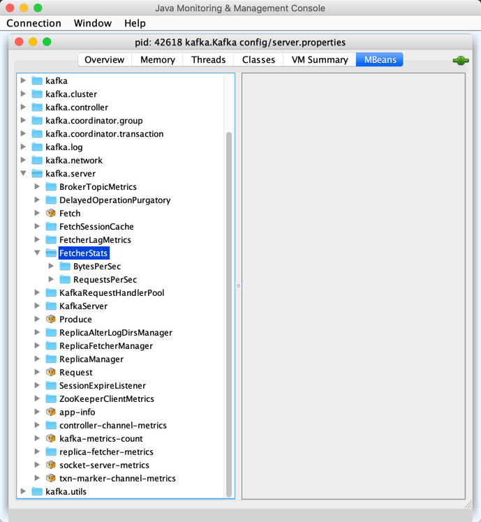

== [[AbstractFetcherThread]] AbstractFetcherThread

`AbstractFetcherThread` is the <<contract, extension>> of the <<kafka-ShutdownableThread.adoc#, ShutdownableThread contract>> for <<implementations, fetcher threads>> that <<maybeTruncate, maybeTruncate>> followed by <<maybeFetch, maybeFetch>> repeatedly (while <<doWork, doing the work>>) until <<shutdown, shut down>>.

NOTE: `AbstractFetcherThread` is an abstract class and cannot be <<creating-instance, created>> directly. It is created indirectly for the <<implementations, concrete AbstractFetcherThreads>>.

[[contract]]
.AbstractFetcherThread Contract (Abstract Methods)
[cols="1m,3",options="header",width="100%"]
|===
| Method
| Description

| buildFetch
a| [[buildFetch]]

[source, scala]
----
buildFetch(
  partitionMap: Map[TopicPartition, PartitionFetchState]
): ResultWithPartitions[Option[FetchRequest.Builder]]
----

Used when `AbstractFetcherThread` is requested to <<maybeFetch, maybeFetch>>.

| endOffsetForEpoch
a| [[endOffsetForEpoch]]

[source, scala]
----
endOffsetForEpoch(
  topicPartition: TopicPartition,
  epoch: Int): Option[OffsetAndEpoch]
----

Used when `AbstractFetcherThread` is requested to <<getOffsetTruncationState, getOffsetTruncationState>>.

| fetchEarliestOffsetFromLeader
a| [[fetchEarliestOffsetFromLeader]]

[source, scala]
----
fetchEarliestOffsetFromLeader(
  topicPartition: TopicPartition,
  currentLeaderEpoch: Int): Long
----

Used when `AbstractFetcherThread` is requested to <<fetchOffsetAndTruncate, fetchOffsetAndTruncate>>.

| fetchEpochEndOffsets
a| [[fetchEpochEndOffsets]]

[source, scala]
----
fetchEpochEndOffsets(
  partitions: Map[TopicPartition, EpochData]
): Map[TopicPartition, EpochEndOffset]
----

Used when `AbstractFetcherThread` is requested to <<truncateToEpochEndOffsets, truncateToEpochEndOffsets>>.

| fetchFromLeader
a| [[fetchFromLeader]]

[source, scala]
----
fetchFromLeader(
  fetchRequest: FetchRequest.Builder
): Seq[(TopicPartition, FetchData)]
----

Used when `AbstractFetcherThread` is requested to <<processFetchRequest, processFetchRequest>>.

| fetchLatestOffsetFromLeader
a| [[fetchLatestOffsetFromLeader]]

[source, scala]
----
fetchLatestOffsetFromLeader(
  topicPartition: TopicPartition,
  currentLeaderEpoch: Int): Long
----

Used when `AbstractFetcherThread` is requested to <<fetchOffsetAndTruncate, fetchOffsetAndTruncate>>.

| isOffsetForLeaderEpochSupported
a| [[isOffsetForLeaderEpochSupported]]

[source, scala]
----
isOffsetForLeaderEpochSupported: Boolean
----

Controls whether an `OffsetsForLeaderEpochRequest` is supported (that was added in Kafka 0.11.0.0)

Used when `AbstractFetcherThread` is requested to <<fetchTruncatingPartitions, fetchTruncatingPartitions>>.

TIP: Consult https://cwiki.apache.org/confluence/display/KAFKA/KIP-101+-+Alter+Replication+Protocol+to+use+Leader+Epoch+rather+than+High+Watermark+for+Truncation[KIP-101: Alter Replication Protocol to use Leader Epoch rather than High Watermark for Truncation].

| latestEpoch
a| [[latestEpoch]]

[source, scala]
----
latestEpoch(topicPartition: TopicPartition): Option[Int]
----

Gets the latest (current) leader epoch for the given `TopicPartition`

Used when `AbstractFetcherThread` is requested to <<fetchTruncatingPartitions, fetchTruncatingPartitions>>.

| logEndOffset
a| [[logEndOffset]]

[source, scala]
----
logEndOffset(topicPartition: TopicPartition): Long
----

Used when `AbstractFetcherThread` is requested to <<getOffsetTruncationState, getOffsetTruncationState>> and <<fetchOffsetAndTruncate, fetchOffsetAndTruncate>>.

| processPartitionData
a| [[processPartitionData]]

[source, scala]
----
processPartitionData(
  topicPartition: TopicPartition,
  fetchOffset: Long,
  partitionData: FetchData): Option[LogAppendInfo]
----

Used when `AbstractFetcherThread` is requested to <<processFetchRequest, processFetchRequest>>.

| truncate
a| [[truncate]]

[source, scala]
----
truncate(
  topicPartition: TopicPartition,
  truncationState: OffsetTruncationState): Unit
----

Used when `AbstractFetcherThread` is requested to <<doTruncate, doTruncate>> and <<fetchOffsetAndTruncate, fetchOffsetAndTruncate>>

| truncateFullyAndStartAt
a| [[truncateFullyAndStartAt]]

[source, scala]
----
truncateFullyAndStartAt(
  topicPartition: TopicPartition,
  offset: Long): Unit
----

Used when `AbstractFetcherThread` is requested to <<fetchOffsetAndTruncate, fetchOffsetAndTruncate>>.

|===

[[implementations]]
.AbstractFetcherThreads
[cols="30,70",options="header",width="100%"]
|===
| AbstractFetcherThread
| Description

| link:kafka-server-ReplicaAlterLogDirsThread.adoc[ReplicaAlterLogDirsThread]
| [[ReplicaAlterLogDirsThread]]

| link:kafka-server-ReplicaFetcherThread.adoc[ReplicaFetcherThread]
| [[ReplicaFetcherThread]]

|===

=== [[KafkaMetricsGroup]][[metrics]] Performance Metrics

<<implementations, AbstractFetcherThreads>> are link:kafka-metrics-KafkaMetricsGroup.adoc[KafkaMetricsGroups] with the following performance metrics.

.AbstractFetcherThread's Performance Metrics
[cols="30m,70",options="header",width="100%"]
|===
| Metric Name
| Description


| BytesPerSec
| [[BytesPerSec]][[byteRate]]

| RequestsPerSec
| [[RequestsPerSec]][[requestRate]]

|===

The <<metrics, performance metrics>> are registered in *kafka.server:type=FetcherStats* group.

.AbstractFetcherThread in jconsole


=== [[creating-instance]] Creating AbstractFetcherThread Instance

`AbstractFetcherThread` takes the following to be created:

* [[name]] Thread Name
* [[clientId]] Client ID
* [[sourceBroker]] `BrokerEndPoint`
* [[failedPartitions]] `FailedPartitions`
* [[fetchBackOffMs]] link:kafka-properties.adoc#replica.fetch.backoff.ms[replica.fetch.backoff.ms] (default: `0`)
* [[isInterruptible]] `isInterruptible` flag (default: `true`)

`AbstractFetcherThread` initializes the <<internal-registries, internal registries and counters>>.

=== [[doWork]] Truncating And Fetching -- `doWork` Method

[source, scala]
----
doWork(): Unit
----

NOTE: `doWork` is part of the <<kafka-ShutdownableThread.adoc#doWork, ShutdownableThread Contract>> to do the work.

`doWork` simply <<maybeTruncate, maybeTruncate>> followed by <<maybeFetch, maybeFetch>>.

==== [[maybeTruncate]] `maybeTruncate` Internal Method

[source, scala]
----
maybeTruncate(): Unit
----

`maybeTruncate` <<fetchTruncatingPartitions, fetchTruncatingPartitions>> to find the partitions with and without epochs.

For partitions with epochs, `maybeTruncate` <<truncateToEpochEndOffsets, truncateToEpochEndOffsets>>.

For partitions without epochs, `maybeTruncate` <<truncateToHighWatermark, truncateToHighWatermark>>.

NOTE: `maybeTruncate` is used exclusively when `AbstractFetcherThread` is requested to <<doWork, do the work>>.

==== [[maybeFetch]] `maybeFetch` Internal Method

[source, scala]
----
maybeFetch(): Unit
----

`maybeFetch` <<buildFetch, buildFetch>> (with the <<partitionStates, partitionStates>>).

NOTE: <<buildFetch, buildFetch>> is <<implementations, implementation>>-specific.

`maybeFetch` then <<handlePartitionsWithErrors, handlePartitionsWithErrors>> with partitions that <<buildFetch, buildFetch>> could not handle.

In the end, `maybeFetch` <<processFetchRequest, processes>> the `FetchRequest` (if created).

`maybeFetch` blocks the thread (_waits_) until the <<fetchBackOffMs, fetchBackOffMs>> elapses when the `FetchRequest` was not created (when <<buildFetch, buildFetch>>). `maybeFetch` prints out the following TRACE message to the logs:

```
There are no active partitions. Back off for [fetchBackOffMs] ms before sending a fetch request
```

NOTE: `maybeFetch` is used when `AbstractFetcherThread` is requested to <<doWork, do the work>>.

=== [[fetchTruncatingPartitions]] `fetchTruncatingPartitions` Internal Method

[source, scala]
----
fetchTruncatingPartitions(): (Map[TopicPartition, EpochData], Set[TopicPartition])
----

`fetchTruncatingPartitions` finds the `TopicPartitions` (in the <<partitionStates, partitionStates>> registry) that are in `Truncating` state (and are not delayed) and splits them into two groups: with and without epochs.

Internally, for every truncating `TopicPartition`, `fetchTruncatingPartitions` <<latestEpoch, gets the latest epoch>>.

If the latest epoch is available and <<isOffsetForLeaderEpochSupported, isOffsetForLeaderEpochSupported>>, `fetchTruncatingPartitions` registers the `TopicPartition` as "with epoch" whereas the others as "without epoch".

NOTE: Both actions (<<latestEpoch, getting the latest epoch>> and <<isOffsetForLeaderEpochSupported, isOffsetForLeaderEpochSupported>>) are <<implementations, implementation>>-specific.

NOTE: `fetchTruncatingPartitions` is used exclusively when `AbstractFetcherThread` is requested to <<maybeTruncate, maybeTruncate>>.

=== [[onPartitionFenced]] `onPartitionFenced` Internal Method

[source, scala]
----
onPartitionFenced(tp: TopicPartition): Unit
----

`onPartitionFenced`...FIXME

NOTE: `onPartitionFenced` is used when `AbstractFetcherThread` is requested to <<maybeTruncateToEpochEndOffsets, maybeTruncateToEpochEndOffsets>>, <<processFetchRequest, processFetchRequest>>, and <<handleOutOfRangeError, handleOutOfRangeError>>.

=== [[maybeTruncateToEpochEndOffsets]] `maybeTruncateToEpochEndOffsets` Internal Method

[source, scala]
----
maybeTruncateToEpochEndOffsets(
  fetchedEpochs: Map[TopicPartition, EpochEndOffset]
): ResultWithPartitions[Map[TopicPartition, OffsetTruncationState]]
----

`maybeTruncateToEpochEndOffsets`...FIXME

NOTE: `maybeTruncateToEpochEndOffsets` is used when `AbstractFetcherThread` is requested to <<truncateToEpochEndOffsets, truncateToEpochEndOffsets>>.

=== [[processFetchRequest]] `processFetchRequest` Internal Method

[source, scala]
----
processFetchRequest(
  fetchStates: Map[TopicPartition, PartitionFetchState],
  fetchRequest: FetchRequest.Builder): Unit
----

`processFetchRequest` prints out the following TRACE message to the logs:

```
Sending fetch request [fetchRequest]
```

`processFetchRequest` then <<fetchFromLeader, fetchFromLeader>>.

NOTE: <<fetchFromLeader, fetchFromLeader>> is <<implementations, implementation>>-specific.

`processFetchRequest` requests the <<fetcherStats, FetcherStats>> to...FIXME

NOTE: `processFetchRequest` is used when `AbstractFetcherThread` is requested to <<maybeFetch, maybeFetch>>.

=== [[handleOutOfRangeError]] `handleOutOfRangeError` Internal Method

[source, scala]
----
handleOutOfRangeError(
  topicPartition: TopicPartition,
  fetchState: PartitionFetchState): Boolean
----

`handleOutOfRangeError`...FIXME

NOTE: `handleOutOfRangeError` is used when `AbstractFetcherThread` is requested to <<doWork, truncate and fetch continuously>> (and in turn <<processFetchRequest, processFetchRequest>>).

=== [[markPartitionsForTruncation]] `markPartitionsForTruncation` Method

[source, scala]
----
markPartitionsForTruncation(
  topicPartition: TopicPartition,
  truncationOffset: Long): Unit
markPartitionsForTruncation(
  brokerId: Int,
  topicPartition: TopicPartition,
  truncationOffset: Long): Unit
----

`markPartitionsForTruncation`...FIXME

NOTE: `markPartitionsForTruncation` is used when...FIXME

=== [[addPartitions]] `addPartitions` Method

[source, scala]
----
addPartitions(
  initialFetchStates: Map[TopicPartition, OffsetAndEpoch]): Unit
----

`addPartitions`...FIXME

NOTE: `addPartitions` is used when `AbstractFetcherManager` is requested to <<kafka-server-AbstractFetcherManager.adoc#addFetcherForPartitions, addFetcherForPartitions>>.

=== [[updateFetchOffsetAndMaybeMarkTruncationComplete]] `updateFetchOffsetAndMaybeMarkTruncationComplete` Internal Method

[source, scala]
----
updateFetchOffsetAndMaybeMarkTruncationComplete(
  fetchOffsets: Map[TopicPartition, OffsetTruncationState]): Unit
----

`updateFetchOffsetAndMaybeMarkTruncationComplete`...FIXME

NOTE: `updateFetchOffsetAndMaybeMarkTruncationComplete` is used when `AbstractFetcherThread` is requested to <<truncateToEpochEndOffsets, truncateToEpochEndOffsets>> and <<truncateToHighWatermark, truncateToHighWatermark>>.

=== [[truncateToEpochEndOffsets]] `truncateToEpochEndOffsets` Internal Method

[source, scala]
----
truncateToEpochEndOffsets(
  latestEpochsForPartitions: Map[TopicPartition, EpochData]): Unit
----

`truncateToEpochEndOffsets`...FIXME

NOTE: `truncateToEpochEndOffsets` is used exclusively when `AbstractFetcherThread` is requested to <<maybeTruncate, maybeTruncate>>.

=== [[truncateToHighWatermark]] `truncateToHighWatermark` Internal Method

[source, scala]
----
truncateToHighWatermark(
  partitions: Set[TopicPartition]): Unit
----

`truncateToHighWatermark`...FIXME

NOTE: `truncateToHighWatermark` is used exclusively when `AbstractFetcherThread` is requested to <<maybeTruncate, maybeTruncate>>.

=== [[partitionsAndOffsets]] `partitionsAndOffsets` Method

[source, scala]
----
partitionsAndOffsets: Map[TopicPartition, InitialFetchState]
----

`partitionsAndOffsets`...FIXME

NOTE: `partitionsAndOffsets` is used exclusively when `AbstractFetcherManager` is requested to <<kafka-server-AbstractFetcherManager.adoc#resizeThreadPool, resizeThreadPool>>.

=== [[getOffsetTruncationState]] `getOffsetTruncationState` Internal Method

[source, scala]
----
getOffsetTruncationState(
  tp: TopicPartition,
  leaderEpochOffset: EpochEndOffset): OffsetTruncationState
----

`getOffsetTruncationState`...FIXME

NOTE: `getOffsetTruncationState` is used exclusively when `AbstractFetcherThread` is requested to <<maybeTruncateToEpochEndOffsets, maybeTruncateToEpochEndOffsets>>.

=== [[fetchOffsetAndTruncate]] `fetchOffsetAndTruncate` Method

[source, scala]
----
fetchOffsetAndTruncate(
  topicPartition: TopicPartition,
  currentLeaderEpoch: Int): Long
----

`fetchOffsetAndTruncate`...FIXME

NOTE: `fetchOffsetAndTruncate` is used exclusively when `AbstractFetcherThread` is requested to <<addPartitions, addPartitions>> and <<handleOutOfRangeError, handleOutOfRangeError>>.

=== [[handlePartitionsWithErrors]] `handlePartitionsWithErrors` Method

[source, scala]
----
handlePartitionsWithErrors(
  partitions: Iterable[TopicPartition]): Unit
----

`handlePartitionsWithErrors`...FIXME

NOTE: `handlePartitionsWithErrors` is used when `AbstractFetcherThread` is requested to <<maybeFetch, maybeFetch>>, <<truncateToEpochEndOffsets, truncateToEpochEndOffsets>>, <<truncateToHighWatermark, truncateToHighWatermark>>, and <<processFetchRequest, processFetchRequest>>.

=== [[doTruncate]] `doTruncate` Internal Method

[source, scala]
----
doTruncate(
  topicPartition: TopicPartition,
  truncationState: OffsetTruncationState): Boolean
----

`doTruncate`...FIXME

NOTE: `doTruncate` is used when `AbstractFetcherThread` is requested to <<maybeTruncate, maybeTruncate>> (and in turn <<truncateToHighWatermark, truncateToHighWatermark>> and <<maybeTruncateToEpochEndOffsets, maybeTruncateToEpochEndOffsets>>).

=== [[toMemoryRecords]] `toMemoryRecords` Method

[source, scala]
----
toMemoryRecords(
  records: Records): MemoryRecords
----

`toMemoryRecords` converts the given records to <<kafka-common-record-MemoryRecords.adoc#, MemoryRecords>>.

[[toMemoryRecords-MemoryRecords]]
If the given records are of type <<kafka-common-record-MemoryRecords.adoc#, MemoryRecords>> already, `toMemoryRecords` simply returns it as-is.

[[toMemoryRecords-FileRecords]]
If the given records are of type <<kafka-common-record-FileRecords.adoc#, FileRecords>>, `toMemoryRecords` allocates a `ByteBuffer` of the size of the records to <<kafka-common-record-FileRecords.adoc#readInto, readInto>> and creates a writable <<kafka-common-record-MemoryRecords.adoc#, MemoryRecords>>.

[NOTE]
====
`toMemoryRecords` is used when:

* `ReplicaAlterLogDirsThread` is requested to <<kafka-server-ReplicaAlterLogDirsThread.adoc#processPartitionData, processPartitionData>>

* `ReplicaFetcherThread` is requested to <<kafka-server-ReplicaFetcherThread.adoc#processPartitionData, processPartitionData>>
====

=== [[shutdown]] `shutdown` Method

[source, scala]
----
shutdown(): Unit
----

NOTE: `shutdown` is part of the link:kafka-ShutdownableThread.adoc#shutdown[ShutdownableThread] contract to...FIXME.

`shutdown`...FIXME

=== [[internal-properties]] Internal Properties

[cols="30m,70",options="header",width="100%"]
|===
| Name
| Description

| fetcherStats
a| [[fetcherStats]] <<kafka-metrics-KafkaMetricsGroup.adoc#, KafkaMetricsGroup>> (with two <<metrics, performance metrics>>)

| partitionStates
a| [[partitionStates]] `TopicPartitions` with their `PartitionFetchState` (`PartitionStates[PartitionFetchState]`)

* A `TopicPartition` is removed in <<onPartitionFenced, onPartitionFenced>> and <<removePartitions, removePartitions>>

* `PartitionFetchState` updated in <<processFetchRequest, processFetchRequest>>, <<markPartitionsForTruncation, markPartitionsForTruncation>>, <<addPartitions, addPartitions>>, <<updateFetchOffsetAndMaybeMarkTruncationComplete, updateFetchOffsetAndMaybeMarkTruncationComplete>>, <<handleOutOfRangeError, handleOutOfRangeError>>, <<delayPartitions, delayPartitions>>

Used when...FIXME

|===
