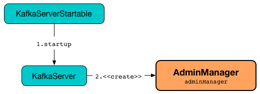

== [[AdminManager]] AdminManager

`AdminManager` is the administration interface of <<kafka-server-KafkaServer.adoc#adminManager, KafkaServer>>.

`AdminManager` is <<creating-instance, created>> exclusively when `KafkaServer` is <<kafka-server-KafkaServer.adoc#startup, started>>.

.AdminManager


`AdminManager` uses the <<metadataCache, MetadataCache>> for the following:

* <<createTopics, createTopics>> (to get the <<kafka-server-MetadataCache.adoc#getAliveBrokers, getAliveBrokers>>)

* <<describeConfigs, Describing the configuration of topic resources>> (to <<kafka-server-MetadataCache.adoc#contains, check whether a topic is available or not>>)

[[logIdent]]
`AdminManager` uses *[Admin Manager on Broker [brokerId]]* as the logging prefix (aka `logIdent`).

[[logging]]
[TIP]
====
Enable `ALL` logging levels for `kafka.server.AdminManager` logger to see what happens inside.

Add the following line to `config/log4j.properties`:

```
log4j.logger.kafka.server.AdminManager=ALL
```

Refer to <<kafka-logging.adoc#, Logging>>.
====

=== [[creating-instance]] Creating AdminManager Instance

`AdminManager` takes the following when created:

* [[config]] <<kafka-server-KafkaConfig.adoc#, KafkaConfig>>
* [[metrics]] <<kafka-Metrics.adoc#, Metrics>>
* [[metadataCache]] <<kafka-server-MetadataCache.adoc#, MetadataCache>>
* [[zkClient]] <<kafka-zk-KafkaZkClient.adoc#, KafkaZkClient>>

`AdminManager` initializes the <<internal-registries, internal registries and counters>>.

=== [[createTopics]] Creating Topics -- `createTopics` Method

[source, scala]
----
createTopics(
  timeout: Int,
  validateOnly: Boolean,
  createInfo: Map[String, CreateTopicsRequest.TopicDetails],
  responseCallback: (Map[String, ApiError]) => Unit): Unit
----

`createTopics`...FIXME

NOTE: `createTopics` is used exclusively when `KafkaApis` is requested to <<kafka-server-KafkaApis.adoc#handleCreateTopicsRequest, handle a CREATE_TOPICS request>>.

=== [[describeConfigs]] Describing Configuration Of Specified Resources (Topics and Brokers) -- `describeConfigs` Method

[source, scala]
----
describeConfigs(
  resourceToConfigNames: Map[ConfigResource, Option[Set[String]]],
  includeSynonyms: Boolean): Map[ConfigResource, DescribeConfigsResponse.Config]
----

[[describeConfigs-TOPIC]]
For `TOPIC` resources, `describeConfigs` does the following:

. Requests the <<adminZkClient, AdminZkClient>> to <<kafka-zk-AdminZkClient.adoc#fetchEntityConfig, fetch configuration>> of the given topics (from Zookeeper)

. Uses `KafkaServer` utility to <<kafka-server-KafkaServer.adoc#copyKafkaConfigToLog, create the default log properties>> based on the <<config, KafkaConfig>>

. Uses `LogConfig` utility to <<kafka-log-LogConfig.adoc#fromProps, fromProps>> with the default log properties and the topic configuration (from Zookeeper)

[[describeConfigs-BROKER]]
For `BROKER` resources, `describeConfigs` does the following...FIXME

NOTE: `describeConfigs` is used exclusively when `KafkaApis` is requested to <<kafka-server-KafkaApis.adoc#handleDescribeConfigsRequest, handle a DescribeConfigs request>>.

=== [[alterConfigs]] `alterConfigs` Method

[source, scala]
----
alterConfigs(
  configs: Map[ConfigResource, AlterConfigsRequest.Config],
  validateOnly: Boolean): Map[ConfigResource, ApiError]
----

`alterConfigs`...FIXME

NOTE: `alterConfigs` is used exclusively when `KafkaApis` is requested to <<kafka-server-KafkaApis.adoc#handleAlterConfigsRequest, handleAlterConfigsRequest>>.

=== [[configSynonyms]] `configSynonyms` Internal Method

[source, scala]
----
configSynonyms(
  name: String,
  synonyms: List[String],
  isSensitive: Boolean): List[DescribeConfigsResponse.ConfigSynonym]
----

`configSynonyms`...FIXME

NOTE: `configSynonyms` is used when...FIXME

=== [[createPartitions]] `createPartitions` Method

[source, scala]
----
createPartitions(
  timeout: Int,
  newPartitions: Map[String, PartitionDetails],
  validateOnly: Boolean,
  listenerName: ListenerName,
  callback: Map[String, ApiError] => Unit): Unit
----

`createPartitions`...FIXME

NOTE: `createPartitions` is used when...FIXME

=== [[tryCompleteDelayedTopicOperations]] `tryCompleteDelayedTopicOperations` Method

[source, scala]
----
tryCompleteDelayedTopicOperations(topic: String): Unit
----

`tryCompleteDelayedTopicOperations`...FIXME

NOTE: `tryCompleteDelayedTopicOperations` is used when...FIXME

=== [[incrementalAlterConfigs]] `incrementalAlterConfigs` Method

[source, scala]
----
incrementalAlterConfigs(
  configs: Map[ConfigResource,
  List[AlterConfigOp]],
  validateOnly: Boolean): Map[ConfigResource, ApiError]
----

`incrementalAlterConfigs`...FIXME

NOTE: `incrementalAlterConfigs` is used when...FIXME

=== [[createTopicConfigEntry]] `createTopicConfigEntry` Internal Method

[source, scala]
----
createTopicConfigEntry(
  logConfig: LogConfig,
  topicProps: Properties,
  includeSynonyms: Boolean)(
    name: String,
    value: Any): DescribeConfigsResponse.ConfigEntry
----

`createTopicConfigEntry`...FIXME

NOTE: `createTopicConfigEntry` is used when `AdminManager` is requested to <<describeConfigs, describe the configuration of a topic>> and <<createTopics, create topics>>.

=== [[createBrokerConfigEntry]] `createBrokerConfigEntry` Internal Method

[source, scala]
----
createBrokerConfigEntry(
  perBrokerConfig: Boolean,
  includeSynonyms: Boolean)(
    name: String,
    value: Any): DescribeConfigsResponse.ConfigEntry
----

`createBrokerConfigEntry`...FIXME

NOTE: `createBrokerConfigEntry` is used when `AdminManager` is requested to...FIXME

=== [[internal-properties]] Internal Properties

[cols="30m,70",options="header",width="100%"]
|===
| Name
| Description

| adminZkClient
a| [[adminZkClient]]

| alterConfigPolicy
| [[alterConfigPolicy]]

| createTopicPolicy
| [[createTopicPolicy]]

| topicPurgatory
| [[topicPurgatory]]
|===
