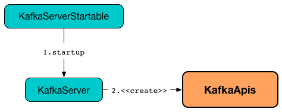

== [[KafkaApis]] KafkaApis -- API Request Handler

`KafkaApis` is responsible for <<handle, handling requests>> to a <<kafka-server-KafkaServer.adoc#apis, Kafka broker>> (by means of <<handlers, handlers>>).

`KafkaApis` is <<creating-instance, created>> when `KafkaServer` is requested to <<kafka-server-KafkaServer.adoc#startup, start>> (for <<kafka-server-KafkaServer.adoc#requestHandlerPool, KafkaRequestHandlerPool>>).

.KafkaApis is Created for KafkaRequestHandlerPool when KafkaServer Starts Up


When <<creating-instance, created>>, `KafkaApis` is given broker services (from the owning <<kafka-server-KafkaServer.adoc#, KafkaServer>>) that are used to <<handle, handle requests>> (from producers, consumers, brokers, administrative clients, etc.)

Some requests are meant for the <<kafka-controller.adoc#, controller broker>> and simply do nothing (_no-ops_) when received by a regular non-controller broker.

[[keys]]
[[handlers]]
.KafkaApis's API Keys and Handlers
[cols="30m,70",options="header",width="100%"]
|===
| API Key
| Handler

| AddOffsetsToTxn
| [[AddOffsetsToTxn]][[ADD_OFFSETS_TO_TXN]] <<handleAddOffsetsToTxnRequest, handleAddOffsetsToTxnRequest>>

| AddPartitionsToTxn
| [[AddPartitionsToTxn]][[ADD_PARTITIONS_TO_TXN]] <<handleAddPartitionToTxnRequest, handleAddPartitionToTxnRequest>>

| AlterConfigs
| [[AlterConfigs]][[ALTER_CONFIGS]] <<handleAlterConfigsRequest, handleAlterConfigsRequest>>

| AlterPartitionReassignments
| [[AlterPartitionReassignments]][[ALTER_PARTITION_REASSIGNMENTS]] <<handleAlterPartitionReassignmentsRequest, handleAlterPartitionReassignmentsRequest>>

| AlterReplicaLogDirs
| [[AlterReplicaLogDirs]][[ALTER_REPLICA_LOG_DIRS]] <<handleAlterReplicaLogDirsRequest, handleAlterReplicaLogDirsRequest>>

| ApiVersions
| [[ApiVersions]][[API_VERSIONS]] <<handleApiVersionsRequest, handleApiVersionsRequest>>

| ControlledShutdown
| [[ControlledShutdown]][[CONTROLLED_SHUTDOWN]] <<handleControlledShutdownRequest, handleControlledShutdownRequest>>

| CreateAcls
| [[CreateAcls]][[CREATE_ACLS]] <<handleCreateAcls, handleCreateAcls>>

| CreateDelegationToken
| [[CreateDelegationToken]][[CREATE_DELEGATION_TOKEN]] <<handleCreateTokenRequest, handleCreateTokenRequest>>

| CreatePartitions
| [[CreatePartitions]][[CREATE_PARTITIONS]] <<handleCreatePartitionsRequest, handleCreatePartitionsRequest>>

| CreateTopics
| [[CreateTopics]][[CREATE_TOPICS]] <<handleCreateTopicsRequest, handleCreateTopicsRequest>>

| DeleteAcls
| [[DeleteAcls]][[DELETE_ACLS]] <<handleDeleteAcls, handleDeleteAcls>>

| DeleteGroups
| [[DeleteGroups]][[DELETE_GROUPS]] <<handleDeleteGroupsRequest, handleDeleteGroupsRequest>>

| DeleteRecords
| [[DeleteRecords]][[DELETE_RECORDS]] <<handleDeleteRecordsRequest, handleDeleteRecordsRequest>>

| DeleteTopics
| [[DeleteTopics]][[DELETE_TOPICS]] <<handleDeleteTopicsRequest, handleDeleteTopicsRequest>>

| DescribeConfigs
| [[DescribeConfigs]][[DESCRIBE_CONFIGS]] <<handleDescribeConfigsRequest, handleDescribeConfigsRequest>>

| DescribeGroups
| [[DescribeGroups]][[DESCRIBE_GROUPS]] <<handleDescribeGroupRequest, handleDescribeGroupRequest>>

| DescribeLogDirs
| [[DescribeLogDirs]][[DESCRIBE_LOG_DIRS]] <<handleDescribeLogDirsRequest, handleDescribeLogDirsRequest>>

| DescribeAcls
| [[DescribeAcls]][[DESCRIBE_ACLS]] <<handleDescribeAcls, handleDescribeAcls>>

| DescribeDelegationToken
| [[DescribeDelegationToken]][[DESCRIBE_DELEGATION_TOKEN]] <<handleDescribeTokensRequest, handleDescribeTokensRequest>>

| ElectLeaders
| [[ElectLeaders]][[ELECT_LEADERS]] <<handleElectReplicaLeader, handleElectReplicaLeader>>

| EndTxn
| [[EndTxn]][[END_TXN]] <<handleEndTxnRequest, handleEndTxnRequest>>

| Fetch
| [[Fetch]][[FETCH]] <<handleFetchRequest, handleFetchRequest>>

| ExpireDelegationToken
| [[ExpireDelegationToken]][[EXPIRE_DELEGATION_TOKEN]] <<handleExpireTokenRequest, handleExpireTokenRequest>>

| <<kafka-common-requests-FindCoordinatorRequest.adoc#FIND_COORDINATOR, FindCoordinator>>
| [[FindCoordinator]][[FIND_COORDINATOR]] <<handleFindCoordinatorRequest, handleFindCoordinatorRequest>>

| Heartbeat
| [[Heartbeat]][[HEARTBEAT]] <<handleHeartbeatRequest, handleHeartbeatRequest>>

| InitProducerId
| [[InitProducerId]][[INIT_PRODUCER_ID]] <<handleInitProducerIdRequest, handleInitProducerIdRequest>>

| IncrementalAlterConfigs
| [[IncrementalAlterConfigs]][[INCREMENTAL_ALTER_CONFIGS]] <<handleIncrementalAlterConfigsRequest, handleIncrementalAlterConfigsRequest>>

| JoinGroup
| [[JoinGroup]][[JOIN_GROUP]] <<handleJoinGroupRequest, handleJoinGroupRequest>>

| LeaderAndIsr
| [[LeaderAndIsr]][[LEADER_AND_ISR]] Cluster action / <<handleLeaderAndIsrRequest, handleLeaderAndIsrRequest>>

| LeaveGroup
| [[LeaveGroup]][[LEAVE_GROUP]] <<handleLeaveGroupRequest, handleLeaveGroupRequest>>

| ListGroups
| [[ListGroups]][[LIST_GROUPS]] <<handleListGroupsRequest, handleListGroupsRequest>>

| ListOffsets
| [[ListOffsets]][[LIST_OFFSETS]] <<handleListOffsetRequest, handleListOffsetRequest>>

| ListPartitionReassignments
| [[ListPartitionReassignments]][[LIST_PARTITION_REASSIGNMENTS]] <<handleListPartitionReassignmentsRequest, handleListPartitionReassignmentsRequest>>

| Metadata
| [[Metadata]][[METADATA]] <<handleTopicMetadataRequest, handleTopicMetadataRequest>>

| OffsetCommit
| [[OffsetCommit]][[OFFSET_COMMIT]] <<handleOffsetCommitRequest, handleOffsetCommitRequest>>

| OffsetDelete
| [[OffsetDelete]][[OFFSET_DELETE]] <<handleOffsetDeleteRequest, handleOffsetDeleteRequest>>

| OffsetFetch
| [[OffsetFetch]][[OFFSET_FETCH]] <<handleOffsetFetchRequest, handleOffsetFetchRequest>>

| OffsetForLeaderEpoch
| [[OffsetForLeaderEpoch]][[OFFSET_FOR_LEADER_EPOCH]] <<handleOffsetForLeaderEpochRequest, handleOffsetForLeaderEpochRequest>>

| Produce
| [[Produce]][[PRODUCE]] <<handleProduceRequest, handleProduceRequest>>

| RenewDelegationToken
| [[RenewDelegationToken]][[RENEW_DELEGATION_TOKEN]] <<handleRenewTokenRequest, handleRenewTokenRequest>>

| SaslAuthenticate
| [[SaslAuthenticate]][[SASL_AUTHENTICATE]] <<handleSaslAuthenticateRequest, handleSaslAuthenticateRequest>>

| SaslHandshake
| [[SaslHandshake]][[SASL_HANDSHAKE]] <<handleSaslHandshakeRequest, handleSaslHandshakeRequest>>

| StopReplica
| [[StopReplica]][[STOP_REPLICA]] Cluster action / <<handleStopReplicaRequest, handleStopReplicaRequest>>

| SyncGroup
| [[SyncGroup]][[SYNC_GROUP]] <<handleSyncGroupRequest, handleSyncGroupRequest>>

| TxnOffsetCommit
| [[TxnOffsetCommit]][[TXN_OFFSET_COMMIT]] <<handleTxnOffsetCommitRequest, handleTxnOffsetCommitRequest>>

| <<kafka-common-requests-UpdateMetadataRequest.adoc#UPDATE_METADATA, UpdateMetadata>>
| [[UpdateMetadata]][[UPDATE_METADATA]] Cluster action / <<handleUpdateMetadataRequest, handleUpdateMetadataRequest>>

| WriteTxnMarkers
| [[WriteTxnMarkers]][[WRITE_TXN_MARKERS]] <<handleWriteTxnMarkersRequest, handleWriteTxnMarkersRequest>>

|===

[[logging]]
[TIP]
====
Enable `ALL` logging levels for `kafka.server.KafkaApis` logger to see what happens inside.

Add the following line to `config/log4j.properties`:

```
log4j.logger.kafka.server.KafkaApis=ALL
```

Refer to <<kafka-logging.adoc#, Logging>>.

---

Please note that Kafka comes with a preconfigured `kafka.server.KafkaApis` logger in `config/log4j.properties`:

```
log4j.appender.requestAppender=org.apache.log4j.DailyRollingFileAppender
log4j.appender.requestAppender.DatePattern='.'yyyy-MM-dd-HH
log4j.appender.requestAppender.File=${kafka.logs.dir}/kafka-request.log
log4j.appender.requestAppender.layout=org.apache.log4j.PatternLayout
log4j.appender.requestAppender.layout.ConversionPattern=[%d] %p %m (%c)%n

log4j.logger.kafka.server.KafkaApis=TRACE, requestAppender
log4j.additivity.kafka.server.KafkaApis=false
```

That means that the logs of `KafkaApis` go to `logs/kafka-request.log` file at `TRACE` logging level and are not added to the main logs (per `log4j.additivity` being off).
====

=== [[creating-instance]] Creating KafkaApis Instance

`KafkaApis` takes the following to be created:

* [[requestChannel]] <<kafka-network-RequestChannel.adoc#, RequestChannel>>
* [[replicaManager]] <<kafka-server-ReplicaManager.adoc#, ReplicaManager>>
* [[adminManager]] <<kafka-server-AdminManager.adoc#, AdminManager>>
* [[groupCoordinator]] <<kafka-coordinator-group-GroupCoordinator.adoc#, GroupCoordinator>>
* [[txnCoordinator]] <<kafka-TransactionCoordinator.adoc#, TransactionCoordinator>>
* [[controller]] <<kafka-controller-KafkaController.adoc#, KafkaController>>
* [[zkClient]] <<kafka-zk-KafkaZkClient.adoc#, KafkaZkClient>>
* [[brokerId]] Broker ID
* [[config]] <<kafka-server-KafkaConfig.adoc#, KafkaConfig>>
* [[metadataCache]] <<kafka-server-MetadataCache.adoc#, MetadataCache>>
* [[metrics]] <<kafka-Metrics.adoc#, Metrics>>
* Optional <<authorizer, Authorizer>>
* [[quotas]] <<kafka-server-QuotaManagers.adoc#, QuotaManagers>>
* [[fetchManager]] <<kafka-server-FetchManager.adoc#, FetchManager>>
* [[brokerTopicStats]] <<kafka-server-BrokerTopicStats.adoc#, BrokerTopicStats>>
* [[clusterId]] Cluster ID
* [[time]] `Time`
* [[tokenManager]] <<kafka-server-DelegationTokenManager.adoc#, DelegationTokenManager>>

=== [[authorizer]] KafkaApis and Authorizer

`KafkaApis` may be given an link:kafka-server-authorizer-Authorizer.adoc[Authorizer] when <<creating-instance, created>>.

The `Authorizer` is used for the following:

* <<handleCreateAcls, handleCreateAcls>>

* <<handleDeleteAcls, handleDeleteAcls>>

* <<handleDescribeAcls, handleDescribeAcls>>

* <<authorize, authorize>>, <<filterAuthorized, filterAuthorized>>, and <<authorizedOperations, authorizedOperations>>

=== [[adminZkClient]] KafkaApis and AdminZkClient

[source, scala]
----
adminZkClient: AdminZkClient
----

When <<creating-instance, created>>, `KafkaApis` creates a <<kafka-zk-AdminZkClient.adoc#, AdminZkClient>> that is used to <<createTopic, create a topic>> for the following handlers:

* <<handleFindCoordinatorRequest, handleFindCoordinatorRequest>> (for `__consumer_offsets` and `__transaction_state` internal topics)

* <<handleTopicMetadataRequest, handleTopicMetadataRequest>> (for `__consumer_offsets` and `__transaction_state` internal topics or any other topic with auto-creation enabled)

=== [[handle]] Routing API Requests to Respective Handlers -- `handle` Method

[source, scala]
----
handle(
  request: RequestChannel.Request): Unit
----

`handle` first prints out the following TRACE message to the logs:

```
Handling request:[request] from connection [id];securityProtocol:[protocol],principal:[principal]
```

`handle` then relays the input <<kafka-network-RequestChannel-Request.adoc#, RequestChannel.Request>> to the corresponding <<handlers, handler>> per the <<keys, apiKey>> (from the header of the input `request`).

NOTE: `handle` is used exclusively when `KafkaRequestHandler` thread is requested to <<kafka-server-KafkaRequestHandler.adoc#run, run>>.

=== [[handleElectReplicaLeader]] Handling ElectLeaders Request -- `handleElectReplicaLeader` Handler

[source, scala]
----
handleElectReplicaLeader(
  request: RequestChannel.Request): Unit
----

CAUTION: FIXME Describe me again

In summary, `handleElectPreferredReplicaLeader` requests the <<replicaManager, ReplicaManager>> to <<kafka-server-ReplicaManager.adoc#electPreferredLeaders, electPreferredLeaders>>.

Internally, `handleElectPreferredReplicaLeader`...FIXME

NOTE: `handleElectPreferredReplicaLeader` is used exclusively when `KafkaApis` is requested to handle a <<ElectPreferredLeaders, ElectPreferredLeaders>> request.

=== [[handleLeaderAndIsrRequest]] Handling LeaderAndIsr Request -- `handleLeaderAndIsrRequest` Handler

[source, scala]
----
handleLeaderAndIsrRequest(request: RequestChannel.Request): Unit
----

In summary, `handleLeaderAndIsrRequest` requests the <<replicaManager, ReplicaManager>> to <<kafka-server-ReplicaManager.adoc#becomeLeaderOrFollower, become the leader or a follower (of partitions)>>.

Internally, `handleLeaderAndIsrRequest` takes the <<kafka-common-requests-LeaderAndIsrRequest.adoc#, LeaderAndIsrRequest>> from (the body of) the <<kafka-network-RequestChannel-Request.adoc#, RequestChannel.Request>>.

When <<authorizeClusterAction, authorized for cluster action>> and not <<isBrokerEpochStale, isBrokerEpochStale>>, `handleLeaderAndIsrRequest` requests the <<replicaManager, ReplicaManager>> to <<kafka-server-ReplicaManager.adoc#becomeLeaderOrFollower, become the leader or a follower (of partitions)>> (with the <<handleLeaderAndIsrRequest-onLeadershipChange, onLeadershipChange>> callback that gets the <<kafka-cluster-Partition.adoc#, Partitions>> of which the broker is a new leader or a follower).

`handleLeaderAndIsrRequest` <<isBrokerEpochStale, isBrokerEpochStale>> and...FIXME

NOTE: `handleLeaderAndIsrRequest` is used exclusively when `KafkaApis` is requested to handle a <<LeaderAndIsr, LeaderAndIsr>> request.

==== [[handleLeaderAndIsrRequest-onLeadershipChange]] `onLeadershipChange` Callback

[source, scala]
----
onLeadershipChange(
  updatedLeaders: Iterable[Partition],
  updatedFollowers: Iterable[Partition]): Unit
----

`onLeadershipChange`...FIXME

=== [[handleAlterReplicaLogDirsRequest]] Handling AlterReplicaLogDirs Request -- `handleAlterReplicaLogDirsRequest` Handler

[source, scala]
----
handleAlterReplicaLogDirsRequest(request: RequestChannel.Request): Unit
----

In summary, `handleAlterReplicaLogDirsRequest` requests the <<replicaManager, ReplicaManager>> to <<kafka-server-ReplicaManager.adoc#alterReplicaLogDirs, alterReplicaLogDirs>>.

`handleAlterReplicaLogDirsRequest`...FIXME

NOTE: `handleAlterReplicaLogDirsRequest` is used exclusively when `KafkaApis` is requested to handle a <<AlterReplicaLogDirs, AlterReplicaLogDirs>> request.

=== [[handleCreateTopicsRequest]] Handling CreateTopics Request -- `handleCreateTopicsRequest` Handler

[source, scala]
----
handleCreateTopicsRequest(request: RequestChannel.Request): Unit
----

`handleCreateTopicsRequest`...FIXME

`handleCreateTopicsRequest` checks whether <<controller, KafkaController>> is link:kafka-controller-KafkaController.adoc#isActive[active]...FIXME

`handleCreateTopicsRequest` <<authorize, authorizes>> the `Create` operation for `ClusterResource`...FIXME

In the end, `handleCreateTopicsRequest` requests <<adminManager, AdminManager>> to link:kafka-server-AdminManager.adoc#createTopics[create the topics].

NOTE: `handleCreateTopicsRequest` is used exclusively when `KafkaApis` is requested to handle a <<CreateTopics, CreateTopics>> request.

=== [[handleOffsetFetchRequest]] Handling OffsetFetch Request -- `handleOffsetFetchRequest` Handler

[source, scala]
----
handleOffsetFetchRequest(request: RequestChannel.Request): Unit
----

`handleOffsetFetchRequest`...FIXME

NOTE: `handleOffsetFetchRequest` is used exclusively when `KafkaApis` is requested to handle a <<OffsetFetch, OffsetFetch>> request.

=== [[handleFetchRequest]] Handling Fetch Request -- `handleFetchRequest` Handler

[source, scala]
----
handleFetchRequest(
  request: RequestChannel.Request): Unit
----

In summary, `handleFetchRequest` requests the <<replicaManager, ReplicaManager>> to <<kafka-server-ReplicaManager.adoc#fetchMessages, fetch messages>>.

`handleFetchRequest`...FIXME

NOTE: `handleFetchRequest` is used when `KafkaApis` is requested to handle a <<Fetch, Fetch>> request.

=== [[handleCreateAcls]] Handling CreateAcls Request -- `handleCreateAcls` Handler

[source, scala]
----
handleCreateAcls(
  request: RequestChannel.Request): Unit
----

`handleCreateAcls`...FIXME

NOTE: `handleCreateAcls` is used when `KafkaApis` is requested to handle a <<CreateAcls, CreateAcls>> request.

=== [[handleTopicMetadataRequest]] Handling Metadata Request -- `handleTopicMetadataRequest` Handler

[source, scala]
----
handleTopicMetadataRequest(
  request: RequestChannel.Request): Unit
----

`handleTopicMetadataRequest` takes the <<kafka-common-requests-MetadataRequest.adoc#, MetadataRequest>> from (the body of) the <<kafka-network-RequestChannel-Request.adoc#, RequestChannel.Request>>.

`handleTopicMetadataRequest` requests the <<metadataCache, MetadataCache>> for <<kafka-server-MetadataCache.adoc#getAllTopics, getAllTopics>> or its subset (per <<kafka-common-requests-MetadataRequest.adoc#topics, topics>> attribute of the `MetadataRequest`).

`handleTopicMetadataRequest` filters out the topics for which the current principal (user) is not authorized to execute `Describe` operation.

For every authorized topic, `handleTopicMetadataRequest`...FIXME

`handleTopicMetadataRequest` creates a `MetadataResponse.TopicMetadata` with `TOPIC_AUTHORIZATION_FAILED` for every `unauthorizedForCreateTopics` and `unauthorizedForDescribeTopics`.

`handleTopicMetadataRequest` <<getTopicMetadata, getTopicMetadata>> if there are `authorizedTopics`.

`handleTopicMetadataRequest` prints out the following TRACE message to the logs:

```
Sending topic metadata [completeTopicMetadata] and brokers [brokers] for correlation id [correlationId] to client [clientId]
```

In the end, `handleTopicMetadataRequest` <<sendResponseMaybeThrottle, sendResponseMaybeThrottle>> with a new <<kafka-common-requests-MetadataResponse.adoc#, MetadataResponse>>.

NOTE: `handleTopicMetadataRequest` is used exclusively when `KafkaApis` is requested to handle a <<Metadata, Metadata>> request.

=== [[authorize]] Authorizing Request for Operation on Resource -- `authorize` Internal Method

[source, scala]
----
authorize(
  request: RequestChannel.Request,
  operation: AclOperation,
  resourceType: ResourceType,
  resourceName: String,
  logIfAllowed: Boolean = true,
  logIfDenied: Boolean = true,
  refCount: Int = 1): Boolean
----

`authorize` simply requests the <<authorizer, Authorizer>> (when defined) to <<kafka-server-authorizer-Authorizer.adoc#authorize, authorize>> the given `AclOperation` on a broker resource (described by the `ResourceType` and `resourceName`).

`authorize` is positive (`true`) when the `Authorizer` returned `ALLOWED`.

NOTE: The <<authorizer, Authorizer>> is created in <<kafka-server-KafkaServer.adoc#authorizer, KafkaServer>> (when the `KafkaApis` is created). It is configured using <<kafka-properties.adoc#authorizer.class.name, authorizer.class.name>> configuration property which is empty by default and so all operations are authorized.

[cols="40,10m,10m,40",options="header",width="100%"]
|===
| Request
| AclOperation
| Resource Type
| Resource Name

| <<OffsetCommit, OffsetCommit>>
| READ
| GROUP
| groupId

| <<Produce, Produce>>
| WRITE
| TRANSACTIONAL_ID
| transactionalId

| <<Produce, Produce>>
| IDEMPOTENT_WRITE
| CLUSTER
| kafka-cluster

| <<Fetch, Fetch>> (from followers)
| CLUSTER_ACTION
| CLUSTER
| kafka-cluster

| <<Metadata, Metadata>> (for auto-create topics)
| CREATE
| CLUSTER
| kafka-cluster

| <<Metadata, Metadata>>
| DESCRIBE
| CLUSTER
| kafka-cluster

| <<OffsetFetch, OffsetFetch>>
| DESCRIBE
| CLUSTER
| kafka-cluster

| <<FindCoordinator, FindCoordinator>>
| DESCRIBE
| GROUP
| Coordinator key

| <<FindCoordinator, FindCoordinator>>
| DESCRIBE
| TRANSACTIONAL_ID
| Coordinator key

| <<DescribeGroups, DescribeGroups>>
| DESCRIBE
| GROUP
| Group ID

| <<ListGroups, ListGroups>>
| DESCRIBE
| CLUSTER
| kafka-cluster

| <<ListGroups, ListGroups>>
| DESCRIBE
| GROUP
| Group ID

| <<JoinGroup, JoinGroup>>
| READ
| GROUP
| Group ID

| <<SyncGroup, SyncGroup>>
| READ
| GROUP
| Group ID

| <<DeleteGroups, DeleteGroups>>
| DELETE
| GROUP
| Group ID

| <<Heartbeat, Heartbeat>>
| READ
| GROUP
| Group ID

| <<LeaveGroup, LeaveGroup>>
| READ
| GROUP
| Group ID

| <<CreateTopics, CreateTopics>>
| CREATE
| CLUSTER
| kafka-cluster

| <<InitProducerId, InitProducerId>>
| WRITE
| TRANSACTIONAL_ID
| Transactional ID

| <<InitProducerId, InitProducerId>>
| IDEMPOTENT_WRITE
| CLUSTER
| kafka-cluster

| <<EndTxn, EndTxn>>
| WRITE
| TRANSACTIONAL_ID
| Transactional ID

| <<AddPartitionsToTxn, AddPartitionsToTxn>>
| WRITE
| TRANSACTIONAL_ID
| Transactional ID

| <<AddOffsetsToTxn, AddOffsetsToTxn>>
| WRITE
| TRANSACTIONAL_ID
| Transactional ID

| <<AddOffsetsToTxn, AddOffsetsToTxn>>
| READ
| GROUP
| Group ID

| <<TxnOffsetCommit, TxnOffsetCommit>>
| WRITE
| TRANSACTIONAL_ID
| Transactional ID

| <<TxnOffsetCommit, TxnOffsetCommit>>
| READ
| GROUP
| Group ID

| <<OffsetForLeaderEpoch, OffsetForLeaderEpoch>>
| CLUSTER_ACTION
| CLUSTER
| kafka-cluster

| <<AlterConfigs, AlterConfigs>> (for brokers)
| ALTER_CONFIGS
| CLUSTER
| kafka-cluster

| <<AlterConfigs, AlterConfigs>> (for topics)
| ALTER_CONFIGS
| TOPIC
| Topic name

| <<IncrementalAlterConfigs, IncrementalAlterConfigs>> (for brokers)
| ALTER_CONFIGS
| CLUSTER
| kafka-cluster

| <<IncrementalAlterConfigs, IncrementalAlterConfigs>> (for topics)
| ALTER_CONFIGS
| TOPIC
| Topic name

| <<DescribeConfigs, DescribeConfigs>> (for brokers)
| DESCRIBE_CONFIGS
| CLUSTER
| kafka-cluster

| <<DescribeConfigs, DescribeConfigs>> (for topics)
| DESCRIBE_CONFIGS
| TOPIC
| Topic name

| <<AlterReplicaLogDirs, AlterReplicaLogDirs>>
| ALTER
| CLUSTER
| kafka-cluster

| <<DescribeLogDirs, DescribeLogDirs>>
| DESCRIBE
| CLUSTER
| kafka-cluster

| <<DescribeDelegationToken, DescribeDelegationToken>>
| DESCRIBE
| DELEGATION_TOKEN
| Token ID

| <<ElectLeaders, ElectLeaders>>
| ALTER
| CLUSTER
| kafka-cluster

| <<OffsetDelete, OffsetDelete>>
| DELETE
| GROUP
| Group ID

|===

=== [[handleCreatePartitionsRequest]] Handling CreatePartitions Request -- `handleCreatePartitionsRequest` Handler

[source, scala]
----
handleCreatePartitionsRequest(request: RequestChannel.Request): Unit
----

`handleCreatePartitionsRequest`...FIXME

NOTE: `handleCreatePartitionsRequest` is used when...FIXME

=== [[handleDeleteTopicsRequest]] Handling DeleteTopics Request -- `handleDeleteTopicsRequest` Handler

[source, scala]
----
handleDeleteTopicsRequest(
  request: RequestChannel.Request): Unit
----

`handleDeleteTopicsRequest`...FIXME

NOTE: `handleDeleteTopicsRequest` is used when...FIXME

=== [[handleTxnOffsetCommitRequest]] Handling TxnOffsetCommit Request -- `handleTxnOffsetCommitRequest` Handler

[source, scala]
----
handleTxnOffsetCommitRequest(
  request: RequestChannel.Request): Unit
----

`handleTxnOffsetCommitRequest`...FIXME

NOTE: `handleTxnOffsetCommitRequest` is used when...FIXME

=== [[handleSyncGroupRequest]] Handling SyncGroup Request -- `handleSyncGroupRequest` Handler

[source, scala]
----
handleSyncGroupRequest(
  request: RequestChannel.Request): Unit
----

`handleSyncGroupRequest`...FIXME

NOTE: `handleSyncGroupRequest` is used when...FIXME

=== [[handleSaslHandshakeRequest]] Handling SaslHandshake Request -- `handleSaslHandshakeRequest` Handler

[source, scala]
----
handleSaslHandshakeRequest(
  request: RequestChannel.Request): Unit
----

`handleSaslHandshakeRequest`...FIXME

NOTE: `handleSaslHandshakeRequest` is used when...FIXME

=== [[handleSaslAuthenticateRequest]] Handling SaslAuthenticate Request -- `handleSaslAuthenticateRequest` Handler

[source, scala]
----
handleSaslAuthenticateRequest(
  request: RequestChannel.Request): Unit
----

`handleSaslAuthenticateRequest`...FIXME

NOTE: `handleSaslAuthenticateRequest` is used when...FIXME

=== [[handleAddPartitionToTxnRequest]] Handling AddPartitionToTxn Request -- `handleAddPartitionToTxnRequest` Handler

[source, scala]
----
handleAddPartitionToTxnRequest(
  request: RequestChannel.Request): Unit
----

`handleAddPartitionToTxnRequest`...FIXME

NOTE: `handleAddPartitionToTxnRequest` is used when...FIXME

=== [[handleApiVersionsRequest]] Handling ApiVersions Request -- `handleApiVersionsRequest` Handler

[source, scala]
----
handleApiVersionsRequest(
  request: RequestChannel.Request): Unit
----

`handleApiVersionsRequest`...FIXME

NOTE: `handleApiVersionsRequest` is used when...FIXME

=== [[handleCreateTokenRequest]] Handling CreateToken Request -- `handleCreateTokenRequest` Handler

[source, scala]
----
handleCreateTokenRequest(
  request: RequestChannel.Request): Unit
----

`handleCreateTokenRequest`...FIXME

NOTE: `handleCreateTokenRequest` is used when...FIXME

=== [[handleDeleteAcls]] Handling DeleteAcls Request -- `handleDeleteAcls` Handler

[source, scala]
----
handleDeleteAcls(
  request: RequestChannel.Request): Unit
----

`handleDeleteAcls`...FIXME

NOTE: `handleDeleteAcls` is used when...FIXME

=== [[handleDeleteGroupsRequest]] Handling DeleteGroups Request -- `handleDeleteGroupsRequest` Handler

[source, scala]
----
handleDeleteGroupsRequest(
  request: RequestChannel.Request): Unit
----

`handleDeleteGroupsRequest`...FIXME

NOTE: `handleDeleteGroupsRequest` is used when...FIXME

=== [[handleDescribeConfigsRequest]] Handling DescribeConfigs Request -- `handleDescribeConfigsRequest` Handler

[source, scala]
----
handleDescribeConfigsRequest(
  request: RequestChannel.Request): Unit
----

`handleDescribeConfigsRequest` takes the <<kafka-common-requests-DescribeConfigsRequest.adoc#, DescribeConfigsRequest>> from (the body of) the given <<kafka-network-RequestChannel-Request.adoc#, RequestChannel.Request>>.

`handleDescribeConfigsRequest` <<authorize, authorizes the DescribeConfigs operation on the broker and topic resources>> (of the <<kafka-common-requests-DescribeConfigsRequest.adoc#resources, DescribeConfigsRequest>>).

For every authorized operation, `handleDescribeConfigsRequest` requests the <<adminManager, AdminManager>> to <<kafka-server-AdminManager.adoc#describeConfigs, describeConfigs>>.

In the end, `handleDescribeConfigsRequest` <<sendResponseMaybeThrottle, sendResponseMaybeThrottle>> with a new `DescribeConfigsResponse`.

NOTE: `handleDescribeConfigsRequest` is used exclusively when `KafkaApis` is requested to handle a <<DescribeConfigs, DescribeConfigs>> request.

=== [[handleDescribeAcls]] Handling DescribeAcls Request -- `handleDescribeAcls` Handler

[source, scala]
----
handleDescribeAcls(
  request: RequestChannel.Request): Unit
----

`handleDescribeAcls` <<authorizeClusterOperation, authorizeClusterOperation>> for the `DESCRIBE` operation.

`handleDescribeAcls`...FIXME

NOTE: `handleDescribeAcls` is used when...FIXME

=== [[handleDescribeTokensRequest]] Handling DescribeTokens Request -- `handleDescribeTokensRequest` Handler

[source, scala]
----
handleDescribeTokensRequest(
  request: RequestChannel.Request): Unit
----

`handleDescribeTokensRequest`...FIXME

NOTE: `handleDescribeTokensRequest` is used when...FIXME

=== [[handleEndTxnRequest]] Handling EndTxn Request -- `handleEndTxnRequest` Handler

[source, scala]
----
handleEndTxnRequest(
  request: RequestChannel.Request): Unit
----

`handleEndTxnRequest`...FIXME

NOTE: `handleEndTxnRequest` is used when...FIXME

=== [[handleExpireTokenRequest]] Handling ExpireToken Request -- `handleExpireTokenRequest` Handler

[source, scala]
----
handleExpireTokenRequest(
  request: RequestChannel.Request): Unit
----

`handleExpireTokenRequest`...FIXME

NOTE: `handleExpireTokenRequest` is used when...FIXME

=== [[handleHeartbeatRequest]] Handling Heartbeat Request -- `handleHeartbeatRequest` Handler

[source, scala]
----
handleHeartbeatRequest(
  request: RequestChannel.Request): Unit
----

`handleHeartbeatRequest`...FIXME

NOTE: `handleHeartbeatRequest` is used when...FIXME

=== [[handleInitProducerIdRequest]] Handling InitProducerId Request -- `handleInitProducerIdRequest` Handler

[source, scala]
----
handleInitProducerIdRequest(
  request: RequestChannel.Request): Unit
----

`handleInitProducerIdRequest`...FIXME

NOTE: `handleInitProducerIdRequest` is used when...FIXME

=== [[handleIncrementalAlterConfigsRequest]] Handling IncrementalAlterConfigs Request -- `handleIncrementalAlterConfigsRequest` Handler

[source, scala]
----
handleIncrementalAlterConfigsRequest(
  request: RequestChannel.Request): Unit
----

`handleIncrementalAlterConfigsRequest`...FIXME

NOTE: `handleIncrementalAlterConfigsRequest` is used when...FIXME

=== [[handleListGroupsRequest]] Handling ListGroups Request -- `handleListGroupsRequest` Handler

[source, scala]
----
handleListGroupsRequest(
  request: RequestChannel.Request): Unit
----

`handleListGroupsRequest`...FIXME

NOTE: `handleListGroupsRequest` is used when...FIXME

=== [[handleLeaveGroupRequest]] Handling LeaveGroup Request -- `handleLeaveGroupRequest` Handler

[source, scala]
----
handleLeaveGroupRequest(
  request: RequestChannel.Request): Unit
----

`handleLeaveGroupRequest`...FIXME

NOTE: `handleLeaveGroupRequest` is used when...FIXME

=== [[handleRenewTokenRequest]] Handling RenewToken Request -- `handleRenewTokenRequest` Handler

[source, scala]
----
handleRenewTokenRequest(
  request: RequestChannel.Request): Unit
----

`handleRenewTokenRequest`...FIXME

NOTE: `handleRenewTokenRequest` is used when...FIXME

=== [[handleControlledShutdownRequest]] Handling ControlledShutdown Request -- `handleControlledShutdownRequest` Handler

[source, scala]
----
handleControlledShutdownRequest(request: RequestChannel.Request): Unit
----

`handleControlledShutdownRequest`...FIXME

NOTE: `handleControlledShutdownRequest` is used when...FIXME

=== [[fetchOffsetForTimestamp]] `fetchOffsetForTimestamp` Internal Method

[source, scala]
----
fetchOffsetForTimestamp(topicPartition: TopicPartition, timestamp: Long): Option[TimestampOffset]
----

`fetchOffsetForTimestamp`...FIXME

NOTE: `fetchOffsetForTimestamp` is used exclusively when `KafkaApis` is requested to <<handleListOffsetRequestV1AndAbove, handleListOffsetRequestV1AndAbove>>.

=== [[handleListOffsetRequestV0]] `handleListOffsetRequestV0` Internal Method

[source, scala]
----
handleListOffsetRequestV0(
  request : RequestChannel.Request) : Map[TopicPartition, ListOffsetResponse.PartitionData]
----

`handleListOffsetRequestV0`...FIXME

NOTE: `handleListOffsetRequestV0` is used exclusively when `KafkaApis` is requested to <<handleListOffsetRequest, handleListOffsetRequest>> (for the API version `0`).

=== [[handleListOffsetRequestV1AndAbove]] `handleListOffsetRequestV1AndAbove` Internal Method

[source, scala]
----
handleListOffsetRequestV1AndAbove(
  request: RequestChannel.Request): Map[TopicPartition, ListOffsetResponse.PartitionData]
----

`handleListOffsetRequestV1AndAbove`...FIXME

NOTE: `handleListOffsetRequestV1AndAbove` is used exclusively when `KafkaApis` is requested to <<handleListOffsetRequest, handleListOffsetRequest>> (for the API version `1` or above).

=== [[handleDescribeLogDirsRequest]] Handling DescribeLogDirs Request -- `handleDescribeLogDirsRequest` Handler

[source, scala]
----
handleDescribeLogDirsRequest(request: RequestChannel.Request): Unit
----

In summary, `handleDescribeLogDirsRequest` requests the <<replicaManager, ReplicaManager>> to <<kafka-server-ReplicaManager.adoc#describeLogDirs, describeLogDirs>>.

Internally, `handleDescribeLogDirsRequest` takes the <<kafka-common-requests-DescribeLogDirsRequest.adoc#, DescribeLogDirsRequest>> from the body (of the <<kafka-network-RequestChannel-Request.adoc#, RequestChannel.Request>>).

`handleDescribeLogDirsRequest` branches off per whether the `DescribeLogDirsRequest` was for <<kafka-common-requests-DescribeLogDirsRequest.adoc#isAllTopicPartitions, isAllTopicPartitions>> or not.

* For <<kafka-common-requests-DescribeLogDirsRequest.adoc#isAllTopicPartitions, all TopicPartitions>>, `handleDescribeLogDirsRequest` requests the <<replicaManager, ReplicaManager>> for the <<kafka-server-ReplicaManager.adoc#logManager, LogManager>> that is requested for <<kafka-log-LogManager.adoc#allLogs, all the partition logs>> and their <<kafka-log-Log.adoc#topicPartition, TopicPartitions>>.

* For specific `TopicPartitions`, `handleDescribeLogDirsRequest` requests them from the <<kafka-common-requests-DescribeLogDirsRequest.adoc#topicPartitions, DescribeLogDirsRequest>>.

NOTE: `handleDescribeLogDirsRequest` returns an empty list of log directories when the request is not <<authorize, authorized>>.

`handleDescribeLogDirsRequest` then requests the <<replicaManager, ReplicaManager>> to <<kafka-server-ReplicaManager.adoc#describeLogDirs, describeLogDirs>> with the requested `TopicPartitions`.

In the end, `handleDescribeLogDirsRequest` <<sendResponseMaybeThrottle, sendResponseMaybeThrottle>> with a `DescribeLogDirsResponse` and the `LogDirInfos`.

NOTE: `handleDescribeLogDirsRequest` is used exclusively when `KafkaApis` is requested to handle a <<DescribeLogDirs, DescribeLogDirs>> request.

=== [[sendResponseMaybeThrottle]] `sendResponseMaybeThrottle` Internal Method

[source, scala]
----
sendResponseMaybeThrottle(
  request: RequestChannel.Request,
  createResponse: Int => AbstractResponse,
  onComplete: Option[Send => Unit] = None): Unit
----

`sendResponseMaybeThrottle`...FIXME

NOTE: `sendResponseMaybeThrottle` is used when...FIXME

=== [[fetchOffsetsBefore]] `fetchOffsetsBefore` Method

[source, scala]
----
fetchOffsetsBefore(log: Log, timestamp: Long, maxNumOffsets: Int): Seq[Long]
----

`fetchOffsetsBefore`...FIXME

NOTE: `fetchOffsetsBefore` is used exclusively when `KafkaApis` is requested to <<fetchOffsets, fetchOffsets>>.

=== [[fetchOffsets]] `fetchOffsets` Method

[source, scala]
----
fetchOffsets(
  logManager: LogManager,
  topicPartition: TopicPartition,
  timestamp: Long,
  maxNumOffsets: Int): Seq[Long]
----

`fetchOffsets`...FIXME

NOTE: `fetchOffsets` is used exclusively when `KafkaApis` is requested to <<handleListOffsetRequestV0, handleListOffsetRequestV0>>.

=== [[handleStopReplicaRequest]] Handling StopReplica Request -- `handleStopReplicaRequest` Handler

[source, scala]
----
handleStopReplicaRequest(request: RequestChannel.Request): Unit
----

In summary, `handleStopReplicaRequest` requests the <<replicaManager, ReplicaManager>> to <<kafka-server-ReplicaManager.adoc#stopReplicas, stopReplicas>>.

`handleStopReplicaRequest`...FIXME

NOTE: `handleStopReplicaRequest` is used exclusively when `KafkaApis` is requested to handle a <<StopReplica, StopReplica>> request.

=== [[handleUpdateMetadataRequest]] Handling UpdateMetadata Request (From Kafka Controller) -- `handleUpdateMetadataRequest` Handler

[source, scala]
----
handleUpdateMetadataRequest(
  request: RequestChannel.Request): Unit
----

`handleUpdateMetadataRequest` takes the <<kafka-common-requests-UpdateMetadataRequest.adoc#, UpdateMetadataRequest>> from (the body of) the <<kafka-network-RequestChannel-Request.adoc#, RequestChannel.Request>>.

When <<authorizeClusterAction, authorized for cluster action>> and not <<isBrokerEpochStale, isBrokerEpochStale>>, `handleUpdateMetadataRequest` requests the following:

* <<replicaManager, ReplicaManager>> to <<kafka-server-ReplicaManager.adoc#maybeUpdateMetadataCache, maybeUpdateMetadataCache>> (that gives deleted partitions)

* <<groupCoordinator, GroupCoordinator>> to <<kafka-coordinator-group-GroupCoordinator.adoc#handleDeletedPartitions, handle the deleted partitions>>

* <<adminManager, AdminManager>> to <<kafka-server-AdminManager.adoc#tryCompleteDelayedTopicOperations, tryCompleteDelayedTopicOperations>> for all the topics (based on the <<kafka-common-requests-UpdateMetadataRequest.adoc#partitionStates, partitionStates>> of the `UpdateMetadataRequest`)

[[handleUpdateMetadataRequest-quotas]]
`handleUpdateMetadataRequest` updates quotas...FIXME

`handleUpdateMetadataRequest` requests the <<replicaManager, ReplicaManager>> to <<kafka-server-ReplicaManager.adoc#tryCompleteElection, tryCompleteElection>> for every partition (based on the <<kafka-common-requests-UpdateMetadataRequest.adoc#partitionStates, partitionStates>> of the `UpdateMetadataRequest`).

In the end, `handleUpdateMetadataRequest` <<sendResponseExemptThrottle, sendResponseExemptThrottle>> (with a no-error `UpdateMetadataResponse`).

NOTE: `handleUpdateMetadataRequest` is used exclusively when `KafkaApis` is requested to handle a <<UpdateMetadata, UpdateMetadata>> request.

=== [[handleOffsetCommitRequest]] Handling OffsetCommitRequest -- `handleOffsetCommitRequest` Handler

[source, scala]
----
handleOffsetCommitRequest(request: RequestChannel.Request): Unit
----

`handleOffsetCommitRequest` takes the <<kafka-common-requests-OffsetCommitRequest.adoc#, OffsetCommitRequest>> from (the body of) the <<kafka-network-RequestChannel-Request.adoc#, RequestChannel.Request>>.

If <<authorize, authorized>>, `handleOffsetCommitRequest` simply requests the <<groupCoordinator, GroupCoordinator>> to <<kafka-coordinator-group-GroupCoordinator.adoc#handleCommitOffsets, handleCommitOffsets>> (with the <<handleOffsetCommitRequest-sendResponseCallback, sendResponseCallback>>).

NOTE: If <<authorize, authorized>>, `handleOffsetCommitRequest` branches off per API version (i.e. `0` to store offsets in Zookeeper and `1` and beyond). The API version `0` is not described here.

If not <<authorize, authorized>>, `handleOffsetCommitRequest`...FIXME

NOTE: `handleOffsetCommitRequest` is used exclusively when `KafkaApis` is requested to handle an <<OffsetCommit, OffsetCommit>> request.

==== [[handleOffsetCommitRequest-sendResponseCallback]] `sendResponseCallback` Method

[source, scala]
----
sendResponseCallback(commitStatus: immutable.Map[TopicPartition, Errors]): Unit
----

`sendResponseCallback` prints out the following DEBUG message to the logs for offsets with errors (i.e. unauthorized topics to read or non-existing topics):

```
Offset commit request with correlation id [correlationId] from client [clientId] on partition [topicPartition] failed due to [exceptionName]
```

In the end, `sendResponseCallback` <<sendResponseMaybeThrottle, sendResponseMaybeThrottle>> a new `OffsetCommitResponse`.

=== [[createInternalTopic]] `createInternalTopic` Internal Method

[source, scala]
----
createInternalTopic(
  topic: String): MetadataResponse.TopicMetadata
----

`createInternalTopic`...FIXME

NOTE: `createInternalTopic` is used when `KafkaApis` is requested to <<getOrCreateInternalTopic, getOrCreateInternalTopic>> and <<getTopicMetadata, getTopicMetadata>> (for metadata of `__consumer_offsets` and `__transaction_state` internal topics).

=== [[sendResponseExemptThrottle]] `sendResponseExemptThrottle` Internal Method

[source, scala]
----
sendResponseExemptThrottle(
  request: RequestChannel.Request,
  response: AbstractResponse,
  onComplete: Option[Send => Unit] = None): Unit
----

`sendResponseExemptThrottle`...FIXME

NOTE: `sendResponseExemptThrottle` is used when `KafkaApis` is requested to...FIXME

=== [[getOrCreateInternalTopic]] `getOrCreateInternalTopic` Internal Method

[source, scala]
----
getOrCreateInternalTopic(
  topic: String,
  listenerName: ListenerName): MetadataResponse.TopicMetadata
----

`getOrCreateInternalTopic` requests the <<metadataCache, MetadataCache>> for <<kafka-server-MetadataCache.adoc#getTopicMetadata, getTopicMetadata>> for the input `topic` (and the `ListenerName`).

In the end, `getOrCreateInternalTopic` returns the `TopicMetadata` if available or <<createInternalTopic, createInternalTopic>>.

NOTE: `getOrCreateInternalTopic` is used exclusively when `KafkaApis` is requested to <<handleFindCoordinatorRequest, handle a FindCoordinator request>> (and requests the metadata of `__consumer_offsets` and `__transaction_state` internal topics).

=== [[getTopicMetadata]] `getTopicMetadata` Internal Method

[source, scala]
----
getTopicMetadata(
  allowAutoTopicCreation: Boolean,
  topics: Set[String],
  listenerName: ListenerName,
  errorUnavailableEndpoints: Boolean,
  errorUnavailableListeners: Boolean): Seq[MetadataResponse.TopicMetadata]
----

`getTopicMetadata`...FIXME

NOTE: `getTopicMetadata` is used exclusively when `KafkaApis` is requested to <<handleTopicMetadataRequest, handle a Metadata request>>.

=== [[handleDescribeGroupRequest]] Handling DescribeGroups Request -- `handleDescribeGroupRequest` Handler

[source, scala]
----
handleDescribeGroupRequest(request: RequestChannel.Request): Unit
----

`handleDescribeGroupRequest`...FIXME

NOTE: `handleDescribeGroupRequest` is used exclusively when `KafkaApis` is requested to handle a <<DescribeGroups, DescribeGroups>> request.

=== [[handleAlterConfigsRequest]] Handling AlterConfigs Request -- `handleAlterConfigsRequest` Handler

[source, scala]
----
handleAlterConfigsRequest(request: RequestChannel.Request): Unit
----

`handleAlterConfigsRequest`...FIXME

NOTE: `handleAlterConfigsRequest` is used exclusively when `KafkaApis` is requested to handle a <<AlterConfigs, AlterConfigs>> request.

=== [[createTopic]] `createTopic` Internal Method

[source, scala]
----
createTopic(
  topic: String,
  numPartitions: Int,
  replicationFactor: Int,
  properties: Properties = new Properties()): MetadataResponse.TopicMetadata
----

`createTopic`...FIXME

NOTE: `createTopic` is used when `KafkaApis` is requested to <<createInternalTopic, createInternalTopic>> and <<getTopicMetadata, getTopicMetadata>>.

=== [[handleFindCoordinatorRequest]] Handling FindCoordinatorRequest -- `handleFindCoordinatorRequest` Handler

[source, scala]
----
handleFindCoordinatorRequest(request: RequestChannel.Request): Unit
----

`handleFindCoordinatorRequest` takes the <<kafka-common-requests-FindCoordinatorRequest.adoc#, FindCoordinatorRequest>> from the body (of the <<kafka-network-RequestChannel-Request.adoc#, RequestChannel.Request>>).

`handleFindCoordinatorRequest` checks permissions...FIXME

For an authorized request, `handleFindCoordinatorRequest` branches off per <<kafka-common-requests-FindCoordinatorRequest.adoc#coordinatorType, CoordinatorType>>, i.e. <<handleFindCoordinatorRequest-GROUP, GROUP>> or <<handleFindCoordinatorRequest-TRANSACTION, TRANSACTION>>.

[[handleFindCoordinatorRequest-GROUP]]
For `GROUP` coordinator type, `handleFindCoordinatorRequest` does the following:

. Requests the <<groupCoordinator, GroupCoordinator>> for <<kafka-coordinator-group-GroupCoordinator.adoc#partitionFor, partitionFor>> the <<kafka-common-requests-FindCoordinatorRequest.adoc#coordinatorKey, coordinator key>> (of the `FindCoordinatorRequest`)

. <<getOrCreateInternalTopic, getOrCreateInternalTopic>> for <<GROUP_METADATA_TOPIC_NAME, __consumer_offsets>> topic

[[handleFindCoordinatorRequest-TRANSACTION]]
For `TRANSACTION` coordinator type, `handleFindCoordinatorRequest` does the following:

. Requests the <<txnCoordinator, TransactionCoordinator>> for <<kafka-TransactionCoordinator.adoc#partitionFor, partitionFor>> (for the `coordinatorKey` of the `FindCoordinatorRequest`)

. <<getOrCreateInternalTopic, getOrCreateInternalTopic>> for <<TRANSACTION_STATE_TOPIC_NAME, __transaction_state>> topic

In the end, `handleFindCoordinatorRequest` <<sendResponseMaybeThrottle, sendResponseMaybeThrottle>> with a new <<kafka-common-requests-FindCoordinatorResponse.adoc#, FindCoordinatorResponse>>.

You should see the following TRACE message in the logs:

```
Sending FindCoordinator response [body] for correlation id [correlationId] to client [clientId].
```

NOTE: `handleFindCoordinatorRequest` is used exclusively when `KafkaApis` is requested to handle a <<FindCoordinator, FindCoordinator>> request.

=== [[handleJoinGroupRequest]] Handling JoinGroupRequest -- `handleJoinGroupRequest` Handler

[source, scala]
----
handleJoinGroupRequest(request: RequestChannel.Request): Unit
----

`handleJoinGroupRequest` takes the <<kafka-common-requests-JoinGroupRequest.adoc#, JoinGroupRequest>> from the body (of the <<kafka-network-RequestChannel-Request.adoc#, RequestChannel.Request>>) and simply requests the <<groupCoordinator, GroupCoordinator>> to <<kafka-coordinator-group-GroupCoordinator.adoc#handleJoinGroup, handleJoinGroup>> (with <<handleJoinGroupRequest-sendResponseCallback, sendResponseCallback>> to handle the response).

NOTE: `handleJoinGroupRequest` is used exclusively when `KafkaApis` is requested to handle a <<JoinGroup, JoinGroup>> request.

==== [[handleJoinGroupRequest-sendResponseCallback]] Handling JoinGroup Response -- `sendResponseCallback` Method

[source, scala]
----
sendResponseCallback(joinResult: JoinGroupResult): Unit
----

`sendResponseCallback` creates a new <<kafka-common-requests-JoinGroupResponse.adoc#, JoinGroupResponse>> for the given `JoinGroupResult` and prints out the following TRACE message to the logs:

```
Sending join group response [responseBody] for correlation id [correlationId] to client [clientId].
```

In the end, `sendResponseCallback` <<sendResponseMaybeThrottle, sendResponseMaybeThrottle>> with the new <<kafka-common-requests-JoinGroupResponse.adoc#, JoinGroupResponse>>.

=== [[handleAddOffsetsToTxnRequest]] Handling AddOffsetsToTxn Request -- `handleAddOffsetsToTxnRequest` Handler

[source, scala]
----
handleAddOffsetsToTxnRequest(request: RequestChannel.Request): Unit
----

`handleAddOffsetsToTxnRequest`...FIXME

NOTE: `handleAddOffsetsToTxnRequest` is used exclusively when `KafkaApis` is requested to handle a <<AddOffsetsToTxn, AddOffsetsToTxn>> request.

=== [[handleProduceRequest]] Handling Produce Request -- `handleProduceRequest` Handler

[source, scala]
----
handleProduceRequest(
  request: RequestChannel.Request): Unit
----

In summary, `handleProduceRequest` takes the <<kafka-common-requests-ProduceRequest.adoc#, ProduceRequest>> from the body (of the <<kafka-network-RequestChannel-Request.adoc#, RequestChannel.Request>>) and requests the <<replicaManager, ReplicaManager>> to <<kafka-server-ReplicaManager.adoc#appendRecords, appendRecords>> (with `isFromClient` flag enabled).

NOTE: `internalTopicsAllowed` flag (when the <<replicaManager, ReplicaManager>> is requested to <<kafka-server-ReplicaManager.adoc#appendRecords, appendRecords>>) is enabled (`true`) only when the client ID is <<kafka-admin-AdminUtils.adoc#AdminClientId, __admin_client>>.

`handleProduceRequest`...FIXME

[[handleProduceRequest-authorizedTopics]]
`handleProduceRequest` <<filterAuthorized, filterAuthorized>> the request for `WRITE` operation on a `TOPIC` resource to the topics (from the `ProduceRequest`).

`handleProduceRequest`...FIXME

NOTE: `handleProduceRequest` is used when `KafkaApis` is requested to handle a <<Produce, Produce>> request.

=== [[handleWriteTxnMarkersRequest]] `handleWriteTxnMarkersRequest` Handler

[source, scala]
----
handleWriteTxnMarkersRequest(request: RequestChannel.Request): Unit
----

In summary, `handleWriteTxnMarkersRequest` requests the <<replicaManager, ReplicaManager>> to <<kafka-server-ReplicaManager.adoc#getMagic, getMagic>> followed by <<kafka-server-ReplicaManager.adoc#appendRecords, appendRecords>> (with `isFromClient` flag disabled).

`handleWriteTxnMarkersRequest`...FIXME

NOTE: `handleWriteTxnMarkersRequest` is used exclusively when `KafkaApis` is requested to handle a <<WriteTxnMarkers, WriteTxnMarkers>> request.

=== [[handleDeleteRecordsRequest]] `handleDeleteRecordsRequest` Handler

[source, scala]
----
handleDeleteRecordsRequest(request: RequestChannel.Request): Unit
----

In summary, `handleDeleteRecordsRequest` requests the <<replicaManager, ReplicaManager>> to <<kafka-server-ReplicaManager.adoc#deleteRecords, deleteRecords>>.

`handleDeleteRecordsRequest`...FIXME

NOTE: `handleDeleteRecordsRequest` is used exclusively when `KafkaApis` is requested to handle a <<DeleteRecords, DeleteRecords>> request.

=== [[handleOffsetForLeaderEpochRequest]] `handleOffsetForLeaderEpochRequest` Handler

[source, scala]
----
handleOffsetForLeaderEpochRequest(request: RequestChannel.Request): Unit
----

In summary, `handleOffsetForLeaderEpochRequest` requests the <<replicaManager, ReplicaManager>> to <<kafka-server-ReplicaManager.adoc#lastOffsetForLeaderEpoch, lastOffsetForLeaderEpoch>>.

`handleOffsetForLeaderEpochRequest`...FIXME

NOTE: `handleOffsetForLeaderEpochRequest` is used exclusively when `KafkaApis` is requested to handle a <<OffsetForLeaderEpoch, OffsetForLeaderEpoch>> request.

=== [[handleListOffsetRequest]] `handleListOffsetRequest` Handler

[source, scala]
----
handleListOffsetRequest(request: RequestChannel.Request): Unit
----

In summary, `handleListOffsetRequest` requests the <<replicaManager, ReplicaManager>> to <<kafka-server-ReplicaManager.adoc#fetchOffsetForTimestamp, fetchOffsetForTimestamp>>.

`handleListOffsetRequest`...FIXME

NOTE: `handleListOffsetRequest` is used exclusively when `KafkaApis` is requested to handle a <<ListOffsets, ListOffsets>> request.

=== [[handleOffsetDeleteRequest]] `handleOffsetDeleteRequest` Handler

[source, scala]
----
handleOffsetDeleteRequest(
  request: RequestChannel.Request): Unit
----

In summary, `handleOffsetDeleteRequest`...FIXME

`handleOffsetDeleteRequest`...FIXME

NOTE: `handleOffsetDeleteRequest` is used when `KafkaApis` is requested to handle a <<OffsetDelete, OffsetDelete>> request.

=== [[handleAlterPartitionReassignmentsRequest]] `handleAlterPartitionReassignmentsRequest` Handler

[source, scala]
----
handleAlterPartitionReassignmentsRequest(
  request: RequestChannel.Request): Unit
----

In summary, `handleAlterPartitionReassignmentsRequest`...FIXME

`handleAlterPartitionReassignmentsRequest`...FIXME

NOTE: `handleAlterPartitionReassignmentsRequest` is used when `KafkaApis` is requested to handle a <<AlterPartitionReassignments, AlterPartitionReassignments>> request.

=== [[handleListPartitionReassignmentsRequest]] `handleListPartitionReassignmentsRequest` Handler

[source, scala]
----
handleListPartitionReassignmentsRequest(
  request: RequestChannel.Request): Unit
----

In summary, `handleListPartitionReassignmentsRequest`...FIXME

`handleListPartitionReassignmentsRequest`...FIXME

NOTE: `handleListPartitionReassignmentsRequest` is used when `KafkaApis` is requested to handle a <<ListPartitionReassignments, ListPartitionReassignments>> request.

=== [[isAuthorizedClusterAction]] `isAuthorizedClusterAction` Internal Method

[source, scala]
----
isAuthorizedClusterAction(request: RequestChannel.Request): Boolean
----

`isAuthorizedClusterAction` simply <<authorize, authorize>> with `ClusterAction` operation and `ClusterResource` resource.

NOTE: `isAuthorizedClusterAction` is used when...FIXME

=== [[updateRecordConversionStats]] `updateRecordConversionStats` Internal Method

[source, scala]
----
updateRecordConversionStats(
  request: RequestChannel.Request,
  tp: TopicPartition,
  conversionStats: RecordConversionStats): Unit
----

`updateRecordConversionStats`...FIXME

NOTE: `updateRecordConversionStats` is used when...FIXME

=== [[authorizeClusterAction]] Asserting Permissions for Cluster Action -- `authorizeClusterAction` Method

[source, scala]
----
authorizeClusterAction(request: RequestChannel.Request): Unit
----

`authorizeClusterAction` simply asserts that the <<kafka-network-RequestChannel-Request.adoc#, RequestChannel.Request>> is <<isAuthorizedClusterAction, authorized>> to execute `ClusterAction` on a `ClusterResource`. If so, `authorizeClusterAction` does nothing and returns.

If not <<isAuthorizedClusterAction, authorized>>, `authorizeClusterAction` throws a `ClusterAuthorizationException`:

```
Request [request] is not authorized.
```

NOTE: `authorizeClusterAction` is used when `KafkaApis` is requested to <<handleLeaderAndIsrRequest, handleLeaderAndIsrRequest>>, <<handleStopReplicaRequest, handleStopReplicaRequest>>, <<handleUpdateMetadataRequest, handleUpdateMetadataRequest>>, <<handleControlledShutdownRequest, handleControlledShutdownRequest>>, and <<handleWriteTxnMarkersRequest, handleWriteTxnMarkersRequest>>.

=== [[isBrokerEpochStale]] `isBrokerEpochStale` Internal Method

[source, scala]
----
isBrokerEpochStale(
  brokerEpochInRequest: Long): Boolean
----

`isBrokerEpochStale`...FIXME

NOTE: `isBrokerEpochStale` is used when `KafkaApis` is requested to <<handleLeaderAndIsrRequest, handleLeaderAndIsrRequest>>, <<handleStopReplicaRequest, handleStopReplicaRequest>>, and <<handleUpdateMetadataRequest, handleUpdateMetadataRequest>>.

=== [[filterAuthorized]] `filterAuthorized` Internal Method

[source, scala]
----
filterAuthorized(
  request: RequestChannel.Request,
  operation: AclOperation,
  resourceType: ResourceType,
  resourceNames: Seq[String],
  logIfAllowed: Boolean = true,
  logIfDenied: Boolean = true): Set[String]
----

`filterAuthorized`...FIXME

NOTE: `filterAuthorized` is used when...FIXME

=== [[authorizedOperations]] `authorizedOperations` Internal Method

[source, scala]
----
authorizedOperations(
  request: RequestChannel.Request,
  resource: Resource): Int
----

`authorizedOperations`...FIXME

[cols="40,20m,40",options="header",width="100%"]
|===
| Request
| Resource Type
| Resource Name

| <<Metadata, Metadata>>
| CLUSTER
| kafka-cluster

| <<Metadata, Metadata>>
| TOPIC
| Topic name

| <<DescribeGroups, DescribeGroups>>
| GROUP
| Group ID

|===

=== [[authorizeClusterOperation]] Throwing ClusterAuthorizationException for Unauthorized Cluster Operation -- `authorizeClusterOperation` Internal Method

[source, scala]
----
authorizeClusterOperation(
  request: RequestChannel.Request,
  operation: AclOperation): Unit
----

`authorizeClusterOperation` simply throws a `ClusterAuthorizationException` when the given request is not <<authorize, authorized for the given operation>> on `CLUSTER` resource and the name as `kafka-cluster`.

```
Request [request] is not authorized.
```

[cols="50,50m",options="header",width="100%"]
|===
| Request
| AclOperation

| <<LeaderAndIsr, LeaderAndIsr>>
| CLUSTER_ACTION

| <<StopReplica, StopReplica>>
| CLUSTER_ACTION

| <<UpdateMetadata, UpdateMetadata>>
| CLUSTER_ACTION

| <<ControlledShutdown, ControlledShutdown>>
| CLUSTER_ACTION

| <<WriteTxnMarkers, WriteTxnMarkers>>
| CLUSTER_ACTION

| <<DescribeAcls, DescribeAcls>>
| DESCRIBE

| <<CreateAcls, CreateAcls>>
| ALTER

| <<DeleteAcls, DeleteAcls>>
| ALTER

| <<AlterPartitionReassignments, AlterPartitionReassignments>>
| ALTER

| <<ListPartitionReassignments, ListPartitionReassignments>>
| DESCRIBE

|===
