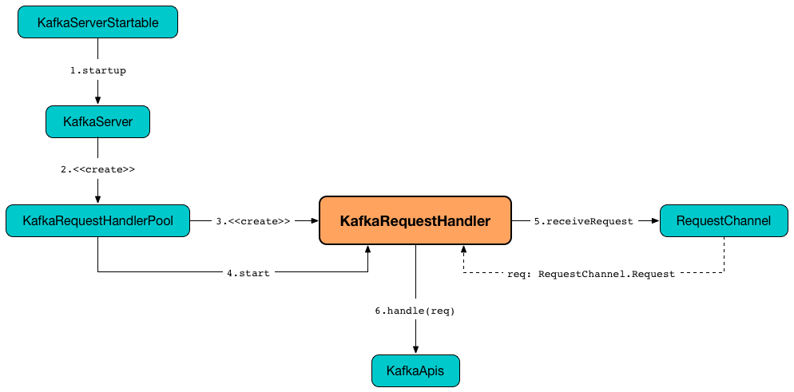

== [[KafkaRequestHandler]] KafkaRequestHandler

`KafkaRequestHandler` is a thread of execution (https://docs.oracle.com/javase/9/docs/api/java/lang/Runnable.html[java.lang.Runnable]) that is responsible for relaying <<kafka-network-RequestChannel-Request.adoc#, client requests>> (from a <<requestChannel, RequestChannel>>) to a <<apis, KafkaApis>> (except `ShutdownRequest` requests that are handled directly).

`KafkaRequestHandler` is <<creating-instance, created>> exclusively when `KafkaRequestHandlerPool` is <<kafka-server-KafkaRequestHandlerPool.adoc#runnables, created>> (and starts the internal `runnables` threads).

.KafkaRequestHandler's Startup and Request Relay


[[logIdent]]
`KafkaRequestHandler` uses *[Kafka Request Handler [id] on Broker [brokerId]]* as the logging prefix (aka `logIdent`).

[[logging]]
[TIP]
====
Enable `ALL` logging levels for `kafka.server.KafkaRequestHandler` logger to see what happens inside.

Add the following line to `config/log4j.properties`:

```
log4j.logger.kafka.server.KafkaRequestHandler=ALL
```

Refer to <<kafka-logging.adoc#, Logging>>.
====

=== [[creating-instance]] Creating KafkaRequestHandler Instance

`KafkaRequestHandler` takes the following to be created:

* [[id]] ID
* [[brokerId]] Broker ID
* [[aggregateIdleMeter]] Aggregate Idle Meter
* [[totalHandlerThreads]] Total number of handler threads
* [[requestChannel]] <<kafka-network-RequestChannel.adoc#, RequestChannel>>
* [[apis]] <<kafka-server-KafkaApis.adoc#, KafkaApis>>
* [[time]] `Time`

`KafkaRequestHandler` initializes the <<internal-properties, internal properties>>.

=== [[run]] Starting KafkaRequestHandler Thread -- `run` Method

[source, scala]
----
run(): Unit
----

NOTE: `run` is part of the https://docs.oracle.com/en/java/javase/11/docs/api/java.base/java/lang/Runnable.html[java.lang.Runnable] to start itself as a separately-executing thread.

`run` runs continuously until `KafkaRequestHandler` is requested to <<stop, stop>> (which turns the <<stopped, stopped>> internal flag on).

`run`...FIXME

=== [[stop]] Stopping KafkaRequestHandler Thread -- `stop` Method

[source, scala]
----
stop(): Unit
----

`stop` simply turns the <<stopped, stopped>> internal flag on (`true`).

NOTE: `stop` is used exclusively when `KafkaRequestHandlerPool` is requested to <<kafka-server-KafkaRequestHandlerPool.adoc#resizeThreadPool, resize the thread pool of KafkaRequestHandlers>>.

=== [[internal-properties]] Internal Properties

[cols="30m,70",options="header",width="100%"]
|===
| Name
| Description

| stopped
a| [[stopped]] Flag to control whether <<run, run>> should stop (`true`) or not (`false`) (and hence the `KafkaRequestHandler`)

Default: `false`

Turned on (`true`) when `KafkaRequestHandler` is requested to <<stop, stop>>

|===
