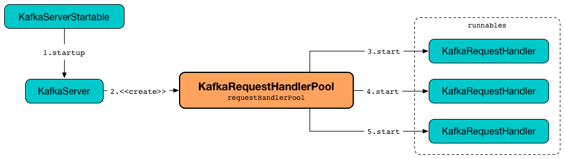
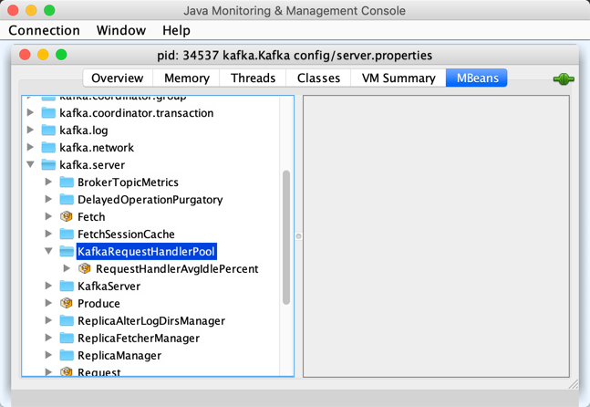

== [[KafkaRequestHandlerPool]] KafkaRequestHandlerPool -- Pool of KafkaRequestHandler Daemon Threads

`KafkaRequestHandlerPool` is a <<runnables, pool of KafkaRequestHandler daemon threads>>.

`KafkaRequestHandlerPool` is <<creating-instance, created>> exclusively when `KafkaServer` is requested to <<kafka-server-KafkaServer.adoc#startup, start up>> (and creates the <<kafka-server-KafkaServer.adoc#dataPlaneRequestHandlerPool, data-plane>> and <<kafka-server-KafkaServer.adoc#controlPlaneRequestHandlerPool, control-plane>> request handler pools).

.KafkaRequestHandlerPool and KafkaRequestHandler Threads


When <<creating-instance, created>>, `KafkaRequestHandlerPool` requests all <<runnables, KafkaRequestHandler daemon threads>> to start.

NOTE: The number of *kafka-request-handler* threads is controlled by <<kafka-properties.adoc#num.network.threads, num.network.threads>> configuration property (default: `3`).

[[logIdent]]
`KafkaRequestHandlerPool` uses *[Kafka Request Handler on Broker [brokerId]]* as the logging prefix (aka `logIdent`).

[[logging]]
[TIP]
====
Enable `ALL` logging level for `kafka.server.KafkaRequestHandlerPool` logger to see what happens inside.

Add the following line to `config/log4j.properties`:

```
log4j.logger.kafka.server.KafkaRequestHandlerPool=ALL
```

Refer to <<kafka-logging.adoc#, Logging>>.
====

=== [[creating-instance]] Creating KafkaRequestHandlerPool Instance

`KafkaRequestHandlerPool` takes the following to be created:

* [[brokerId]] Broker ID
* [[requestChannel]] <<kafka-network-RequestChannel.adoc#, RequestChannel>>
* [[apis]] link:kafka-server-KafkaApis.adoc[KafkaApis]
* [[time]] `Time`
* [[numThreads]] Number of threads (i.e. instances of <<runnables, KafkaRequestHandlers>> as defined by link:kafka-server-KafkaConfig.adoc#numNetworkThreads[numNetworkThreads] property)
* [[requestHandlerAvgIdleMetricName]] `requestHandlerAvgIdleMetricName`
* [[logAndThreadNamePrefix]] `logAndThreadNamePrefix`

`KafkaRequestHandlerPool` initializes the <<internal-properties, internal properties>>.

`KafkaRequestHandlerPool` starts <<numThreads, numThreads>>  daemon *kafka-request-handler* threads (as registered in the <<runnables, runnables>> internal registry).

=== [[KafkaMetricsGroup]][[metrics]] Performance Metrics

`KafkaRequestHandlerPool` is a <<kafka-metrics-KafkaMetricsGroup.adoc#, KafkaMetricsGroup>> with the following performance metrics.

.KafkaRequestHandlerPool's Performance Metrics
[cols="30m,70",options="header",width="100%"]
|===
| Metric Name
| Description

| <<requestHandlerAvgIdleMetricName, requestHandlerAvgIdleMetricName>>
| [[aggregateIdleMeter]] *Aggregare idle meter* - average free capacity of the request handlers (_idle handlers_)
|===

The performance metrics are registered in *kafka.server:type=KafkaRequestHandlerPool* group.

.KafkaMetricsGroup in jconsole


=== [[createHandler]] Creating and Starting KafkaRequestHandler Daemon Thread -- `createHandler` Method

[source, scala]
----
createHandler(id: Int): Unit
----

`createHandler` creates a new <<kafka-server-KafkaRequestHandler.adoc#, KafkaRequestHandler>> for the given id (and the <<brokerId, broker ID>>, the <<aggregateIdleMeter, aggregare idle meter>>, the <<threadPoolSize, threadPoolSize>>, the <<requestChannel, RequestChannel>> and the <<apis, KafkaApis>>).

`createHandler` adds the `KafkaRequestHandler` to the <<runnables, runnables>> internal registry.

In the end, `createHandler` starts the `KafkaRequestHandler` as a daemon thread with the name with the format:

```
[logAndThreadNamePrefix]-kafka-request-handler-[id]
```

NOTE: `createHandler` is used when `KafkaRequestHandlerPool` is <<creating-instance, created>> (to create the <<numThreads, numThreads>> handlers) and requested to <<resizeThreadPool, resize the thread pool>> (with new handlers).

=== [[resizeThreadPool]] Resizing Thread Pool (of KafkaRequestHandlers) -- `resizeThreadPool` Method

[source, scala]
----
resizeThreadPool(newSize: Int): Unit
----

`resizeThreadPool` prints out the following INFO message to the logs:

```
Resizing request handler thread pool size from [currentSize] to [newSize]
```

When the given `newSize` is greater than the current <<threadPoolSize, threadPoolSize>>, `resizeThreadPool` <<createHandler, creates and starts new KafkaRequestHandler daemon threads>>.

When the given `newSize` is smaller than the current <<threadPoolSize, threadPoolSize>>, `resizeThreadPool` removes `KafkaRequestHandlers` from the <<runnables, runnables>> internal registry and requests them to <<kafka-server-KafkaRequestHandler.adoc#stop, stop>>.

In the end, `resizeThreadPool` sets the <<threadPoolSize, threadPoolSize>> internal registry to the given `newSize`.

NOTE: `resizeThreadPool` is used exclusively when `DynamicThreadPool` is requested to <<kafka-server-DynamicThreadPool.adoc#reconfigure, reconfigure>> (the <<kafka-properties.adoc#num.io.threads, num.io.threads>> configuration property).

=== [[shutdown]] Shutting Down -- `shutdown` Method

[source, scala]
----
shutdown(): Unit
----

`shutdown`...FIXME

NOTE: `shutdown` is used when...FIXME

=== [[internal-properties]] Internal Properties

[cols="30m,70",options="header",width="100%"]
|===
| Name
| Description

| runnables
a| [[runnables]] Pool of <<kafka-server-KafkaRequestHandler.adoc#, KafkaRequestHandlers>> daemon threads

| threadPoolSize
a| [[threadPoolSize]]

|===
