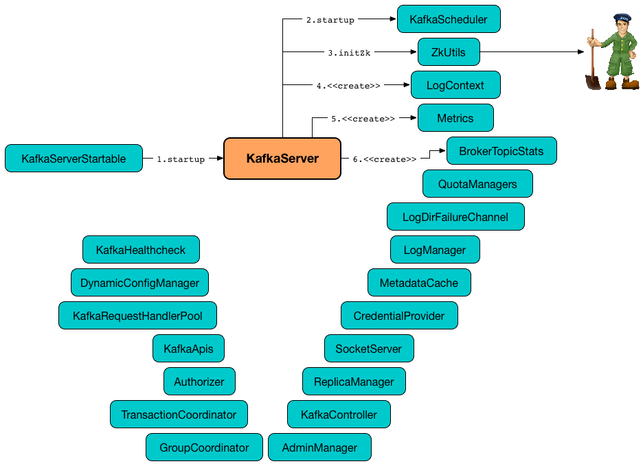

== [[KafkaServer]] KafkaServer -- Kafka Broker

`KafkaServer` is a Kafka broker that manages Kafka services.

.KafkaServer's Startup and Auxiliary Services


[[kafka.server]]
When <<creating-instance, created>>, `KafkaServer` registers itself in the JMX system under the *kafka.server* node.

[[logging]]
[TIP]
====
Enable `ALL` logging level for `kafka.server.KafkaServer` logger to see what happens inside.

Add the following line to `config/log4j.properties`:

```
log4j.logger.kafka.server.KafkaServer=ALL
```

Refer to <<kafka-logging.adoc#, Logging>>.
====

=== [[creating-instance]] Creating KafkaServer Instance

`KafkaServer` takes the following when created:

* [[config]] link:kafka-server-KafkaConfig.adoc[KafkaConfig]
* [[time]] `Time` (defaults to `Time.SYSTEM`)
* [[threadNamePrefix]] Optional thread name prefix
* [[kafkaMetricsReporters]] A collection of link:kafka-KafkaMetricsReporter.adoc[KafkaMetricsReporters] (defaults to no reporters)

CAUTION: FIXME

NOTE: `KafkaServer` is created when link:kafka-KafkaServerStartable.adoc#creating-instance[`KafkaServerStartable` is created].

=== [[startup]] Starting Up -- `startup` Method

[source, scala]
----
startup(): Unit
----

`startup` starts the Kafka broker.

Internally, `startup` first prints out the following INFO message to the logs:

```
starting
```

`startup` sets <<brokerState, BrokerState>> as `Starting`.

`startup` requests <<kafkaScheduler, KafkaScheduler>> to link:kafka-KafkaScheduler.adoc#startup[start].

`startup` <<initZk, connects to Zookeeper>> (and initializes <<zkUtils, ZkUtils>>).

`startup` <<getOrGenerateClusterId, getOrGenerateClusterId>> (that is recorded as <<_clusterId, cluster id>>).

You should see the following INFO message in the logs:

```
Cluster ID = [clusterId]
```

`startup` <<getBrokerIdAndOfflineDirs, gets the broker ID and initial offline directories>>.

`startup` requests the <<config, KafkaConfig>> to <<kafka-server-KafkaConfig.adoc#brokerId, set the brokerId>> to the broker ID.

`startup` creates the `LogContext` with *[KafkaServer id=[brokerId]]* prefix.

`startup` requests the <<config, KafkaConfig>> for the <<kafka-server-KafkaConfig.adoc#dynamicConfig, DynamicBrokerConfig>> that is in turn requested to <<kafka-server-DynamicBrokerConfig.adoc#initialize, initialize (fetching broker configuration from Zookeeper)>>.

`startup` creates a new <<kafka-KafkaScheduler.adoc#, KafkaScheduler>> (with the number of threads as specified by <<kafka-properties.adoc#background.threads, background.threads>> configuration property) and immediately requests it to <<kafka-KafkaScheduler.adoc#startup, start up>>.

`startup` creates and configures metrics.

CAUTION: FIXME

`startup` registers broker topic metrics (by initializing <<_brokerTopicStats, BrokerTopicStats>>).

`startup` initializes <<quotaManagers, QuotaManagers>>.

`startup` <<notifyClusterListeners, notifies cluster resource listeners>> (i.e. <<kafkaMetricsReporters, KafkaMetricsReporters>> and the configured instances of metric reporters).

`startup` creates the <<logDirFailureChannel, LogDirFailureChannel>>

`startup` creates the <<logManager, LogManager>> and requests it to link:kafka-log-LogManager.adoc#startup[start up].

`startup` creates the <<metadataCache, MetadataCache>> (for the <<brokerId, broker ID>>).

`startup` creates the <<credentialProvider, CredentialProvider>> (per link:kafka-properties.adoc#sasl.enabled.mechanisms[sasl.enabled.mechanisms] property).

`startup` creates the <<socketServer, SocketServer>> (for <<config, KafkaConfig>>, <<metrics, Metrics>> and <<credentialProvider, CredentialProvider>>) and requests it to link:kafka-network-SocketServer.adoc#startup[start up].

`startup` creates the <<replicaManager, ReplicaManager>> and requests it to link:kafka-server-ReplicaManager.adoc#startup[start up].

`startup` link:kafka-controller-KafkaController.adoc#creating-instance[creates] the <<kafkaController, KafkaController>> (for <<config, KafkaConfig>>, <<zkUtils, ZkUtils>>, <<metrics, Metrics>> and the optional <<threadNamePrefix, threadNamePrefix>>) and requests it to link:kafka-controller-KafkaController.adoc#startup[start up].

`startup` link:kafka-server-AdminManager.adoc#creating-instance[creates] the <<adminManager, AdminManager>> (for <<config, KafkaConfig>>, <<metrics, Metrics>>, <<metadataCache, MetadataCache>> and <<zkUtils, ZkUtils>>).

`startup` link:kafka-coordinator-group-GroupCoordinator.adoc#creating-instance[creates] the <<groupCoordinator, GroupCoordinator>> (for <<config, KafkaConfig>>, <<zkUtils, ZkUtils>> and <<replicaManager, ReplicaManager>>) and requests it to link:kafka-coordinator-group-GroupCoordinator.adoc#startup[start up].

`startup` link:kafka-TransactionCoordinator.adoc#creating-instance[creates] the <<transactionCoordinator, TransactionCoordinator>> (for <<config, KafkaConfig>>, <<replicaManager, ReplicaManager>>, a new dedicated link:kafka-KafkaScheduler.adoc[KafkaScheduler] with `transaction-log-manager-` thread name prefix, <<zkUtils, ZkUtils>>, <<metrics, Metrics>> and <<metadataCache, MetadataCache>>) and requests it to link:kafka-TransactionCoordinator.adoc#startup[start up].

`startup` creates a <<authorizer, Authorizer>> (if defined using link:kafka-properties.adoc#authorizer.class.name[authorizer.class.name] property) and requests it to link:kafka-server-authorizer-Authorizer.adoc#configure[configure].

`startup` link:kafka-server-KafkaApis.adoc#creating-instance[creates] the <<apis, KafkaApis>> (for <<socketServer, SocketServer>>, <<replicaManager, ReplicaManager>>, <<adminManager, AdminManager>>, <<groupCoordinator, GroupCoordinator>>, <<transactionCoordinator, TransactionCoordinator>>, <<kafkaController, KafkaController>>, <<zkUtils, ZkUtils>>, <<brokerId, broker ID>>, <<config, KafkaConfig>>, <<metadataCache, MetadataCache>>, <<metrics, Metrics>>, <<authorizer, Authorizer>>, <<quotaManagers, QuotaManagers>>, <<_brokerTopicStats, BrokerTopicStats>>, <<clusterId, cluster ID>>).

NOTE: At this point `KafkaServer` may start processing requests.

`startup` link:kafka-server-KafkaRequestHandlerPool.adoc#creating-instance[creates] the <<requestHandlerPool, KafkaRequestHandlerPool>> (for <<brokerId, broker ID>>, <<socketServer, SocketServer>>, <<apis, KafkaApis>> and link:kafka-properties.adoc#num.io.threads[num.io.threads]).

`startup` starts the HTTP interface of mx4j (if configured).

`startup` creates the <<kafka-server-DynamicConfigManager.adoc#, DynamicConfigManager>> (for <<zkUtils, ZkUtils>> and <<dynamicConfigHandlers, dynamicConfigHandlers>>) and requests it to <<kafka-server-DynamicConfigManager.adoc#startup, start up>>.

`startup` configures the advertised listeners (if defined).

`startup` creates the <<kafkaHealthcheck, KafkaHealthcheck>> (for <<brokerId, broker ID>>, the advertised listeners, <<zkUtils, ZkUtils>>, link:kafka-properties.adoc#broker.rack[broker.rack] and link:kafka-properties.adoc#inter.broker.protocol.version[inter.broker.protocol.version] Kafka properties) and requests it to link:kafka-KafkaHealthcheck.adoc#startup[start up].

`startup` <<checkpointBrokerId, checkpoints>> the <<brokerId, broker ID>>.

`startup` sets <<brokerState, BrokerState>> as `RunningAsBroker`, creates the <<shutdownLatch, CountDownLatch>>, enables the <<startupComplete, startupComplete>> flag, disables <<isStartingUp, isStartingUp>> flag

`startup` registers `AppInfo` as an MBean with the MBean server as `kafka.server:type=app-info,id=[brokerId]`.

In the end, you should see the following INFO message in the logs:

```
INFO [Kafka Server [brokerId]], started (kafka.server.KafkaServer)
```

NOTE: The INFO message above uses so-called *log ident* with the value of `broker.id` property and is always in the format ``[Kafka Server [brokerId]], `` after a Kafka server has fully started.

NOTE: `startup` is used exclusively when `KafkaServerStartable` is requested to <<kafka-KafkaServerStartable.adoc#startup, starts up>>.

=== [[authorizer]] Authorizer

[source, scala]
----
authorizer: Option[Authorizer] = None
----

`authorizer` is an <<kafka-server-authorizer-Authorizer.adoc#, Authorizer>> based on <<kafka-properties.adoc#authorizer.class.name, authorizer.class.name>> configuration property (default: `(empty)`).

`Authorizer` is used to create the <<dataPlaneRequestProcessor, data-plane>> and <<controlPlaneRequestProcessor, control-plane>> `KafkaApis` (for <<kafka-server-KafkaApis.adoc#authorizer, authorizing operations>>).

=== [[notifyClusterListeners]] Sending Updated Cluster Metadata to ClusterResourceListeners -- `notifyClusterListeners` Internal Method

[source, scala]
----
notifyClusterListeners(clusterListeners: Seq[AnyRef]): Unit
----

`notifyClusterListeners` creates a link:kafka-ClusterResourceListener.adoc#ClusterResourceListeners[ClusterResourceListeners] (with the objects from the input `clusterListeners` of type `ClusterResourceListener`) and link:kafka-ClusterResourceListener.adoc#onUpdate[sends the updated cluster metadata] to them.

[NOTE]
====
`notifyClusterListeners` is used when:

* `KafkaServer` is requested to <<startup, start up>> (with `clusterListeners` as <<kafkaMetricsReporters, kafkaMetricsReporters>> and the `MetricsReporter` reporters from link:kafka-properties.adoc#metric_reporters[metric.reporters] Kafka property)

* `DynamicMetricsReporters` is requested to <<kafka-server-DynamicMetricsReporters.adoc#createReporters, createReporters>> (when <<kafka-server-DynamicMetricsReporters.adoc#creating-instance, created>> and requested to <<kafka-server-DynamicMetricsReporters.adoc#reconfigure, reconfigure>>)
====

=== [[createReplicaManager]] Creating ReplicaManager -- `createReplicaManager` Internal Method

[source, scala]
----
createReplicaManager(isShuttingDown: AtomicBoolean): ReplicaManager
----

`createReplicaManager` simply link:kafka-server-ReplicaManager.adoc#creating-instance[creates] the <<replicaManager, ReplicaManager>> (passing in the references to the services, e.g. <<metrics, Metrics>>, <<kafkaScheduler, KafkaScheduler>>, <<logManager, LogManager>>, <<quotaManagers, QuotaManagers>>, <<metadataCache, MetadataCache>>, <<logDirFailureChannel, LogDirFailureChannel>>).

NOTE: `createReplicaManager` is used exclusively when `KafkaServer` is requested to <<startup, start up>>.

=== [[getOrGenerateClusterId]] `getOrGenerateClusterId` Internal Method

[source, scala]
----
getOrGenerateClusterId(zkClient: KafkaZkClient): String
----

`getOrGenerateClusterId` simply requests the given <<kafka-zk-KafkaZkClient.adoc#, KafkaZkClient>> for the <<kafka-zk-KafkaZkClient.adoc#getClusterId, cluster ID>> or <<kafka-zk-KafkaZkClient.adoc#createOrGetClusterId, createOrGetClusterId>> with a random UUID (as Base64).

NOTE: `getOrGenerateClusterId` is used exclusively when `KafkaServer` is requested to <<startup, start up>> (and initializes the internal <<_clusterId, cluster ID>>).

=== [[shutdown]] Shutting Down -- `shutdown` Method

[source, scala]
----
shutdown(): Unit
----

`shutdown`...FIXME

[NOTE]
====
`shutdown` is used when:

* `KafkaServer` is requested to <<startup, start up>> (and there was an exception)

* `KafkaServerStartable` is requested to <<kafka-KafkaServerStartable.adoc#shutdown, shut down>>
====

=== [[initZkClient]] `initZkClient` Internal Method

[source, scala]
----
initZkClient(time: Time): Unit
----

`initZkClient` prints out the following INFO message to the logs:

```
Connecting to zookeeper on [zkConnect]
```

(only if the chroot path is used) `initZkClient`...FIXME

`initZkClient`...FIXME (secureAclsEnabled)

`initZkClient` creates a <<kafka-zk-KafkaZkClient.adoc#, KafkaZkClient>> (with the following configuration properties: <<kafka-server-KafkaConfig.adoc#zkConnect, KafkaConfig.zkConnect>>, <<kafka-server-KafkaConfig.adoc#secureAclsEnabled, KafkaConfig.secureAclsEnabled>>, <<kafka-server-KafkaConfig.adoc#zkSessionTimeoutMs, KafkaConfig.zkSessionTimeoutMs>>, <<kafka-server-KafkaConfig.adoc#zkConnectionTimeoutMs, KafkaConfig.zkConnectionTimeoutMs>>, <<kafka-server-KafkaConfig.adoc#zkMaxInFlightRequests, KafkaConfig.zkMaxInFlightRequests>>).

In the end, `initZkClient` requests the <<_zkClient, KafkaZkClient>> to <<kafka-zk-KafkaZkClient.adoc#createTopLevelPaths, createTopLevelPaths>>.

NOTE: `initZkClient` is used exclusively when `KafkaServer` is requested to <<startup, start up>>.

=== [[controlledShutdown]] `controlledShutdown` Internal Method

[source, scala]
----
controlledShutdown(): Unit
----

`controlledShutdown`...FIXME

NOTE: `controlledShutdown` is used when `KafkaServer` is requested to <<shutdown, shut down>>.

=== [[checkpointBrokerId]] Checkpointing Broker -- `checkpointBrokerId` Internal Method

[source, scala]
----
checkpointBrokerId(brokerId: Int): Unit
----

For every directory in <<kafka-server-KafkaConfig.adoc#logDirs, KafkaConfig.logDirs>> that is <<kafka-log-LogManager.adoc#isLogDirOnline, isLogDirOnline>> (according to the <<logManager, LogManager>>), `checkpointBrokerId` finds the corresponding `BrokerMetadataCheckpoint` (with the path to the *meta.properties* file) in the <<brokerMetadataCheckpoints, brokerMetadataCheckpoints>> registry and requests it to `read` it.

Unless the `meta.properties` file was already available, `checkpointBrokerId` requests the `BrokerMetadataCheckpoints` (of the log directories with no meta files) to `write` the broker metadata.

NOTE: `checkpointBrokerId` is used exclusively when `KafkaServer` is requested to <<startup, start up>>.

=== [[getBrokerIdAndOfflineDirs]] Getting Broker ID and Initial Offline Directories -- `getBrokerIdAndOfflineDirs` Internal Method

[source, scala]
----
getBrokerIdAndOfflineDirs: (Int, Seq[String])
----

`getBrokerIdAndOfflineDirs`...FIXME

NOTE: `getBrokerIdAndOfflineDirs` is used exclusively when `KafkaServer` is requested to <<startup, start up>>.

=== [[generateBrokerId]] `generateBrokerId` Internal Method

[source, scala]
----
generateBrokerId: Int
----

`generateBrokerId`...FIXME

NOTE: `generateBrokerId` is used exclusively when `KafkaServer` is requested to <<getBrokerIdAndOfflineDirs, getBrokerIdAndOfflineDirs>>.

=== [[createBrokerInfo]] `createBrokerInfo` Internal Method

[source, scala]
----
createBrokerInfo: BrokerInfo
----

`createBrokerInfo`...FIXME

[NOTE]
====
`createBrokerInfo` is used when:

* `KafkaServer` is requested to <<startup, start up>>

* `DynamicListenerConfig` is requested to <<kafka-server-DynamicListenerConfig.adoc#reconfigure, reconfigure>>
====

=== [[_clusterId]][[clusterId]] Cluster ID -- `_clusterId` Internal Property

[source, scala]
----
_clusterId: String
----

`KafkaServer` uses *Cluster ID* that is a random UUID (encoded to Base64).

When requested to <<startup, start up>>, `KafkaServer` initializes the internal `_clusterId` which is immediately printed out as an INFO message to the logs:

```
Cluster ID = [clusterId]
```

Cluster ID is persisted in Zookeeper in */cluster/id* znode (in JSON format).

Cluster ID is registered as *kafka.server:type=KafkaServer,name=ClusterId* MBean in the JMX system.

Cluster ID is used for the following:

* Creating <<kafka-server-KafkaApis.adoc#, KafkaApis>> (for <<dataPlaneRequestProcessor, dataPlaneRequestProcessor>> and `controlPlaneRequestChannelOpt`) at <<startup, startup>>

* <<notifyClusterListeners, Sending an updated cluster metadata to ClusterResourceListeners>>

=== [[copyKafkaConfigToLog]] Default Configuration Properties of Logs (for LogManager and AdminManager) -- `copyKafkaConfigToLog` Internal Utility

[source, scala]
----
copyKafkaConfigToLog(
  kafkaConfig: KafkaConfig): Map[String, Object]
----

`copyKafkaConfigToLog` sets the <<copyKafkaConfigToLog-properties, topic-level configuration properties>> based on the given <<kafka-server-KafkaConfig.adoc#, KafkaConfig>>.

NOTE: `copyKafkaConfigToLog` uses the same configuration properties as link:kafka-log-LogConfig.adoc#TopicConfigSynonyms[TopicConfigSynonyms]. The keys of the configuration properties of `LogConfig` are simply aliases of link:kafka-common-TopicConfig.adoc#keys[TopicConfig].

[[copyKafkaConfigToLog-properties]]
.Topic-Level Configuration Properties
[cols="30,70",options="header",width="100%"]
|===
| LogConfig
| KafkaConfig

| link:kafka-log-LogConfig.adoc#CleanupPolicyProp[CleanupPolicyProp]
| link:kafka-server-KafkaConfig.adoc#logCleanupPolicy[logCleanupPolicy]

| link:kafka-log-LogConfig.adoc#CompressionTypeProp[CompressionTypeProp]
| link:kafka-server-KafkaConfig.adoc#compressionType[compressionType]

| link:kafka-log-LogConfig.adoc#DeleteRetentionMsProp[DeleteRetentionMsProp]
| link:kafka-server-KafkaConfig.adoc#logCleanerDeleteRetentionMs[logCleanerDeleteRetentionMs]

| link:kafka-log-LogConfig.adoc#FileDeleteDelayMsProp[FileDeleteDelayMsProp]
| link:kafka-server-KafkaConfig.adoc#logDeleteDelayMs[logDeleteDelayMs]

| link:kafka-log-LogConfig.adoc#FlushMessagesProp[FlushMessagesProp]
| link:kafka-server-KafkaConfig.adoc#logFlushIntervalMessages[logFlushIntervalMessages]

| link:kafka-log-LogConfig.adoc#FlushMsProp[FlushMsProp]
| link:kafka-server-KafkaConfig.adoc#logFlushIntervalMs[logFlushIntervalMs]

| link:kafka-log-LogConfig.adoc#IndexIntervalBytesProp[IndexIntervalBytesProp]
| link:kafka-server-KafkaConfig.adoc#logIndexIntervalBytes[logIndexIntervalBytes]

| link:kafka-log-LogConfig.adoc#MaxCompactionLagMsProp[MaxCompactionLagMsProp]
| link:kafka-server-KafkaConfig.adoc#logCleanerMaxCompactionLagMs[logCleanerMaxCompactionLagMs]

| link:kafka-log-LogConfig.adoc#MaxMessageBytesProp[MaxMessageBytesProp]
| link:kafka-server-KafkaConfig.adoc#messageMaxBytes[messageMaxBytes]

| link:kafka-log-LogConfig.adoc#MessageDownConversionEnableProp[MessageDownConversionEnableProp]
| link:kafka-server-KafkaConfig.adoc#logMessageDownConversionEnable[logMessageDownConversionEnable]

| link:kafka-log-LogConfig.adoc#MessageFormatVersionProp[MessageFormatVersionProp]
| link:kafka-server-KafkaConfig.adoc#logMessageFormatVersion[logMessageFormatVersion]

| link:kafka-log-LogConfig.adoc#MessageTimestampDifferenceMaxMsProp[MessageTimestampDifferenceMaxMsProp]
| link:kafka-server-KafkaConfig.adoc#logMessageTimestampDifferenceMaxMs[logMessageTimestampDifferenceMaxMs]

| link:kafka-log-LogConfig.adoc#MessageTimestampTypeProp[MessageTimestampTypeProp]
| link:kafka-server-KafkaConfig.adoc#logMessageTimestampType[logMessageTimestampType]

| link:kafka-log-LogConfig.adoc#MinCleanableDirtyRatioProp[MinCleanableDirtyRatioProp]
| link:kafka-server-KafkaConfig.adoc#logCleanerMinCleanRatio[logCleanerMinCleanRatio]

| link:kafka-log-LogConfig.adoc#MinCompactionLagMsProp[MinCompactionLagMsProp]
| link:kafka-server-KafkaConfig.adoc#logCleanerMinCompactionLagMs[logCleanerMinCompactionLagMs]

| link:kafka-log-LogConfig.adoc#MinInSyncReplicasProp[MinInSyncReplicasProp]
| link:kafka-server-KafkaConfig.adoc#minInSyncReplicas[minInSyncReplicas]

| link:kafka-log-LogConfig.adoc#PreAllocateEnableProp[PreAllocateEnableProp]
| link:kafka-server-KafkaConfig.adoc#logPreAllocateEnable[logPreAllocateEnable]

| link:kafka-log-LogConfig.adoc#RetentionBytesProp[RetentionBytesProp]
| link:kafka-server-KafkaConfig.adoc#logRetentionBytes[logRetentionBytes]

| link:kafka-log-LogConfig.adoc#RetentionMsProp[RetentionMsProp]
| link:kafka-server-KafkaConfig.adoc#logRetentionTimeMillis[logRetentionTimeMillis]

| link:kafka-log-LogConfig.adoc#SegmentBytesProp[SegmentBytesProp]
| link:kafka-server-KafkaConfig.adoc#logSegmentBytes[logSegmentBytes]

| link:kafka-log-LogConfig.adoc#SegmentIndexBytesProp[SegmentIndexBytesProp]
| link:kafka-server-KafkaConfig.adoc#logIndexSizeMaxBytes[logIndexSizeMaxBytes]

| link:kafka-log-LogConfig.adoc#SegmentJitterMsProp[SegmentJitterMsProp]
| link:kafka-server-KafkaConfig.adoc#logRollTimeJitterMillis[logRollTimeJitterMillis]

| link:kafka-log-LogConfig.adoc#SegmentMsProp[SegmentMsProp]
| link:kafka-server-KafkaConfig.adoc#logRollTimeMillis[logRollTimeMillis]

| link:kafka-log-LogConfig.adoc#UncleanLeaderElectionEnableProp[UncleanLeaderElectionEnableProp]
| link:kafka-server-KafkaConfig.adoc#uncleanLeaderElectionEnable[uncleanLeaderElectionEnable]

|===

[NOTE]
====
`copyKafkaConfigToLog` is used when:

* `LogManager` utility is requested to link:kafka-log-LogManager.adoc#apply[create an instance of LogManager] (for `KafkaServer` when requested to link:kafka-server-KafkaServer.adoc#startup[start up])

* `AdminManager` is requested to link:kafka-server-AdminManager.adoc#describeConfigs[describe the configuration of a topic] and link:kafka-server-AdminManager.adoc#createTopics[create topics]
====

=== [[internal-properties]] Internal Properties

[cols="30m,70",options="header",width="100%"]
|===
| Name
| Description

| adminManager
| [[adminManager]] <<kafka-server-AdminManager.adoc#, AdminManager>>

| apis
a| [[apis]] <<kafka-server-KafkaApis.adoc#, KafkaApis>>

| brokerMetadataCheckpoints
| [[brokerMetadataCheckpoints]]

| brokerState
| [[brokerState]] `BrokerState`

| _brokerTopicStats
a| [[_brokerTopicStats]][[brokerTopicStats]] <<kafka-server-BrokerTopicStats.adoc#, BrokerTopicStats>>

Created when `KafkaServer` is requested to <<startup, start up>>

Used (as `brokerTopicStats` method) to create the <<dataPlaneRequestProcessor, data-plane KafkaApis>>, the <<dataPlaneRequestProcessor, control-plane KafkaApis>>, the <<replicaManager, ReplicaManager>>, the <<logManager, LogManager>> when `KafkaServer` is requested to <<startup, start up>>

| controlPlaneRequestHandlerPool
a| [[controlPlaneRequestHandlerPool]] Control-plane <<kafka-server-KafkaRequestHandlerPool.adoc#, KafkaRequestHandlerPool>> for the <<controlPlaneRequestProcessor, control-plane KafkaApis>>

| controlPlaneRequestProcessor
a| [[controlPlaneRequestProcessor]] Control-plane <<kafka-server-KafkaApis.adoc#, KafkaApis>> request processor (handler) for the optional <<kafka-network-SocketServer.adoc#controlPlaneRequestChannelOpt, control-plane KafkaRequestHandlerPool>> of the <<socketServer, SocketServer>>

| credentialProvider
| [[credentialProvider]] `CredentialProvider`

| dataPlaneRequestProcessor
a| [[dataPlaneRequestProcessor]] Data-plane <<kafka-server-KafkaApis.adoc#, KafkaApis>> request handler for the <<kafka-network-SocketServer.adoc#dataPlaneRequestChannel, data-plane RequestChannel>> of the <<socketServer, SocketServer>>

| dataPlaneRequestHandlerPool
a| [[dataPlaneRequestHandlerPool]] Data-plane <<kafka-server-KafkaRequestHandlerPool.adoc#, KafkaRequestHandlerPool>> for the <<dataPlaneRequestProcessor, data-plane KafkaApis>>

| dynamicConfigHandlers
a| [[dynamicConfigHandlers]] <<kafka-server-ConfigHandler.adoc#, ConfigHandlers>> by name:

* <<kafka-server-TopicConfigHandler.adoc#, TopicConfigHandler>> as *topics*

* <<kafka-server-ClientIdConfigHandler.adoc#, ClientIdConfigHandler>> as *clients*

* <<kafka-server-UserConfigHandler.adoc#, UserConfigHandler>> as *users*

* <<kafka-server-BrokerConfigHandler.adoc#, BrokerConfigHandler>> as *brokers*

Initialized when `KafkaServer` is requested to <<startup, start up>> for the only purpose of creating the <<dynamicConfigManager, DynamicConfigManager>>.

| dynamicConfigManager
| [[dynamicConfigManager]] <<kafka-server-DynamicConfigManager.adoc#, DynamicConfigManager>>

| groupCoordinator
a| [[groupCoordinator]] <<kafka-coordinator-group-GroupCoordinator.adoc#, GroupCoordinator>> (for the only purpose of creating the <<apis, KafkaApis>>)

<<kafka-coordinator-group-GroupCoordinator.adoc#apply, Created>> and immediately <<kafka-coordinator-group-GroupCoordinator.adoc#startup, started up>> when `KafkaServer` is requested to <<startup, start up>>

<<kafka-coordinator-group-GroupCoordinator.adoc#shutdown, Shut down>> when `KafkaServer` is requested to <<shutdown, shut down>>

| isStartingUp
| [[isStartingUp]] Flag for...FIXME

| kafkaController
| [[kafkaController]] link:kafka-controller-KafkaController.adoc[KafkaController]

| kafkaHealthcheck
| [[kafkaHealthcheck]] link:kafka-KafkaHealthcheck.adoc[KafkaHealthcheck]

| kafkaScheduler
| [[kafkaScheduler]] <<kafka-KafkaScheduler.adoc#, KafkaScheduler>> with the number of daemon threads as configured using <<kafka-properties.adoc#backgroundThreads, background.threads>> configuration property (default: `10`)

| logContext
| [[logContext]] `LogContext`

| logDirFailureChannel
| [[logDirFailureChannel]] `LogDirFailureChannel`

| logManager
a| [[logManager]][[getLogManager]] <<kafka-log-LogManager.adoc#, LogManager>>

Used when:

* <<checkpointBrokerId, checkpointBrokerId>> (when `KafkaServer` is requested to <<startup, start up>>)

* `DynamicBrokerConfig` is requested to <<kafka-server-DynamicBrokerConfig.adoc#addReconfigurables, addReconfigurables>>

* `KafkaServer` is requested to <<startup, start up>> (and creates a `TopicConfigHandler` for topics for <<dynamicConfigHandlers, dynamicConfigHandlers>> and a <<createReplicaManager, ReplicaManager>>)

---

<<kafka-log-LogManager.adoc#apply, Created>> and immediately <<kafka-log-LogManager.adoc#startup, started>> when `KafkaServer` is requested to <<startup, start up>>.

<<kafka-log-LogManager.adoc#shutdown, Shut down>> when `KafkaServer` is requested to <<shutdown, shut down>>.

| metadataCache
a| [[metadataCache]] <<kafka-server-MetadataCache.adoc#, MetadataCache>> that is created for the sake of creating the following services (at <<startup, startup>>):

* <<adminManager, AdminManager>>
* <<apis, KafkaApis>>
* <<replicaManager, ReplicaManager>>
* <<transactionCoordinator, TransactionCoordinator>>

| replicaManager
a| [[replicaManager]] <<kafka-server-ReplicaManager.adoc#, ReplicaManager>> used to create:

* <<apis, KafkaApis>>
* <<groupCoordinator, GroupCoordinator>>
* <<transactionCoordinator, TransactionCoordinator>>

---

* link:kafka-server-ReplicaManager.adoc#creating-instance[Created] (and link:kafka-server-ReplicaManager.adoc#startup[started] immmediately) when `KafkaServer` is requested to <<startup, start up>>

* link:kafka-server-ReplicaManager.adoc#shutdown[Shut down] when `KafkaServer` <<shutdown, shuts down>>

| reporters
| [[reporters]] Collection of link:kafka-MetricsReporter.adoc[MetricsReporter]

Used when...FIXME

| requestHandlerPool
| [[requestHandlerPool]] link:kafka-server-KafkaRequestHandlerPool.adoc[KafkaRequestHandlerPool]

| socketServer
a| [[socketServer]] <<kafka-network-SocketServer.adoc#, SocketServer>>

| transactionCoordinator
| [[transactionCoordinator]] link:kafka-TransactionCoordinator.adoc[TransactionCoordinator]

| quotaManagers
a| [[quotaManagers]] <<kafka-server-QuotaManagers.adoc#, QuotaManagers>>

| shutdownLatch
| [[shutdownLatch]] https://docs.oracle.com/en/java/javase/11/docs/api/java.base/java/util/concurrent/CountDownLatch.html[java.util.concurrent.CountDownLatch]

| startupComplete
| [[startupComplete]] Flag for...FIXME

| zkUtils
| [[zkUtils]] link:kafka-ZkUtils.adoc[ZkUtils]

|===
