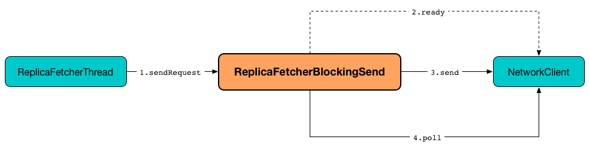

== [[ReplicaFetcherBlockingSend]] ReplicaFetcherBlockingSend

`ReplicaFetcherBlockingSend` is...FIXME

`ReplicaFetcherBlockingSend` is <<creating-instance, created>> exclusively when `ReplicaFetcherThread` is link:kafka-server-ReplicaFetcherThread.adoc#leaderEndpoint[created].

`ReplicaFetcherBlockingSend` uses <<networkClient, NetworkClient>> to <<sendRequest, send requests>> for...FIXME

.ReplicaFetcherBlockingSend's Sending Client Request and Waiting for Response


[[socketTimeout]]
`ReplicaFetcherBlockingSend` uses link:kafka-properties.adoc#replica.socket.timeout.ms[replica.socket.timeout.ms] configuration property when <<sendRequest, sending a request>> to the <<sourceBroker, partition leader broker>>.

=== [[creating-instance]] Creating ReplicaFetcherBlockingSend Instance

`ReplicaFetcherBlockingSend` takes the following when created:

* [[sourceBroker]] `BrokerEndPoint`
* [[brokerConfig]] link:kafka-server-KafkaConfig.adoc[KafkaConfig]
* [[metrics]] link:kafka-Metrics.adoc[Metrics]
* [[time]] `Time`
* [[fetcherId]] Fetcher ID
* [[clientId]] Client ID
* [[logContext]] `LogContext`

`ReplicaFetcherBlockingSend` initializes the <<internal-registries, internal registries and counters>>.

=== [[sendRequest]] Sending Client Request and Waiting for Response -- `sendRequest` Method

[source, scala]
----
sendRequest(requestBuilder: Builder[_ <: AbstractRequest]): ClientResponse
----

`sendRequest` requests `NetworkClientUtils` to link:kafka-clients-NetworkClientUtils.adoc#[wait until the connection is ready] to the <<sourceNode, source broker node>> (in <<socketTimeout, replica.socket.timeout.ms>>).

`sendRequest` requests <<networkClient, NetworkClient>> to link:kafka-clients-NetworkClient.adoc#newClientRequest[create a new client request] to the <<sourceBroker, source broker>>.

`sendRequest` requests `NetworkClientUtils` to link:#sendAndReceive[send the client request and wait for a response].

NOTE: `sendRequest` is a blocking operation (i.e. blocks the current thread) and polls for responses until the one arrives or a disconnection or a version mismatch happens.

In case `NetworkClientUtils` found the broker node unavailable, `sendRequest` reports a `SocketTimeoutException`:

```
Failed to connect to [sourceNode] within [socketTimeout] ms
```

NOTE: `sendRequest` is used when `ReplicaFetcherThread` link:kafka-server-ReplicaFetcherThread.adoc#earliestOrLatestOffset[earliestOrLatestOffset] and link:kafka-server-ReplicaFetcherThread.adoc#fetchEpochsFromLeader[fetchEpochsFromLeader].

=== [[close]] `close` Method

[source, scala]
----
close(): Unit
----

`close`...FIXME

NOTE: `close` is used when...FIXME

=== [[internal-properties]] Internal Properties

[cols="30m,70",options="header",width="100%"]
|===
| Name
| Description

| networkClient
a| [[networkClient]] link:kafka-clients-NetworkClient.adoc[NetworkClient]

Used when...FIXME

| sourceNode
a| [[sourceNode]] Source `Node`

Used when...FIXME

|===
