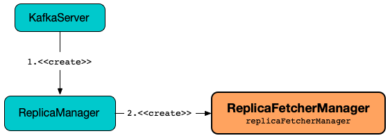
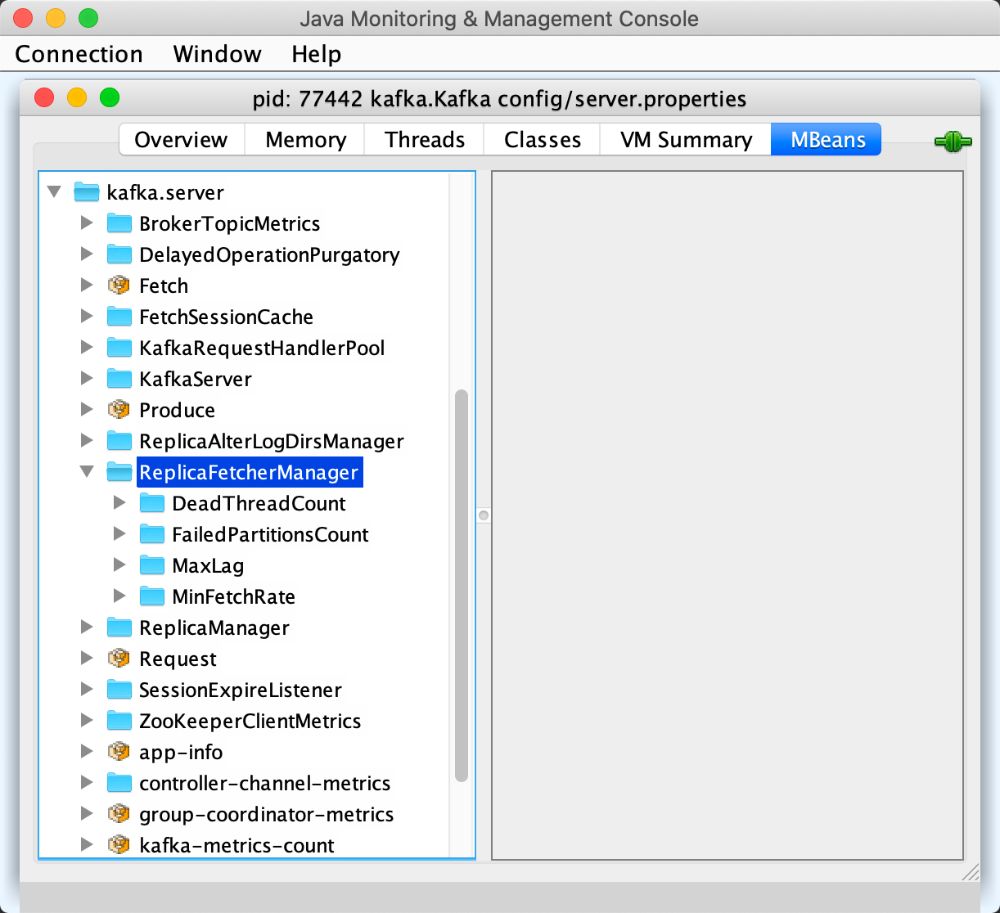

== [[ReplicaFetcherManager]] ReplicaFetcherManager

`ReplicaFetcherManager` is a link:kafka-server-AbstractFetcherManager.adoc[manager] of link:kafka-server-ReplicaFetcherThread.adoc[ReplicaFetcherThreads] for link:kafka-server-ReplicaManager.adoc#replicaFetcherManager[ReplicaManager].

.ReplicaFetcherManager


[[num.replica.fetchers]]
`ReplicaFetcherManager` uses link:kafka-properties.adoc#num.replica.fetchers[num.replica.fetchers] configuration property for the link:kafka-server-AbstractFetcherManager.adoc#numFetchers[number of replica fetcher threads].

[[logging]]
[TIP]
====
Enable `ALL` logging level for `kafka.server.ReplicaFetcherManager` logger to see what happens inside.

Add the following line to `config/log4j.properties`:

```
log4j.logger.kafka.server.ReplicaFetcherManager=ALL
```

Refer to link:kafka-logging.adoc[Logging].
====

=== [[KafkaMetricsGroup]][[metrics]] Performance Metrics

As an link:kafka-server-AbstractFetcherManager.adoc#metrics[AbstractFetcherManager], `ReplicaFetcherManager` is a link:kafka-metrics-KafkaMetricsGroup.adoc[KafkaMetricsGroup].

The performance metrics are registered in *kafka.server:type=ReplicaFetcherManager* group.

.ReplicaFetcherManager in jconsole


=== [[creating-instance]] Creating ReplicaFetcherManager Instance

`ReplicaFetcherManager` takes the following to be created:

* [[brokerConfig]] link:kafka-server-KafkaConfig.adoc[KafkaConfig]
* [[replicaManager]] link:kafka-server-ReplicaManager.adoc[ReplicaManager]
* [[metrics]] link:kafka-Metrics.adoc[Metrics]
* [[time]] `Time`
* [[threadNamePrefix]] Thread name prefix (undefined by default)
* [[quotaManager]] link:kafka-server-ReplicationQuotaManager.adoc[ReplicationQuotaManager]

=== [[createFetcherThread]] Creating ReplicaFetcherThread -- `createFetcherThread` Method

[source, scala]
----
createFetcherThread(
  fetcherId: Int,
  sourceBroker: BrokerEndPoint): ReplicaFetcherThread
----

NOTE: `createFetcherThread` is part of the link:kafka-server-AbstractFetcherManager.adoc#createFetcherThread[AbstractFetcherManager] contract to...FIXME.

`createFetcherThread` creates a link:kafka-server-ReplicaFetcherThread.adoc[ReplicaFetcherThread] with the thread name (that uses the <<threadNamePrefix, threadNamePrefix>> if defined, the given `fetcherId` and the id of the `BrokerEndPoint`) as follows:

```
[prefix]ReplicaFetcherThread-[fetcherId]-[sourceBrokerId]
```

=== [[shutdown]] `shutdown` Method

[source, scala]
----
shutdown(): Unit
----

`shutdown` prints out the following INFO message to the logs:

```
shutting down
```

`shutdown` link:kafka-server-AbstractFetcherManager.adoc#closeAllFetchers[closeAllFetchers].

In the end, `shutdown` prints out the following INFO message to the logs:

```
shutdown completed
```

NOTE: `shutdown` is used when...FIXME
