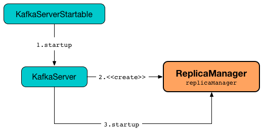
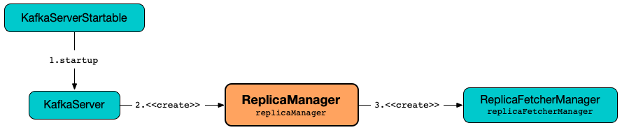
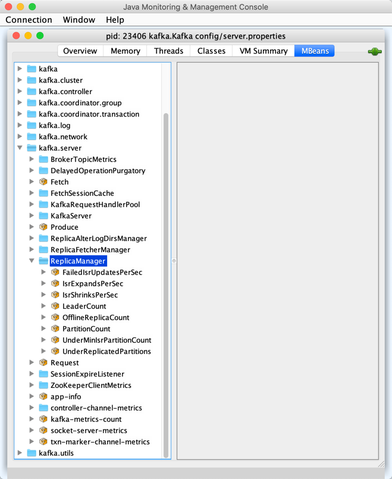

== [[ReplicaManager]] ReplicaManager

`ReplicaManager` manages log replicas using the <<logManager, LogManager>>.

`ReplicaManager` is <<creating-instance, created>> and immediately <<startup, started>> when `KafkaServer` is requested to <<kafka-server-KafkaServer.adoc#startup, start up>>.

.ReplicaManager and KafkaServer


`ReplicaManager` is given all the required services (e.g. <<metrics, Metrics>>, <<zkClient, KafkaZkClient>>, <<scheduler, Scheduler>>, <<logManager, LogManager>>, <<quotaManagers, QuotaManagers>>, <<metadataCache, MetadataCache>>) from the `KafkaServer`.

NOTE: `KafkaServer` creates a `ReplicaManager` for the only purpose of creating <<kafka-server-KafkaApis.adoc#, KafkaApis>>, <<kafka-coordinator-group-GroupCoordinator.adoc#, GroupCoordinator>>, and <<kafka-TransactionCoordinator.adoc#, TransactionCoordinator>>.

When <<startup, started>>, `ReplicaManager` schedules <<kafka-server-scheduled-tasks.adoc#isr-expiration, isr-expiration>> and <<kafka-server-scheduled-tasks.adoc#isr-change-propagation, isr-change-propagation>> recurring tasks (every half of link:kafka-properties.adoc#replica.lag.time.max.ms[replica.lag.time.max.ms] property and 2500 ms, respectively).

`ReplicaManager` manages a <<allPartitions, registry of Partitions by TopicPartition>>.

`ReplicaManager` <<becomeLeaderOrFollower, can be the leader or a follower>> of partitions which happens when `KafkaApis` is requested to <<kafka-server-KafkaApis.adoc#handleLeaderAndIsrRequest, handle a LeaderAndIsr request>> (mostly, if not always, from the <<kafka-controller-KafkaController.adoc#, KafkaController>>).

`ReplicaManager` uses the <<metadataCache, MetadataCache>> for the following:

* ...FIXME

[[logging]]
[TIP]
====
Enable `ALL` logging level for `kafka.server.ReplicaManager` logger to see what happens inside.

Add the following line to `log4j.properties`:

```
log4j.logger.kafka.server.ReplicaManager=ALL
```

Refer to link:kafka-logging.adoc[Logging].

---

Please note that `ReplicaManager` also uses a preconfigured <<stateChangeLogger, state.change.logger>> logger in `config/log4j.properties`:

```
log4j.appender.stateChangeAppender=org.apache.log4j.DailyRollingFileAppender
log4j.appender.stateChangeAppender.DatePattern='.'yyyy-MM-dd-HH
log4j.appender.stateChangeAppender.File=${kafka.logs.dir}/state-change.log
log4j.appender.stateChangeAppender.layout=org.apache.log4j.PatternLayout
log4j.appender.stateChangeAppender.layout.ConversionPattern=[%d] %p %m (%c)%n

log4j.logger.state.change.logger=TRACE, stateChangeAppender
log4j.additivity.state.change.logger=false
```

That means that the logs of `ReplicaManager` go to `logs/state-change.log` file at `TRACE` logging level and are not added to the main logs (per `log4j.additivity` being off).

====

=== [[replicaFetcherManager]] ReplicaManager and ReplicaFetcherManager

`ReplicaManager` creates a link:kafka-server-ReplicaFetcherManager.adoc[ReplicaFetcherManager] while being created (via <<createReplicaFetcherManager, createReplicaFetcherManager>>).

.ReplicaManager and ReplicaFetcherManager


`ReplicaManager` uses the `ReplicaFetcherManager` for the following:

* link:kafka-server-AbstractFetcherManager.adoc#addFetcherForPartitions[addFetcherForPartitions] when <<makeFollowers, makeFollowers>>

* link:kafka-server-AbstractFetcherManager.adoc#removeFetcherForPartitions[removeFetcherForPartitions] when <<stopReplicas, stopReplicas>>, <<makeLeaders, makeLeaders>>, <<makeFollowers, makeFollowers>> and <<handleLogDirFailure, handleLogDirFailure>>

* link:kafka-server-AbstractFetcherManager.adoc#shutdownIdleFetcherThreads[shutdownIdleFetcherThreads] when <<becomeLeaderOrFollower, becomeLeaderOrFollower>>

* link:kafka-server-ReplicaFetcherManager.adoc#shutdown[shutdown] when <<shutdown, shutdown>>

`ReplicaFetcherManager` is also used when:

* `DynamicThreadPool` is requested to link:kafka-server-DynamicThreadPool.adoc#reconfigure[reconfigure (resize) the thread pool]

* `KafkaApis` is requested to link:kafka-server-KafkaApis.adoc#handleStopReplicaRequest[handle a StopReplica request]

=== [[KafkaMetricsGroup]][[performance-metrics]] Performance Metrics

`ReplicaManager` is a <<kafka-metrics-KafkaMetricsGroup.adoc#, KafkaMetricsGroup>> with the following performance metrics.

.ReplicaManager's Performance Metrics
[cols="30m,70",options="header",width="100%"]
|===
| Metric Name
| Description

| FailedIsrUpdatesPerSec
| [[failedIsrUpdatesRate]]

| IsrExpandsPerSec
| [[isrExpandRate]]

| IsrShrinksPerSec
| [[isrShrinkRate]]

| LeaderCount
| [[leaderCount]]

| OfflineReplicaCount
| [[offlineReplicaCount]]

| PartitionCount
| [[partitionCount]] Number of <<allPartitions, allPartitions>>

| UnderMinIsrPartitionCount
| [[underMinIsrPartitionCount]]

| UnderReplicatedPartitions
| [[underReplicatedPartitions]] <<underReplicatedPartitionCount, underReplicatedPartitionCount>>

|===

The performance metrics are registered in *kafka.server:type=ReplicaManager* group.

.ReplicaManager in jconsole


=== [[allPartitions]] Registry of Partitions by TopicPartition -- `allPartitions` Internal Property

[source, scala]
----
allPartitions: Pool[TopicPartition, Partition]
----

`allPartitions` is a registry of <<kafka-cluster-Partition.adoc#, Partitions>> by `TopicPartition`

The number of partitions in `allPartitions` is available as the <<partitionCount, PartitionCount>> performance metric.

A new `TopicPartition` is added exclusively when <<getOrCreatePartition, looking up a Partition by a TopicPartition that is not registered yet>>.

A `TopicPartition` is removed when <<stopReplica, stopping a replica>> (and marked as the <<OfflinePartition, OfflinePartition>>).

NOTE: `allPartitions` is used when <<getPartition, getPartition>>, <<nonOfflinePartitionsIterator, nonOfflinePartitionsIterator>>, <<offlinePartitionsIterator, offlinePartitionsIterator>>, <<becomeLeaderOrFollower, becomeLeaderOrFollower>>, <<maybeShrinkIsr, maybeShrinkIsr>>, <<handleLogDirFailure, handleLogDirFailure>>

=== [[createReplicaFetcherManager]] Creating ReplicaFetcherManager -- `createReplicaFetcherManager` Internal Method

[source, scala]
----
createReplicaFetcherManager(
  metrics: Metrics
  time: Time
  threadNamePrefix: Option[String]
  quotaManager: ReplicationQuotaManager): ReplicaFetcherManager
----

`createReplicaFetcherManager` simply creates a <<kafka-server-ReplicaFetcherManager.adoc#, ReplicaFetcherManager>>.

NOTE: `createReplicaFetcherManager` is used when `ReplicaManager` is <<replicaFetcherManager, created>>.

=== [[createReplicaAlterLogDirsManager]] Creating ReplicaAlterLogDirsManager -- `createReplicaAlterLogDirsManager` Internal Method

[source, scala]
----
createReplicaAlterLogDirsManager(
  quotaManager: ReplicationQuotaManager,
  brokerTopicStats: BrokerTopicStats): ReplicaAlterLogDirsManager
----

`createReplicaAlterLogDirsManager` simply creates a link:kafka-server-ReplicaAlterLogDirsManager.adoc[ReplicaAlterLogDirsManager].

NOTE: `createReplicaAlterLogDirsManager` is used when `ReplicaManager` is <<replicaAlterLogDirsManager, created>>.

=== [[shutdown]] `shutdown` Method

[source, scala]
----
shutdown(
  checkpointHW: Boolean = true): Unit
----

`shutdown`...FIXME

NOTE: `shutdown` is used when `KafkaServer` is requested to link:kafka-server-KafkaServer.adoc#shutdown[shut down].

=== [[alterReplicaLogDirs]] `alterReplicaLogDirs` Method

[source, scala]
----
alterReplicaLogDirs(partitionDirs: Map[TopicPartition, String]): Map[TopicPartition, Errors]
----

`alterReplicaLogDirs`...FIXME

NOTE: `alterReplicaLogDirs` is used exclusively when `KafkaApis` is requested to <<kafka-server-KafkaApis.adoc#handleAlterReplicaLogDirsRequest, handle an AlterReplicaLogDirs request>>.

=== [[becomeLeaderOrFollower]] Becoming Leader or Follower of Partitions -- `becomeLeaderOrFollower` Method

[source, scala]
----
becomeLeaderOrFollower(
  correlationId: Int,
  leaderAndIsrRequest: LeaderAndIsrRequest,
  onLeadershipChange: (Iterable[Partition], Iterable[Partition]) => Unit): LeaderAndIsrResponse
----

`becomeLeaderOrFollower` prints out the following TRACE message to the logs:

```
Received LeaderAndIsr request [stateInfo] correlation id [correlationId] from controller [controllerId] epoch [controllerEpoch] for partition [topicPartition]
```

`becomeLeaderOrFollower` records the current controller epoch (of the <<kafka-common-requests-LeaderAndIsrRequest.adoc#, LeaderAndIsrRequest>>) in the <<controllerEpoch, controllerEpoch>> internal registry.

[[becomeLeaderOrFollower-partitionsTobeLeader]][[becomeLeaderOrFollower-partitionsToBeFollower]]
For all _valid partition states_, `becomeLeaderOrFollower` finds the partition states with the leader being the <<localBrokerId, (local) broker>> and that are the partitions for which the broker becomes the leader. All other partition states are for partitions for which the broker becomes a follower.

[[becomeLeaderOrFollower-partitionsBecomeLeader]]
For all partitions for which the broker becomes the leader, `becomeLeaderOrFollower` <<makeLeaders, makeLeaders>>.

[[becomeLeaderOrFollower-partitionsBecomeFollower]]
For all partitions for which the broker becomes a follower, `becomeLeaderOrFollower` <<makeFollowers, makeFollowers>>.

[[becomeLeaderOrFollower-hwThreadInitialized]]
With the <<hwThreadInitialized, hwThreadInitialized>> internal flag disabled (`false`), `becomeLeaderOrFollower` <<startHighWaterMarksCheckPointThread, startHighWaterMarksCheckPointThread>> and turns the flag on (`true`).

[[becomeLeaderOrFollower-newPartitions]]
For every new partitions, `becomeLeaderOrFollower`...FIXME

`becomeLeaderOrFollower`...FIXME

`becomeLeaderOrFollower` calls the given `onLeadershipChange` callback with the partitions for the broker to be the leader and a follower.

In the end, `becomeLeaderOrFollower` creates a new `LeaderAndIsrResponse` to "announce" a successful request processing.

NOTE: `becomeLeaderOrFollower` is used exclusively when `KafkaApis` is requested to <<kafka-server-KafkaApis.adoc#handleLeaderAndIsrRequest, handle a LeaderAndIsr request>>.

=== [[makeFollowers]] `makeFollowers` Internal Method

[source, scala]
----
makeFollowers(
  controllerId: Int,
  epoch: Int,
  partitionState: Map[Partition, LeaderAndIsrRequest.PartitionState],
  correlationId: Int,
  responseMap: mutable.Map[TopicPartition, Errors]) : Set[Partition]
----

`makeFollowers`...FIXME

NOTE: `makeFollowers` is used when `ReplicaManager` is requested to <<becomeLeaderOrFollower, becomeLeaderOrFollower>>.

=== [[recordIsrChange]] `recordIsrChange` Method

[source, scala]
----
recordIsrChange(topicPartition: TopicPartition): Unit
----

`recordIsrChange` adds the input `topicPartition` to <<isrChangeSet, isrChangeSet>> internal registry and sets <<lastIsrChangeMs, lastIsrChangeMs>> to the current time.

NOTE: `recordIsrChange` is used exclusively when `Partition` does link:kafka-cluster-Partition.adoc#updateIsr[updateIsr]

=== [[updateFollowerLogReadResults]] `updateFollowerLogReadResults` Internal Method

[source, scala]
----
updateFollowerLogReadResults(
  replicaId: Int,
  readResults: Seq[(TopicPartition, LogReadResult)]): Seq[(TopicPartition, LogReadResult)]
----

`updateFollowerLogReadResults`...FIXME

NOTE: `updateFollowerLogReadResults` is used exclusively when `ReplicaManager` is requested to <<fetchMessages, fetch messages from the leader replica>>.

=== [[fetchMessages]] `fetchMessages` Method

[source, scala]
----
fetchMessages(
  timeout: Long,
  replicaId: Int,
  fetchMinBytes: Int,
  fetchMaxBytes: Int,
  hardMaxBytesLimit: Boolean,
  fetchInfos: Seq[(TopicPartition, PartitionData)],
  quota: ReplicaQuota,
  responseCallback: Seq[(TopicPartition, FetchPartitionData)] => Unit,
  isolationLevel: IsolationLevel,
  clientMetadata: Option[ClientMetadata]): Unit
----

`fetchMessages` determines `fetchIsolation`:

* `FetchLogEnd` for a request from a follower or when the `replicaId` is `Request.FutureLocalReplicaId`

* `FetchTxnCommitted` for `isolationLevel` being `READ_COMMITTED`

* `FetchHighWatermark` otherwise

`fetchMessages` <<readFromLocalLog, readFromLocalLog>> (with the `fetchIsolation`).

`fetchMessages`...FIXME

[NOTE]
====
`fetchMessages` is used when:

* `KafkaApis` is requested to link:kafka-server-KafkaApis.adoc#handleFetchRequest[handle a Fetch request]

* `ReplicaAlterLogDirsThread` is requested to link:kafka-server-ReplicaAlterLogDirsThread.adoc#fetchFromLeader[fetchFromLeader]
====

=== [[maybePropagateIsrChanges]] `maybePropagateIsrChanges` Method

[source, scala]
----
maybePropagateIsrChanges(): Unit
----

`maybePropagateIsrChanges`...FIXME

NOTE: `maybePropagateIsrChanges` is used exclusively when <<kafka-server-scheduled-tasks.adoc#isr-change-propagation, isr-change-propagation>> task is executed (every 2500 milliseconds).

=== [[creating-instance]] Creating ReplicaManager Instance

`ReplicaManager` takes the following when created:

* [[config]] <<kafka-server-KafkaConfig.adoc#, KafkaConfig>>
* [[metrics]] <<kafka-Metrics.adoc#, Metrics>>
* [[time]] `Time`
* [[zkClient]] <<kafka-zk-KafkaZkClient.adoc#, KafkaZkClient>>
* [[scheduler]] <<kafka-Scheduler.adoc#, Scheduler>>
* [[logManager]] <<kafka-log-LogManager.adoc#, LogManager>>
* [[isShuttingDown]] `isShuttingDown` flag
* [[quotaManagers]] <<kafka-server-QuotaManagers.adoc#, QuotaManagers>>
* [[brokerTopicStats]] <<kafka-server-BrokerTopicStats.adoc#, BrokerTopicStats>>
* [[metadataCache]] <<kafka-server-MetadataCache.adoc#, MetadataCache>>
* [[logDirFailureChannel]] `LogDirFailureChannel`
* [[delayedProducePurgatory]] `DelayedOperationPurgatory[DelayedProduce]`
* [[delayedFetchPurgatory]] `DelayedOperationPurgatory[DelayedFetch]`
* [[delayedDeleteRecordsPurgatory]] `DelayedOperationPurgatory[DelayedDeleteRecords]`
* [[threadNamePrefix]] Optional thread name prefix

`ReplicaManager` initializes the <<internal-registries, internal registries and counters>>.

=== [[startup]] Starting ReplicaManager (and Scheduling ISR-Related Tasks) -- `startup` Method

[source, scala]
----
startup(): Unit
----

`startup` requests <<scheduler, Scheduler>> to link:kafka-KafkaScheduler.adoc#schedule[schedule the ISR-related tasks]:

. <<kafka-server-scheduled-tasks.adoc#isr-expiration, isr-expiration>>
. <<kafka-server-scheduled-tasks.adoc#isr-change-propagation, isr-change-propagation>>

`startup` then creates a <<logDirFailureHandler, LogDirFailureHandler>> and requests it to link:kafka-server-ReplicaManager-LogDirFailureHandler.adoc#start[start].

NOTE: `startup` uses `Scheduler` that was specified when `ReplicaManager` <<creating-instance, was created>>.

NOTE: `startup` is used exclusively when `KafkaServer` link:kafka-server-KafkaServer.adoc#startup[starts up].

=== [[maybeShrinkIsr]] `maybeShrinkIsr` Internal Method

[source, scala]
----
maybeShrinkIsr(): Unit
----

`maybeShrinkIsr` prints out the following TRACE message to the logs:

```
Evaluating ISR list of partitions to see which replicas can be removed from the ISR
```

`maybeShrinkIsr` requests the partitions (from <<allPartitions, allPartitions>> pool that are not <<OfflinePartition, offline partitions>>) to link:kafka-cluster-Partition.adoc#maybeShrinkIsr[maybeShrinkIsr] (with link:kafka-properties.adoc#replica.lag.time.max.ms[replica.lag.time.max.ms] property).

NOTE: `maybeShrinkIsr` is used exclusively to schedule <<kafka-server-scheduled-tasks.adoc#isr-expiration, isr-expiration>> recurring task when `ReplicaManager` <<startup, starts up>>.

=== [[makeLeaders]] `makeLeaders` Internal Method

[source, scala]
----
makeLeaders(
  controllerId: Int,
  epoch: Int,
  partitionState: Map[Partition, LeaderAndIsrRequest.PartitionState],
  correlationId: Int,
  responseMap: mutable.Map[TopicPartition, Errors]): Set[Partition]
----

`makeLeaders`...FIXME

NOTE: `makeLeaders` is used exclusively when `ReplicaManager` is requested to <<becomeLeaderOrFollower, becomeLeaderOrFollower>>.

=== [[describeLogDirs]] `describeLogDirs` Method

[source, scala]
----
describeLogDirs(partitions: Set[TopicPartition]): Map[String, LogDirInfo]
----

`describeLogDirs`...FIXME

NOTE: `describeLogDirs` is used exclusively when `KafkaApis` is requested to <<kafka-server-KafkaApis.adoc#handleDescribeLogDirsRequest, handle a DescribeLogDirs request>>.

=== [[getLog]] Finding Log For TopicPartition -- `getLog` Method

[source, scala]
----
getLog(topicPartition: TopicPartition): Option[Log]
----

`getLog`...FIXME

[NOTE]
====
`getLog` is used when:

* `GroupMetadataManager` is requested to <<kafka-coordinator-group-GroupMetadataManager.adoc#doLoadGroupsAndOffsets, doLoadGroupsAndOffsets>>

* `TransactionStateManager` is requested to <<kafka-TransactionStateManager.adoc#loadTransactionMetadata, loadTransactionMetadata>>
====

=== [[startHighWaterMarksCheckPointThread]] `startHighWaterMarksCheckPointThread` Method

[source, scala]
----
startHighWaterMarksCheckPointThread(): Unit
----

`startHighWaterMarksCheckPointThread`...FIXME

NOTE: `startHighWaterMarksCheckPointThread` is used when...FIXME

=== [[checkpointHighWatermarks]] `checkpointHighWatermarks` Method

[source, scala]
----
checkpointHighWatermarks(): Unit
----

`checkpointHighWatermarks`...FIXME

NOTE: `checkpointHighWatermarks` is used when...FIXME

=== [[shutdownIdleReplicaAlterLogDirsThread]] `shutdownIdleReplicaAlterLogDirsThread` Method

[source, scala]
----
shutdownIdleReplicaAlterLogDirsThread(): Unit
----

`shutdownIdleReplicaAlterLogDirsThread`...FIXME

NOTE: `shutdownIdleReplicaAlterLogDirsThread` is used when...FIXME

=== [[handleLogDirFailure]] `handleLogDirFailure` Method

[source, scala]
----
handleLogDirFailure(
  dir: String,
  sendZkNotification: Boolean = true): Unit
----

`handleLogDirFailure`...FIXME

NOTE: `handleLogDirFailure` is used when `LogDirFailureHandler` is requested to <<kafka-server-ReplicaManager-LogDirFailureHandler.adoc#doWork, do the work>>.

=== [[maybeUpdateMetadataCache]] `maybeUpdateMetadataCache` Method

[source, scala]
----
maybeUpdateMetadataCache(
  correlationId: Int,
  updateMetadataRequest: UpdateMetadataRequest) : Seq[TopicPartition]
----

`maybeUpdateMetadataCache`...FIXME

NOTE: `maybeUpdateMetadataCache` is used exclusively when `KafkaApis` is requested to <<kafka-server-KafkaApis.adoc#handleUpdateMetadataRequest, handle an UpdateMetadata request>>.

=== [[appendRecords]] Appending Records -- `appendRecords` Method

[source, scala]
----
appendRecords(
  timeout: Long,
  requiredAcks: Short,
  internalTopicsAllowed: Boolean,
  isFromClient: Boolean,
  entriesPerPartition: Map[TopicPartition, MemoryRecords],
  responseCallback: Map[TopicPartition, PartitionResponse] => Unit,
  delayedProduceLock: Option[Lock] = None,
  recordConversionStatsCallback: Map[TopicPartition, RecordConversionStats] => Unit = _ => ()): Unit
----

`appendRecords`...FIXME

[NOTE]
====
`appendRecords` is used when:

* `GroupMetadataManager` is requested to <<kafka-coordinator-group-GroupMetadataManager.adoc#appendForGroup, request the ReplicaManager to append records>>

* `TransactionStateManager` is requested to <<kafka-TransactionStateManager.adoc#enableTransactionalIdExpiration, enableTransactionalIdExpiration>> and <<kafka-TransactionStateManager.adoc#appendTransactionToLog, appendTransactionToLog>>

* `KafkaApis` is requested to handle <<kafka-server-KafkaApis.adoc#handleProduceRequest, Produce>> and <<kafka-server-KafkaApis.adoc#handleWriteTxnMarkersRequest, WriteTxnMarkers>> requests
====

==== [[isValidRequiredAcks]] Validating requiredAcks -- `isValidRequiredAcks` Internal Method

[source, scala]
----
isValidRequiredAcks(requiredAcks: Short): Boolean
----

`isValidRequiredAcks` is positive (`true`) when the given `requiredAcks` is one of the following:

* `-1`

* `1`

* `0`

Otherwise, `isValidRequiredAcks` is negative (`false`).

NOTE: `isValidRequiredAcks` is used exclusively when `ReplicaManager` is requested to <<appendRecords, appendRecords>>.

==== [[appendToLocalLog]] `appendToLocalLog` Internal Method

[source, scala]
----
appendToLocalLog(
  internalTopicsAllowed: Boolean,
  isFromClient: Boolean,
  entriesPerPartition: Map[TopicPartition, MemoryRecords],
  requiredAcks: Short): Map[TopicPartition, LogAppendResult]
----

`appendToLocalLog` processes (_maps over_) the given `Map[TopicPartition, MemoryRecords]` (`entriesPerPartition`), so that the leader partition (of every `TopicPartition`) is requested to <<kafka-cluster-Partition.adoc#appendRecordsToLeader, appendRecordsToLeader>>.

Internally, `appendToLocalLog` prints out the following TRACE message to the logs:

```
Append [[entriesPerPartition]] to local log
```

For every tuple in the given `entriesPerPartition` (`Map[TopicPartition, MemoryRecords]`), `appendToLocalLog` does the following steps:

. Requests the <<brokerTopicStats, BrokerTopicStats>> to mark the occurrence of an event for the <<kafka-server-BrokerTopicMetrics.adoc#totalProduceRequestRate, totalProduceRequestRate>> for the topic (of the `TopicPartition`) in the <<kafka-server-BrokerTopicStats.adoc#topicStats, topicStats>> and for <<kafka-server-BrokerTopicStats.adoc#allTopicsStats, all topics>>

. <<getPartitionOrException, Gets the partition (or throws an exception)>> (with `expectLeader` flag enabled)

. Requests the `Partition` to <<kafka-cluster-Partition.adoc#appendRecordsToLeader, appendRecordsToLeader>> (with the `MemoryRecords`, the `isFromClient` flag, and the `requiredAcks` bit map)

. Requests the <<brokerTopicStats, BrokerTopicStats>> to mark the `sizeInBytes` of the `MemoryRecords` for the <<kafka-server-BrokerTopicMetrics.adoc#bytesInRate, bytesInRate>> for the topic (of the `TopicPartition`) in the <<kafka-server-BrokerTopicStats.adoc#bytesInRate, bytesInRate>> and for <<kafka-server-BrokerTopicStats.adoc#allTopicsStats, all topics>>

. Requests the <<brokerTopicStats, BrokerTopicStats>> to mark the number of messages appended for the <<kafka-server-BrokerTopicMetrics.adoc#messagesInRate, messagesInRate>> for the topic (of the `TopicPartition`) in the <<kafka-server-BrokerTopicStats.adoc#bytesInRate, bytesInRate>> and for <<kafka-server-BrokerTopicStats.adoc#allTopicsStats, all topics>>

. Prints out the following TRACE message to the logs:
+
```
[sizeInBytes] written to log [topicPartition] beginning at offset [firstOffset] and ending at offset [lastOffset]
```

In case `Topic.isInternal(topicPartition.topic) && !internalTopicsAllowed`, `appendToLocalLog`...FIXME

In case of exceptions, `appendToLocalLog`...FIXME

NOTE: `appendToLocalLog` is used exclusively when `ReplicaManager` is requested to <<appendRecords, append records>>.

=== [[getPartitionOrException]] Getting Partition Or Throwing Exception -- `getPartitionOrException` Method

[source, scala]
----
getPartitionOrException(
  topicPartition: TopicPartition,
  expectLeader: Boolean): Partition
----

`getPartitionOrException` <<getPartition, gets the partition>> if available or throws one of the following exceptions:

* `KafkaStorageException` when the partition is offline
+
```
Partition [topicPartition] is in an offline log directory
```

* `NotLeaderForPartitionException`
+
```
Broker [localBrokerId] is not a replica of [topicPartition]
```

* `ReplicaNotAvailableException`
+
```
Partition [topicPartition] is not available
```

* `UnknownTopicOrPartitionException`
+
```
Partition [topicPartition] doesn't exist
```

NOTE: `getPartitionOrException` is used when...FIXME

=== [[getPartition]] Getting Partition by TopicPartition (If Available) -- `getPartition` Method

[source, scala]
----
getPartition(topicPartition: TopicPartition): Option[Partition]
----

`getPartition` gets the <<kafka-cluster-Partition.adoc#, partition>> for the given `TopicPartition`.

[NOTE]
====
`getPartition` is used when:

* `DelayedDeleteRecords` is requested to `tryComplete`

* `DelayedProduce` is requested to `tryComplete`

* `ReplicaAlterLogDirsThread` is requested to <<kafka-server-ReplicaAlterLogDirsThread.adoc#processPartitionData, processPartitionData>>

* `ReplicaFetcherThread` is requested to <<kafka-server-ReplicaFetcherThread.adoc#processPartitionData, processPartitionData>>, <<kafka-server-ReplicaFetcherThread.adoc#truncate, truncate>>, and <<kafka-server-ReplicaFetcherThread.adoc#truncateFullyAndStartAt, truncateFullyAndStartAt>>

* `ReplicaManager` is requested to <<nonOfflinePartition, nonOfflinePartition>>, <<getPartitionOrException, getPartitionOrException>>, <<alterReplicaLogDirs, alterReplicaLogDirs>>, <<appendToLocalLog, appendToLocalLog>>, <<becomeLeaderOrFollower, becomeLeaderOrFollower>>, and <<lastOffsetForLeaderEpoch, lastOffsetForLeaderEpoch>>

====

=== [[stopReplica]] Stopping Partition Replica -- `stopReplica` Method

[source, scala]
----
stopReplica(
  topicPartition: TopicPartition,
  deletePartition: Boolean): Unit
----

`stopReplica`...FIXME

NOTE: `stopReplica` is used exclusively when `ReplicaManager` is requested to <<stopReplicas, stopReplicas>>.

=== [[underReplicatedPartitionCount]] `underReplicatedPartitionCount` Method

[source, scala]
----
underReplicatedPartitionCount: Int
----

`underReplicatedPartitionCount`...FIXME

NOTE: `underReplicatedPartitionCount` is used exclusively for the <<underReplicatedPartitions, UnderReplicatedPartitions>> performance metric.

=== [[leaderPartitionsIterator]] `leaderPartitionsIterator` Internal Method

[source, scala]
----
leaderPartitionsIterator: Iterator[Partition]
----

`leaderPartitionsIterator`...FIXME

NOTE: `leaderPartitionsIterator` is used exclusively for the performance metrics: <<leaderCount, LeaderCount>>, <<underMinIsrPartitionCount, UnderMinIsrPartitionCount>>, and <<underReplicatedPartitions, UnderReplicatedPartitions>> (indirectly using <<underReplicatedPartitionCount, underReplicatedPartitionCount>>).

=== [[nonOfflinePartitionsIterator]] `nonOfflinePartitionsIterator` Internal Method

[source, scala]
----
nonOfflinePartitionsIterator: Iterator[Partition]
----

`nonOfflinePartitionsIterator`...FIXME

NOTE: `nonOfflinePartitionsIterator` is used when `ReplicaManager` is requested to <<leaderPartitionsIterator, leaderPartitionsIterator>>, <<checkpointHighWatermarks, checkpointHighWatermarks>>, and <<handleLogDirFailure, handleLogDirFailure>>.

=== [[getOrCreatePartition]] Looking Up Partition or Creating New One (by TopicPartition) -- `getOrCreatePartition` Method

[source, scala]
----
getOrCreatePartition(topicPartition: TopicPartition): Partition
----

`getOrCreatePartition` simply looks up a <<kafka-cluster-Partition.adoc#, Partition>> by the `TopicPartition` (in the <<allPartitions, allPartitions>> internal registry). If not found, `getOrCreatePartition` adds a new `Partition`.

NOTE: `getOrCreatePartition` is used exclusively when `ReplicaManager` is requested to <<becomeLeaderOrFollower, becomeLeaderOrFollower>>.

=== [[offlinePartitionsIterator]] `offlinePartitionsIterator` Internal Method

[source, scala]
----
offlinePartitionsIterator: Iterator[Partition]
----

`offlinePartitionsIterator`...FIXME

NOTE: `offlinePartitionsIterator` is used when...FIXME

=== [[markPartitionOffline]] `markPartitionOffline` Method

[source, scala]
----
markPartitionOffline(tp: TopicPartition): Unit
----

`markPartitionOffline`...FIXME

NOTE: `markPartitionOffline` is used when...FIXME

=== [[lastOffsetForLeaderEpoch]] `lastOffsetForLeaderEpoch` Method

[source, scala]
----
lastOffsetForLeaderEpoch(
  requestedEpochInfo: Map[TopicPartition, OffsetsForLeaderEpochRequest.PartitionData]
): Map[TopicPartition, EpochEndOffset]
----

`lastOffsetForLeaderEpoch`...FIXME

NOTE: `lastOffsetForLeaderEpoch` is used when...FIXME

=== [[nonOfflinePartition]] `nonOfflinePartition` Method

[source, scala]
----
nonOfflinePartition(topicPartition: TopicPartition): Option[Partition]
----

`nonOfflinePartition`...FIXME

NOTE: `nonOfflinePartition` is used when...FIXME

=== [[deleteRecords]] `deleteRecords` Method

[source, scala]
----
deleteRecords(
  timeout: Long,
  offsetPerPartition: Map[TopicPartition, Long],
  responseCallback: Map[TopicPartition, DeleteRecordsResponse.PartitionResponse] => Unit): Unit
----

`deleteRecords`...FIXME

NOTE: `deleteRecords` is used when...FIXME

=== [[fetchOffsetForTimestamp]] `fetchOffsetForTimestamp` Method

[source, scala]
----
fetchOffsetForTimestamp(
  topicPartition: TopicPartition,
  timestamp: Long,
  isolationLevel: Option[IsolationLevel],
  currentLeaderEpoch: Optional[Integer],
  fetchOnlyFromLeader: Boolean): TimestampOffset
----

`fetchOffsetForTimestamp`...FIXME

NOTE: `fetchOffsetForTimestamp` is used when...FIXME

=== [[stopReplicas]] `stopReplicas` Method

[source, scala]
----
stopReplicas(
  stopReplicaRequest: StopReplicaRequest): (mutable.Map[TopicPartition, Errors], Errors)
----

`stopReplicas`...FIXME

NOTE: `stopReplicas` is used exclusively when `KafkaApis` is requested to <<kafka-server-KafkaApis.adoc#handleStopReplicaRequest, handle a StopReplica request>>.

=== [[getMagic]] `getMagic` Method

[source, scala]
----
getMagic(topicPartition: TopicPartition): Option[Byte]
----

`getMagic`...FIXME

NOTE: `getMagic` is used when...FIXME

=== [[localReplicaOrException]] `localReplicaOrException` Method

[source, scala]
----
localReplicaOrException(topicPartition: TopicPartition): Replica
----

`localReplicaOrException` <<getPartitionOrException, finds the partition (or throws an exception)>> for the given `TopicPartition` (and `expectLeader` flag off) and requests the `Partition` to <<kafka-cluster-Partition.adoc#localReplicaOrException, get the local partition replica (or throw an exception)>>.

NOTE: A partition replica is local when the replica ID is exactly the local broker ID.

NOTE: `localReplicaOrException` is used when...FIXME

=== [[shouldLeaderThrottle]] `shouldLeaderThrottle` Method

[source, scala]
----
shouldLeaderThrottle(
  quota: ReplicaQuota,
  topicPartition: TopicPartition,
  replicaId: Int): Boolean
----

`shouldLeaderThrottle`...FIXME

NOTE: `shouldLeaderThrottle` is used when...FIXME

=== [[readFromLocalLog]] `readFromLocalLog` Method

[source, scala]
----
readFromLocalLog(
  replicaId: Int,
  fetchOnlyFromLeader: Boolean,
  fetchIsolation: FetchIsolation,
  fetchMaxBytes: Int,
  hardMaxBytesLimit: Boolean,
  readPartitionInfo: Seq[(TopicPartition, PartitionData)],
  quota: ReplicaQuota,
  clientMetadata: Option[ClientMetadata]): Seq[(TopicPartition, LogReadResult)]
----

`readFromLocalLog` returns records (as `FetchDataInfo`) for every `TopicPartition` in the given `readPartitionInfo`.

Internally, `readFromLocalLog` <<readFromLocalLog-read, reads>> the requested `PartitionData` (up to `fetchMaxBytes` that is decremented sequentially for every partition) for every `TopicPartition` (in the given `readPartitionInfo` collection).

[NOTE]
====
`readFromLocalLog` is used when:

* `DelayedFetch` is requested to `onComplete`

* `ReplicaManager` is requested to <<fetchMessages, fetchMessages>> (when `KafkaApis` is requested to <<kafka-server-KafkaApis.adoc#handleFetchRequest, handle a Fetch request>>)
====

==== [[readFromLocalLog-read]] `read` Internal Method

[source, scala]
----
read(
  tp: TopicPartition,
  fetchInfo: PartitionData,
  limitBytes: Int,
  minOneMessage: Boolean): LogReadResult
----

`read` increments the link:kafka-server-BrokerTopicMetrics.adoc#totalFetchRequestRate[totalFetchRequestRate] metric of the topic (of the `TopicPartition`) and the link:kafka-server-BrokerTopicStats.adoc#allTopicsStats[allTopicsStats] in the <<brokerTopicStats, BrokerTopicStats>>.

`read` prints out the following TRACE message to the logs:

```
Fetching log segment for partition [tp], offset [offset], partition fetch size [partitionFetchSize], remaining response limit [limitBytes]
```

`read` <<getPartitionOrException, finds the Partition>> for the `TopicPartition`.

`read`...FIXME

=== [[electPreferredLeaders]] Triggerring Preferred Replica Leader Election -- `electPreferredLeaders` Method

[source, scala]
----
electPreferredLeaders(
  controller: KafkaController,
  partitions: Set[TopicPartition],
  responseCallback: Map[TopicPartition, ApiError] => Unit,
  requestTimeout: Long): Unit
----

`electPreferredLeaders` simply requests the `KafkaController` to <<kafka-controller-KafkaController.adoc#electPreferredLeaders, electPreferredLeaders>> for the partitions.

NOTE: `electPreferredLeaders` is used exclusively when `KafkaApis` is requested to <<kafka-server-KafkaApis.adoc#handleElectPreferredReplicaLeader, handle an ElectPreferredLeaders request>>.

=== [[tryCompleteElection]] `tryCompleteElection` Method

[source, scala]
----
tryCompleteElection(key: DelayedOperationKey): Unit
----

`tryCompleteElection`...FIXME

NOTE: `tryCompleteElection` is used exclusively when `KafkaApis` is requested to <<kafka-server-KafkaApis.adoc#handleUpdateMetadataRequest, handle an UpdateMetadata request>>.

=== [[localLog]] `localLog` Method

[source, scala]
----
localLog(
  topicPartition: TopicPartition): Option[Log]
----

`localLog`...FIXME

NOTE: `localLog` is used when...FIXME

=== [[findPreferredReadReplica]] `findPreferredReadReplica` Method

[source, scala]
----
findPreferredReadReplica(
  tp: TopicPartition,
  clientMetadata: ClientMetadata,
  replicaId: Int,
  fetchOffset: Long,
  currentTimeMs: Long): Option[Int]
----

`findPreferredReadReplica` <<getPartitionOrException, finds the Partition>> for the `TopicPartition` (with `expectLeader` flag off).

`findPreferredReadReplica`...FIXME

NOTE: `findPreferredReadReplica` is used when `ReplicaManager` is requested to <<readFromLocalLog, readFromLocalLog>>.

=== [[localLogOrException]] `localLogOrException` Method

[source, scala]
----
localLogOrException(
  topicPartition: TopicPartition): Log
----

`localLogOrException` <<getPartitionOrException, finds the Partition>> for the given `TopicPartition` (and `expectLeader` flag off) and then requests it for the link:kafka-cluster-Partition.adoc#localLogOrException[local Log].

`localLogOrException` throws an exception if neither the `Partition` nor the `Log` of the given `TopicPartition` is available locally.

NOTE: `localLogOrException` is used when `ReplicaFetcherThread` is requested for the link:kafka-server-ReplicaFetcherThread.adoc#latestEpoch[latest epoch], link:kafka-server-ReplicaFetcherThread.adoc#logEndOffset[logEndOffset], link:kafka-server-ReplicaFetcherThread.adoc#endOffsetForEpoch[endOffsetForEpoch], and link:kafka-server-ReplicaFetcherThread.adoc#buildFetch[buildFetch].

=== [[updateFollowerFetchState]] `updateFollowerFetchState` Internal Method

[source, scala]
----
updateFollowerFetchState(
  followerId: Int,
  readResults: Seq[(TopicPartition, LogReadResult)]): Seq[(TopicPartition, LogReadResult)]
----

`updateFollowerFetchState`...FIXME

NOTE: `updateFollowerFetchState` is used when `ReplicaManager` is requested to <<fetchMessages, fetchMessages>>.

=== [[internal-properties]] Internal Properties

[cols="30m,70",options="header",width="100%"]
|===
| Name
| Description

| controllerEpoch
a| [[controllerEpoch]]

| replicaAlterLogDirsManager
a| [[replicaAlterLogDirsManager]] link:kafka-server-ReplicaAlterLogDirsManager.adoc[ReplicaAlterLogDirsManager]

<<createReplicaAlterLogDirsManager, Created>> immediately with `ReplicaManager`

Used when:

* `ReplicaFetcherThread` is requested to link:kafka-server-ReplicaFetcherThread.adoc#truncate[truncate]

* `ReplicaManager` is requested to <<shutdownIdleReplicaAlterLogDirsThread, shutdownIdleReplicaAlterLogDirsThread>>, <<stopReplicas, stopReplicas>>, <<alterReplicaLogDirs, alterReplicaLogDirs>>, <<becomeLeaderOrFollower, becomeLeaderOrFollower>>, <<handleLogDirFailure, handleLogDirFailure>>, <<shutdown, shutdown>>

| highWatermarkCheckpoints
a| [[highWatermarkCheckpoints]] `OffsetCheckpointFiles` per live log data directory

| stateChangeLogger
a| [[stateChangeLogger]] link:kafka-controller-StateChangeLogger.adoc[StateChangeLogger] with the broker ID and `inControllerContext` flag off (that sets `Broker` log prefix)

| hwThreadInitialized
a| [[hwThreadInitialized]]

| isrChangeSet
a| [[isrChangeSet]] Collection of `TopicPartition` that...FIXME

| lastIsrChangeMs
a| [[lastIsrChangeMs]] Time when <<isrChangeSet, isrChangeSet>> has a new `TopicPartition` <<recordIsrChange, added>>.

| logDirFailureHandler
a| [[logDirFailureHandler]] link:kafka-server-ReplicaManager-LogDirFailureHandler.adoc[LogDirFailureHandler]

| OfflinePartition
a| [[OfflinePartition]]

|===
