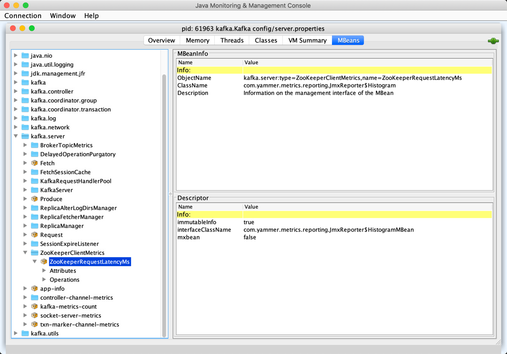

== [[KafkaZkClient]] KafkaZkClient -- Higher-Level Zookeeper Client

`KafkaZkClient` is a higher-level Zookeeper client.

`KafkaZkClient` is <<creating-instance, created>> (using the <<apply, apply>> factory method) when:

* `KafkaServer` is requested to link:kafka-server-KafkaServer.adoc#startup[start up] (and link:kafka-server-KafkaServer.adoc#initZkClient[initZkClient])

* `AclAuthorizer` is requested to link:kafka-security-authorizer-AclAuthorizer.adoc#configure[configure] (and <<createAclPaths, createAclPaths>>)

* `ZkSecurityMigrator`, link:kafka-admin-TopicCommand.adoc[TopicCommand] (with the deprecated `--zookeeper` option), link:kafka-admin-ReassignPartitionsCommand.adoc[ReassignPartitionsCommand], `PreferredReplicaLeaderElectionCommand` (with the deprecated `--zookeeper` option), link:kafka-admin-ConfigCommand.adoc[ConfigCommand] tools are executed

[[logging]]
[TIP]
====
Enable `ALL` logging level for `kafka.zk.KafkaZkClient` logger to see what happens inside.

Add the following line to `config/log4j.properties`:

```
log4j.logger.kafka.zk.KafkaZkClient=ALL
```

Refer to link:kafka-logging.adoc[Logging].
====

=== [[KafkaMetricsGroup]][[metrics]] Performance Metrics

`KafkaZkClient` is a <<kafka-metrics-KafkaMetricsGroup.adoc#, KafkaMetricsGroup>> with the following performance metrics.

.KafkaZkClient's Performance Metrics
[cols="30m,70",options="header",width="100%"]
|===
| Name
| Description

| ZooKeeperRequestLatencyMs
| [[ZooKeeperRequestLatencyMs]][[latencyMetric]] Histogram that is updated when `KafkaZkClient` is requested to <<retryRequestsUntilConnected, retryRequestsUntilConnected>>

|===

The performance metrics are registered in *kafka.server:type=ZooKeeperClientMetrics* group.

.KafkaZkClient Metrics in JConsole JMX Tool


=== [[getTopicPartitionCount]] `getTopicPartitionCount` Method

[source, scala]
----
getTopicPartitionCount(topic: String): Option[Int]
----

`getTopicPartitionCount`...FIXME

NOTE: `getTopicPartitionCount` is used when...FIXME

=== [[registerStateChangeHandler]] Registering StateChangeHandler -- `registerStateChangeHandler` Method

[source, scala]
----
registerStateChangeHandler(stateChangeHandler: StateChangeHandler): Unit
----

`registerStateChangeHandler`...FIXME

NOTE: `registerStateChangeHandler` is used when...FIXME

=== [[creating-instance]] Creating KafkaZkClient Instance

`KafkaZkClient` takes the following when created:

* [[zooKeeperClient]] <<kafka-ZooKeeperClient.adoc#, ZooKeeperClient>>
* [[isSecure]] `isSecure` flag
* [[time]] `Time`

`KafkaZkClient` initializes the <<internal-registries, internal registries and counters>>.

=== [[apply]] Creating KafkaZkClient Instance -- `apply` Factory Method

[source, scala]
----
apply(
  connectString: String,
  isSecure: Boolean,
  sessionTimeoutMs: Int,
  connectionTimeoutMs: Int,
  maxInFlightRequests: Int,
  time: Time,
  metricGroup: String = "kafka.server",
  metricType: String = "SessionExpireListener"): KafkaZkClient
----

`apply` creates a <<kafka-ZooKeeperClient.adoc#, ZooKeeperClient>> that is then used to create a <<creating-instance, KafkaZkClient>>.

[NOTE]
====
`apply` is used when...FIXME
====

=== [[createTopLevelPaths]] `createTopLevelPaths` Method

[source, scala]
----
createTopLevelPaths(): Unit
----

`createTopLevelPaths`...FIXME

NOTE: `createTopLevelPaths` is used when...FIXME

=== [[updateBrokerInfoInZk]] `updateBrokerInfoInZk` Method

[source, scala]
----
updateBrokerInfoInZk(brokerInfo: BrokerInfo): Unit
----

`updateBrokerInfoInZk`...FIXME

NOTE: `updateBrokerInfoInZk` is used when...FIXME

=== [[registerZNodeChildChangeHandler]] `registerZNodeChildChangeHandler` Method

[source, scala]
----
registerZNodeChildChangeHandler(zNodeChildChangeHandler: ZNodeChildChangeHandler): Unit
----

`registerZNodeChildChangeHandler`...FIXME

NOTE: `registerZNodeChildChangeHandler` is used when...FIXME

=== [[registerZNodeChangeHandlerAndCheckExistence]] `registerZNodeChangeHandlerAndCheckExistence` Method

[source, scala]
----
registerZNodeChangeHandlerAndCheckExistence(zNodeChangeHandler: ZNodeChangeHandler): Boolean
----

`registerZNodeChangeHandlerAndCheckExistence`...FIXME

NOTE: `registerZNodeChangeHandlerAndCheckExistence` is used when...FIXME

=== [[deleteLogDirEventNotifications]] `deleteLogDirEventNotifications` Method

[source, scala]
----
deleteLogDirEventNotifications(): Unit
----

`deleteLogDirEventNotifications`...FIXME

NOTE: `deleteLogDirEventNotifications` is used when...FIXME

=== [[deleteIsrChangeNotifications]] `deleteIsrChangeNotifications` Method

[source, scala]
----
deleteIsrChangeNotifications(): Unit
----

`deleteIsrChangeNotifications`...FIXME

NOTE: `deleteIsrChangeNotifications` is used when...FIXME

=== [[unregisterZNodeChildChangeHandler]] `unregisterZNodeChildChangeHandler` Method

[source, scala]
----
unregisterZNodeChildChangeHandler(path: String): Unit
----

`unregisterZNodeChildChangeHandler`...FIXME

NOTE: `unregisterZNodeChildChangeHandler` is used when...FIXME

=== [[unregisterZNodeChangeHandler]] `unregisterZNodeChangeHandler` Method

[source, scala]
----
unregisterZNodeChangeHandler(path: String): Unit
----

`unregisterZNodeChangeHandler`...FIXME

NOTE: `unregisterZNodeChangeHandler` is used when...FIXME

=== [[setControllerEpochRaw]] `setControllerEpochRaw` Method

[source, scala]
----
setControllerEpochRaw(epoch: Int, epochZkVersion: Int): SetDataResponse
----

`setControllerEpochRaw`...FIXME

NOTE: `setControllerEpochRaw` is used when...FIXME

=== [[createControllerEpochRaw]] `createControllerEpochRaw` Method

[source, scala]
----
createControllerEpochRaw(epoch: Int): CreateResponse
----

`createControllerEpochRaw`...FIXME

NOTE: `createControllerEpochRaw` is used when...FIXME

=== [[getAllBrokersInCluster]] Fetching Metadata of Brokers in Cluster -- `getAllBrokersInCluster` Method

[source, scala]
----
getAllBrokersInCluster: Seq[Broker]
----

`getAllBrokersInCluster` <<getSortedBrokerList, fetches broker IDs>> followed by fetching the metadata of every broker (which is the data associated with a `/brokers/ids/[brokerId]` znode).

[NOTE]
====
`getAllBrokersInCluster` is used when:

* `ConfigCommand` is requested to <<kafka-admin-ConfigCommand.adoc#alterConfig, alterConfig>>

* `ReassignPartitionsCommand` is requested to <<kafka-admin-ReassignPartitionsCommand.adoc#removeThrottle, removeThrottle>>

* `TopicCommand` is requested to <<kafka-admin-TopicCommand.adoc#describeTopic, describeTopic>>

* `KafkaController` is requested to <<kafka-controller-KafkaController.adoc#initializeControllerContext, initializeControllerContext>> and at <<kafka-controller-ControllerEvent.adoc#BrokerChange, BrokerChange>> controller event

* `KafkaServer` is requested to <<kafka-server-KafkaServer.adoc#createBrokerInfo, createBrokerInfo>>

* `AdminZkClient` is requested to <<kafka-zk-AdminZkClient.adoc#getBrokerMetadatas, getBrokerMetadatas>>
====

=== [[getAllTopicsInCluster]] `getAllTopicsInCluster` Method

[source, scala]
----
getAllTopicsInCluster: Seq[String]
----

`getAllTopicsInCluster`...FIXME

NOTE: `getAllTopicsInCluster` is used when...FIXME

=== [[getReplicaAssignmentForTopics]] `getReplicaAssignmentForTopics` Method

[source, scala]
----
getReplicaAssignmentForTopics(topics: Set[String]): Map[TopicPartition, Seq[Int]]
----

`getReplicaAssignmentForTopics`...FIXME

NOTE: `getReplicaAssignmentForTopics` is used when...FIXME

=== [[getPartitionReassignment]] `getPartitionReassignment` Method

[source, scala]
----
getPartitionReassignment: collection.Map[TopicPartition, Seq[Int]]
----

`getPartitionReassignment`...FIXME

NOTE: `getPartitionReassignment` is used when...FIXME

=== [[getTopicDeletions]] `getTopicDeletions` Method

[source, scala]
----
getTopicDeletions: Seq[String]
----

`getTopicDeletions`...FIXME

NOTE: `getTopicDeletions` is used when...FIXME

=== [[getTopicPartitionStates]] Retrieving Partition State -- `getTopicPartitionStates` Method

[source, scala]
----
getTopicPartitionStates(
  partitions: Seq[TopicPartition]): Map[TopicPartition, LeaderIsrAndControllerEpoch]
----

`getTopicPartitionStates` <<getTopicPartitionStatesRaw, getTopicPartitionStatesRaw>> for the given `TopicPartitions`.

For every response, `getTopicPartitionStates` decodes the JSON-encoded partition state data (for the partitions that were found in ZooKeeper).

NOTE: `getTopicPartitionStates` is used when `KafkaController` is requested to <<kafka-controller-KafkaController.adoc#updateLeaderAndIsrCache, updateLeaderAndIsrCache>>, <<kafka-controller-KafkaController.adoc#areReplicasInIsr, areReplicasInIsr>>, <<kafka-controller-KafkaController.adoc#updateLeaderEpoch, updateLeaderEpoch>> and <<kafka-controller-KafkaController.adoc#processPartitionReassignmentIsrChange, process a PartitionReassignmentIsrChange controller event>>.

=== [[registerZNodeChangeHandler]] `registerZNodeChangeHandler` Method

[source, scala]
----
registerZNodeChangeHandler(zNodeChangeHandler: ZNodeChangeHandler): Unit
----

`registerZNodeChangeHandler`...FIXME

NOTE: `registerZNodeChangeHandler` is used when...FIXME

=== [[getControllerEpoch]] `getControllerEpoch` Method

[source, scala]
----
getControllerEpoch: Option[(Int, Stat)]
----

`getControllerEpoch`...FIXME

NOTE: `getControllerEpoch` is used when...FIXME

=== [[deletePartitionReassignment]] `deletePartitionReassignment` Method

[source, scala]
----
deletePartitionReassignment(): Unit
----

`deletePartitionReassignment`...FIXME

NOTE: `deletePartitionReassignment` is used when...FIXME

=== [[setOrCreatePartitionReassignment]] `setOrCreatePartitionReassignment` Method

[source, scala]
----
setOrCreatePartitionReassignment(reassignment: collection.Map[TopicPartition, Seq[Int]]): Unit
----

`setOrCreatePartitionReassignment`...FIXME

NOTE: `setOrCreatePartitionReassignment` is used when...FIXME

=== [[getControllerId]] Getting Active Controller ID -- `getControllerId` Method

[source, scala]
----
getControllerId: Option[Int]
----

`getControllerId` sends a request to Zookeeper for the data of the `/controller` znode and returns the following:

* The `brokerid` field of the JSON data when the response is `OK`

* `None` for a `NONODE` response

* Throws a `KeeperException` with the response code and the `/controller` path

[NOTE]
====
`getControllerId` is used when:

* `KafkaController` is requested to <<kafka-controller-KafkaController.adoc#elect, elect>>

* `ControllerEventThread` is requested to <<kafka-controller-ControllerEventThread.adoc#doWork, process controller events>> (and processes <<kafka-controller-ControllerEvent.adoc#ControllerChange, ControllerChange>> and <<kafka-controller-ControllerEvent.adoc#Reelect, Reelect>> events)

* `KafkaServer` is requested to <<kafka-server-KafkaServer.adoc#controlledShutdown, perform a controlled shutdown>>
====

=== [[checkedEphemeralCreate]] Creating Ephemeral Znode (And Throwing Exception When Unsuccessful)-- `checkedEphemeralCreate` Method

[source, scala]
----
checkedEphemeralCreate(path: String, data: Array[Byte]): Unit
----

`checkedEphemeralCreate`...FIXME

NOTE: `checkedEphemeralCreate` is used when...FIXME

=== [[registerControllerAndIncrementControllerEpoch]] `registerControllerAndIncrementControllerEpoch` Method

[source, scala]
----
registerControllerAndIncrementControllerEpoch(controllerId: Int): (Int, Int)
----

`registerControllerAndIncrementControllerEpoch`...FIXME

NOTE: `registerControllerAndIncrementControllerEpoch` is used exclusively when `KafkaController` is requested to <<kafka-controller-KafkaController.adoc#elect, elect>>.

=== [[retryRequestsUntilConnected]] `retryRequestsUntilConnected` Internal Method

[source, scala]
----
retryRequestsUntilConnected[Req <: AsyncRequest](
  requests: Seq[Req]): Seq[Req#Response]
----

`retryRequestsUntilConnected`...FIXME

=== [[createSequentialPersistentPath]] `createSequentialPersistentPath` Method

[source, scala]
----
createSequentialPersistentPath(path: String, data: Array[Byte]): String
----

`createSequentialPersistentPath`...FIXME

NOTE: `createSequentialPersistentPath` is used when `KafkaZkClient` is requested to <<propagateLogDirEvent, propagateLogDirEvent>> and <<propagateIsrChanges, propagateIsrChanges>>.

=== [[propagateLogDirEvent]] `propagateLogDirEvent` Method

[source, scala]
----
propagateLogDirEvent(brokerId: Int): Unit
----

`propagateLogDirEvent`...FIXME

NOTE: `propagateLogDirEvent` is used exclusively when `ReplicaManager` is requested to <<kafka-server-ReplicaManager.adoc#handleLogDirFailure, handleLogDirFailure>>.

=== [[propagateIsrChanges]] `propagateIsrChanges` Method

[source, scala]
----
propagateIsrChanges(isrChangeSet: collection.Set[TopicPartition]): Unit
----

`propagateIsrChanges`...FIXME

NOTE: `propagateIsrChanges` is used exclusively when `ReplicaManager` is requested to <<kafka-server-ReplicaManager.adoc#maybePropagateIsrChanges, maybePropagateIsrChanges>>.

=== [[getTopicPartitionStatesRaw]] `getTopicPartitionStatesRaw` Method

[source, scala]
----
getTopicPartitionStatesRaw(
  partitions: Seq[TopicPartition]): Seq[GetDataResponse]
----

`getTopicPartitionStatesRaw` gets the topic partition states (from the path `/brokers/topics/[topic]/partitions/[partition]/state` in Zookeeper) for the given partitions.

Internally, `getTopicPartitionStatesRaw` creates a ZooKeeper `GetDataRequest` for the path `/brokers/topics/[topic]/partitions/[partition]/state` for every partition (in the given `partitions`).

In the end, `getTopicPartitionStatesRaw` <<retryRequestsUntilConnected, retryRequestsUntilConnected>> the `GetDataRequests`.

[NOTE]
====
`getTopicPartitionStatesRaw` is used when:

* `PartitionStateMachine` is requested to <<kafka-controller-PartitionStateMachine.adoc#doElectLeaderForPartitions, doElectLeaderForPartitions>>

* `ZkReplicaStateMachine` is requested to <<kafka-controller-ZkReplicaStateMachine.adoc#getTopicPartitionStatesFromZk, getTopicPartitionStatesFromZk>>

* `KafkaZkClient` is requested to <<getTopicPartitionStates, getTopicPartitionStates>> (and <<getTopicPartitionState, getTopicPartitionState>>)
====

=== [[getTopicPartitionState]] `getTopicPartitionState` Method

[source, scala]
----
getTopicPartitionState(partition: TopicPartition): Option[LeaderIsrAndControllerEpoch]
----

`getTopicPartitionState`...FIXME

NOTE: `getTopicPartitionState` is used when...FIXME

=== [[getSortedBrokerList]] Fetching Broker IDs -- `getSortedBrokerList` Method

[source, scala]
----
getSortedBrokerList(): Seq[Int]
----

`getSortedBrokerList` <<getChildren, gets the child znodes>> at `/brokers/ids` path and sorts it by broker ID (according to the natural ordering).

[NOTE]
====
`getSortedBrokerList` is used when:

* `ReassignPartitionsCommand` is requested to <<kafka-admin-ReassignPartitionsCommand.adoc#parseAndValidate, parseAndValidate>>

* `KafkaZkClient` is requested to <<getAllBrokersInCluster, getAllBrokersInCluster>>
====

=== [[getChildren]] Fetching Child ZNodes -- `getChildren` Method

[source, scala]
----
getChildren(path : String): Seq[String]
----

`getChildren`...FIXME

NOTE: `getChildren` is used when...FIXME

=== [[getClusterId]] `getClusterId` Method

[source, scala]
----
getClusterId: Option[String]
----

`getClusterId`...FIXME

NOTE: `getClusterId` is used when...FIXME

=== [[createOrGetClusterId]] `createOrGetClusterId` Method

[source, scala]
----
createOrGetClusterId(proposedClusterId: String): String
----

`createOrGetClusterId`...FIXME

NOTE: `createOrGetClusterId` is used when...FIXME

=== [[getAllBrokerAndEpochsInCluster]] All Brokers In Kafka Cluster -- `getAllBrokerAndEpochsInCluster` Method

[source, scala]
----
getAllBrokerAndEpochsInCluster: Map[Broker, Long]
----

`getAllBrokerAndEpochsInCluster`...FIXME

NOTE: `getAllBrokerAndEpochsInCluster` is used when...FIXME

=== [[getBroker]] `getBroker` Method

[source, scala]
----
getBroker(
  brokerId: Int): Option[Broker]
----

`getBroker`...FIXME

NOTE: `getBroker` is used when...FIXME

=== [[getAllLogDirEventNotifications]] LogDirEvent Notifications (from Zookeeper) -- `getAllLogDirEventNotifications` Method

[source, scala]
----
getAllLogDirEventNotifications: Seq[String]
----

`getAllLogDirEventNotifications`...FIXME

NOTE: `getAllLogDirEventNotifications` is used when...FIXME

=== [[getBrokerIdsFromLogDirEvents]] Converting LogDirEvent Notifications to Broker IDs -- `getBrokerIdsFromLogDirEvents` Method

[source, scala]
----
getBrokerIdsFromLogDirEvents(
  sequenceNumbers: Seq[String]): Seq[Int]
----

`getBrokerIdsFromLogDirEvents`...FIXME

NOTE: `getBrokerIdsFromLogDirEvents` is used when...FIXME

=== [[createTopicPartitionStatesRaw]] Creating State Znodes for Selected Partitions -- `createTopicPartitionStatesRaw` Method

[source, scala]
----
createTopicPartitionStatesRaw(
  leaderIsrAndControllerEpochs: Map[TopicPartition, LeaderIsrAndControllerEpoch],
  expectedControllerEpochZkVersion: Int
): Seq[CreateResponse]
----

`createTopicPartitionStatesRaw` <<createTopicPartitions, createTopicPartitions>> with the topics (of the given partitions).

`createTopicPartitionStatesRaw` <<createTopicPartition, createTopicPartition>> with the partitions.

For every partition (in the given `leaderIsrAndControllerEpochs`), `createTopicPartitionStatesRaw` creates a new `CreateRequest` to create `/brokers/topics/[topic]/partitions/[partition]/state` persistent znode with the associated `LeaderIsrAndControllerEpoch` encoded to JSON format.

```
// zkCli :2181
$ ./bin/zookeeper-shell.sh :2181 ls /brokers/topics
[t1]

$ ./bin/zookeeper-shell.sh :2181 get /brokers/topics/t1/partitions/0/state
{"controller_epoch":1,"leader":0,"version":1,"leader_epoch":0,"isr":[0]}
```

In the end, `createTopicPartitionStatesRaw` <<retryRequestsUntilConnected, retryRequestsUntilConnected>> all the `CreateRequests`.

NOTE: `createTopicPartitionStatesRaw` is used exclusively when `ZkPartitionStateMachine` is requested to <<kafka-controller-ZkPartitionStateMachine.adoc#initializeLeaderAndIsrForPartitions, initializeLeaderAndIsrForPartitions>>.

=== [[createTopicPartitions]] `createTopicPartitions` Internal Method

[source, scala]
----
createTopicPartitions(
  topics: Seq[String],
  expectedControllerEpochZkVersion: Int):Seq[CreateResponse]
----

`createTopicPartitions`...FIXME

NOTE: `createTopicPartitions` is used when...FIXME

=== [[createTopicPartition]] `createTopicPartition` Internal Method

[source, scala]
----
createTopicPartition(
  partitions: Seq[TopicPartition],
  expectedControllerEpochZkVersion: Int): Seq[CreateResponse]
----

`createTopicPartition`...FIXME

NOTE: `createTopicPartition` is used when...FIXME

=== [[updateLeaderAndIsr]] `updateLeaderAndIsr` Method

[source, scala]
----
updateLeaderAndIsr(
  leaderAndIsrs: Map[TopicPartition, LeaderAndIsr],
  controllerEpoch: Int,
  expectedControllerEpochZkVersion: Int): UpdateLeaderAndIsrResult
----

`updateLeaderAndIsr`...FIXME

NOTE: `updateLeaderAndIsr` is used when...FIXME

=== [[getPartitionsForTopics]] Partition Numbers of Given Topics -- `getPartitionsForTopics` Method

[source, scala]
----
getPartitionsForTopics(
  topics: Set[String]): Map[String, Seq[Int]]
----

`getPartitionsForTopics`...FIXME

NOTE: `getPartitionsForTopics` is used when...FIXME

=== [[getEntityConfigs]] Reading Entity Config From Zookeeper (Under /config Node) -- `getEntityConfigs` Method

[source, scala]
----
getEntityConfigs(
  rootEntityType: String,
  sanitizedEntityName: String): Properties
----

`getEntityConfigs` reads the `/config/[rootEntityType]/[sanitizedEntityName]`.

`getEntityConfigs`...FIXME

NOTE: `getEntityConfigs` is used exclusively when `AdminZkClient` is requested to <<kafka-zk-AdminZkClient.adoc#fetchEntityConfig, fetchEntityConfig>>.

=== [[createAclPaths]] `createAclPaths` Method

[source, scala]
----
createAclPaths(): Unit
----

`createAclPaths`...FIXME

NOTE: `createAclPaths` is used when `AclAuthorizer` is requested to link:kafka-security-authorizer-AclAuthorizer.adoc#configure[configure].

=== [[registerBroker]] `registerBroker` Method

[source, scala]
----
registerBroker(
  brokerInfo: BrokerInfo): Long
----

`registerBroker`...FIXME

NOTE: `registerBroker` is used when...FIXME

=== [[updateBrokerInfo]] `updateBrokerInfo` Method

[source, scala]
----
updateBrokerInfo(
  brokerInfo: BrokerInfo): Unit
----

`updateBrokerInfo`...FIXME

NOTE: `updateBrokerInfo` is used when...FIXME

=== [[close]] `close` Method

[source, scala]
----
close(): Unit
----

NOTE: `close` is part of the Java's https://docs.oracle.com/en/java/javase/11/docs/api/java.base/java/lang/AutoCloseable.html[AutoCloseable] contract to close a resource (and relinquishing any underlying resources).

`close`...FIXME
